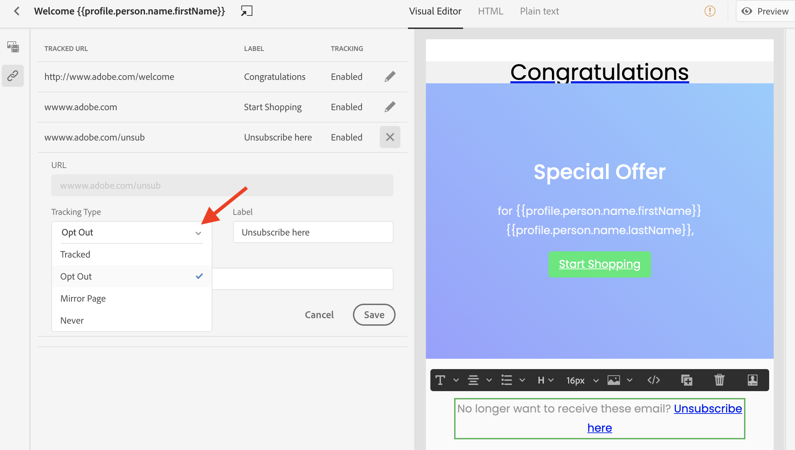

# Tracciamento dei messaggi {#tracking}

Journey Optimizer consente di tenere traccia dei messaggi inviati e del comportamento dei destinatari.

Puoi abilitare il tracciamento a livello di messaggio selezionando le opzioni **[!UICONTROL Open Tracking for email]** e/o **[!UICONTROL Click Tracking for email]** . In questo modo potrai tenere traccia del comportamento dei destinatari attraverso le aperture e/o i clic sui collegamenti. [Ulteriori informazioni sulla creazione dei messaggi](create-message.md).

Durante la progettazione di un messaggio, puoi aggiungere al contenuto collegamenti tracciati. Inoltre, E-mail Designer ti consente di gestire gli URL che verranno tracciati, ad esempio per abilitare/disabilitare il tracciamento o per modificare il tipo di tracciamento per ciascun collegamento. [Ulteriori informazioni sull’utilizzo di E-mail Designer](create-email-content.md).

Il numero di messaggi aperti e il numero di collegamenti su cui è stato fatto clic sono elencati nella scheda [Esecuzioni](message-monitoring.md).
