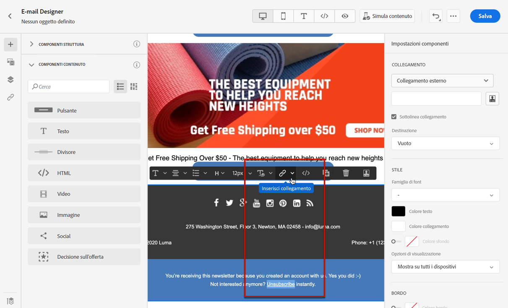
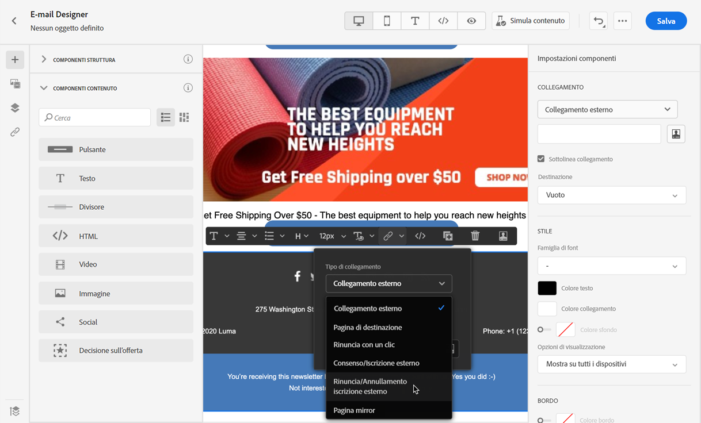
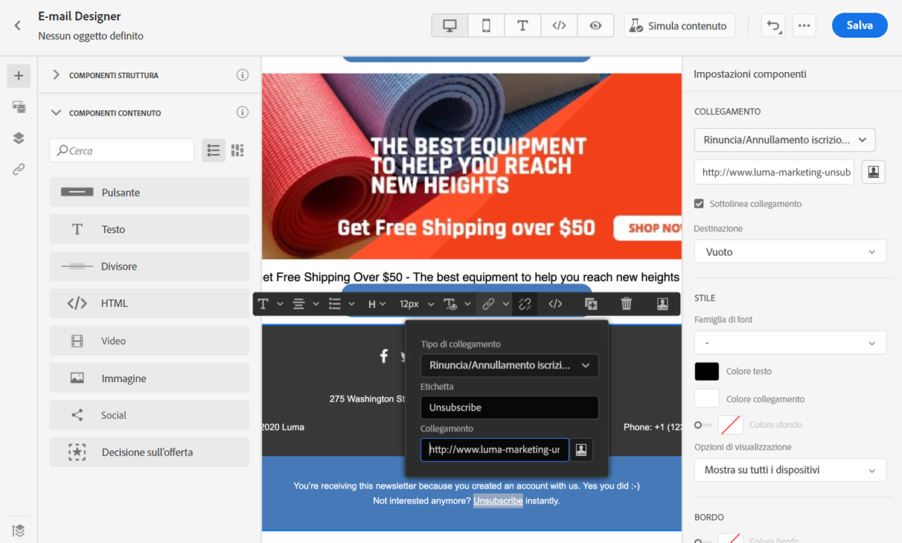
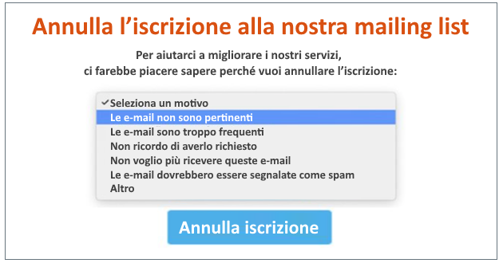
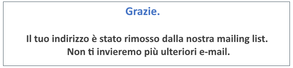
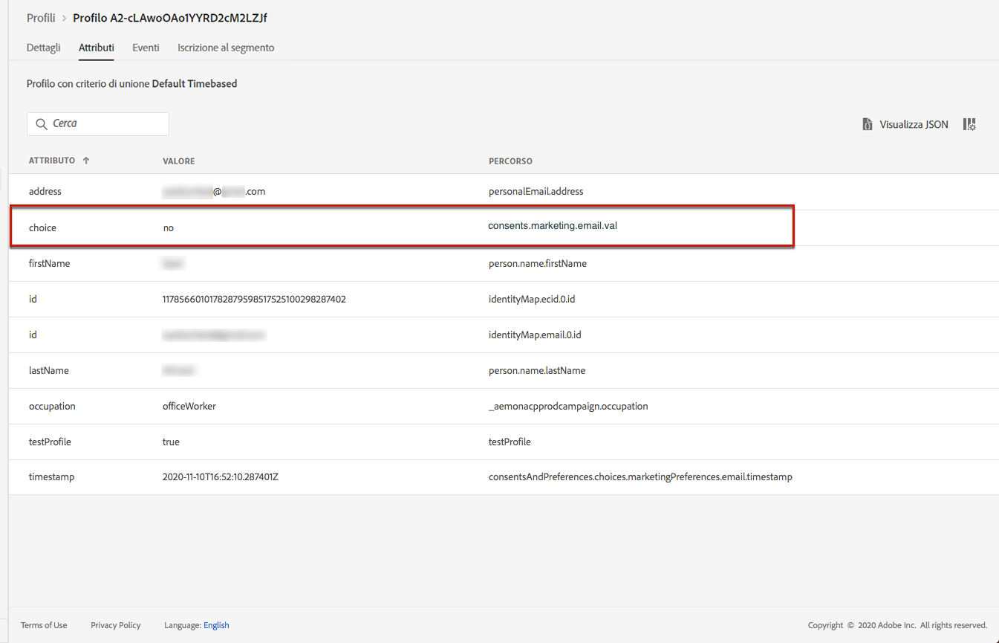
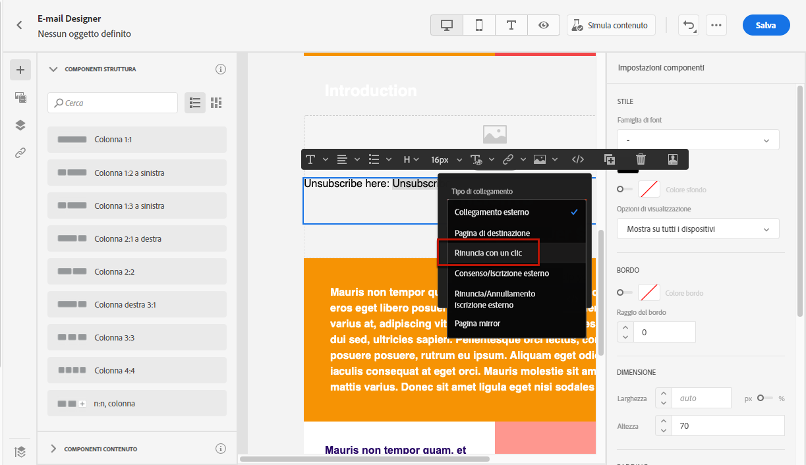
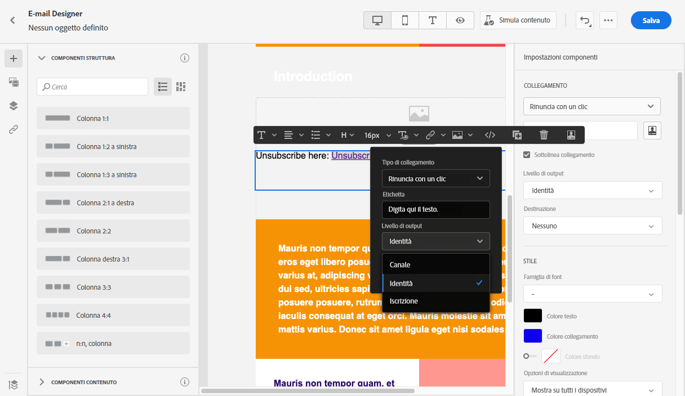
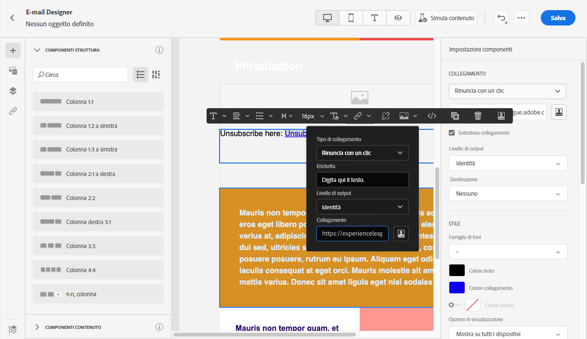
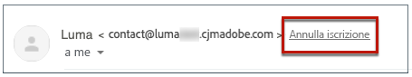

# Gestire il consenso {#consent}

Utilizza [!DNL Journey Optimizer] per tenere traccia del consenso dei destinatari alle comunicazioni e capire in che modo desiderano interagire con il tuo marchio gestendo le preferenze e gli abbonamenti.

Regolamenti come il GDPR stabiliscono che si devono soddisfare requisiti specifici prima di poter utilizzare le informazioni degli interessati. Inoltre, gli interessati dovrebbero poter modificare il loro consenso in qualsiasi momento.

**Perché è importante?**

* Il mancato rispetto di queste normative introduce rischi legali normativi per il tuo marchio.
* Ti aiuta a evitare l’invio di comunicazioni non richieste ai destinatari, in modo che queste non vengano contrassegnate come spam danneggiando la tua reputazione.

Per ulteriori informazioni sulla gestione della privacy e sulle normative applicabili, consulta la [documentazione di Experience Platform](https://experienceleague.adobe.com/docs/experience-platform/privacy/home.html?lang=it){target=&quot;_blank&quot;}.

>[!NOTE]
>
>In [!DNL Journey Optimizer], il consenso è gestito dallo [Schema di consenso](https://experienceleague.adobe.com/docs/experience-platform/xdm/field-groups/profile/consents.html?lang=it){target=&quot;_blank&quot;} di Experience Platform. Per impostazione predefinita, il valore del campo di consenso è vuoto e viene trattato come consenso alla ricezione delle comunicazioni. Puoi modificare questo valore predefinito durante l’onboarding in uno dei possibili valori elencati [qui](https://experienceleague.adobe.com/docs/experience-platform/xdm/data-types/consents.html?lang=it#choice-values){target=&quot;_blank&quot;}.

## Gestione della rinuncia e-mail {#opt-out-management}

Come requisito legale, è necessario dare ai destinatari la possibilità di annullare l’iscrizione alla ricezione di comunicazioni da parte di un marchio. Ulteriori informazioni sulle normative applicabili sono disponibili nella [documentazione di Experience Platform](https://experienceleague.adobe.com/docs/experience-platform/privacy/regulations/overview.html?lang=it#regulations){target=&quot;_blank&quot;}.

Pertanto, devi sempre includere un **collegamento che consenta di annullare l’abbonamento** in ogni e-mail inviata ai destinatari:

* Facendo clic su questo collegamento, i destinatari verranno indirizzati a una pagina di destinazione contenente un pulsante per confermare la rinuncia.
* Dopo aver confermato la scelta, i dati dei profili verranno aggiornati con queste informazioni.

>[!NOTE]
>
>I messaggi e-mail di tipo marketing devono includere un collegamento di rinuncia, che non è necessario per i messaggi transazionali. La categoria del messaggio (**[!UICONTROL Marketing]** o **[!UICONTROL Transactional]**) è definita per la [superficie di canale](../configuration/channel-surfaces.md#email-type) (ossia per il predefinito del messaggio) e durante la [creazione del messaggio](get-started-content.md#create-new-message).

### Rinuncia esterna {#opt-out-external-lp}

In questo caso, puoi inserire in un’e-mail un collegamento a una pagina di destinazione esterna per consentire agli utenti di annullare l’abbonamento alla ricezione di comunicazioni dal tuo marchio.

#### Aggiungere un collegamento per annullare l’abbonamento {#add-unsubscribe-link}

Devi innanzitutto aggiungere a un messaggio un collegamento che consenta di annullare l’abbonamento. Per farlo, segui la procedura indicata di seguito:

1. Crea la pagina di destinazione per l’annullamento dell’abbonamento.

1. Inseriscila sul sistema di terze parti a tua scelta.

1. [Crea un messaggio](get-started-content.md) in un percorso.

1. Seleziona il testo nel contenuto e [inserisci un collegamento](../design/message-tracking.md#insert-links) utilizzando la barra degli strumenti contestuale.

   

1. Seleziona **[!UICONTROL External Opt-out/Unsubscription]** dall’elenco a discesa **[!UICONTROL Link type]**.

   

1. Nel campo **[!UICONTROL Link]**, incolla il collegamento alla pagina di destinazione della terza parte.

   

1. Fai clic su **[!UICONTROL Save]**.

#### Implementare una chiamata API per la rinuncia {#opt-out-api}

Per consentire ai destinatari di rinunciare selezionando la preferenza dalla pagina di destinazione, devi implementare una **chiamata API per abbonamento** tramite [Adobe Developer](https://developer.adobe.com/){target=&quot;_blank&quot;} per aggiornare le preferenze dei profili corrispondenti.

La chiamata POST è la seguente:

Endpoint: platform.adobe.io/journey/imp/consent/preferences

Parametri query:

* **parametri**: contiene il payload crittografato
* **sig**: signature
* **pid**: ID profilo crittografato

Questi tre parametri verranno inclusi nell’URL della pagina di destinazione di terze parti inviato al destinatario:


Requisiti dell’intestazione:

* x-api-key
* x-gw-ims-org-id
* x-sandbox-name
* autorizzazione (token utente dal tuo account tecnico)

Corpo della richiesta:

```
{
   "marketing": [
       {
            "type": "email",           
            "choice": "no",          
            "scope": "channel"       
        }
    ],
 
}
```

[!DNL Journey Optimizer] utilizzerà questi parametri per aggiornare la scelta del profilo corrispondente tramite la chiamata API di [Adobe Developer](https://developer.adobe.com){target=&quot;_blank&quot;}.

#### Inviare il messaggio con il collegamento per annullare l’abbonamento {#send-message-unsubscribe-link}

Una volta configurato il collegamento che apre la pagina di destinazione in cui sarà possibile per annullare l’abbonamento, e implementata la chiamata API, il messaggio è pronto per essere inviato.

1. Invia il messaggio contenente il collegamento tramite un [percorso](../building-journeys/journey.md).

1. Una volta ricevuto il messaggio, se il destinatario fa clic sul collegamento per annullare l’abbonamento, viene visualizzata la pagina di destinazione.

   

1. Se il destinatario invia il modulo (in questo esempio, premendo il pulsante **Unsubscribe** nella pagina di destinazione), i dati del profilo vengono aggiornati tramite la [chiamata API](#opt-out-api).

1. Il destinatario che ha scelto l’opt-out viene quindi reindirizzato a una schermata con un messaggio di conferma che indica che la rinuncia è avvenuta con successo.

   

   L’utente non riceverà più comunicazioni dal tuo marchio, a meno che non acconsenta nuovamente.

1. Per verificare che la scelta del profilo corrispondente sia stata aggiornata, passa ad Experience Platform e accedi al profilo selezionando uno spazio dei nomi di identità e un valore di identità corrispondente. Per ulteriori informazioni, consulta la [documentazione di Experience Platform](https://experienceleague.adobe.com/docs/experience-platform/profile/ui/user-guide.html?lang=it#getting-started){target=&quot;_blank&quot;}.

   

   Nella scheda **[!UICONTROL Attributes]**, puoi vedere che il valore di **[!UICONTROL choice]** è stato modificato in **[!UICONTROL no]**.

### Rinuncia con un clic {#one-click-opt-out}

Poiché molti clienti cercano un processo più semplice per annullare l’abbonamento, puoi anche aggiungere al contenuto dell’e-mail un collegamento di rinuncia con un solo clic. Questo collegamento consentirà ai destinatari di annullare rapidamente l’abbonamento alle comunicazioni senza essere reindirizzati a una pagina di destinazione in cui confermare la rinuncia, per una procedura più snella.

Per aggiungere un collegamento di rinuncia all’e-mail, segui la procedura seguente.

1. [Inserisci un collegamento](../design/message-tracking.md#insert-links) e seleziona **[!UICONTROL One click Opt-out]** come tipo di collegamento.

   

1. Seleziona la modalità di applicazione della rinuncia: a livello di canale, identità o abbonamento.

   

   * **[!UICONTROL Channel]**: la rinuncia si applica ai messaggi futuri inviati alla destinazione del profilo (ad esempio l’indirizzo e-mail) per il canale corrente. Se a un profilo sono associate più destinazioni, la rinuncia si applica a tutte le destinazioni (ad esempio gli indirizzi e-mail) nel profilo di quel canale.
   * **[!UICONTROL Identity]**: la rinuncia si applica ai messaggi futuri inviati alla destinazione specifica (ad esempio l’indirizzo e-mail) utilizzata per il messaggio corrente.
   * **[!UICONTROL Subscription]**: la rinuncia si applica ai messaggi futuri associati a un elenco di abbonamento specifico. Questa opzione può essere selezionata solo se il messaggio corrente è associato a un elenco di abbonamenti.

1. Immetti l’URL della pagina di destinazione a cui l’utente verrà reindirizzato una volta annullato l’abbonamento. Questa pagina è disponibile solo per confermare che la rinuncia è stata eseguita correttamente.

   >[!NOTE]
   >
   >Se hai attivato l’opzione **Annullamento iscrizione a mailing list** a livello della superficie di canale, questo URL verrà utilizzato anche quando gli utenti fanno clic sul collegamento di annullamento dell’iscrizione nell’intestazione dell’e-mail. [Ulteriori informazioni](#unsubscribe-header)

   

   Puoi personalizzare i tuoi collegamenti. Ulteriori informazioni sugli URL personalizzati sono disponibili in [questa sezione](../personalization/personalization-syntax.md).

1. Salva le modifiche.

Quando il messaggio viene inviato tramite un [percorso](../building-journeys/journey.md), se un destinatario fa clic sul collegamento di rinuncia, il suo profilo viene immediatamente escluso.

### Collegamento per annullare l’iscrizione nell’intestazione dell’e-mail {#unsubscribe-header}

>[!CONTEXTUALHELP]
>id="ajo_admin_preset_unsubscribe"
>title="Aggiungi un collegamento per annullare l’iscrizione all’intestazione dell’e-mail"
>abstract="Abilita Annulla sottoscrizione elenco per aggiungere un collegamento di annullamento dell’iscrizione all’intestazione dell’e-mail. Per impostare un URL per l’annullamento dell’iscrizione, inserisci un collegamento per la rinuncia con un solo clic nel contenuto dell’e-mail."
>additional-url="https://experienceleague.adobe.com/docs/journey-optimizer/using/messages/consent.html?lang=it#one-click-opt-out" text="Rinuncia con un clic"

Se l’opzione [Annullamento iscrizione a mailing list](../configuration/channel-surfaces.md#list-unsubscribe) è attiva a livello di superficie di canale, le e-mail corrispondenti inviate con [!DNL Journey Optimizer] includeranno un collegamento di annullamento dell’iscrizione nell’intestazione dell’e-mail.

Ad esempio, il collegamento per annullare l’iscrizione verrà visualizzato in Gmail in questo modo:



>[!NOTE]
>
>Per visualizzare il collegamento di annullamento dell’iscrizione nell’intestazione dell’e-mail, il client e-mail dei destinatari deve supportare questa funzione.

L’indirizzo predefinito per l’annullamento dell’iscrizione è l’indirizzo **[!UICONTROL Mailto (unsubscribe)]** visualizzato nella superficie di canale corrispondente. [Ulteriori informazioni](../configuration/channel-surfaces.md#list-unsubscribe).

Per impostare un URL personalizzato per l’annullamento dell’iscrizione, inserisci un collegamento per la rinuncia con un solo clic nel contenuto del messaggio e-mail e immetti l’URL desiderato. [Ulteriori informazioni](#one-click-opt-out)

A seconda del client e-mail, clicca sul collegamento per annullare l’iscrizione dall’intestazione può avere uno degli effetti seguenti:

* La richiesta di annullamento dell’iscrizione viene inviata all’indirizzo predefinito di annullamento dell’iscrizione.

* Il destinatario viene indirizzato all’URL della pagina di destinazione specificato al momento dell’aggiunta del collegamento di rinuncia al messaggio.

   >[!NOTE]
   >
   >Se non aggiungi un collegamento di rinuncia con un solo clic nel contenuto del messaggio, non verrà visualizzata alcuna pagina di destinazione.

* Il profilo corrispondente viene immediatamente escluso e questa scelta viene aggiornata in Experience Platform. Per ulteriori informazioni, consulta la [documentazione di Experience Platform](https://experienceleague.adobe.com/docs/experience-platform/profile/ui/user-guide.html#getting-started){target=&quot;_blank&quot;}.

## Gestione degli opt-out per notifiche push {#push-opt-out-management}

I destinatari delle notifiche push possono annullare l’iscrizione dai propri dispositivi.

Ad esempio, al momento del download o dell’utilizzo dell’app, possono scegliere di interrompere le notifiche. Analogamente, possono modificare le impostazioni di notifica tramite il sistema operativo mobile.

## Gestione della rinuncia agli SMS {#sms-opt-out-management}

In conformità agli standard e alle normative del settore, i destinatari di SMS possono rispondere con parole chiave di consenso e rinuncia.
Adobe Journey Optimizer elabora automaticamente le seguenti parole chiave nei messaggi in arrivo: START (AVVIA), STOP (INTERROMPI) e UNSTOP (RIPRENDI). Queste parole chiave attivano le risposte standard automatiche dal provider SMS.

Per ulteriori informazioni sulla rinuncia agli SMS, consulta questa [pagina](../messages/create-sms.md#opt-in-and-opt-out).