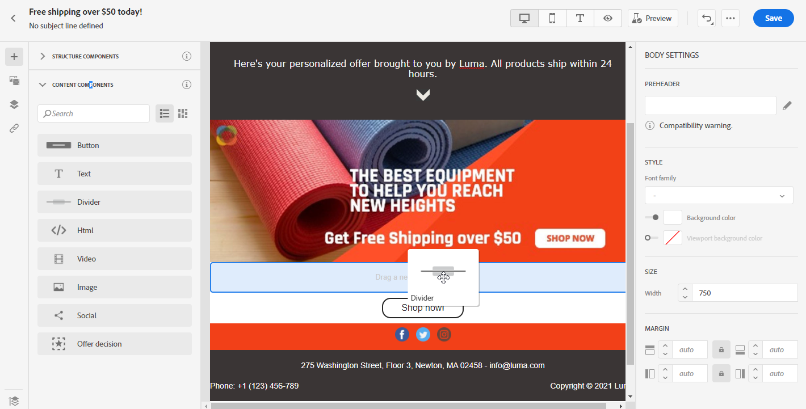
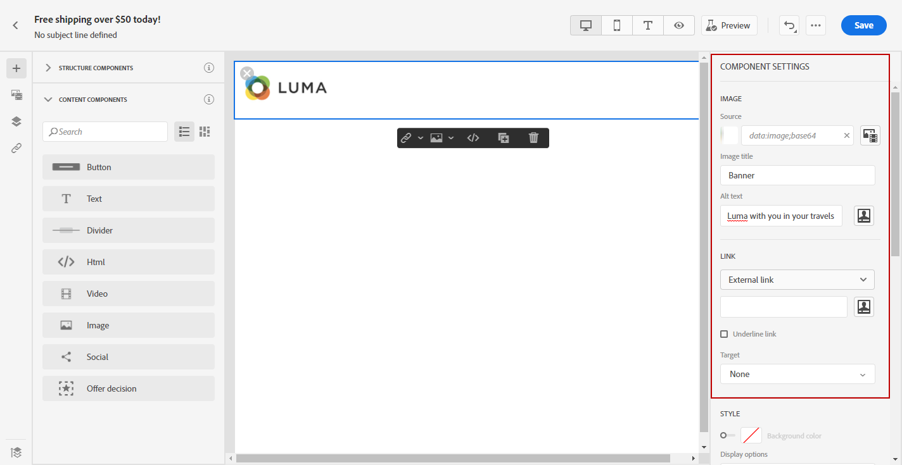

# Utilizzare i componenti contenuto di E-mail designer {#content-components}

>[!CONTEXTUALHELP]
>id="ac_content_components"
>title="Informazioni sui componenti Contenuto"
>abstract="I componenti contenuto sono segnaposto di contenuto vuoti che possono essere utilizzati per creare il layout di un’e-mail."

Quando crei il tuo contenuto e-mail da zero, **[!UICONTROL Content components]** consente di personalizzare ulteriormente l’e-mail con componenti vuoti e non elaborati che possono essere utilizzati una volta inseriti in un messaggio e-mail.
Puoi aggiungere più **[!UICONTROL Content components]** come necessario all&#39;interno di un **[!UICONTROL Structure component]** che definisce il layout del messaggio e-mail.

## Pulsante {#buttons}

Utilizza la **[!UICONTROL Button]** per inserire più pulsanti nell’e-mail e reindirizzare il pubblico dell’e-mail a un’altra pagina.

1. Da **[!UICONTROL Content components]**, trascinamento **[!UICONTROL Button]** in **[!UICONTROL Structure component]**.

   

1. Fai clic sul pulsante appena aggiunto per personalizzare il testo e avere accesso al **[!UICONTROL Components Settings]** nel riquadro a destra della finestra di progettazione e-mail.

   

1. In **[!UICONTROL Link]** campo **[!UICONTROL Components Settings]**, aggiungi l’URL a cui desideri reindirizzare il pubblico quando fai clic sul pulsante .

1. Scegli in che modo il pubblico verrà reindirizzato con il **[!UICONTROL Target]** a discesa:

   * **[!UICONTROL None]**: apre il collegamento nello stesso frame in cui è stato fatto clic (impostazione predefinita).
   * **[!UICONTROL Blank]**: apre il collegamento in una nuova finestra o scheda.
   * **[!UICONTROL Self]**: apre il collegamento nello stesso frame in cui è stato fatto clic.
   * **[!UICONTROL Parent]**: apre il collegamento nel frame principale.
   * **[!UICONTROL Top]**: apre il collegamento nel corpo completo della finestra.

   

1. Ora puoi personalizzare ulteriormente il pulsante modificando la variabile **[!UICONTROL Style]**, **[!UICONTROL Margin]** e **[!UICONTROL Border]** ad esempio.

## Testo {#text}

Utilizza la **[!UICONTROL Text]** per inserire testo nell’e-mail. È possibile regolare il colore, lo stile e le dimensioni del testo in **[!UICONTROL Component Settings]**.

1. In **[!UICONTROL Content Components]**, trascinamento **[!UICONTROL Text]** in **[!UICONTROL Structure component]**.

   

1. Fai clic sul componente appena aggiunto per personalizzare il testo e avere accesso al **[!UICONTROL Components Settings]** nel riquadro a destra della finestra di progettazione e-mail.

1. Modifica il testo con le seguenti opzioni disponibili nella barra degli strumenti:

   

   * **[!UICONTROL Change text style]**: applicare al testo in grassetto, corsivo, sottolineato o barrato.
   * **Modificare l’allineamento**: scegliere tra allineamento a sinistra, a destra, al centro o giustificato per il testo.
   * **[!UICONTROL Create list]**: aggiungere al testo un elenco puntato o un elenco di numeri.
   * **[!UICONTROL Set heading]**: aggiungi fino a sei livelli di intestazione al testo.
   * **Dimensione font**: selezionare la dimensione del font del testo in pixel.
   * **[!UICONTROL Edit image]**: aggiungi un’immagine o una risorsa al componente testo. [Ulteriori informazioni sulla gestione delle risorse](assets-essentials.md).
   * **[!UICONTROL Show the source code]**: visualizza il codice sorgente del testo. Non può essere modificato.
   * **[!UICONTROL Duplicate]**: aggiungi una copia del componente testo.
   * **[!UICONTROL Delete]**: elimina il componente di testo selezionato dal messaggio e-mail.
   * **[!UICONTROL Add personalization]**: aggiungi campi di personalizzazione per personalizzare il contenuto dai dati dei profili. [Ulteriori informazioni sulla personalizzazione dei contenuti](../personalization/personalize.md).

1. Per una migliore esperienza utente, puoi aggiungere campi di personalizzazione per rivolgerti al pubblico. Per ulteriori informazioni, consulta questa [sezione](../personalization/personalize.md).

1. Regolare la **[!UICONTROL Text color]**, **[!UICONTROL Font family]** e **[!UICONTROL Size]** in **[!UICONTROL Components Settings]**.

   

## Divider {#divider}

Utilizza la **[!UICONTROL Divider]** per inserire una linea di divisione per organizzare il layout e il contenuto dell’e-mail.
È possibile selezionare il colore, lo stile e le dimensioni della linea di interruzione in **[!UICONTROL Component Settings]**.

## HTML {#HTML}

Utilizza la **[!UICONTROL HTML]** per copiare e incollare le diverse parti del HTML esistente. Questo consente di creare componenti HTML modulari gratuiti.

Per rendere semplicemente un contenuto esterno conforme a E-mail Designer, Adobe consiglia di creare un messaggio da zero e di copiare il contenuto dell’e-mail esistente nei componenti.

1. In **[!UICONTROL Content Components]**, trascinamento **[!UICONTROL HTML]** in **[!UICONTROL Structure component]**.

   

1. Fai clic sul componente appena aggiunto, quindi **[!UICONTROL Show the source code]** per aggiungere il tuo HTML.

   

1. Copia e incolla il codice HTML che desideri aggiungere all’e-mail e fai clic su **[!UICONTROL Save]**.

1. Ora puoi personalizzare ulteriormente il tuo HTML modificando il **[!UICONTROL Style]**, **[!UICONTROL Margin]** e **[!UICONTROL Border]** ad esempio, o aggiungi un collegamento per reindirizzare il pubblico a un altro contenuto.

## Immagine {#image}

Utilizza la **[!UICONTROL Image]** per inserire un file immagine dal computer nell’e-mail.

1. In **[!UICONTROL Content Components]**, trascinamento **[!UICONTROL Image]** in **[!UICONTROL Structure component]**.

   

1. Fai clic su **[!UICONTROL Browse]** per scegliere un file di immagine dalle risorse.

   Per saperne di più [!DNL Assets Essentials], fare riferimento a [Documentazione di Adobe Experience Manager Assets Essentials](https://experienceleague.adobe.com/docs/experience-manager-assets-essentials/help/introduction.html){target=&quot;_blank&quot;}.

1. Fai clic sul componente appena aggiunto per iniziare a configurare il **[!UICONTROL Content Components]** e di avere accesso ai **[!UICONTROL Components Settings]** nel riquadro a destra della finestra di progettazione e-mail.

1. Imposta le proprietà dell&#39;immagine:

   * **[!UICONTROL Image Title]** consente di definire un titolo per l’immagine.
   * **[!UICONTROL Alt text]** consente di definire la didascalia collegata all’immagine. Questo corrisponde all’attributo alt HTML.

   

1. È ora possibile personalizzare ulteriormente l&#39;immagine modificando il **[!UICONTROL Style]**, **[!UICONTROL Margin]** e **[!UICONTROL Border]** ad esempio, o aggiungi un collegamento per reindirizzare il pubblico a un altro contenuto.

## Video {#Video}

>[!CONTEXTUALHELP]
>id="ac_edition_video"
>title="Impostazioni video"
>abstract="Utilizza questo componente per inserire un video nel messaggio e-mail. I video non funzionano su tutti i client e-mail. È consigliabile impostare un’immagine di fallback."
>additional-url="https://www.emailonacid.com/blog/article/email-development/a_how_to_guide_to_embedding_html5_video_in_email/" text="Informazioni aggiuntive"

Utilizza la **[!UICONTROL Video]** per inserire un video nell’e-mail tramite un collegamento URL.

1. In **[!UICONTROL Content Components]**, trascinamento **[!UICONTROL Video]** in **[!UICONTROL Structure component]**.

   

1. Fai clic sul componente appena aggiunto per iniziare a configurare il **[!UICONTROL Content Components]** e di avere accesso ai **[!UICONTROL Components Settings]** nel riquadro a destra della finestra di progettazione e-mail.

1. In **[!UICONTROL Video link]** campo **[!UICONTROL Components Settings]**, aggiungi l’URL del video.

   

1. Puoi aggiungere una **[!UICONTROL Poster image]** per specificare un&#39;immagine da visualizzare fino a quando il pubblico non fa clic sul pulsante di riproduzione.

1. È ora possibile personalizzare ulteriormente l&#39;immagine modificando il **[!UICONTROL Style]**, **[!UICONTROL Margin]** e **[!UICONTROL Border]** ad esempio.

## Social {#social}

Utilizza la **[!UICONTROL Social]** per inserire collegamenti alle pagine dei social media nel messaggio e-mail.

1. In **[!UICONTROL Content Components]**, trascinamento **[!UICONTROL Social]** in **[!UICONTROL Structure component]**.

   

1. Fai clic sul componente appena aggiunto per iniziare a configurare il **[!UICONTROL Content Components]** e di avere accesso ai **[!UICONTROL Components Settings]** nel riquadro a destra della finestra di progettazione e-mail.

1. In **[!UICONTROL Social]** campo **[!UICONTROL Components Settings]**, scegli i social media da aggiungere o rimuovere.

   

1. Scegli la dimensione delle icone nella **[!UICONTROL Size of images]** campo .

1. Fai clic su ciascuna delle icone dei social media per configurare le **[!UICONTROL URL]** a cui verrà reindirizzato il pubblico.

   

1. Puoi anche modificare le icone di ciascuno dei tuoi social media, se necessario, in **[!UICONTROL Image]** campo .

1. È ora possibile personalizzare ulteriormente le icone dei social media modificando **[!UICONTROL Style]**, **[!UICONTROL Margin]** e **[!UICONTROL Border]**.

## Decisione di offerta {#offer-decision}

Utilizza la **[!UICONTROL Offer decision]** per inserire nei messaggi le decisioni (precedentemente note come attività di offerta). Decisioni sfrutterà la Gestione delle decisioni per scegliere l&#39;offerta migliore da consegnare ai tuoi clienti.

Argomenti correlati:

* [Introduzione alla gestione delle decisioni](../offers/get-started/starting-offer-decisioning.md).
* [Aggiungere offerte personalizzate nei messaggi](deliver-personalized-offers.md).
