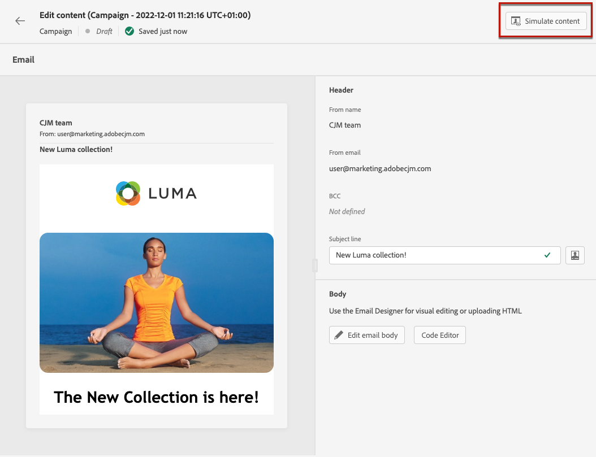

# Creare un messaggio e-mail {#create-email-bis}

Per creare un’e-mail, segui i passaggi riportati di seguito.

## 1. Creare un messaggio e-mail in un percorso o una campagna

Aggiungi un **[!UICONTROL E-mail]** a un percorso o a una campagna e segui i passaggi riportati di seguito in base al tuo caso.

>[!BEGINTABS]

>[!TAB Aggiungere un’e-mail a un percorso]

1. Apri il percorso, quindi trascina e rilascia una **[!UICONTROL E-mail]** attività dal **[!UICONTROL Azioni]** della palette.

1. Fornisci informazioni di base sul messaggio (etichetta, descrizione, categoria).

1. Scegli la [superficie e-mail] da utilizzare.

   

Per ulteriori informazioni su come configurare un percorso, consulta [questa pagina](../building-journeys/journey-gs.md).

>[!TAB Aggiungere un messaggio e-mail a una campagna]

1. Crea una nuova campagna pianificata o attivata dall’API e seleziona **[!UICONTROL E-mail]** come tua azione.

1. Scegli la [superficie e-mail] da utilizzare.

   

1. Fai clic su **[!UICONTROL Crea]**.

1. Completa i passaggi per creare una campagna e-mail.

   

<!--
From the **[!UICONTROL Action]** section, specify if you want to track how your recipients react to your delivery: you can track email opens, and/or clicks on links and buttons in your email.

-->

Per ulteriori informazioni su come configurare una campagna, consulta [questa pagina](../campaigns/get-started-with-campaigns.md).

>[!ENDTABS]

## Definire il contenuto dell’e-mail

1. Dalla schermata di configurazione del percorso o della campagna, fai clic sul pulsante **[!UICONTROL Modifica contenuto]** per configurare il contenuto dell’e-mail. [Ulteriori informazioni]

   

1. In **[!UICONTROL Intestazione]** della sezione **[!UICONTROL Modifica contenuto]** schermo, **[!UICONTROL Nome mittente]**, **[!UICONTROL Da e-mail]** e **[!UICONTROL CCN]** Il campo proviene dall’area e-mail selezionata. [Ulteriori informazioni] <!--check if same for journey-->

   

1. È possibile aggiungere un oggetto. Digita testo normale direttamente nel campo corrispondente o utilizza il [Editor espressioni](../personalization/personalization-build-expressions.md) per personalizzare l’oggetto.

1. Fai clic sul pulsante **[!UICONTROL Modifica corpo del messaggio e-mail]** per iniziare a creare il contenuto utilizzando il pulsante [!DNL Journey Optimizer] E-mail Designer. [Ulteriori informazioni]

   

   Puoi anche fare clic sul pulsante **[!UICONTROL Editor di codice]** per codificare il proprio contenuto in HTML semplice utilizzando la finestra a comparsa visualizzata.

   

   >[!NOTE]
   >
   >Se il contenuto è già stato creato o importato tramite E-mail Designer, verrà visualizzato in HTML.

## Visualizzare l’anteprima del messaggio e-mail

Una volta definito il contenuto del messaggio, puoi visualizzarlo in anteprima per controllare il rendering del messaggio e-mail e controllare le impostazioni di personalizzazione con i profili di test. [Ulteriori informazioni]

È inoltre necessario controllare gli avvisi nella sezione superiore dell’editor.  Alcuni sono semplici avvisi, altri possono impedire l’utilizzo del messaggio. [Ulteriori informazioni](alerts.md).

## Convalidare il contenuto dell’e-mail

Quando il tuo messaggio e-mail è pronto, completa la configurazione del tuo [percorso](../building-journeys/journey-gs.md) o [campagna](../campaigns/create-campaign.md) e attiva per inviare il messaggio.

>[!NOTE]
>
>Per tenere traccia del comportamento dei destinatari tramite le aperture e/o le interazioni e-mail, assicurati che le opzioni dedicate nel **[!UICONTROL Tracking]** la sezione è abilitata nel percorso [attività e-mail](../building-journeys/journeys-message.md) o nell’e-mail [campagna](../campaigns/create-campaign.md).

È inoltre necessario controllare gli avvisi nella sezione superiore dell’editor.  Alcuni sono semplici avvisi, altri possono impedire l’utilizzo del messaggio. [Ulteriori informazioni](alerts.md)

