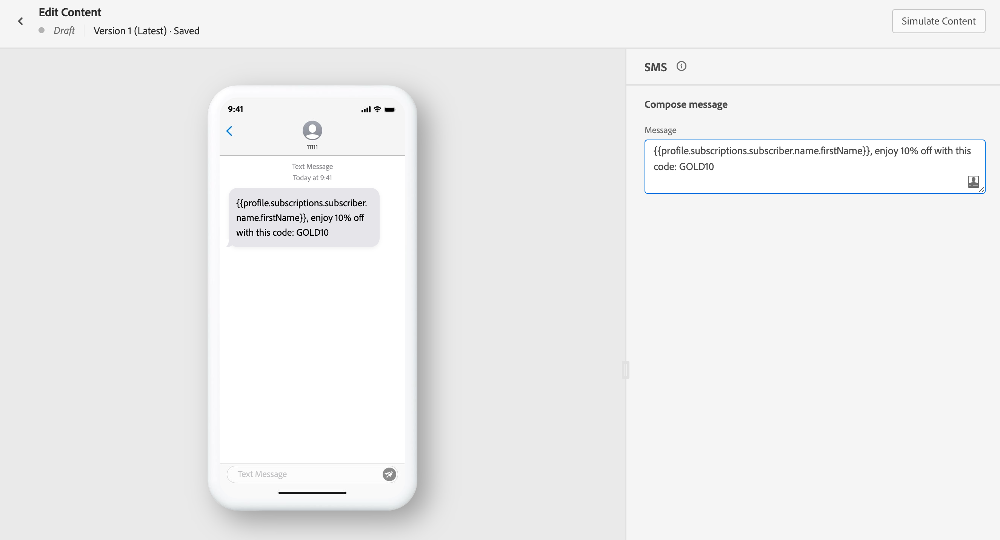

# Creare un messaggio SMS {#create-sms}

>[!CONTEXTUALHELP]
>id="ajo_message_sms"
>title="Creazione di SMS"
>abstract="Aggiungi il messaggio di testo e inizia a personalizzarlo con l’editor espressioni."

Utilizzo [!DNL Journey Optimizer] per inviare messaggi di testo ai clienti sui loro dispositivi mobili. Puoi creare, personalizzare e visualizzare in anteprima i messaggi in formato testo dall’editor SMS.

>[!NOTE]
>
>In conformità agli standard e alle normative del settore, tutti i messaggi di marketing SMS devono contenere un modo per consentire ai destinatari di annullare facilmente l’iscrizione. A tal fine, i destinatari SMS possono rispondere con parole chiave di consenso e rinuncia. [Scopri come gestire la rinuncia](../privacy/opt-out.md#sms-opt-out-management-sms-opt-out-management)

È possibile creare le consegne SMS:

* In una **Percorso**: Dopo aver aggiunto un’attività SMS nel percorso e definito le impostazioni di base, utilizza **[!UICONTROL Azioni: SMS]** riquadro a destra per creare il contenuto per il messaggio SMS.

   Per ulteriori informazioni su come configurare il percorso, consulta questo [page](../building-journeys/journey-gs.md).

* In una **Campaign**: Dopo aver creato una campagna, seleziona SMS come azione e definisci le impostazioni di base.

   Per ulteriori informazioni su come configurare la campagna, consulta questo [page](../campaigns/create-campaign.md#configure).

Se è la prima volta che crei un messaggio SMS, assicurati che il canale SMS sia stato configurato. [Ulteriori informazioni](../configuration/sms-configuration.md).

## Definire il contenuto SMS{#sms-content}

Per iniziare a personalizzare il messaggio SMS, segui questi passaggi:

1. Fai clic sul pulsante **[!UICONTROL Messaggio]** per aprire l’editor espressioni.

   

1. Utilizza l’editor espressioni per definire il contenuto e aggiungere contenuto dinamico. Puoi utilizzare qualsiasi attributo, ad esempio il nome del profilo o la città. Ulteriori informazioni [personalizzazione](../personalization/personalize.md) e [contenuto dinamico](../personalization/get-started-dynamic-content.md) nell’editor espressioni.

1. Fai clic su **[!UICONTROL Salva]** e controlla il messaggio nell’anteprima.

   

## Convalidare l’SMS{#sms-preview}

>[!NOTE]
>
> Per una migliore consegna, è sempre necessario utilizzare i numeri di telefono nei formati supportati dal provider. Ad esempio, Twilio e Sinch supportano solo i numeri di telefono in formato E.164.

Una volta definito il contenuto del messaggio, puoi utilizzare i profili di test per visualizzarlo in anteprima e testarlo. Se hai inserito [contenuti personalizzati](../personalization/personalize.md), puoi controllare come questo contenuto viene visualizzato nel messaggio, sfruttando i dati del profilo di test.

Per visualizzare la modalità di visualizzazione del messaggio SMS sui dispositivi mobili, fai clic sul pulsante **[!UICONTROL Simulazione del contenuto]** scheda . Ulteriori informazioni sulla simulazione dei contenuti in [questa sezione](../design/preview.md).

È inoltre necessario controllare gli avvisi nella sezione superiore dell’editor.  Alcuni sono semplici avvisi, altri possono impedire l’utilizzo del messaggio. Ulteriori informazioni in [questa sezione](alerts.md).

<!--
## How-to video

Learn how to configure, author, and include SMS messaging into your customer journeys.

>[!VIDEO](https://video.tv.adobe.com/v/344460?quality=12)
-->
**Argomenti correlati**

* [Configurare il canale SMS](../configuration/sms-configuration.md)
* [Rapporto SMS](../reports/journey-global-report.md#sms-global)
* [Creare un nuovo messaggio](get-started-content.md)
* [Aggiungere un messaggio in un percorso](../building-journeys/journeys-message.md)
