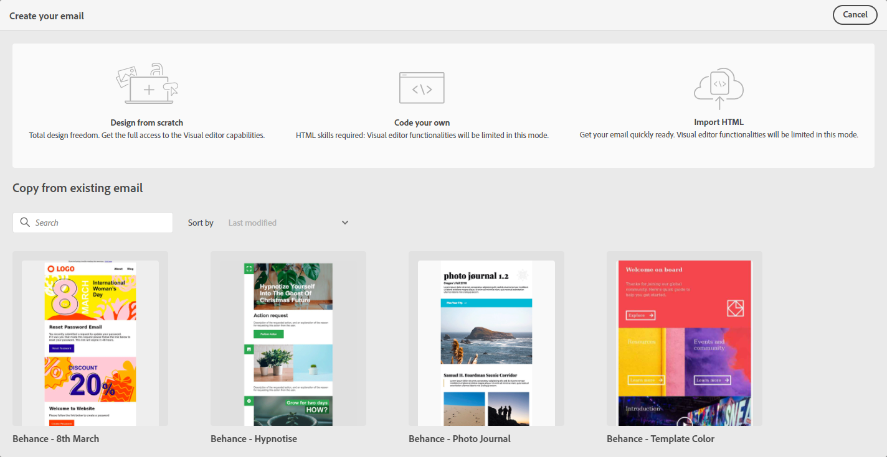

# Introduzione alla progettazione delle e-mail {#get-started-content-design}

Durante la creazione di contenuti e-mail con [!DNL Journey Optimizer], puoi:

* **Progettazione dell&#39;e-mail da zero** tramite l’interfaccia di e-mail designer e sfrutta le immagini da [Adobe Experience Manager Assets Essentials](assets-essentials.md). Scopri come progettare il contenuto delle e-mail o utilizzare modelli incorporati [in questa sezione](create-email-content.md).

* **Codice o incolla di HTML raw** direttamente nella finestra di progettazione e-mail. Scopri come codificare i contenuti personalizzati [in questa sezione](existing-content.md#import-raw-html-code).

* **Importare contenuto HTML esistente** da un file o da una cartella .zip. Scopri come importare un contenuto e-mail [in questa sezione](existing-content.md#import-html-content-from-file).

Queste funzioni sono tutte disponibili quando si accede a E-mail Designer dalla schermata di creazione dei messaggi. [Ulteriori informazioni sulla creazione dei messaggi](create-message.md).

>[!NOTE]
>
>I modelli nell’area inferiore sono statici e non possono essere modificati. Sono disponibili solo a scopo illustrativo.
