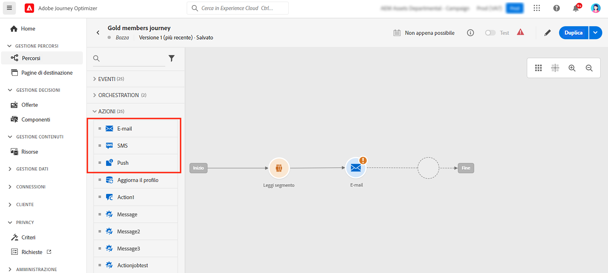
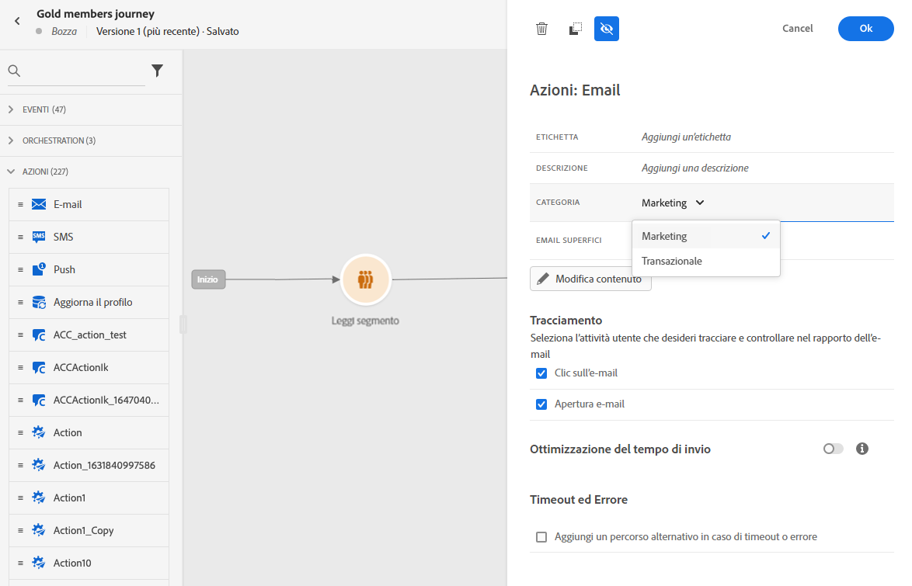
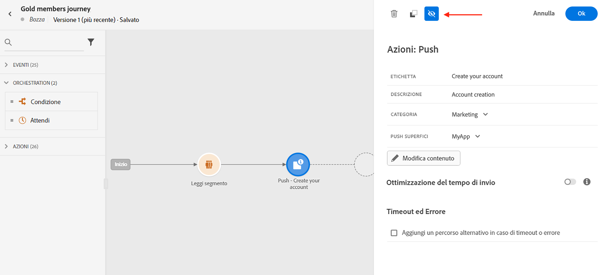
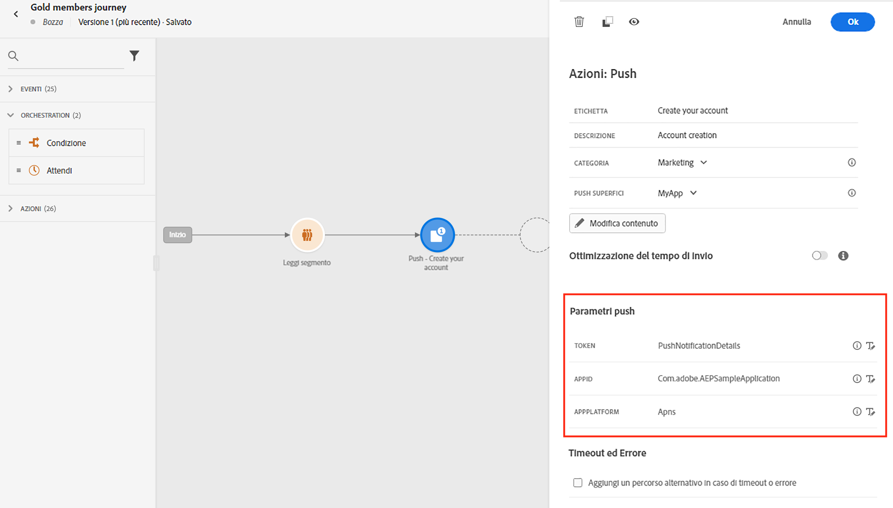
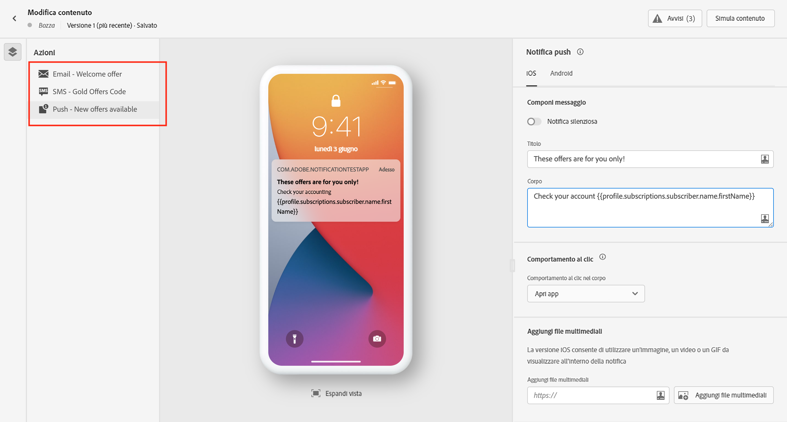
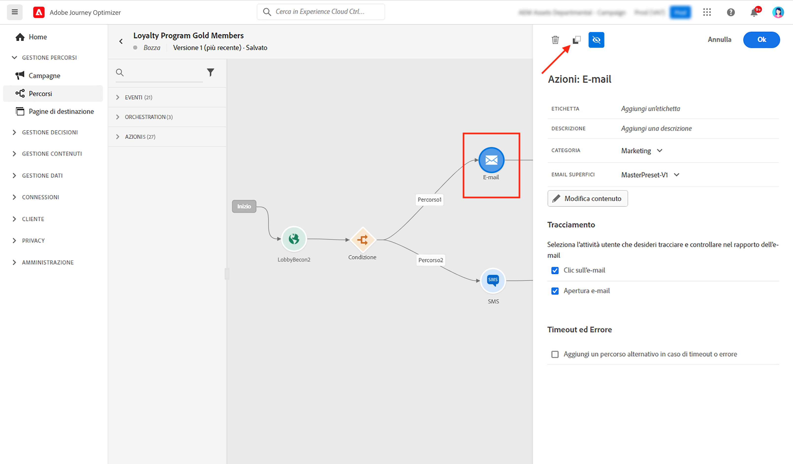
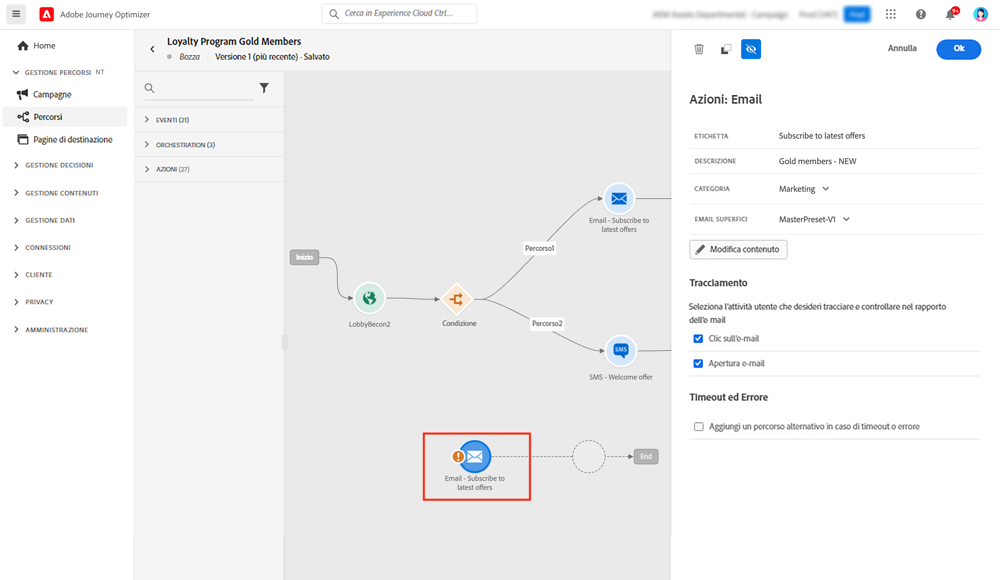
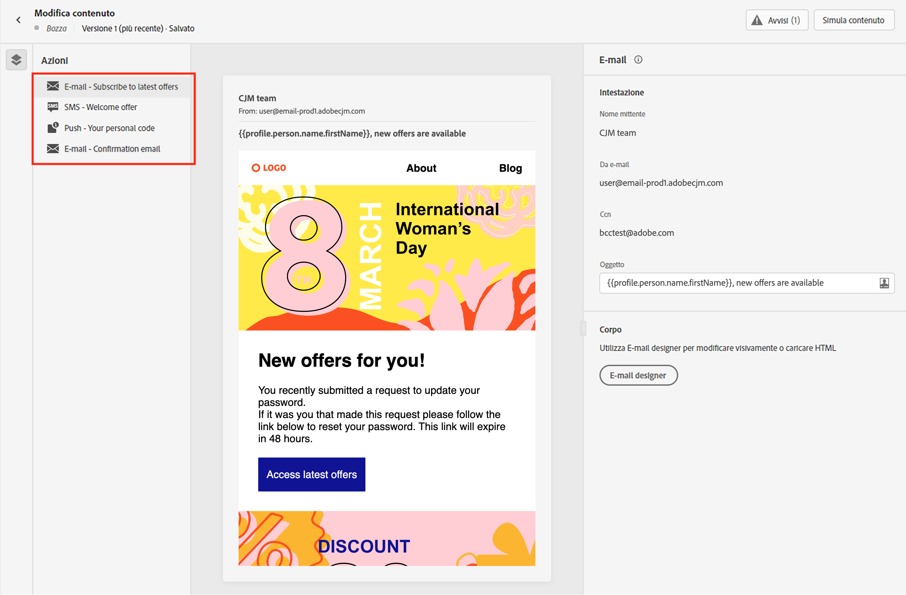
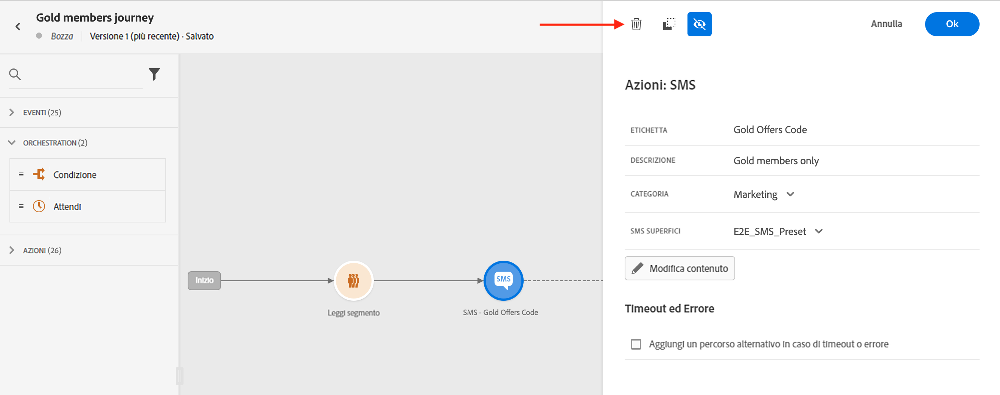

# Aggiungere messaggi nei percorsi{#messages-in-journeys}

>[!CONTEXTUALHELP]
>id="ajo_message_category"
>title="Categoria messaggio"
>abstract="Scegli Marketing per i messaggi commerciali; scegli Transazionale per i messaggi non commerciali, come la conferma di un ordine, le notifiche di reimpostazione della password o le informazioni di consegna."

>[!CONTEXTUALHELP]
>id="ajo_message_surface"
>title="Superficie di canale"
>abstract="Una superficie di canale è un’istanza di quel canale che dispone di tutte le impostazioni per consegnare correttamente un’azione tramite una campagna o un percorso. Viene definita da un amministratore di sistema."

Nei percorsi, utilizza le azioni del canale per progettare e personalizzare il messaggio da inviare al pubblico. Quando aggiungi un’azione E-mail, SMS o Push all’area di lavoro del percorso, di fatto crei un invio attivato. Quando i contatti arrivano a tale azione del canale, Adobe Journey Optimizer invia automaticamente il messaggio.

>[!NOTE]
>Puoi anche creare campagne per l’invio di messaggi pianificati. [Ulteriori informazioni](../campaigns/get-started-with-campaigns.md).

Per aggiungere messaggi in un percorso, è sufficiente aggiungere un’attività Push, SMS o E-mail nell’area di lavoro del percorso.

1. Inizia il tuo percorso con un [Evento](../building-journeys/general-events.md) o un’attività [Leggi segmento](../building-journeys/read-segment.md).

1. Dalla sezione **Azioni** della palette, trascina un’attività **E-mail**, **SMS** o **Push** nell’area di lavoro.

   

1. Inserisci un’etichetta e una descrizione.

1. Seleziona la **[!UICONTROL Categoria]** del messaggio: scegli **Marketing** per i messaggi commerciali, o **Transazionale** per i messaggi non commerciali quali conferma di un ordine, notifiche di reimpostazione della password o informazioni di consegna.

   >[!CAUTION]
   >
   >Se hai definito delle [regole di frequenza](../configuration/frequency-rules.md) per un canale e una categoria specifici, queste vengono applicate automaticamente al messaggio selezionando tale canale e categoria. Attualmente, per le regole di frequenza è disponibile solo la categoria **[!UICONTROL Marketing]**.

   

   >[!CAUTION]
   >
   >I messaggi di tipo Marketing devono includere un [collegamento di rinuncia](../messages/consent.md#opt-out-management). Questo non è necessario per i messaggi transazionali, in quanto possono essere inviati a profili che hanno annullato l’iscrizione a comunicazioni di marketing.

1. Seleziona la **[!UICONTROL Superficie]** di canale (ossia il predefinito per messaggi) da utilizzare per inviare il messaggio.

   Una “superficie” è una configurazione definita da un [amministratore di sistema](../start/path/administrator.md). Contiene tutti i parametri tecnici per l’invio del messaggio, ad esempio parametri di intestazione, sottodominio, app mobili e così via. [Ulteriori informazioni](../configuration/channel-surfaces.md).

   >[!CAUTION]
   >
   >È necessario scegliere una superficie di canale valida per la categoria di messaggi e il canale selezionati.

   Puoi accedere e modificare l’etichetta, la descrizione e la superficie del messaggio in qualsiasi momento utilizzando il pulsante **[!UICONTROL Proprietà]** nell’interfaccia del messaggio.

1. Creare il contenuto del messaggio.

   Scopri i passaggi dettagliati per creare il contenuto del messaggio nella pagina seguente:

   * [Creare un messaggio e-mail](create-email.md)
   * [Creare una notifica push](create-push.md)
   * [Creare un messaggio SMS](create-sms.md)

## Abilitare l’ottimizzazione dell’ora di invio{#sto-in-journeys}

Per le notifiche e-mail e push, puoi abilitare **[!UICONTROL Ottimizzazione del tempo di invio]**.

Utilizza **[!UICONTROL Ottimizzazione del tempo di invio]** per pianificare un’ora di invio personalizzata in modo da aumentare le percentuali di apertura e clic sui messaggi da parte di ogni utente. [Ulteriori informazioni](../messages/send-time-optimization.md).

## Parametri avanzati{#adv-settings}

I parametri avanzati sono di sola lettura e nascosti per impostazione predefinita.

Per accedere ai parametri avanzati, fai clic sull’icona **[!UICONTROL Mostra i campi di sola lettura]** nella parte superiore del riquadro dei messaggi.

I parametri avanzati vengono visualizzati nella parte inferiore del riquadro dei messaggi. Questi parametri sono definiti dall’[amministratore di sistema](../start/path/administrator.md) nella [superficie di canale](../configuration/channel-surfaces.md) (ossia il predefinito per messaggi) associata al messaggio.

Per le notifiche push, puoi visualizzare i seguenti parametri: Token, AppID, AppPlatform.

Per l’e-mail, puoi visualizzare l’indirizzo e-mail principale.

Per un uso particolare, è possibile ignorare questi valori in contesti specifici. Per forzare un valore, fai clic sul pulsante **Abilita sovrascrittura del parametro** a destra del campo. Questa opzione può essere utile ad esempio nelle seguenti situazioni:

* Per il test di un’e-mail, puoi utilizzare il tuo indirizzo e-mail. Dopo aver pubblicato il percorso, l’e-mail viene inviata al tuo indirizzo.
* Fai riferimento all’indirizzo e-mail degli iscritti a un elenco. Per ulteriori informazioni, consulta [questo caso d’uso](../building-journeys/message-to-subscribers-uc.md).

Fai clic sulla stessa icona per nascondere le impostazioni avanzate.

## Sfogliare i messaggi{#browse-message}

Quando in un percorso vengono utilizzati più messaggi, è possibile passare da un messaggio all’altro dalla schermata **Modifica contenuto**.

È quindi possibile [controllare gli avvisi](alerts.md) e [simulare](../design/preview.md) ogni contenuto da una singola visualizzazione.

## Duplicare un messaggio {#duplicate-message}

Puoi copiare un messaggio esistente dall’area di lavoro del percorso.

Per farlo, segui la procedura indicata di seguito:

1. Seleziona il messaggio da copiare.

1. Utilizza il pulsante **[!UICONTROL Copia]** nel riquadro **[!UICONTROL Azione]**.

   

1. Usa **Crtl+V** per incollare il messaggio.

   Il messaggio viene aggiunto all’area di lavoro del percorso. Tutte le impostazioni e la configurazione verranno copiate nel nuovo messaggio.

   

1. Rinomina il messaggio per essere in grado di distinguere quello iniziale dalla copia, ad esempio durante la modifica dei messaggi, come segue:

   

>[!NOTE]
>
>Per le e-mail, puoi anche convertire un messaggio esistente in un modello. [Ulteriori informazioni](../design/email-templates.md).

## Eliminare un messaggio{#delete-message}

Per eliminare un messaggio, utilizza l’icona del cestino nella parte superiore del riquadro Attività dell’azione del canale.

Per confermare, utilizza il pulsante **[!UICONTROL Conferma]**.
