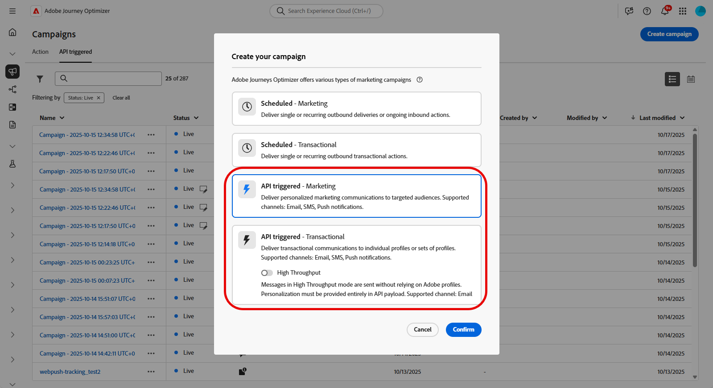
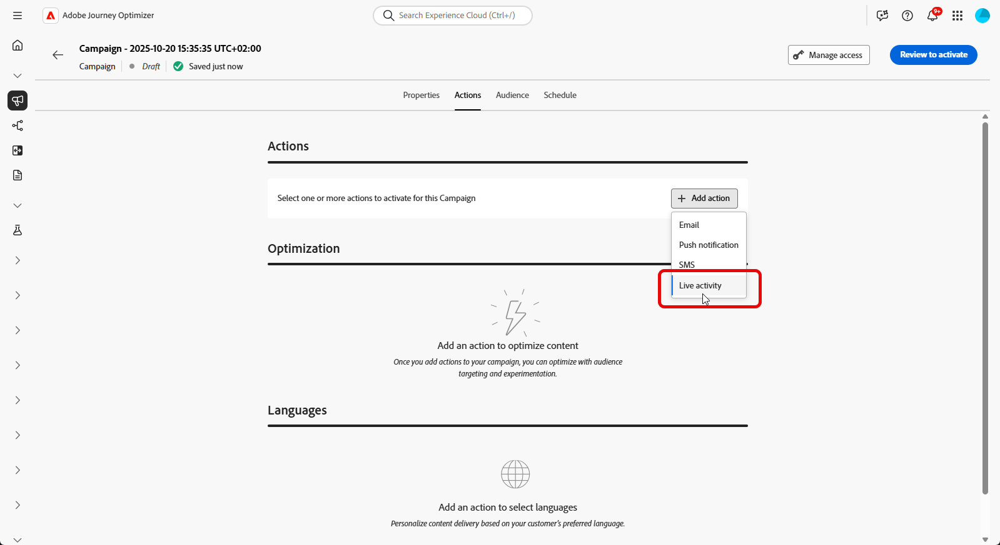

# Creare un’attività live {#create-mobile-live}

Dopo aver configurato la configurazione mobile e aver implementato il SDK mobile di Adobe Experience Platform, puoi iniziare a creare la tua attività Live in Journey Optimizer:

1. Accedi al menu **[!UICONTROL Campagne]**, quindi fai clic su **[!UICONTROL Crea campagna]**.

1. Seleziona il tipo di campagna **API attivata**.

   * Seleziona **Marketing attivato da API** per campagne basate su pubblico

   * Seleziona **Transazionale attivato da API** per le singole campagne.

   >[!IMPORTANT]
   >
   > Tieni presente che per **Transazionale attivato da API**, l&#39;opzione **[!UICONTROL Alta velocità effettiva]** non deve essere abilitata.

   

1. Dalla sezione **[!UICONTROL Proprietà]**, modifica il **[!UICONTROL Titolo]** e la **[!UICONTROL Descrizione]** della tua campagna.

1. Nella sezione **[!UICONTROL Azioni]**, scegli **[!UICONTROL Attività live]** e seleziona o crea una nuova configurazione.

   Ulteriori informazioni sulla configurazione delle attività live in [questa pagina](mobile-live-configuration.md).

   

1. Fai clic su **[!UICONTROL Crea esperimento]** per iniziare a configurare l&#39;esperimento sui contenuti e creare trattamenti per misurarne le prestazioni e identificare l&#39;opzione migliore per il pubblico di destinazione. [Ulteriori informazioni](../content-management/content-experiment.md)

1. Dalla scheda **[!UICONTROL Pubblico]**, scegli il tuo **[!UICONTROL Tipo di identità]** [Ulteriori informazioni](../audience/about-audiences.md).

   >[!NOTE]
   >
   >Per le campagne **Marketing attivato da API**, puoi selezionare un pubblico esistente che funga da prima segmentazione prima di controllare la sottoscrizione al channelID APN dal payload API.

1. Le campagne sono progettate per essere eseguite in una data specifica o con una frequenza ricorrente. Scopri come configurare la **[!UICONTROL pianificazione]** della campagna in [questa sezione](../campaigns/create-campaign.md#schedule).

1. Una volta configurata, fai clic su **[!UICONTROL Verifica per attivare]**, quindi fai clic su **[!UICONTROL Attiva]**.

1. Dopo l&#39;attivazione della campagna, utilizza la **richiesta cURL** fornita come modello per attivare gli eventi di inizio, aggiornamento o fine dell&#39;attività Live. Aggiorna il payload di esempio con i dati specifici prima dell’esecuzione.

   Assicurati anche di copiare gli identificatori **[!UICONTROL ID campagna]** da includere nel payload.

   ➡️ Per informazioni sui requisiti di autenticazione, inclusi token OAuth e chiavi API, consulta la [documentazione di campagne attivate da API](https://developer.adobe.com/journey-optimizer-apis/references/messaging/).

   

   +++ Esempio di un payload per casi d’uso unitari (campagna transazionale attivata da API)

   Questo esempio di payload è destinato a singole campagne che utilizzano il tipo di campagna **Transazionale** attivato da API. La maggior parte dei campi del seguente esempio di payload sono obbligatori, solo `requestId`, `dismissal-date` e `alert` sono facoltativi.

   ```json
   {
       "requestId": "your-request-id",
       "campaignId": "your-campaign-id",
       "recipients": [
   {
       "type": "aep",
       "userId": "testemail@gmail.com",
       "namespace": "email",
       "context": {
        "requestPayload": {
       "aps": {
       "content-available": 1,
       "timestamp": 1756984054,              // current epoch time
       "dismissal-date": 1756984084,         // optional – auto remove when event="end"
       "event": "update",                    // start | update | end
   
       // Fields from FoodDeliveryLiveActivityAttributes
       "content-state": {
         "orderStatus": "Delivered"
       },
   
       "attributes-type": "FoodDeliveryLiveActivityAttributes",
       "attributes": {
         "restaurantName": "Pizza",
         "liveActivityData": {
           "liveActivityID": "orderId1"       // customer reference ID
         }
       },
   
       "alert": {
         "title": "Order Delivered!",
         "body": "Your pizza has arrived."
       }
     }
   }
   }
   }
   ]
   }
   ```

   +++

   +++ Esempio di payload per casi d’uso di broadcast (campagna di marketing attivata da API)

   Questo esempio di payload è per le campagne basate su pubblico che utilizzano il tipo di campagna Marketing **attivato da API**.

   ```json
   {
       "requestId": "123400000",
       "campaignId": "d32e6f6c-56df-4a98-a2c0-6db6008f8f32",
       "audience": {
           "id": "508f9416-52d0-4898-ba47-08baaa22e9c7"
       },
       "context": {
           "requestPayload": {
               "aps": {
                   "input-push-channel": "V+8UslywEfAAAOq9SbTrLg==",  //apns-channel-id
                   "content-available": 1,
                   "timestamp": 1770808339,
                   "event": "update",   // start | update | end
   
                   // Fields from GameScoreLiveActivityAttributes
                   "content-state": {
                       "homeTeamScore": 33,
                       "awayTeamScore": 49,
                       "statusText": "Wingdom keeps scoring!"
                   },
                   "attributes-type": "GameScoreLiveActivityAttributes",
                   "attributes": {
                       "liveActivityData": {
                           "channelID": "V+8UslywEfAAAOq9SbTrLg=="   //apns-channel-id, must match the "input-push-channel" value
                       }
                   },
                   "alert": {
                       "title": "This is the title for game",
                       "body": "This is the body for body"
                   }
               }
           }
       }
   }
   ```

   +++

Dopo aver progettato la tua attività Live, puoi monitorare la misurazione dell&#39;impatto della tua attività Live con [rapporti incorporati](../reports/campaign-global-report-cja-activity.md).

## Video introduttivo

Scopri come configurare l’attività iOS Live con Adobe Journey Optimizer per distribuire aggiornamenti avanzati e in tempo reale sulla schermata di blocco di iPhone e su Dynamic Island.

>[!VIDEO](https://video.tv.adobe.com/v/3479864)
