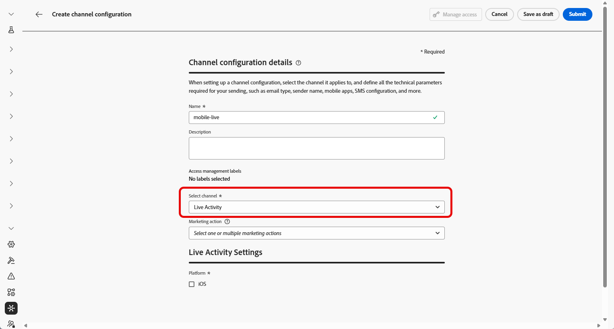
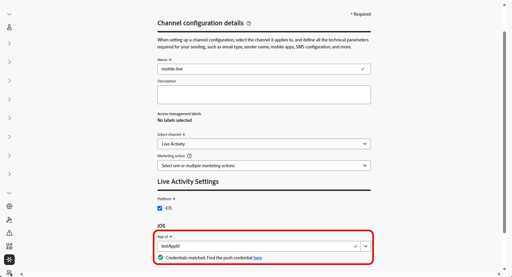

# Introduzione alla configurazione delle attività live {#mobile-live-config}

>[!BEGINSHADEBOX]

**In questa pagina:** configura le tue credenziali push e la configurazione del canale attività live in modo da poter autorizzare Adobe Journey Optimizer a distribuire aggiornamenti in tempo reale alla tua app iOS.

>[!ENDSHADEBOX]

Prima di inviare attività live, devi configurare l’ambiente Adobe Journey Optimizer. Per eseguire questa operazione:

## Passaggio 1: aggiungere le credenziali push dell’app in Journey Optimizer (facoltativo){#push-credentials-launch}

La registrazione delle credenziali push dell’app mobile è necessaria per autorizzare Adobe a inviare notifiche push per tuo conto.

Il passaggio 1 è facoltativo se le credenziali push sono già state configurate, in quanto possono essere riutilizzate per la configurazione del canale attività live. Se non è stata definita alcuna credenziale, devi creare nuove credenziali push per l’app. Consulta i passaggi descritti di seguito:

1. Accedi al menu **[!UICONTROL Canali]** > **[!UICONTROL Impostazioni push]** > **[!UICONTROL Credenziali push]**.

1. Fare clic su **[!UICONTROL Crea credenziali push]**.

   

1. Dal menu a discesa **[!UICONTROL Platform]**, seleziona il sistema operativo:

1. Immetti l&#39;app mobile **[!UICONTROL ID app]**.

   

1. Abilita l&#39;opzione **[!UICONTROL Applica a tutte le sandbox]** per rendere queste credenziali push disponibili in tutte le sandbox. Se una sandbox specifica ha le proprie credenziali per la stessa coppia Platform e App ID, queste avranno la precedenza.

1. Attivato il pulsante **[!UICONTROL Immetti manualmente le credenziali push]** per aggiungere le tue credenziali.

1. Trascina e rilascia il file .p8 Apple Push Notification Authentication Key. Questa chiave può essere acquisita dalla pagina **Certificati**, **Identificatori** e **Profili**.

1. Fornisci l&#39;**ID chiave**. Si tratta di una stringa di 10 caratteri assegnata durante la creazione del tasto di autenticazione p8. È disponibile nella scheda **Chiavi** in **Certificati**, **Identificatori** e **Profili** pagina.

1. Fornisci **ID team**. Si tratta di un valore stringa che si trova nella scheda Appartenenza.

1. Fai clic su **[!UICONTROL Invia]** per creare la configurazione dell&#39;app.

## Passaggio 2: creare la configurazione dell’attività live {#config-live-activity}

1. Nella barra a sinistra, passa a **[!UICONTROL Amministrazione]** > **[!UICONTROL Canali]** e seleziona **[!UICONTROL Impostazioni generali]** > **[!UICONTROL Configurazioni canale]**. Fare clic sul pulsante **[!UICONTROL Crea configurazione canale]**.

   

1. Immetti un nome e una descrizione (facoltativa) per la configurazione, quindi seleziona il canale dell’attività Live.

   >[!NOTE]
   >
   > I nomi devono iniziare con una lettera (A-Z). Può contenere solo caratteri alfanumerici. È inoltre possibile utilizzare i caratteri trattino basso `_`, punto `.` e trattino `-`.

1. Seleziona **[!DNL Live activity]** come tuo canale.

   

1. Seleziona **[!UICONTROL Azioni di marketing]** per associare i criteri di consenso ai messaggi utilizzando questa configurazione. Tutti i criteri di consenso associati all’azione di marketing vengono utilizzati per rispettare le preferenze dei clienti. Ulteriori informazioni

1. Scegli iOS come **[!UICONTROL piattaforma]**.

1. Seleziona dall&#39;elenco a discesa lo stesso **[!UICONTROL ID app]** come per le [credenziali push](#push-credentials-launch) configurate in precedenza o scegline uno esistente.

   

1. Una volta configurati tutti i parametri, fai clic su **[!UICONTROL Invia]** per confermare. Puoi anche salvare la configurazione del canale come bozza e riprenderla in un secondo momento.

1. Una volta creata, la configurazione del canale viene visualizzata nell&#39;elenco con lo stato **[!UICONTROL Elaborazione]**.

   >[!NOTE]
   >
   >Se i controlli non hanno esito positivo, ulteriori informazioni sui possibili motivi di errore in [questa sezione](../configuration/channel-surfaces.md).

1. Una volta completati i controlli, la configurazione del canale ottiene lo stato **[!UICONTROL Attivo]**. È pronto per essere utilizzato per inviare messaggi.

Ora puoi avviare l’integrazione con Adobe Experience Platform Mobile SDK per abilitare gli aggiornamenti dinamici in tempo reale sullo schermo Bloccato e su Dynamic Island.

➡️ [Ulteriori informazioni sull&#39;integrazione di Adobe Experience Platform Mobile SDK](mobile-live-configuration-sdk.md)

>[!TIP]
>
>Se riscontri problemi con la configurazione o la consegna di attività Live, consulta [Risoluzione dei problemi relativi alle attività Live](troubleshoot-mobile-live.md) per i passaggi di debug.