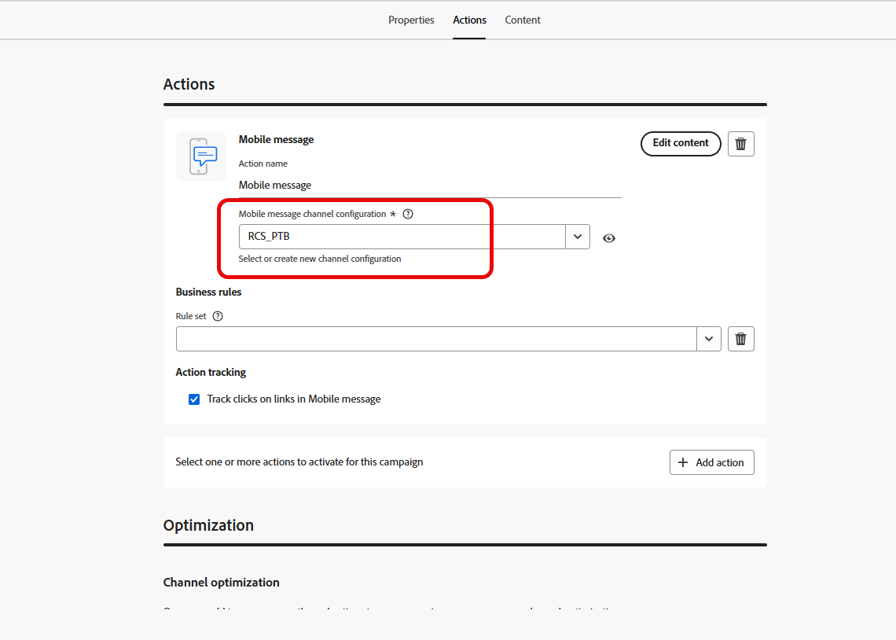

# Creare un messaggio per dispositivi mobili {#create-sms}

>[!CONTEXTUALHELP]
>id="ajo_message_sms"
>title="Creare un messaggio per dispositivi mobili"
>abstract="Per creare un messaggio per dispositivi mobili, aggiungi un’azione SMS in un percorso o in una campagna e inizia a personalizzarla con l’editor di personalizzazione."

>[!AVAILABILITY]
>
>RCS non è un servizio compatibile con HIPAA e non deve essere utilizzato per raccogliere, archiviare o elaborare dati personali sensibili, inclusi i dati sulla salute consentiti, ad esempio le informazioni personali sulla salute, che potrebbero essere altrimenti elaborati in Journey Optimizer.

Con Adobe Journey Optimizer è possibile progettare e inviare messaggi di testo (SMS), di comunicazione avanzata (RCS) e multimediali (MMS). Devi innanzitutto aggiungere un’azione Messaggio mobile in un percorso o in una campagna, quindi definire il contenuto del messaggio Mobile, come descritto di seguito. Adobe Journey Optimizer offre anche funzionalità per testare i messaggi Mobile prima dell’invio, in modo da poter controllare il rendering, gli attributi di personalizzazione e tutte le altre impostazioni.

In conformità agli standard e alle normative del settore, tutti i messaggi di marketing SMS/RCS/MMS devono consentire ai destinatari di annullare facilmente l’iscrizione. A questo scopo, i destinatari di SMS possono rispondere con parole chiave di consenso e rinuncia. [Scopri come gestire la rinuncia](../privacy/opt-out.md#opt-out-decision-management)

## Aggiungi un messaggio mobile {#create-sms-journey-campaign}

>[!CONTEXTUALHELP]
>id="ajo_journey_action_sms"
>title="Azione messaggio mobile"
>abstract="Un’azione del canale del messaggio mobile invia un messaggio di testo (SMS), multimediale (MMS) o di comunicazione avanzata (RCS) ai profili quando raggiungono questo passaggio del percorso. L’etichetta identifica l’attività nell’area di lavoro del percorso e l’azione fa riferimento a una configurazione di messaggi per dispositivi mobili che definisce il contenuto consegnato. La sezione **Ottimizzazione** può includere esperimenti di contenuto o regole di targeting, la sezione **Multilingue** può distribuire contenuto in più lingue e la sezione **Timeout o errore** può definire un percorso alternativo se l&#39;azione non riesce."
>additional-url="https://experienceleague.adobe.com/en/docs/journey-optimizer/using/orchestrate-journeys/about-journey-building/journey-action#add-action" text="Introduzione alle azioni dei canali"

Sfoglia le schede seguenti per scoprire come aggiungere un messaggio Mobile in una campagna o in un percorso.

>[!BEGINTABS]

>[!TAB Aggiungi un messaggio mobile a un Percorso]

1. Apri il percorso, quindi trascina e rilascia un&#39;attività **[!UICONTROL Action]** dalla sezione **[!UICONTROL Actions]** della palette. Ulteriori informazioni sull&#39;[attività Azione](../building-journeys/journey-action.md).

   >[!IMPORTANT]
   >
   >Le attività dei canali nativi legacy (e-mail, push, SMS, in-app, web, esperienza basata su codice e scheda di contenuto) sono diventate obsolete a partire dalla versione di marzo 2026. I percorsi esistenti che utilizzano queste attività continuano a funzionare senza alcuna modifica e non è richiesta alcuna migrazione.

1. Seleziona **[!UICONTROL Messaggio mobile]** come tipo di azione e fai clic su **[!UICONTROL Aggiungi]**.

   

1. Immetti un **[!UICONTROL Label]** per identificare l&#39;azione nell&#39;area di lavoro del percorso.

1. Fai clic sul pulsante **[!UICONTROL Configura azione]**.

1. Sei indirizzato alla scheda **[!UICONTROL Azioni]**. Da qui, seleziona o crea la configurazione del messaggio mobile da utilizzare. [Ulteriori informazioni](mobile-configuration.md)

   

1. Inoltre, puoi applicare le regole di limitazione all&#39;azione del messaggio mobile selezionando un set di regole nell&#39;elenco a discesa **[!UICONTROL Regole aziendali]**. [Ulteriori informazioni](../conflict-prioritization/channel-capping.md)

1. Seleziona il pulsante **[!UICONTROL Modifica contenuto]** e crea il contenuto come desiderato. [Ulteriori informazioni](design-mobile.md)

1. Torna all’area di lavoro del percorso. Se necessario, completa il flusso di percorso trascinando altre azioni o eventi. [Ulteriori informazioni](../building-journeys/about-journey-activities.md)

Per ulteriori informazioni su come creare, configurare e pubblicare un percorso, fare riferimento a [questa pagina](../building-journeys/journey-gs.md).

>[!TAB Aggiungere un messaggio mobile a una campagna]

1. Accedi al menu **[!UICONTROL Campagne]**, quindi fai clic su **[!UICONTROL Crea campagna]**.

1. Seleziona il tipo di campagna da eseguire

   * **Pianificato - Marketing**: esegui la campagna immediatamente o in una data specificata. Le campagne pianificate hanno lo scopo di inviare messaggi di marketing. Vengono configurati ed eseguiti dall’interfaccia utente di.

   * **Attivato da API - Marketing/Transazionale**: esegui la campagna utilizzando una chiamata API. Le campagne attivate da API hanno lo scopo di inviare messaggi di marketing o transazionali, ovvero messaggi inviati in seguito a un’azione eseguita da un individuo: reimpostazione della password, acquisto del carrello, ecc.

1. Dalla sezione **[!UICONTROL Proprietà]**, modifica il **[!UICONTROL Titolo]** e la **[!UICONTROL Descrizione]** della tua campagna.

1. Dalla scheda **[!UICONTROL Azione]**, fai clic su **[!UICONTROL Aggiungi azione]** e scegli **[!UICONTROL Messaggio mobile]**. Quindi, seleziona o crea una nuova configurazione.

   Ulteriori informazioni sulla configurazione dei messaggi mobili in [questa pagina](mobile-configuration.md).

   

1. Fai clic su **[!UICONTROL Crea esperimento]** per iniziare a configurare l&#39;esperimento sui contenuti e creare trattamenti per misurarne le prestazioni e identificare l&#39;opzione migliore per il pubblico di destinazione. [Ulteriori informazioni](../content-management/content-experiment.md)

1. Nella sezione **[!UICONTROL Tracciamento azioni]**, specifica se desideri tenere traccia dei clic sui collegamenti nel messaggio mobile.

1. Dalla scheda **[!UICONTROL Pubblico]**, fai clic sul pulsante **[!UICONTROL Seleziona pubblico]** per definire il pubblico di destinazione dall&#39;elenco dei tipi di pubblico di Adobe Experience Platform disponibili. [Ulteriori informazioni](../audience/about-audiences.md).

1. Nel campo **[!UICONTROL Spazio dei nomi identità]**, scegli lo spazio dei nomi da utilizzare per identificare i singoli utenti del pubblico selezionato. [Ulteriori informazioni](../event/about-creating.md#select-the-namespace).

1. Dalla scheda **[!UICONTROL Pianifica]**, puoi progettare le campagne da eseguire in una data specifica o con una frequenza ricorrente. Scopri come configurare la **[!UICONTROL pianificazione]** della campagna in [questa sezione](../campaigns/campaign-schedule.md#action-campaign-schedule).

1. Dal menu **[!UICONTROL Trigger azione]**, scegli la **[!UICONTROL Frequenza]** del messaggio mobile:

   * Una volta
   * Giornaliera
   * Settimanale
   * Month

Puoi iniziare a progettare il contenuto del messaggio per dispositivi mobili dal pulsante **[!UICONTROL Modifica contenuto]**, come descritto di seguito. [Ulteriori informazioni](design-mobile.md)

Per ulteriori informazioni su come creare, configurare e attivare una campagna, consulta [questa pagina](../campaigns/get-started-with-campaigns.md).

>[!ENDTABS]

**Argomenti correlati**

* [Progettare un messaggio mobile](design-mobile.md)
* [Aggiungere un messaggio in una campagna](../campaigns/create-campaign.md)
* [Anteprima, verifica e invia il messaggio mobile](send-mobile-message.md)
* [Configurare il canale di messaggi mobile](mobile-configuration.md)
* [Rapporti sui messaggi mobili](../reports/journey-global-report-cja-sms.md)

