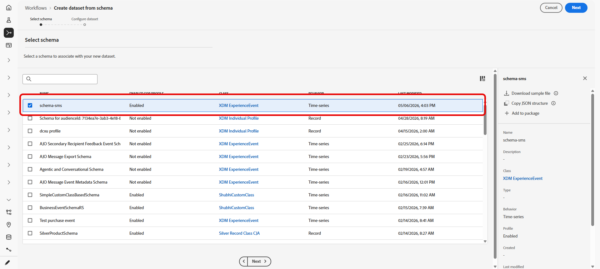

# Utilizzare un set di dati personalizzato per le parole chiave in entrata {#custom-dataset-inbound-keywords}

Le parole chiave SMS in entrata possono essere memorizzate in un set di dati personalizzato abilitato per il profilo. La configurazione è costituita da uno schema Adobe Experience Platform, un set di dati creato da tale schema e dalle credenziali API SMS di Journey Optimizer che fanno riferimento al set di dati per i messaggi in entrata.

>[!NOTE]
>
>Se non è configurato alcun set di dati personalizzato, per impostazione predefinita le parole chiave in entrata vengono memorizzate nel set di dati dell&#39;evento attività in entrata _AJO_. Per poter acquisire i messaggi in arrivo in questo set di dati, un profilo deve disporre di almeno un messaggio inviato da [!DNL Journey Optimizer]. [Ulteriori informazioni sui set di dati di sistema](../data/get-started-datasets.md#system-datasets)

Per informazioni generali su schemi, gruppi di campi e set di dati, consulta la seguente documentazione di Adobe Experience Platform:

* [Panoramica del sistema XDM](https://experienceleague.adobe.com/docs/experience-platform/xdm/home.html?lang=it){target="_blank"}
* [Nozioni di base sulla composizione dello schema](https://experienceleague.adobe.com/docs/experience-platform/xdm/schema/composition.html?lang=it){target="_blank"}
* [Panoramica sui set di dati](https://experienceleague.adobe.com/docs/experience-platform/catalog/datasets/overview.html?lang=it){target="_blank"}

Per utilizzare un set di dati personalizzato per una parola chiave in entrata, è necessario:

1. [Creare uno schema](#create-schema)
1. [Creare un set di dati](#create-dataset)
1. [Configurare le credenziali API](#configure-api-credentials)

## Creare uno schema {#create-schema}

Uno schema definisce la struttura e le regole di convalida che si applicano ai dati acquisiti. Componi uno schema Experience Event per la raccolta di parole chiave in entrata aggiungendo i gruppi di campi esistenti elencati di seguito.

➡️ [Ulteriori informazioni sulla creazione di schemi nella documentazione di Adobe Experience Platform](https://experienceleague.adobe.com/en/docs/experience-platform/xdm/schema/composition)

1. In Adobe Experience Platform, da **[!UICONTROL Gestione dati]**, accedere a **[!UICONTROL Schemi]** e selezionare **[!UICONTROL Crea schema]**.

   

1. Scegliere **[!UICONTROL Schema standard]**.

1. Seleziona **[!UICONTROL Evento esperienza]**.

   

1. Immetti un **[!UICONTROL Nome visualizzato]** per lo schema e fai clic su **[!UICONTROL Fine]**.

   Lo schema viene salvato e viene aperto l’editor schema.

1. Apri **[!UICONTROL Proprietà schema]** e abilita lo schema per **[!UICONTROL Profilo]**.

   

1. In **[!UICONTROL Gruppi di campi]**, aggiungi i seguenti gruppi di campi esistenti:

   * [!DNL Adobe CJM ExperienceEvent - Message interaction details]
   * [!DNL Adobe CJM ExperienceEvent - Message Execution Details]
   * [!DNL Adobe CJM ExperienceEvent - Message Profile Details]

1. Fai clic su **[!UICONTROL Salva]**.

## Creare un set di dati {#create-dataset}

Un set di dati è il contenitore di archiviazione per i dati acquisiti. Ogni set di dati è associato esattamente a uno schema e i record scritti nel set di dati devono essere conformi a tale schema.

1. In Adobe Experience Platform, da **[!UICONTROL Gestione dati]**, accedere a **[!UICONTROL Set di dati]** e selezionare **[!UICONTROL Crea set di dati]**.

   

1. Scegli **[!UICONTROL Crea set di dati dallo schema]**.

1. Seleziona lo schema creato nella sezione precedente e fai clic su **[!UICONTROL Avanti]**.

   

1. Immetti un **[!UICONTROL Nome]** e fai clic su **[!UICONTROL Fine]**.

1. Dalla scheda **[!UICONTROL Attività dati]**, abilita i dati per **[!UICONTROL Profilo]**.

   Selezionare il criterio **[!UICONTROL Conservazione dati]** appropriato per i requisiti di governance organizzativa.

   

1. Fai clic su **[!UICONTROL Salva]**.

## Configurare le credenziali API {#configure-api-credentials}

Configurare le credenziali in base al provider SMS utilizzando [Introduzione alla configurazione di SMS/MMS/RCS](mobile-configuration.md). Quindi completa i passaggi seguenti per selezionare il set di dati in entrata personalizzato.

1. Nella barra a sinistra, passa a **[!UICONTROL Amministrazione]** > **[!UICONTROL Canali]** `>` **[!UICONTROL Impostazioni SMS]** e seleziona il menu **[!UICONTROL Credenziali API]**. Fare clic sul pulsante **[!UICONTROL Crea nuove credenziali API]**.

1. Crea o modifica le credenziali in base al provider.

1. Abilita l&#39;opzione **[!UICONTROL Usa set di dati personalizzato per in entrata]**.

1. Seleziona il **[!UICONTROL Set di dati]** creato nella sezione precedente.

   

1. Completare i campi obbligatori rimanenti e fare clic su **[!UICONTROL Salva]**.

   >[!NOTE]
   >
   >Al momento del salvataggio delle credenziali API, Journey Optimizer verifica che il set di dati della parola chiave in entrata sia configurato correttamente. Se la convalida non riesce, viene visualizzato un messaggio di errore per indicare la correzione richiesta.

Dopo il salvataggio delle credenziali, il comportamento dei messaggi in uscita e in entrata rimane invariato; le parole chiave in entrata per tali credenziali vengono registrate nel set di dati personalizzato selezionato.
