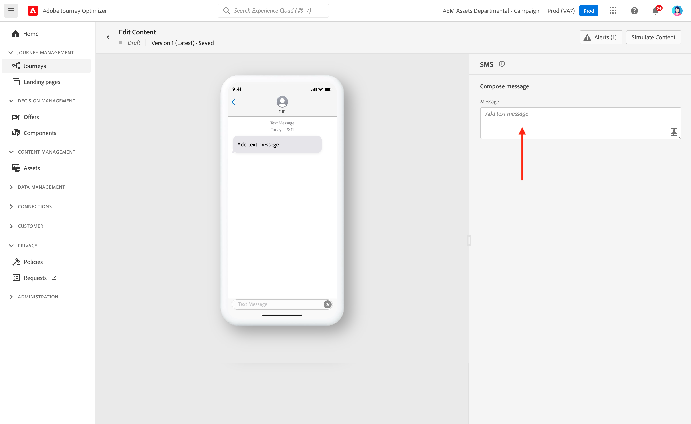

# Progettare un messaggio mobile {#design-mobile}

Con Adobe Journey Optimizer è possibile progettare e inviare messaggi di testo (SMS), di comunicazione avanzata (RCS) e multimediali (MMS). Devi innanzitutto aggiungere un’azione Messaggio mobile in un percorso o in una campagna, quindi definire il contenuto del messaggio Mobile, come descritto di seguito. Adobe Journey Optimizer offre anche funzionalità per testare i messaggi Mobile prima dell’invio, in modo da poter controllare il rendering, gli attributi di personalizzazione e tutte le altre impostazioni.

In conformità agli standard e alle normative del settore, tutti i messaggi di marketing SMS/RCS/MMS devono contenere un modo per i profili di annullare facilmente l’abbonamento. A questo scopo, i profili SMS possono rispondere con parole chiave di consenso e rinuncia. [Scopri come gestire la rinuncia](../privacy/opt-out.md#opt-out-decision-management)

## Definire il contenuto RCS{#rcs-content}

RCS consente di inviare messaggi visivamente avanzati con immagini, video, caroselli e pulsanti interattivi, distribuiti tramite l’app di messaggistica nativa sui dispositivi supportati. I messaggi vengono inviati da un mittente di marchio verificato. Quando il dispositivo o il gestore di un profilo non supporta RCS, Journey Optimizer utilizza automaticamente un SMS standard.

Ogni messaggio RCS richiede un **[!UICONTROL testo di fallback predefinito]**: una versione SMS di testo normale distribuita a profili il cui dispositivo o gestore non supporta RCS. Una campagna non può essere attivata senza di essa.

Durante la scrittura del testo di fallback, tieni presente quanto segue:

* **Mantieni la concisione.** I messaggi SMS sono limitati a 160 caratteri per segmento; i messaggi più lunghi sono suddivisi in più parti e possono comportare costi aggiuntivi.
* **Includi URL chiave.** Se il messaggio RCS si collega a un URL tramite pulsanti di azione, aggiungi un URL abbreviato al testo di fallback in modo che i profili SMS possano ancora raggiungere la destinazione.
* **Evitare riferimenti solo RCS.** Non citare elementi visivi, caroselli o funzioni interattive non disponibili negli SMS semplici.
* **Personalization è supportato.** Puoi utilizzare i token di personalizzazione nel testo di fallback per mantenere la coerenza del messaggio in entrambe le versioni.

Per definire il contenuto del messaggio RCS, effettua le seguenti operazioni.

1. Nel pannello di authoring, scegli il **[!UICONTROL tipo di contenuto]**:

   +++ Testo

   Corpo di testo normale con pulsanti interattivi opzionali. Consigliato per notifiche, avvisi, promemoria e flussi di conversazione in cui non sono necessari elementi visivi.

   +++

   +++ Media

   Un&#39;immagine o un video indipendente con testo opzionale e pulsanti interattivi. Utilizzalo quando un singolo elemento visivo (un’immagine del prodotto, un banner o un video clip) è il punto focale del messaggio.

   1. Dal menu Intestazione, immetti un **[!UICONTROL URL file multimediale]** che punti all&#39;immagine o al video da visualizzare.

   1. Se il supporto è un file video, immettere un **[!UICONTROL URL miniatura]**.

   +++

   +++ Scheda

   Una scheda strutturata che combina un’immagine o un video, un titolo, un corpo del testo e pulsanti di azione. Utilizzalo per presentare un prodotto, un’offerta o un elemento di contenuto in un formato di marchio.

   1. Immetti un **[!UICONTROL Titolo]** e una **[!UICONTROL Descrizione]**.

   1. Immetti un **[!UICONTROL URL file multimediale]** che punti all&#39;immagine o al video da visualizzare.

   1. Se il supporto è un file video, immettere un **[!UICONTROL URL miniatura]**.

   +++

   +++ Carosello

   Una serie scorrevole orizzontale di schede ricche in un singolo messaggio, ciascuna con la propria immagine, titolo, descrizione e pulsanti. Ideale per cataloghi di prodotti o promozioni. È richiesto un minimo di 2 carte.

   1. Selezionare una **[!UICONTROL larghezza scheda]** per controllare la larghezza di visualizzazione di ogni scheda.
   1. Per ogni scheda, immetti un **[!UICONTROL Titolo]** e una **[!UICONTROL Descrizione]**.

   1. Immetti un **[!UICONTROL URL file multimediale]** che punti all&#39;immagine o al video della scheda.

   1. Se necessario, selezionare **[!UICONTROL Altezza file multimediale]** e aggiungere i pulsanti di azione suggeriti.

   +++

   +++ Posizione

   Invia un pin mappa a un set di coordinate, visualizzato come anteprima mappa in linea nel thread di messaggistica del profilo. Utilizzalo per condividere un indirizzo del negozio, una sede dell’evento o un’area di servizio.

   1. Immetti il valore decimale **[!UICONTROL Latitudine]** e **[!UICONTROL Longitudine]** della posizione.

   1. Facoltativamente, immettere un **[!UICONTROL Nome posizione]** da visualizzare come etichetta sul pin della mappa.

   +++

1. Nel campo **[!UICONTROL Testo messaggio]**, immetti il contenuto del messaggio. Puoi utilizzare la personalizzazione per adattare il testo a ciascun profilo. I limiti dei caratteri variano a seconda del tipo di messaggio: 3.072 caratteri per contenuti multimediali avanzati (singoli) e 160 caratteri per contenuti RCS di base.

1. Utilizza l&#39;**[!UICONTROL editor Personalization]** per definire il contenuto, aggiungere personalizzazione e contenuto dinamico. Puoi utilizzare qualsiasi attributo, ad esempio il nome del profilo o la città. È inoltre possibile definire regole condizionali.

1. Facoltativamente, aggiungi **[!UICONTROL Azioni suggerite]**, pulsanti interattivi che consentono ai profili di agire con un solo tocco.

1. Immetti un **[!UICONTROL Label]** per l&#39;**[!UICONTROL Action]**.

1. Scegli il **[!UICONTROL tipo di azione]**:

   * **[!UICONTROL Risposta]**: invia una risposta di testo predefinita all&#39;agente RCS per conto del profilo. Utilizzare questa opzione per acquisire l&#39;intento, stimolare i flussi di conversazione o attivare eventi di percorso a valle. Non sono necessari campi aggiuntivi, il testo della risposta corrisponde all’etichetta del pulsante.

   * **[!UICONTROL URL aperto]**: reindirizza il profilo a una pagina Web, a un collegamento diretto o a una destinazione in-app. Supporta token di personalizzazione e parametri di tracciamento UTM, ad esempio `https://www.example.com/offers?id={{profile.userId}}`.

   * **[!UICONTROL Componi numero di telefono]**: apre la finestra di composizione del dispositivo con un numero di telefono specificato precompilato, pronto per la chiamata da parte del profilo.

   * **[!UICONTROL Visualizza percorso]**: apre l&#39;applicazione mappe predefinita del dispositivo in un percorso specificato. Specifica il valore decimale **[!UICONTROL Latitudine]** e **[!UICONTROL Longitudine]** del percorso da visualizzare.

1. Nel campo **[!UICONTROL Testo di fallback predefinito]**, immetti la versione SMS di testo normale del messaggio. Questa opzione è obbligatoria e viene distribuita ai profili il cui dispositivo o gestore non supporta RCS.

1. Dall&#39;elenco a discesa **[!UICONTROL Webview]**, scegli le dimensioni della **[!UICONTROL Webview]** quando invii un&#39;azione **[!UICONTROL Apri URL]**.

1. Fai clic su **[!UICONTROL Salva]** e verifica il messaggio nell’anteprima. Ora puoi testare e controllare il contenuto del messaggio come descritto in [questa sezione](send-mobile-message.md).

## Definire il contenuto SMS{#sms-content}

>[!CONTEXTUALHELP]
>id="ajo_message_sms_content"
>title="Definire il contenuto SMS"
>abstract="Personalizza e personalizza il messaggio mobile utilizzando l’editor di personalizzazione per definire il contenuto e incorporare elementi dinamici."

Per configurare il contenuto del messaggio, segui i passaggi indicati di seguito. Le impostazioni per MMS sono descritte in dettaglio in [questa sezione](#mms-content).

1. Dalla schermata di configurazione del percorso o della campagna, fai clic sul pulsante **[!UICONTROL Modifica contenuto]** per configurare il contenuto del messaggio mobile.

1. Fai clic sul campo **[!UICONTROL Messaggio]** per aprire l&#39;editor di personalizzazione.

   

1. Genera messaggi mobili coinvolgenti personalizzati per il tuo pubblico utilizzando [Assistente IA per la generazione di testo](../content-management/generative-text.md).

1. Utilizza l’editor di personalizzazione per definire i contenuti, aggiungere personalizzazioni e contenuti dinamici. Puoi utilizzare qualsiasi attributo, ad esempio il nome del profilo o la città. È inoltre possibile definire regole condizionali. Per ulteriori informazioni sulla [personalizzazione](../personalization/personalize.md) e sul [contenuto dinamico](../personalization/get-started-dynamic-content.md) nell&#39;editor di personalizzazione, consulta le pagine seguenti.

1. Dopo aver definito il contenuto, puoi aggiungere URL tracciati al messaggio. A tale scopo, accedere al menu **[!UICONTROL Funzioni helper]** e selezionare **[!UICONTROL Helper]**.

   

1. Seleziona **[!UICONTROL Url]** e fai clic su **[!UICONTROL Aggiungi URL]**.

   

1. Per ridurre l&#39;URL, incollarlo nel campo `originalUrl` e fare clic su **[!UICONTROL Salva]**.

   >[!CAUTION]
   >
   >Per utilizzare la funzione di abbreviazione URL, devi prima configurare un sottodominio che verrà quindi collegato alla configurazione. [Ulteriori informazioni](mobile-subdomains.md)
   >
   > La durata degli URL brevi è impostata su 30 giorni. Dopo questo periodo, questi URL brevi non saranno più accessibili e visualizzeranno il messaggio: `404 short-code not found`.

1. Per aggiungere un collegamento profondo che apra una schermata specifica nell&#39;app mobile, utilizzare la funzione helper **[!UICONTROL Url]** con il tipo `DEEPLINK`, come nell&#39;esempio seguente. [Ulteriori informazioni sui collegamenti profondi](../email/deeplinks.md)

   ```
   {{url originalUrl='<<deeplink_url>>' type='DEEPLINK' action='CLICK'}}
   ```

   >[!IMPORTANT]
   >
   >Prima di utilizzare i collegamenti profondi, assicurati di aver completato i [passaggi di configurazione](../email/deeplinks.md#configuration) corrispondenti in Journey Optimizer e di aver implementato la [gestione dei collegamenti profondi](../email/deeplinks.md#mobile-implementation) nella tua app mobile. In caso contrario, il collegamento profondo non indirizza gli utenti al contenuto in-app previsto.
   >
   >Inoltre, assicurati che il tracciamento dei collegamenti sia abilitato nella sezione **[!UICONTROL Azioni]** del percorso o della campagna in modo che l&#39;URL venga riscritto tramite i sistemi Adobe.

1. Dal menu **[!UICONTROL Decisioning]**, puoi personalizzare e ottimizzare il contenuto dei messaggi mobili con **Decisioning**. Questa funzionalità consente di utilizzare Punteggi di priorità, Formule o Modelli di intelligenza artificiale per selezionare e visualizzare in modo dinamico il contenuto migliore per i clienti.

   Per ulteriori informazioni su come creare e utilizzare i criteri di decisione nei messaggi mobili, consulta [questa sezione](../experience-decisioning/create-decision.md).

1. Fai clic su **[!UICONTROL Salva]** e verifica il messaggio nell’anteprima. Ora puoi testare e controllare il contenuto del messaggio come descritto in [questa sezione](send-mobile-message.md).

## Definire il contenuto MMS{#mms-content}

È possibile migliorare la comunicazione inviando messaggi MMS (Multimedia Message Service), consentendo la condivisione di file multimediali quali video, immagini, clip audio e GIF e altro ancora. Inoltre, MMS consente di inserire nel messaggio fino a 1600 caratteri di testo.

>[!NOTE]
>
> Il canale MMS presenta alcune limitazioni elencate in [questa pagina](../start/guardrails.md#sms-guardrails).

Per creare contenuti MMS, effettua le seguenti operazioni:

1. Creare un messaggio mobile come descritto in [questa sezione](#create-sms-journey-campaign).

1. Modifica il contenuto SMS come descritto in [questa sezione](#sms-content).

1. Abilita l’opzione MMS per aggiungere contenuti multimediali al contenuto SMS.

   

1. Aggiungi **[!UICONTROL Titolo]** al file multimediale.

1. Immetti l&#39;URL del file multimediale nel campo **[!UICONTROL File multimediali]**.

   

1. Fai clic su **[!UICONTROL Salva]** e verifica il messaggio nell’anteprima. Ora puoi testare e verificare il contenuto del messaggio come descritto di seguito.

Dopo aver eseguito i test e convalidato il contenuto, puoi inviare il messaggio Mobile al pubblico. Questi passaggi sono descritti in [questa pagina](send-mobile-message.md)
