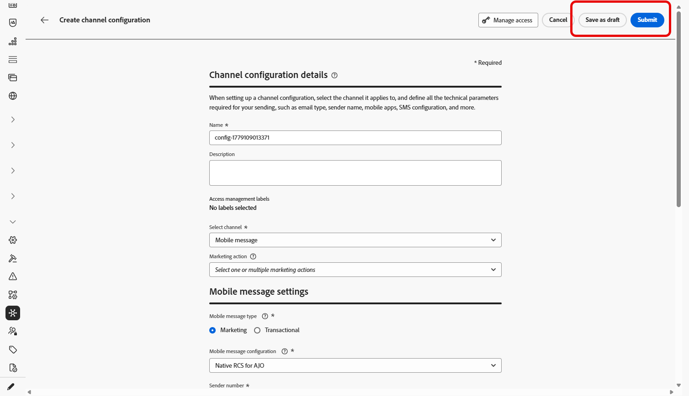
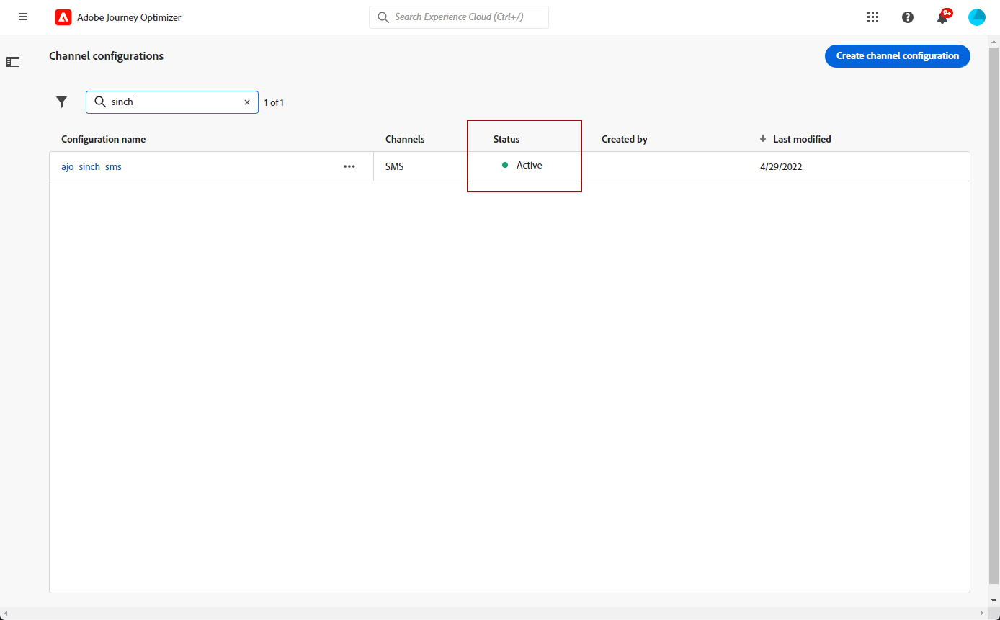

# Creare una configurazione di messaggio per dispositivi mobili {#message-preset-sms}

>[!CONTEXTUALHELP]
>id="ajo_admin_surface_sms_type"
>title="Definire la categoria di messaggio"
>abstract="Seleziona il tipo di messaggi Mobile utilizzando questa configurazione: Marketing per i messaggi promozionali che richiedono il consenso dell’utente o Transazionale per i messaggi non commerciali, come la reimpostazione della password."
>additional-url="https://experienceleague.adobe.com/docs/journey-optimizer/using/privacy/consent/opt-out.html?lang=it#sms-opt-out-management" text="Rinuncia al marketing dei messaggi mobili"

Una volta configurato il canale dei messaggi mobile, è necessario creare una configurazione di canale per poter inviare messaggi SMS, RCS e MMS da **[!DNL Journey Optimizer]**.

Per creare una configurazione di canale, effettua le seguenti operazioni:

1. Nella barra a sinistra, passa a **[!UICONTROL Amministrazione]** > **[!UICONTROL Canali]** e seleziona **[!UICONTROL Impostazioni generali]** > **[!UICONTROL Configurazioni canale]**. Fare clic sul pulsante **[!UICONTROL Crea configurazione canale]**.

   

1. Immetti un nome e una descrizione (facoltativa) per la configurazione, quindi seleziona il canale mobile.

   

   >[!NOTE]
   >
   > I nomi devono iniziare con una lettera (A-Z). Può contenere solo caratteri alfanumerici. È inoltre possibile utilizzare i caratteri trattino basso `_`, punto `.` e trattino `-`.

1. Selezionare il tipo di **[!UICONTROL SMS]** per questa configurazione:

   * **[!UICONTROL Marketing]**: per messaggi promozionali che richiedono il consenso dell&#39;utente.
   * **[!UICONTROL Transazionale]**: per messaggi non commerciali quali conferme di ordini, reimpostazioni di password o aggiornamenti di consegna.

   >[!CAUTION]
   >
   >**I messaggi transazionali** possono essere inviati ai profili che hanno annullato l&#39;abbonamento alle comunicazioni di marketing, ma solo in contesti specifici.

   {width=80%}

1. Selezionare la **[!UICONTROL configurazione mobile]** da associare alla configurazione.

   Per ulteriori informazioni su come configurare l&#39;ambiente per l&#39;invio di messaggi Mobile, consulta [questa sezione](#create-api).

1. Immettere il **[!UICONTROL numero mittente]** &#x200B;che si desidera utilizzare per le comunicazioni.

1. Se desideri utilizzare la funzione di abbreviazione URL nei messaggi Mobile, seleziona un elemento dall&#39;elenco **[!UICONTROL Sottodominio]**.

   >[!NOTE]
   >
   >Per poter selezionare un sottodominio, accertati di aver configurato in precedenza almeno un sottodominio SMS/RCS/MMS. [Scopri come](mobile-subdomains.md)

1. Nella sezione **[!UICONTROL Dimensione di esecuzione]**, utilizza il **[!UICONTROL Campo di esecuzione SMS]** per selezionare tra gli attributi del profilo il numero di telefono da utilizzare in priorità se nel database sono disponibili più numeri. [Ulteriori informazioni](../configuration/primary-email-addresses.md#override-execution-address-channel-config)

   >[!NOTE]
   >
   >Per impostazione predefinita, [!DNL Journey Optimizer] utilizza il numero di telefono specificato nelle [impostazioni generali](../configuration/primary-email-addresses.md) a livello di sandbox. L’aggiornamento di questo campo sovrascrive il valore predefinito per i percorsi e le campagne che utilizzano questa configurazione.

1. Seleziona **[!UICONTROL Usa set di dati personalizzato per in entrata]** per instradare gli SMS in entrata di questa credenziale a un set di dati precreato scelto dal menu a discesa. [Ulteriori informazioni sull&#39;utilizzo di un set di dati personalizzato per le parole chiave in entrata](custom-dataset-inbound-keywords.md)

   >[!NOTE]
   >
   >Lo schema del set di dati deve essere **[!UICONTROL XDM ExperienceEvent]** e includere almeno questi gruppi di campi:
   >* Adobe CJM ExperienceEvent - Dettagli sull’interazione del messaggio
   >* Adobe CJM ExperienceEvent - Dettagli sull’esecuzione dei messaggi
   >* Adobe CJM ExperienceEvent - Dettagli profilo messaggio
   >
   >Lo schema e il set di dati devono essere abilitati per il profilo.

1. Una volta configurati tutti i parametri, fai clic su **[!UICONTROL Invia]** per confermare. Puoi anche salvare la configurazione del canale come bozza e riprenderla in un secondo momento.

   

1. Una volta creata, la configurazione del canale viene visualizzata nell&#39;elenco con lo stato **[!UICONTROL Elaborazione]**.

   >[!NOTE]
   >
   >Se i controlli non hanno esito positivo, ulteriori informazioni sui possibili motivi di errore in [questa sezione](../configuration/channel-surfaces.md).

1. Una volta completati i controlli, la configurazione del canale ottiene lo stato **[!UICONTROL Attivo]**. È pronto per essere utilizzato per inviare messaggi.

   

Ora puoi inviare messaggi mobili con Journey Optimizer.
