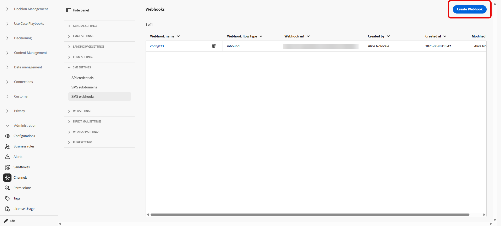
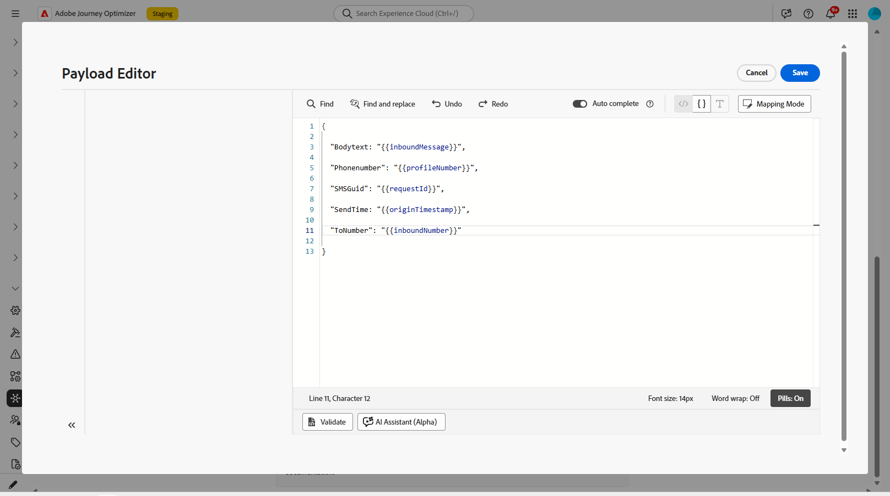
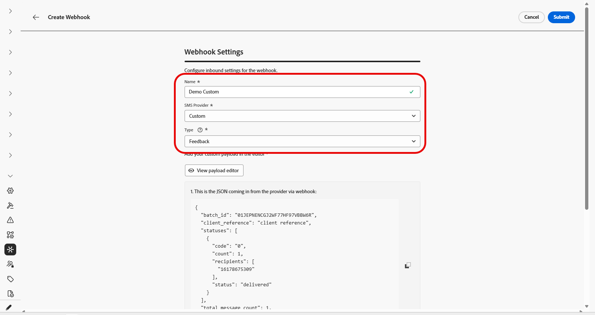

# Creare webhook {#webhook}

>[!BEGINSHADEBOX]

**In questa pagina:** scopri come creare webhook SMS in entrata e di feedback in Adobe Journey Optimizer per acquisire risposte di consenso e rinuncia e eventi di consegna per provider personalizzati, Infobip e Sinch.

>[!ENDSHADEBOX]

>[!CONTEXTUALHELP]
>id="ajo_channels_sms_webhook_settings_create"
>title="Creare un webhook SMS"
>abstract="Puoi configurare i webhook per acquisire le risposte in entrata e gestire il consenso opt-in e opt-out, nonché per ricevere rapporti sulle consegne tra cui le conferme di lettura, se disponibili."


>[!CONTEXTUALHELP]
>id="ajo_admin_sms_webhook_flow_type"
>title="Scegliere il tipo di webhook"
>abstract="Durante la configurazione di un webhook, scegli **In entrata** per acquisire le risposte di consenso e le preferenze utente oppure **[!UICONTROL Feedback]** per tenere traccia degli eventi di consegna e coinvolgimento a fini di reporting e analisi."

>[!BEGINSHADEBOX]

Quando in Journey Optimizer vengono create nuove credenziali API, i webhook SMS ora consentono di acquisire sia parole chiave in entrata che eventi di feedback come consegne ed errori. Poiché ogni provider dispone di funzionalità diverse, esistono istruzioni separate per abilitare i webhook.
Con i webhook che ora supportano il provider personalizzato, ora è possibile raccogliere feedback e raccolte di parole chiave in entrata da qualsiasi provider da segnalare e su cui intervenire in Journey Optimizer.

* **Nuovi clienti:** Le istruzioni qui riportate possono essere seguite per configurare correttamente i webhook SMS.

* **Clienti esistenti:** È possibile migrare dalle informazioni memorizzate nelle credenziali API ai webhook e non è disponibile alcuna sequenza temporale per la migrazione dei clienti. Per i clienti esistenti che desiderano effettuare la migrazione ai webhook SMS, i passaggi di migrazione devono essere eseguiti come documentato nella guida alla migrazione.

>[!ENDSHADEBOX]

## Panoramica {#overview}

Una volta create correttamente le credenziali API, ora puoi configurare i webhook per acquisire le risposte in entrata e gestire il consenso di consenso e rinuncia e per ricevere i rapporti di consegna, comprese le conferme di lettura, se disponibili.

Durante la configurazione di un webhook, puoi definirne lo scopo in base al tipo di dati che desideri acquisire:

* **In entrata**: utilizza questa opzione se desideri acquisire le risposte al consenso, come i consensi o le rinunce, e raccogliere le preferenze dell&#39;utente.

* **Feedback**: scegli questa opzione per tenere traccia degli eventi di consegna e coinvolgimento, incluse le consegne, gli errori in uscita e le conferme di lettura (se applicabili) per supportare la generazione di rapporti e l&#39;analisi.

>[!NOTE]
>
>I dati delle parole chiave in entrata vengono memorizzati nel set di dati di sistema _AJO Email Tracking Dataset_, a meno che non sia configurato un set di dati personalizzato. Per poter acquisire i messaggi in arrivo, è necessario che un profilo disponga di almeno un messaggio inviato da [!DNL Journey Optimizer]. [Ulteriori informazioni](../data/get-started-datasets.md#system-datasets)

A seconda del provider, ci saranno diverse aspettative su ciò che deve essere configurato per avere un’implementazione SMS corretta:

* **Conversazione sinch e sinch**: crea un webhook che gestisca sia gli eventi in entrata che quelli di feedback. Non è richiesta alcuna configurazione di payload.

* **Infobip**: crea due webhook separati, uno per gli eventi in entrata e uno per gli eventi di feedback. Per entrambi i webhook non è richiesta alcuna configurazione di payload.

* **Twilio**: i webhook non sono disponibili. La raccolta di dati in entrata e di feedback non è supportata.

* **Provider personalizzato**: crea due webhook separati, uno per gli eventi in entrata e uno per gli eventi di feedback. Per il corretto funzionamento di entrambi i webhook è necessaria la configurazione del payload.

### Supporto provider {#provider-support}

>[!NOTE]
>
>L’unico formato di webhook supportato è JSON. I dati modulo per i webhook non sono supportati.

La tabella seguente mostra quali provider supportano i webhook in entrata e di feedback e se è necessaria la creazione di payload:

| Provider | Webhook in entrata | Webhook feedback | Parole chiave | Creazione payload necessaria | Webhook necessario | Creazione payload |
| --- | --- | --- | --- | --- | --- | --- |
| Infobip | Configurabile | Configurabile | Configurabile | Non obbligatorio | Obbligatorio | Non obbligatorio |
| Sinch | Configurabile | Configurabile | Configurabile | Non obbligatorio | No. Integrato | N/D |
| Sinch conversazionale | Configurabile | Configurabile | Configurabile | Non obbligatorio | No. Integrato | N/D |
| Twilio | Non disponibile | Non disponibile | Non disponibile | Non disponibile | Non disponibile | N/D |
| Personalizzato | Configurabile | Configurabile | Configurabile | Obbligatorio | Obbligatorio | Obbligatorio |

Per i clienti che passano dalle credenziali API ai webhook SMS, le informazioni sul percorso di migrazione si trovano nella guida alla migrazione.

## Crea webhook

### Per conversazioni sinch e sinch {#create-webhook-sinch}

Per Sinch e Sinch Conversational, crea un singolo webhook che gestisca sia gli eventi in entrata che quelli di feedback. Non è richiesta alcuna configurazione di payload personalizzata.

1. Nella barra a sinistra, passa a **[!UICONTROL Amministrazione]** `>` **[!UICONTROL Canali]**, seleziona il menu **[!UICONTROL Webhook SMS]** in **[!UICONTROL Impostazioni SMS]** e fai clic sul pulsante **[!UICONTROL Crea webhook]**.

   

1. Configura le impostazioni del webhook come descritto di seguito:

   * **[!UICONTROL Name]**: immetti un nome per il webhook.

   * **[!UICONTROL Seleziona fornitore SMS]**: conversazionale sinch o sinch.

   * **[!UICONTROL Credenziali API]**: scegli dall&#39;elenco a discesa [le credenziali API configurate in precedenza](mobile-configuration-sinch.md).

   * **[!UICONTROL Numero di telefono del mittente]**: immettere il numero di telefono del mittente che si desidera utilizzare per le comunicazioni.

   

1. Iniziare a impostare le parole chiave in entrata immettendo le parole chiave nel campo **[!UICONTROL Immettere una parola chiave]**. È possibile aggiungere e rimuovere più parole chiave. Si noti che le parole chiave non fanno distinzione tra maiuscole e minuscole.

   

1. Seleziona una categoria di parole chiave dal menu a discesa **[!UICONTROL Categoria parole chiave in entrata]** per configurare:

   +++ Opt-in

   * Abilita le parole chiave che danno il consenso esplicito agli utenti. Quando il messaggio di un utente corrisponde a una parola chiave configurata, il numero di telefono dell’utente acconsente alla ricezione di messaggi SMS.

   * Per impostazione predefinita, sono attivate le seguenti parole chiave: Subscribe, Yes, Unstop, Continue, Resume e Begin. Rimuovere le parole chiave predefinite facendo clic su .

   * Utilizza il campo **[!UICONTROL Messaggio di risposta]** per creare un messaggio inviato automaticamente quando il messaggio in entrata di un utente corrisponde a una parola chiave Opt-in.

   +++

   +++ Rinuncia

   * Abilita le parole chiave per la rinuncia agli utenti e la rimozione del consenso all’invio di messaggi mobili. Quando il messaggio di un utente corrisponde a una parola chiave configurata, il suo numero di telefono viene escluso dalla ricezione di messaggi SMS.

   * Per impostazione predefinita, sono attivate le seguenti parole chiave: Stop, Quit, Cancel, End, Unsubscribe, No. Rimuovere le parole chiave predefinite facendo clic su .

   * Utilizza il campo **[!UICONTROL Messaggio di risposta]** per creare un messaggio inviato automaticamente quando il messaggio in entrata di un utente corrisponde a una parola chiave di rinuncia.

   * Abilita **[!UICONTROL Logica Fuzzy]** per rilevare parole chiave simili alle parole chiave di rinuncia configurate. Se la risposta di un utente è vicina ma non esatta, viene inviato il messaggio immesso nel campo **[!UICONTROL Risposta automatica fuzzy]**. In genere, questo messaggio indica che la rinuncia non si è verificata e specifica la parola chiave esatta necessaria per annullare l’abbonamento.

   +++

   +++ Doppio consenso

   * Abilita le parole chiave per il requisito del doppio consenso. In questa fase, quando il messaggio di un utente corrisponde a una parola chiave configurata, l’utente non ha prestato il consenso completo. Questo flusso di lavoro di consenso in due passaggi richiede agli utenti di confermare il consenso con una seconda parola chiave.

   * Utilizza il campo **[!UICONTROL Messaggio di risposta]** per creare un messaggio che viene inviato automaticamente quando viene trovata una corrispondenza per una parola chiave di doppio consenso. Questo messaggio indica all&#39;utente di immettere una parola chiave Opt-in per completare il processo di consenso.

   +++

   +++ Aiuto

   * Abilita le parole chiave che forniscono una risposta standard quando viene richiesta la guida. Quando il messaggio di un utente corrisponde a una parola chiave configurata, riceve il messaggio di risposta della Guida.

   * Per impostazione predefinita, sono attivate le seguenti parole chiave: Guida, Informazioni, Informazioni. Rimuovere le parole chiave predefinite facendo clic su .

   * Utilizzare il campo **[!UICONTROL Messaggio di risposta]** per creare un messaggio inviato automaticamente quando il messaggio in entrata di un utente corrisponde a una parola chiave della Guida.

   +++

   +++ Personalizzato

   * Configura una singola parola chiave personalizzata. Quando il messaggio di un utente corrisponde a questa parola chiave, la parola chiave viene scritta nel set di dati **[!UICONTROL Tracciamento feedback messaggio]** per la generazione di rapporti e pubblico.

   * Crea un pubblico (in streaming o in batch) che faccia riferimento a questa parola chiave da utilizzare nei tuoi percorsi e nelle tue campagne.

   +++

1. Immetti un **[!UICONTROL messaggio di risposta predefinito]**. Questo messaggio viene inviato automaticamente quando la risposta di un utente non corrisponde a nessuna parola chiave configurata.

   

1. Fai clic su **[!UICONTROL Invia]** per salvare la configurazione del webhook.

1. Puoi modificare o eliminare i webhook esistenti dal menu **[!UICONTROL Webhook]**.

1. Accedi al nuovo webhook creato e copia l&#39;**[!UICONTROL URL del webhook]**.

   

1. Utilizza il tuo **[!UICONTROL URL webhook]** per abilitare gli eventi **Feedback** e **In entrata** per entrare in Journey Optimizer.

   * Per il canale SMS, [ulteriori informazioni nella documentazione di Sinch](https://community.sinch.com/t5/SMS/How-do-I-assign-a-callback-URL-to-an-SMS-service/ta-p/8414)

   * Per il canale MMS, [ulteriori informazioni nella documentazione di Sinch](https://developers.sinch.com/docs/conversation/getting-started#5-handle-incoming-messages)

   * Per i clienti che hanno acquistato SMS direttamente tramite Journey Optimizer, crea un ticket di supporto con il supporto di Adobe. Il team dell’account Adobe configurerà l’URL del webhook per te.
     

Se il webhook utilizza credenziali API collegate a una configurazione di canale esistente, il webhook ha effetto immediato. In caso contrario, crea una nuova configurazione di canale.

➡️[Ulteriori informazioni sulla configurazione dei canali](mobile-configuration-surface.md)

### Per Infobip {#create-webhook-infobip}

Per Infobip, crea due webhook separati: uno per gli eventi di feedback e uno per gli eventi in entrata.

1. Nella barra a sinistra, passa a **[!UICONTROL Amministrazione]** `>` **[!UICONTROL Canali]**, seleziona il menu **[!UICONTROL Webhook SMS]** in **[!UICONTROL Impostazioni SMS]** e fai clic sul pulsante **[!UICONTROL Crea webhook]**.

   

1. Configura le impostazioni del webhook come descritto di seguito:

   * **[!UICONTROL Name]**: immetti un nome per il webhook.

   * **[!UICONTROL Seleziona fornitore SMS]**: Infobip.

   * **[!UICONTROL Tipo]**: scegliere Feedback o In entrata. Devi creare entrambi separatamente. In questo caso, iniziamo con In entrata.

   * **[!UICONTROL Credenziali API]**: scegli dall&#39;elenco a discesa [le credenziali API configurate in precedenza](mobile-configuration-infobip.md#api-credential).

   * **[!UICONTROL Numero di telefono del mittente]**: immettere il numero di telefono del mittente che si desidera utilizzare per le comunicazioni.

   

1. Iniziare a impostare le parole chiave in entrata immettendo le parole chiave nel campo **[!UICONTROL Immettere una parola chiave]**. È possibile aggiungere e rimuovere più parole chiave. Si noti che le parole chiave non fanno distinzione tra maiuscole e minuscole.

   

1. Seleziona una categoria di parole chiave dal menu a discesa **[!UICONTROL Categoria parole chiave in entrata]** per configurare:

   +++ Opt-in

   * Abilita le parole chiave che danno il consenso esplicito agli utenti. Quando il messaggio di un utente corrisponde a una parola chiave configurata, il numero di telefono dell’utente acconsente alla ricezione di messaggi SMS.

   * Per impostazione predefinita, sono attivate le seguenti parole chiave: Subscribe, Yes, Unstop, Continue, Resume e Begin. Rimuovere le parole chiave predefinite facendo clic su .

   * Utilizza il campo **[!UICONTROL Messaggio di risposta]** per creare un messaggio inviato automaticamente quando il messaggio in entrata di un utente corrisponde a una parola chiave Opt-in.

   +++

   +++ Rinuncia

   * Abilita le parole chiave per la rinuncia agli utenti e la rimozione del consenso all’invio di messaggi mobili. Quando il messaggio di un utente corrisponde a una parola chiave configurata, il suo numero di telefono viene escluso dalla ricezione di messaggi SMS.

   * Per impostazione predefinita, sono attivate le seguenti parole chiave: Stop, Quit, Cancel, End, Unsubscribe, No. Rimuovere le parole chiave predefinite facendo clic su .

   * Utilizza il campo **[!UICONTROL Messaggio di risposta]** per creare un messaggio inviato automaticamente quando il messaggio in entrata di un utente corrisponde a una parola chiave di rinuncia.

   * Abilita **[!UICONTROL Logica Fuzzy]** per rilevare parole chiave simili alle parole chiave di rinuncia configurate. Se la risposta di un utente è vicina ma non esatta, viene inviato il messaggio immesso nel campo **[!UICONTROL Risposta automatica fuzzy]**. In genere, questo messaggio indica che la rinuncia non si è verificata e specifica la parola chiave esatta necessaria per annullare l’abbonamento.

   +++

   +++ Doppio consenso

   * Abilita le parole chiave per il requisito del doppio consenso. In questa fase, quando il messaggio di un utente corrisponde a una parola chiave configurata, l’utente non ha prestato il consenso completo. Questo flusso di lavoro di consenso in due passaggi richiede agli utenti di confermare il consenso con una seconda parola chiave.

   * Utilizza il campo **[!UICONTROL Messaggio di risposta]** per creare un messaggio che viene inviato automaticamente quando viene trovata una corrispondenza per una parola chiave di doppio consenso. Questo messaggio indica all&#39;utente di immettere una parola chiave Opt-in per completare il processo di consenso.

   +++

   +++ Aiuto

   * Abilita le parole chiave che forniscono una risposta standard quando viene richiesta la guida. Quando il messaggio di un utente corrisponde a una parola chiave configurata, riceve il messaggio di risposta della Guida.

   * Per impostazione predefinita, sono attivate le seguenti parole chiave: Guida, Informazioni, Informazioni. Rimuovere le parole chiave predefinite facendo clic su .

   * Utilizzare il campo **[!UICONTROL Messaggio di risposta]** per creare un messaggio inviato automaticamente quando il messaggio in entrata di un utente corrisponde a una parola chiave della Guida.

   +++

   +++ Personalizzato

   * Configura una singola parola chiave personalizzata. Quando il messaggio di un utente corrisponde a questa parola chiave, la parola chiave viene scritta nel set di dati **[!UICONTROL Tracciamento feedback messaggio]** per la generazione di rapporti e pubblico.

   * Crea un pubblico (in streaming o in batch) che faccia riferimento a questa parola chiave da utilizzare nei tuoi percorsi e nelle tue campagne.

   +++

1. Immetti un **[!UICONTROL messaggio di risposta predefinito]**. Questo messaggio viene inviato automaticamente quando la risposta di un utente non corrisponde a nessuna parola chiave configurata.

   

1. Fai clic su **[!UICONTROL Invia]** per salvare la configurazione del webhook.

1. Nel menu **[!UICONTROL Webhook]** è ora necessario creare un webhook **Feedback** per Infobip.

1. Configura le impostazioni del webhook come descritto di seguito:

   * **[!UICONTROL Name]**: immetti un nome per il webhook.

   * **[!UICONTROL Seleziona fornitore SMS]**: Infobip.

   * **[!UICONTROL Tipo]**: Scegli Feedback.

   

1. Fai clic su **[!UICONTROL Invia]** per salvare la configurazione del webhook di feedback.

1. Puoi modificare o eliminare i webhook esistenti dal menu **[!UICONTROL Webhook]**.

1. Accedi ai nuovi webhook creati e copia l&#39;**[!UICONTROL URL del webhook]** da ciascuno dei tuoi webhook.

   

1. Ora puoi utilizzare questi URL per abilitare sia gli URL di richiamata per inviare feedback che gli eventi in entrata in Journey Optimizer.

Se il webhook utilizza credenziali API collegate a una configurazione di canale esistente, il webhook ha effetto immediato. In caso contrario, crea una nuova configurazione di canale.

➡️[Ulteriori informazioni sulla configurazione dei canali](mobile-configuration-surface.md)

### Per provider personalizzato {#create-webhook-custom}

Per i provider SMS personalizzati, crea due webhook separati: uno per gli eventi di feedback e uno per gli eventi in entrata.

1. Nella barra a sinistra, passa a **[!UICONTROL Amministrazione]** `>` **[!UICONTROL Canali]**, seleziona il menu **[!UICONTROL Webhook SMS]** in **[!UICONTROL Impostazioni SMS]** e fai clic sul pulsante **[!UICONTROL Crea webhook]**.

   

1. Configura le impostazioni del webhook come descritto di seguito:

   * **[!UICONTROL Name]**: immetti un nome per il webhook.

   * **[!UICONTROL Seleziona fornitore SMS]**: personalizzato.

   * **[!UICONTROL Tipo]**: scegliere Feedback o In entrata. Devi creare entrambi separatamente. In questo caso, iniziamo con In entrata.

   * **[!UICONTROL Credenziali API]**: scegli dall&#39;elenco a discesa [le credenziali API configurate in precedenza](mobile-configuration-custom.md).

   * **[!UICONTROL Numero di telefono del mittente]**: immettere il numero di telefono del mittente che si desidera utilizzare per le comunicazioni.

   

1. Iniziare a impostare le parole chiave in entrata immettendo le parole chiave nel campo **[!UICONTROL Immettere una parola chiave]**. È possibile aggiungere e rimuovere più parole chiave. Si noti che le parole chiave non fanno distinzione tra maiuscole e minuscole.

   

1. Seleziona una categoria di parole chiave dal menu a discesa **[!UICONTROL Categoria parole chiave in entrata]** per configurare:

   +++ Opt-in

   * Abilita le parole chiave che danno il consenso esplicito agli utenti. Quando il messaggio di un utente corrisponde a una parola chiave configurata, il numero di telefono dell’utente acconsente alla ricezione di messaggi SMS.

   * Per impostazione predefinita, sono attivate le seguenti parole chiave: Subscribe, Yes, Unstop, Continue, Resume e Begin. Rimuovere le parole chiave predefinite facendo clic su .

   * Utilizza il campo **[!UICONTROL Messaggio di risposta]** per creare un messaggio inviato automaticamente quando il messaggio in entrata di un utente corrisponde a una parola chiave Opt-in.

   +++

   +++ Rinuncia

   * Abilita le parole chiave per la rinuncia agli utenti e la rimozione del consenso all’invio di messaggi mobili. Quando il messaggio di un utente corrisponde a una parola chiave configurata, il suo numero di telefono viene escluso dalla ricezione di messaggi SMS.

   * Per impostazione predefinita, sono attivate le seguenti parole chiave: Stop, Quit, Cancel, End, Unsubscribe, No. Rimuovere le parole chiave predefinite facendo clic su .

   * Utilizza il campo **[!UICONTROL Messaggio di risposta]** per creare un messaggio inviato automaticamente quando il messaggio in entrata di un utente corrisponde a una parola chiave di rinuncia.

   * Abilita **[!UICONTROL Logica Fuzzy]** per rilevare parole chiave simili alle parole chiave di rinuncia configurate. Se la risposta di un utente è vicina ma non esatta, viene inviato il messaggio immesso nel campo **[!UICONTROL Risposta automatica fuzzy]**. In genere, questo messaggio indica che la rinuncia non si è verificata e specifica la parola chiave esatta necessaria per annullare l’abbonamento.

   +++

   +++ Doppio consenso

   * Abilita le parole chiave per il requisito del doppio consenso. In questa fase, quando il messaggio di un utente corrisponde a una parola chiave configurata, l’utente non ha prestato il consenso completo. Questo flusso di lavoro di consenso in due passaggi richiede agli utenti di confermare il consenso con una seconda parola chiave.

   * Utilizza il campo **[!UICONTROL Messaggio di risposta]** per creare un messaggio che viene inviato automaticamente quando viene trovata una corrispondenza per una parola chiave di doppio consenso. Questo messaggio indica all&#39;utente di immettere una parola chiave Opt-in per completare il processo di consenso.

   +++

   +++ Aiuto

   * Abilita le parole chiave che forniscono una risposta standard quando viene richiesta la guida. Quando il messaggio di un utente corrisponde a una parola chiave configurata, riceve il messaggio di risposta della Guida.

   * Per impostazione predefinita, sono attivate le seguenti parole chiave: Guida, Informazioni, Informazioni. Rimuovere le parole chiave predefinite facendo clic su .

   * Utilizzare il campo **[!UICONTROL Messaggio di risposta]** per creare un messaggio inviato automaticamente quando il messaggio in entrata di un utente corrisponde a una parola chiave della Guida.

   +++

   +++ Personalizzato

   * Configura una singola parola chiave personalizzata. Quando il messaggio di un utente corrisponde a questa parola chiave, la parola chiave viene scritta nel set di dati **[!UICONTROL Tracciamento feedback messaggio]** per la generazione di rapporti e pubblico.

   * Crea un pubblico (in streaming o in batch) che faccia riferimento a questa parola chiave da utilizzare nei tuoi percorsi e nelle tue campagne.

   +++

1. Immetti un **[!UICONTROL messaggio di risposta predefinito]**. Questo messaggio viene inviato automaticamente quando la risposta di un utente non corrisponde a nessuna parola chiave configurata.

   

1. Crea un payload personalizzato che corrisponda al JSON proveniente dal provider. L’unico formato di webhook supportato è JSON. I dati modulo per i webhook non sono supportati.

   Il webhook in entrata richiede i campi seguenti per ricevere valori dal webhook del provider:

   * **InboundMessage**: messaggio in entrata o parola chiave ricevuta dall&#39;utente.
   * **ProfileNumber**: numero di telefono dell&#39;utente che ha inviato il messaggio.
   * **RequestID**: identificatore univoco fornito dal provider SMS per identificare una transazione specifica.
   * **OriginTimestamp**: il timestamp di ricezione del messaggio, in formato UTC.
   * **InboundNumber**: numero di telefono utilizzato per questa configurazione del webhook.

   >[!TIP]
   >
   > Apri la **[!UICONTROL Guida all&#39;installazione]** per un payload JSON di esempio e una guida dettagliata.


1. Al momento della creazione del file JSON, fai clic su **[!UICONTROL Visualizza editor payload]**, quindi copia e incolla il payload JSON nell&#39;editor e salvalo.

   

1. Fai clic su **[!UICONTROL Invia]** per salvare la configurazione del webhook.

1. Nel menu **[!UICONTROL Webhook]** è ora necessario creare un webhook **Feedback** per il provider personalizzato.

1. Configura le impostazioni del webhook come descritto di seguito:

   * **[!UICONTROL Name]**: immetti un nome per il webhook.

   * **[!UICONTROL Seleziona fornitore SMS]**: personalizzato.

   * **[!UICONTROL Tipo]**: Scegli Feedback.

   

1. Crea un payload personalizzato corrispondente al formato JSON dal provider. L’unico formato di webhook supportato è JSON. I dati modulo per i webhook non sono supportati.

   Il webhook di feedback richiede i campi seguenti per ricevere valori dal webhook del provider:

   * **Riferimento client**: un identificatore univoco restituito nel payload a scopo di registrazione.
   * **Codice**: codice di errore fornito dal provider SMS.
   * **Stato**: lo stato di errore fornito dal provider SMS.

   +++Esempio di payload

   ```json
   {
   "clientReference": "{{client_reference}}",
   "statuses": [
       {
           "code": "{{failureCode}}",
           "status": "{{feedbackStatus}}"
       }
   ]
   }
   ```

   +++

1. Fai clic su **[!UICONTROL Visualizza editor payload]**, quindi copia e incolla il payload JSON nell&#39;editor e salvalo.

   

1. Fai clic su **[!UICONTROL Invia]** per salvare la configurazione del webhook di feedback.

1. Puoi modificare o eliminare i webhook esistenti dal menu **[!UICONTROL Webhook]**.

1. Accedi ai nuovi webhook creati e copia l&#39;**[!UICONTROL URL del webhook]** da ciascuno dei tuoi webhook.

1. Configura il provider SMS per inviare **Feedback** e **eventi in entrata** a questi URL del webhook in Journey Optimizer.

   Le istruzioni di configurazione variano a seconda del provider SMS. Per informazioni dettagliate sulla configurazione degli URL di callback, consulta la documentazione del provider.

Se il webhook utilizza credenziali API collegate a una configurazione di canale esistente, il webhook ha effetto immediato. In caso contrario, crea una nuova configurazione di canale.

➡️[Ulteriori informazioni sulla configurazione dei canali](mobile-configuration-surface.md)
