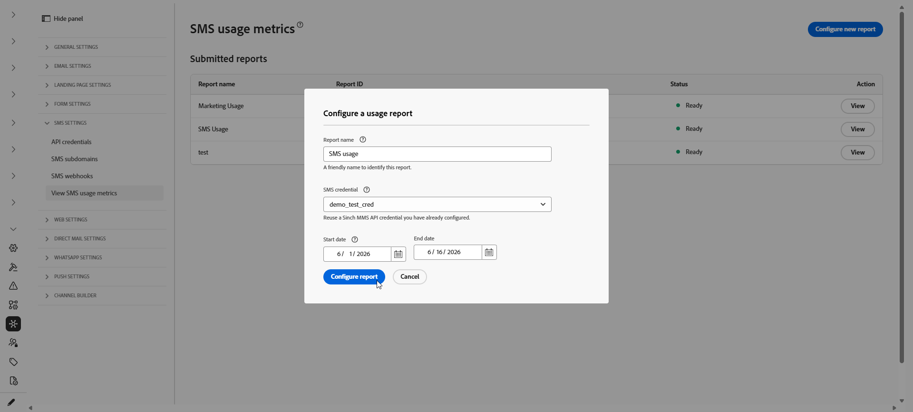

# Genera report di utilizzo SMS {#sms-usage-report}

>[!CONTEXTUALHELP]
>id="ajo_admin_sms_usage_metrics"
>title="Metriche di utilizzo degli SMS"
>abstract="Genera rapporti sull’utilizzo degli SMS per riconciliare il volume di messaggi con la fatturazione del fornitore. I rapporti elencano i conteggi di tipo terminazione mobile (MT) e origine mobile (MO) per ogni codice breve o numero di telefono, aggregati per giorno."

>[!BEGINSHADEBOX]

**In questa pagina:** genera report sull&#39;utilizzo degli SMS in Adobe Journey Optimizer per riconciliare il volume MT (Mobile Terminated) e MO (Mobile-originated) con la fatturazione del fornitore, utilizzando una credenziale API Sinch MMS e un output CSV scaricabile.

>[!ENDSHADEBOX]

Le metriche di utilizzo degli SMS sono disponibili quando acquisti SMS tramite Adobe Journey Optimizer. I report riepilogano il traffico di invio e ricezione in base al codice breve o al numero di telefono, aggregato per giorno, per gli ultimi **90 giorni**.

Per visualizzare le metriche di utilizzo, un amministratore deve:

1. [Crea una credenziale API MMS Sinch](mobile-configuration-sinch.md#sinch-mms) utilizzata solo per recuperare i dati di utilizzo da Sinch.

   I report di utilizzo richiedono credenziali API con **[!UICONTROL fornitore SMS]** impostato su **Sinch MMS**. Questa credenziale collega Journey Optimizer a Sinch in modo da poter recuperare i dati di utilizzo. È separato dalle credenziali Sinch utilizzate per inviare messaggi SMS o MMS, anche se i valori dei campi provengono dallo stesso progetto Sinch.

1. [Configurare e recuperare un report sull&#39;utilizzo degli SMS](#configure-sms-usage-report).

Questi passaggi richiedono l&#39;autorizzazione **[!UICONTROL Gestione impostazioni SMS]**. [Ulteriori informazioni sulle autorizzazioni](../administration/high-low-permissions.md#administration-permissions).

## Configurare e visualizzare i rapporti sull’utilizzo degli SMS {#configure-sms-usage-report}

>[!CONTEXTUALHELP]
>id="ajo_admin_sms_usage_report_name"
>title="Nome report"
>abstract="Inserisci un’etichetta che ti aiuti a riconoscere questo rapporto nell’elenco in un secondo momento, ad esempio Revisione fatturazione maggio 2026."

>[!CONTEXTUALHELP]
>id="ajo_admin_sms_usage_credential"
>title="Credenziali SMS"
>abstract="Seleziona le credenziali API Sinch il cui traffico di invio e ricezione deve essere visualizzato in questo rapporto. Per aggiungere o aggiornare le credenziali, vai a **Amministrazione** > **Canali** > **Credenziali API**, quindi scegli **Fornitore SMS** > **MMS sinch**."

>[!CONTEXTUALHELP]
>id="ajo_admin_sms_usage_start_date"
>title="Start date (Data di inizio)"
>abstract="Primo giorno dell’intervallo di date da includere nel rapporto. I dati di utilizzo sono disponibili solo per gli ultimi 90 giorni."

I rapporti sull’utilizzo degli SMS presentano il volume generato da dispositivi mobili (MO) e terminato da dispositivi mobili (MT) in base al codice breve, per supportare la riconciliazione tra la fatturazione del fornitore e l’attività di messaggistica in Journey Optimizer.

1. Nella barra a sinistra, passa a **[!UICONTROL Amministrazione]** > **[!UICONTROL Canali]** > **[!UICONTROL Impostazioni SMS]**.

1. Accedi al menu **[!UICONTROL Visualizza metriche di utilizzo SMS]**, quindi fai clic su **[!UICONTROL Configura nuovo rapporto]**.

   

1. Configura il rapporto:

   * **[!UICONTROL Nome report]**: immetti un&#39;etichetta che ti consenta di riconoscere il report.
   * **[!UICONTROL Credenziali SMS]**: seleziona le **credenziali API Sinch MMS** create in precedenza per il reporting sull&#39;utilizzo degli SMS.
   * **[!UICONTROL Data inizio]** e **[!UICONTROL Data fine]**: impostare l&#39;intervallo di date per il report. I dati di utilizzo sono disponibili solo per gli ultimi 90 giorni.

     

1. Fare clic su **[!UICONTROL Configura report]** per inviare la richiesta.

1. Nell&#39;elenco **[!UICONTROL Report inviati]** trovare il report configurato e fare clic su **[!UICONTROL Recupera report]**.

   Lo stato cambia in **In sospeso** durante la generazione del report.

1. Una volta aggiornato lo stato del report a **[!UICONTROL Pronto]**, fai clic su **[!UICONTROL Visualizza]** per aprire il report. La relazione include:

   * **Riepilogo utilizzo**: totale messaggi originati da dispositivi mobili (MO) e terminati da dispositivi mobili (MT) per le date selezionate, suddivisi per codice breve.

   * **Volume SMS giornaliero**: volume SMS per giorno, suddiviso per codice breve.

     

1. Per esportare il report, fare clic su **[!UICONTROL Scarica CSV]**. Journey Optimizer scarica un file CSV per il rapporto che stai visualizzando.
