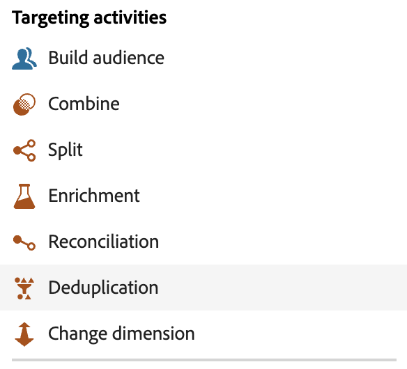

# Informazioni sulle attività di campagna orchestrate {#ms-campaign-activities}

Le attività delle campagne orchestrate sono raggruppate in tre categorie. A seconda del contesto, le attività disponibili possono variare.

Tutte le attività sono descritte nelle sezioni seguenti:

* [Attività di targeting](#targeting)
* [Attività di canale](#channel)
* [Attività di controllo del flusso](#flow-control)

{width="80%" align="left"}

## Attività di targeting {#targeting}

Queste attività sono specifiche per il targeting. Consentono di creare uno o più target definendo un pubblico e suddividendo o combinando i tipi di pubblico mediante le operazioni di intersezione, unione o esclusione.

{width="40%" align="left"}

* [Genera pubblico](build-audience.md): definisci la popolazione target. Puoi selezionare un pubblico esistente o utilizzare il modellatore di query per definire una query personalizzata.
* [Modifica dimensione](change-dimension.md): modifica la dimensione di targeting durante la creazione della campagna orchestrata.
* [Combina](combine.md): esegui la segmentazione del gruppo in entrata. Puoi utilizzare un’unione, un’intersezione o un’esclusione.
* [Deduplicazione](deduplication.md): elimina i duplicati nei risultati delle attività in entrata.
* [Arricchimento](enrichment.md): definisci i dati aggiuntivi da elaborare nella campagna orchestrata. Questa attività consente di sfruttare la transizione in entrata e può essere configurata in modo da completare la transizione in uscita con dati aggiuntivi.
* [Riconciliazione](reconciliation.md): definire il collegamento tra i dati nei dati di Journey Optimizer e i dati in una tabella di lavoro, ad esempio i dati caricati da un file esterno.
* [Dividi](split.md): segmenta la popolazione in ingresso in diversi sottoinsiemi.

## Attività di canale {#channel}

Adobe Journey Optimizer consente di automatizzare ed eseguire campagne di marketing su più canali. Puoi combinare le attività dei canali nell’area di lavoro per creare una campagna orchestrata cross-channel che può attivare azioni in base al comportamento del cliente. Sono disponibili le seguenti attività di **Canale**: e-mail, SMS, Android e notifiche push di iOS. [Scopri come creare un&#39;azione del canale nel contesto di una campagna orchestrata](channels.md).

## Attività di controllo del flusso {#flow-control}

>[!CONTEXTUALHELP]
>id="ajo_orchestration_end"
>title="Attività Fine"
>abstract="L’attività **Fine** consente di contrassegnare graficamente la fine di una campagna orchestrata. Questa attività non ha alcun impatto funzionale ed è pertanto facoltativa."

{width="30%" align="left"}

Le seguenti attività sono specifiche per l’organizzazione e l’esecuzione di campagne orchestrate. Il loro compito principale è quello di coordinare le altre attività:

* [And-join](and-join.md): sincronizza più rami di esecuzione di una campagna orchestrata.
* [Fork](fork.md): crea transizioni in uscita per avviare più attività contemporaneamente.
  <!--* [Test](test.md): Enable transitions based on specified conditions.-->
* [Attendi](wait.md): sospende temporaneamente l&#39;esecuzione di una parte di una campagna orchestrata.

>[!NOTE]
>L&#39;attività **End** contrassegna graficamente la fine di una campagna orchestrata. Questa attività non ha alcun impatto funzionale ed è pertanto facoltativa
