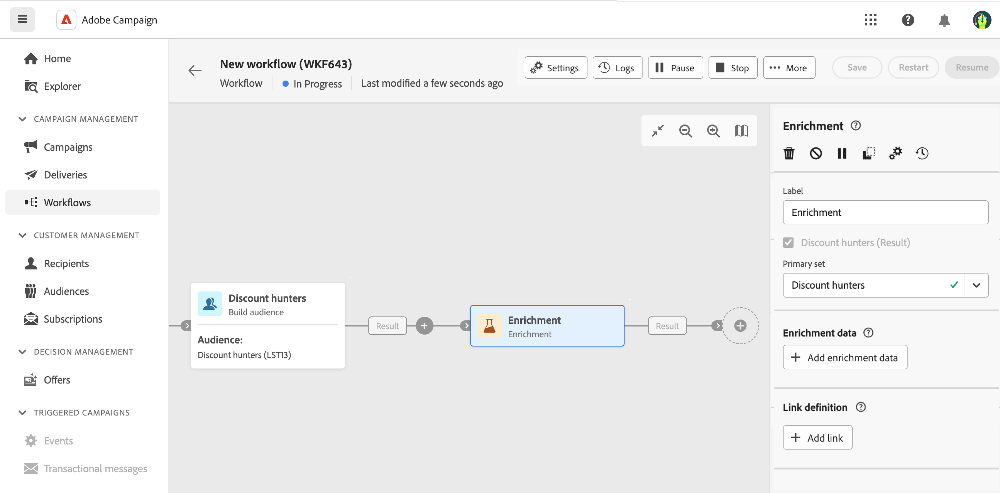
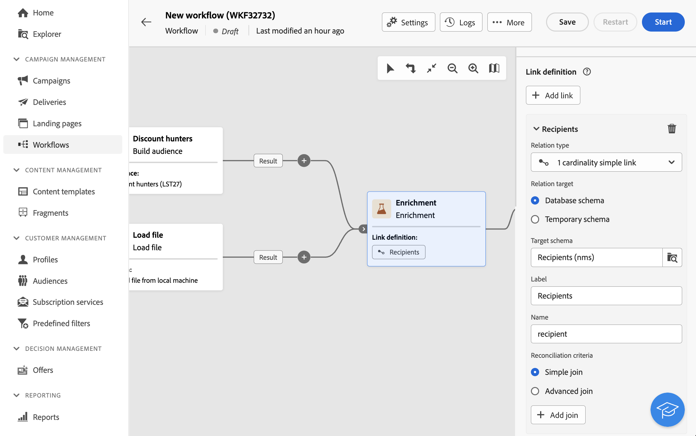
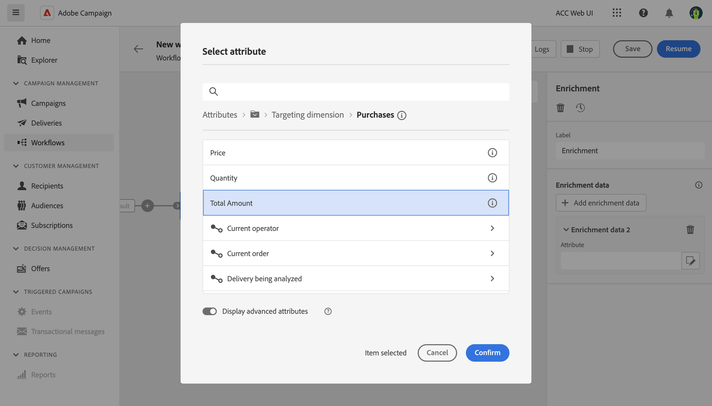

# Arricchimento {#enrichment}

>[!CONTEXTUALHELP]
>id="ajo_orchestration_enrichment"
>title="Attività Arricchimento"
>abstract="L’attività di **Arricchimento** consente di migliorare i dati mirati con informazioni aggiuntive provenienti dal database. Viene comunemente utilizzata in un flusso di lavoro dopo le attività di segmentazione."

L’attività **Arricchimento** è un’attività di **targeting**. Consente di migliorare i dati target con informazioni aggiuntive provenienti dal database. Viene comunemente utilizzata in un flusso di lavoro dopo le attività di segmentazione.

I dati di arricchimento possono provenire:

* **Dalla stessa tabella di lavoro** di quella di destinazione della tua campagna orchestrata:

  *Eseguire il targeting di un gruppo di clienti e aggiungere il campo Data di nascita alla tabella di lavoro corrente*.

* **Da un’altra tabella di lavoro**:

  *Esegui il targeting di un gruppo di clienti e aggiungere i campi “Importo” e “Tipo di prodotto” provenienti dalla tabella “Acquisto”*.

Una volta aggiunti i dati di arricchimento alla campagna orchestrata, è possibile utilizzarli nelle attività aggiunte dopo l&#39;attività **Arricchimento** per segmentare i clienti in gruppi distinti in base a comportamenti, preferenze e esigenze, oppure per creare messaggi di marketing e campagne personalizzati che hanno maggiori probabilità di risuonare con il pubblico di destinazione.

Ad esempio, puoi aggiungere alla tabella di lavoro della campagna orchestrata informazioni relative agli acquisti dei clienti e utilizzare questi dati per personalizzare le e-mail con il loro ultimo acquisto o l’importo speso per tali acquisti.

## Aggiungere un’attività Enrichment {#enrichment-configuration}

Per configurare l’attività **Arricchimento** segui questi passaggi:

1. Aggiungi attività come **Crea pubblico** e **Combina**.
1. Aggiungi un’attività **Arricchimento**.
1. Se nella campagna orchestrata sono state configurate più transizioni, è possibile utilizzare il campo **[!UICONTROL Set principale]** per definire quale transizione deve essere utilizzata come set principale da arricchire con i dati.

## Aggiungi dati di arricchimento {#enrichment-add}

>[!CONTEXTUALHELP]
>id="ajo_targetdata_personalization_enrichmentdata"
>title="Dati di arricchimento"
>abstract="Seleziona i dati da utilizzare per arricchire la campagna orchestrata. Puoi selezionare due tipi di dati di arricchimento: un attributo di arricchimento singolo dalla dimensione di destinazione oppure un collegamento di raccolta, ossia un collegamento con cardinalità 1-N tra più tabelle."

>[!CONTEXTUALHELP]
>id="ajo_orchestration_enrichment_data"
>title="Attività Arricchimento"
>abstract="Una volta aggiunti i dati di arricchimento alla campagna orchestrata, è possibile utilizzarli nelle attività aggiunte dopo l’attività Enrichment per segmentare i clienti in gruppi distinti in base ai loro comportamenti, preferenze e esigenze, oppure per creare messaggi di marketing e campagne personalizzati che hanno maggiori probabilità di risuonare con il pubblico di destinazione."

1. Fare clic su **Aggiungi dati di arricchimento** e selezionare l&#39;attributo da utilizzare per arricchire i dati.

   Puoi selezionare due tipi di dati di arricchimento: un singolo attributo di arricchimento dalla dimensione di destinazione o un collegamento di raccolta. Ciascuno di questi tipi è descritto negli esempi seguenti:
   * [Attributo di arricchimento singolo](#single-attribute)
   * [Collegamento raccolta](#collection-link)

   >[!NOTE]
   >
   >Il pulsante **Modifica espressione** nella schermata di selezione degli attributi consente di creare espressioni avanzate per selezionare l&#39;attributo.

   

## Creare collegamenti tra tabelle {#create-links}

>[!CONTEXTUALHELP]
>id="ajo_orchestration_enrichment_simplejoin"
>title="Definizione dei collegamenti"
>abstract="Crea un collegamento tra i dati della tabella di lavoro e Adobe Journey Optimizer. Ad esempio, se carichi i dati da un file che contiene il numero di account, il paese e l’e-mail dei destinatari, ora puoi creare un collegamento alla tabella dei paesi per aggiornare queste informazioni nei rispettivi profili."

La sezione **[!UICONTROL Definizione collegamento]** consente di creare un collegamento tra i dati della tabella di lavoro e Adobe Journey Optimizer. Ad esempio, se carichi i dati da un file che contiene il numero di account, il paese e l’e-mail dei destinatari, ora puoi creare un collegamento alla tabella dei paesi per aggiornare queste informazioni nei rispettivi profili.

Sono disponibili diversi tipi di collegamenti:

* Collegamento semplice con cardinalità **[!UICONTROL 1]**: ogni record del set principale può essere associato a un solo record dei dati collegati.
* Collegamento semplice **[!UICONTROL 0 o 1 cardinalità]**: ogni record del set principale può essere associato a 0 o 1 record dei dati collegati, ma non a più di uno.
* **[!UICONTROL N collegamento raccolta cardinalità]**: ogni record del set principale può essere associato a 0, 1 o più record (N) dei dati collegati.

Per creare un collegamento, effettua le seguenti operazioni:

1. Nella sezione **[!UICONTROL Definizione collegamento]**, fare clic sul pulsante **[!UICONTROL Aggiungi collegamento]**.

   

1. Nell&#39;elenco a discesa **Tipo di relazione**, scegliere il tipo di collegamento che si desidera creare.

1. Identifica la destinazione a cui vuoi collegare il set principale:

   * Per collegare una tabella esistente nel database, scegliere **[!UICONTROL Schema del database]** e selezionare la tabella desiderata dal campo **[!UICONTROL Schema di destinazione]**.
   * Per collegare i dati della transizione di input, scegliere **Schema temporaneo** e selezionare la transizione di cui si desidera utilizzare i dati.

1. Definisci i criteri di riconciliazione per far corrispondere i dati del set principale con lo schema collegato. Sono disponibili due tipi di join:

   * **Unione semplice**: seleziona un attributo specifico che corrisponda ai dati dei due schemi. Fai clic su **Aggiungi join** e seleziona gli attributi **Source** e **Destination** da utilizzare come criteri di riconciliazione.
   * **Advanced join**: crea un join utilizzando condizioni avanzate. Fai clic su **Aggiungi join** e sul pulsante **Crea condizione** per aprire Query Modeler.

Un esempio di flusso di lavoro che utilizza i collegamenti è disponibile nella sezione [Esempi](#link-example).

## Riconciliazione dei dati {#reconciliation}

>[!CONTEXTUALHELP]
>id="ajo_orchestration_enrichment_reconciliation"
>title="Riconciliazione"
>abstract="L’attività **Arricchimento** può essere utilizzata per riconciliare i dati dallo schema di Journey Optimizer con i dati di un altro schema o con quelli provenienti da uno schema temporaneo, ad esempio i dati caricati tramite un’attività Carica file. Questo tipo di collegamento definisce una riconciliazione verso un record univoco. Journey Optimizer crea un collegamento a una tabella di destinazione aggiungendo ad essa una chiave esterna per la memorizzazione di un riferimento al record univoco."

L’attività di **arricchimento** del flusso di lavoro può ora essere utilizzata per riconciliare i dati dallo schema del database di Campaign con i dati di un altro schema o con i dati provenienti da uno schema temporaneo, ad esempio i dati caricati tramite un’attività Carica file. Questo tipo di collegamento definisce una riconciliazione verso un record univoco. Journey Optimizer crea un collegamento a una tabella di destinazione aggiungendo ad essa una chiave esterna per la memorizzazione di un riferimento al record univoco.

Ad esempio, puoi utilizzare questa opzione per riconciliare il paese di un profilo, specificato in un file caricato, con uno dei paesi disponibili nella tabella dedicata del database di Campaign.

Segui i passaggi per configurare un&#39;attività **Enrichment** con un collegamento di riconciliazione:

1. Fai clic sul pulsante **Aggiungi collegamento** nella sezione **Riconciliazione**.
1. Identifica i dati con cui desideri creare un collegamento di riconciliazione.

   * Per creare un collegamento di riconciliazione con i dati del database Campaign, selezionare **Schema del database** e scegliere lo schema in cui è memorizzata la destinazione.
   * Per creare un collegamento di riconciliazione con i dati provenienti dalla transizione di input, selezionare **Schema temporaneo** e scegliere la transizione della campagna orchestrata in cui sono archiviati i dati di destinazione.

1. I campi **Etichetta** e **Nome** vengono compilati automaticamente in base allo schema di destinazione selezionato. Se necessario, è possibile modificarne i valori.

1. Nella sezione **Criteri di riconciliazione** specificare la modalità di riconciliazione dei dati delle tabelle di origine e di destinazione:

   * **Unione semplice**: riconciliare un campo specifico della tabella di origine con un altro campo della tabella di destinazione. A tale scopo, fare clic sul pulsante **Aggiungi join** e specificare i campi **Source** e **Destination** da utilizzare per la riconciliazione.

     >[!NOTE]
     >
     >È possibile utilizzare uno o più criteri di **Unione semplice**, nel qual caso devono essere tutti verificati in modo che i dati possano essere collegati tra loro.

   * **Unione avanzata**: utilizza il modellatore di query per configurare i criteri di riconciliazione. A questo scopo, fai clic sul pulsante **Crea condizione**, quindi definisci i criteri di riconciliazione creando la tua regola utilizzando le operazioni AND e OR.

L&#39;esempio seguente mostra una campagna orchestrata configurata per creare un collegamento tra la tabella dei profili di Journey Optimizer e una tabella temporanea generata da un&#39;attività **Load file**. In questo esempio, l&#39;attività **Enrichment** esegue la riconciliazione di entrambe le tabelle utilizzando l&#39;indirizzo e-mail come criterio di riconciliazione.

## Aggiungere offerte {#add-offers}

>[!CONTEXTUALHELP]
>id="ajo_orchestration_enrichment_offer_proposition"
>title="Proposta di offerta"
>abstract="L’attività Arricchimento ti consente di aggiungere offerte per ciascun profilo."

L&#39;attività **[!UICONTROL Enrichment]** ti consente di aggiungere offerte per ciascun profilo.

A tale scopo, segui la procedura per configurare un&#39;attività **[!UICONTROL Enrichment]** con un&#39;offerta:

1. Nell&#39;attività **[!UICONTROL Enrichment]**, nella sezione **[!UICONTROL Proposta di offerte]**, fare clic sul pulsante **[!UICONTROL Aggiungi offerta]**

   

1. Sono disponibili due opzioni per la selezione dell’offerta:

   * **[!UICONTROL Cerca l&#39;offerta migliore nella categoria]**: seleziona questa opzione e specifica i parametri di chiamata del motore di offerta (spazio dell&#39;offerta, categoria o temi, data di contatto, numero di offerte da mantenere). Il motore calcolerà le offerte migliori da aggiungere in base a questi parametri. È consigliabile completare il campo Categoria o Tema, anziché entrambi contemporaneamente.

     

   * **[!UICONTROL Offerta predefinita]**: seleziona questa opzione e specifica uno spazio dell&#39;offerta, un&#39;offerta specifica e una data di contatto per configurare direttamente l&#39;offerta da aggiungere senza chiamare il motore delle offerte.

     

1. Dopo aver selezionato l&#39;offerta, fai clic sul pulsante **[!UICONTROL Conferma]**.

Ora puoi utilizzare l’offerta nell’attività di consegna.

### Utilizzo delle offerte dall’attività Enrichment

All’interno di una campagna orchestrata, se desideri utilizzare le offerte che ottieni da un’attività di arricchimento nella consegna, segui i passaggi seguenti:

1. Apri l’attività di consegna e vai nell’edizione dei contenuti. Fai clic sul pulsante **[!UICONTROL Impostazioni offerte]** e seleziona nell&#39;elenco a discesa lo spazio **[!UICONTROL Offerte]** corrispondente alla tua offerta.
Se si desidera visualizzare solo le offerte dell&#39;attività di arricchimento, impostare il numero di **[!UICONTROL proposte]** su 0 e salvare le modifiche.

   

1. Nella finestra di progettazione e-mail, quando si aggiunge una personalizzazione con offerte, fare clic sull&#39;icona **[!UICONTROL Proposte]** per visualizzare le offerte ottenute dall&#39;attività **[!UICONTROL Arricchimento]**. Apri l’offerta da scegliere facendo clic su di essa.

   

   Accedi a **[!UICONTROL Funzioni di rendering]** e scegli **[!UICONTROL Rendering HTML]** o **[!UICONTROL Rendering testo]** in base alle tue esigenze.

   

>[!NOTE]
>
>Se scegli di avere più di un&#39;offerta nell&#39;attività **[!UICONTROL Arricchimento]** all&#39;opzione **[!UICONTROL Numero di offerte da mantenere]**, tutte le offerte vengono visualizzate quando si fa clic sull&#39;icona **[!UICONTROL Proposte]**.

## Esempi {#example}

### Attributo di arricchimento singolo {#single-attribute}

In questo caso, viene semplicemente aggiunto un attributo di arricchimento singolo, ad esempio, la data di nascita. Segui questi passaggi:

1. Fai clic all’interno del campo **Attributo**.
1. Seleziona un campo semplice dalla dimensione di targeting, nel nostro esempio la data di nascita.
1. Fai clic su **Conferma**.

### Collegamento di raccolta {#collection-link}

In questo caso d’uso più complesso, selezioneremo un collegamento di raccolta che è un collegamento con cardinalità 1-N tra le tabelle. Recuperiamo i tre ultimi acquisti che sono inferiori a 100 $. A questo scopo è necessario definire:

* un attributo di arricchimento: il campo **Prezzo**
* il numero di righe da recuperare: 3
* un filtro: per escludere gli articoli superiori a 100 $
* un ordinamento: ordinamento decrescente nel campo **Data ordine**.

#### Aggiungere l’attributo {#add-attribute}

Qui puoi selezionare il collegamento di raccolta da utilizzare come dati di arricchimento.

1. Fai clic all’interno del campo **Attributo**.
1. Fai clic su **Visualizza gli attributi avanzati**.
1. Selezionare il campo **Prezzo** dalla tabella **Acquisti**.

<!--  -->

#### Definire le impostazioni di raccolta{#collection-settings}

A questo punto, definisci come vengono raccolti i dati e quanti record recuperare.

1. Seleziona **Raccogli dati** nel menu a discesa **Seleziona la modalità di raccolta dei dati**.
1. Digita “3” nel campo **Righe da recuperare (colonne da creare)**.

Se, ad esempio, desideri ottenere l’importo medio degli acquisti per un cliente, seleziona **Dati aggregati** e seleziona **Media** nel menu a discesa **Funzione di aggregazione**.

Utilizza i campi **Etichetta** e **Alias** del tuo attributo per renderlo più comprensibile, come illustrato di seguito.

#### Definire i filtri{#collection-filters}

Ora puoi definire il valore massimo per l’attributo di arricchimento. In questo esmpio, vogliamo escludere gli articoli superiori a 100 $.
1. Fai clic su **Crea filtri**.
1. Aggiungi i due seguenti filtri: **Il prezzo** esiste E **Il prezzo** è inferiore a 100. Il primo filtra i valori NULL, in quanto apparirebbero come il valore maggiore.
1. Fai clic su **Conferma**.

#### Definire l’ordinamento{#collection-sorting}

Ora è necessario applicare l’ordinamento per recuperare i tre acquisti **più recenti**.

1. Attiva l’opzione **Abilita ordinamento**.
1. Fai clic all’interno del campo **Attributo**.
1. Seleziona il campo **Data ordine**.
1. Fai clic su **Conferma**.
1. Seleziona **Decrescente** nel menu a discesa **Ordina**.

### Arricchimento con dati collegati {#link-example}

L’esempio seguente mostra una campagna orchestrata configurata per creare un collegamento tra due transizioni. Le prime transizioni eseguono il targeting dei dati del profilo utilizzando un&#39;attività **Query**, mentre la seconda transizione include i dati di acquisto memorizzati in un file caricato tramite un&#39;attività Load file.

* La prima attività **Enrichment** collega il set principale (dati dell&#39;attività **Query**) allo schema dell&#39;attività **Load file**. Questo ci consente di far corrispondere ogni profilo target della query con i dati di acquisto corrispondenti.

  

* È stata aggiunta una seconda attività **Enrichment** per arricchire i dati della tabella della campagna orchestrata con i dati di acquisto provenienti dall&#39;attività **Load file**. Questo ci consente di utilizzare tali dati in ulteriori attività, ad esempio per personalizzare i messaggi inviati ai clienti con le informazioni sul loro acquisto.

  
