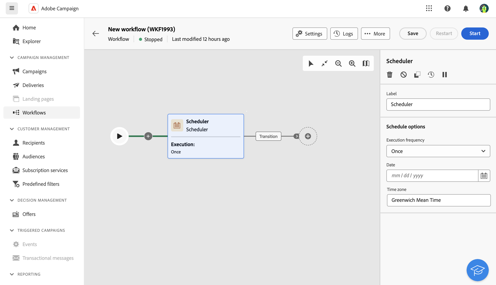

# Modulo di pianificazione {#scheduler}

>[!CONTEXTUALHELP]
>id="ajo_orchestration_scheduler"
>title="Attività del Modulo di pianificazione"
>abstract="L&#39;attività **Scheduler** consente di pianificare l&#39;avvio della campagna orchestrata. Questa attività dovrebbe essere considerata come un avvio pianificato. Può essere utilizzata solo come prima attività della campagna orchestrata."

L’attività del **Modulo di pianificazione** è un’attività di **Controllo del flusso**. Consente di pianificare l’avvio della campagna orchestrata. Questa attività dovrebbe essere considerata come un avvio pianificato. Può essere utilizzata solo come prima attività della campagna orchestrata.

## Best practice{#scheduler-best-practices}

* Non pianificare l’esecuzione di una campagna orchestrata per più di 15 minuti, in quanto potrebbe impedire le prestazioni complessive del sistema e creare blocchi nel database.
* Se desideri inviare una consegna una tantum nella campagna orchestrata, puoi aggiungere un&#39;attività di pianificazione e impostarla per l&#39;esecuzione di **Una volta**. Puoi anche definire la **Pianificazione** nelle impostazioni della consegna.
* Se desideri inviare una consegna ricorrente nella campagna orchestrata, devi utilizzare un&#39;attività **Scheduler** e impostare la frequenza di esecuzione. L’attività di consegna ricorrente non ti consente di definire una pianificazione.

## Configurare l’attività di pianificazione {#scheduler-configuration}

>[!CONTEXTUALHELP]
>id="ajo_orchestration_schedule_validity"
>title="Validità del modulo di pianificazione"
>abstract="È possibile definire un periodo di validità per il modulo di pianificazione. Può essere permanente (impostazione predefinita) o valido fino a una data specifica."

>[!CONTEXTUALHELP]
>id="ajo_orchestration_schedule_options"
>title="Opzioni del modulo di pianificazione"
>abstract="Definisci la frequenza del modulo di pianificazione. Può essere eseguito in un determinato momento, una o più volte al giorno, alla settimana o al mese."

Per configurare l’attività del **Modulo di pianificazione**, segui questi passaggi:

1. Aggiungi un&#39;attività **Scheduler** alla campagna orchestrata.

1. Configura la **Frequenza di esecuzione**:

   * **Una volta**: la campagna orchestrata viene eseguita una sola volta.

   * **Giornaliero**: la campagna orchestrata viene eseguita a un&#39;ora specifica, una volta al giorno.

   * **Più volte al giorno:** la campagna orchestrata viene eseguita regolarmente più volte al giorno. Puoi impostare esecuzioni in orari specifici o periodicamente.

   * **Settimanale**: la campagna orchestrata viene eseguita in un determinato momento, una o più volte alla settimana.

   * **Mensile**: la campagna orchestrata viene eseguita in un determinato momento, una o più volte al mese. Puoi selezionare i mesi, quando è necessario eseguire la campagna orchestrata. Puoi anche impostare le esecuzioni in un giorno feriale specifico del mese, ad esempio il secondo martedì del mese.

1. Definisci i dettagli di esecuzione in base alla frequenza selezionata. I campi dettagliati possono variare a seconda della frequenza utilizzata (tempo, frequenza di ripetizione, giorni specificati, ecc.).

1. Fai clic su **Anteprima orari di lancio** per verificare la pianificazione delle prossime dieci esecuzioni della campagna orchestrata.

1. Definisci il periodo di validità del modulo di pianificazione:

   * **Permanente (non scade mai)**: la campagna orchestrata viene eseguita, in base alla frequenza specificata, senza alcun limite all&#39;intervallo di tempo o al numero di iterazioni.

   * **Periodo di validità**: la campagna orchestrata viene eseguita in base alla frequenza specificata, fino a una data specifica. È necessario specificare le date di inizio e di fine.

>[!NOTE]
>
>Se si desidera avviare immediatamente la campagna orchestrata, è possibile fare clic sull&#39;**Attività in sospeso** nella barra delle azioni superiore della pianificazione. Questo pulsante è disponibile solo dopo aver avviato la campagna orchestrata.

## Esempio{#scheduler-example}

Nell’esempio seguente, l’attività è configurata in modo che la campagna orchestrata venga eseguita diverse volte al giorno alle 9 e alle 12, ogni giorno della settimana dal 1° ottobre 2025 al 1° gennaio 2026.

