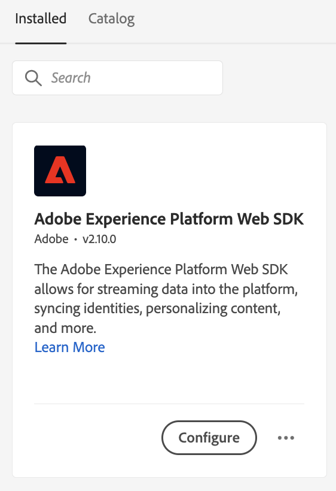
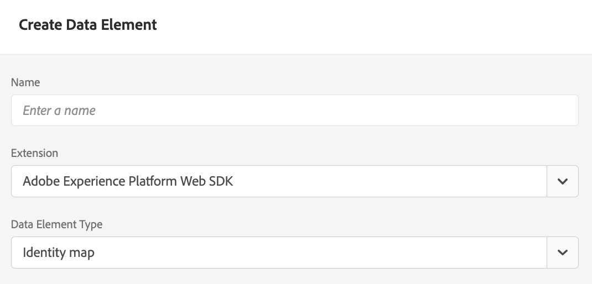
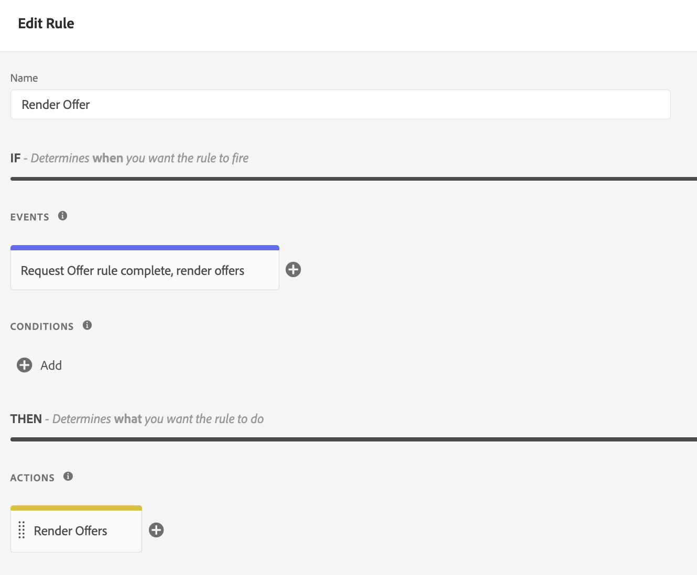
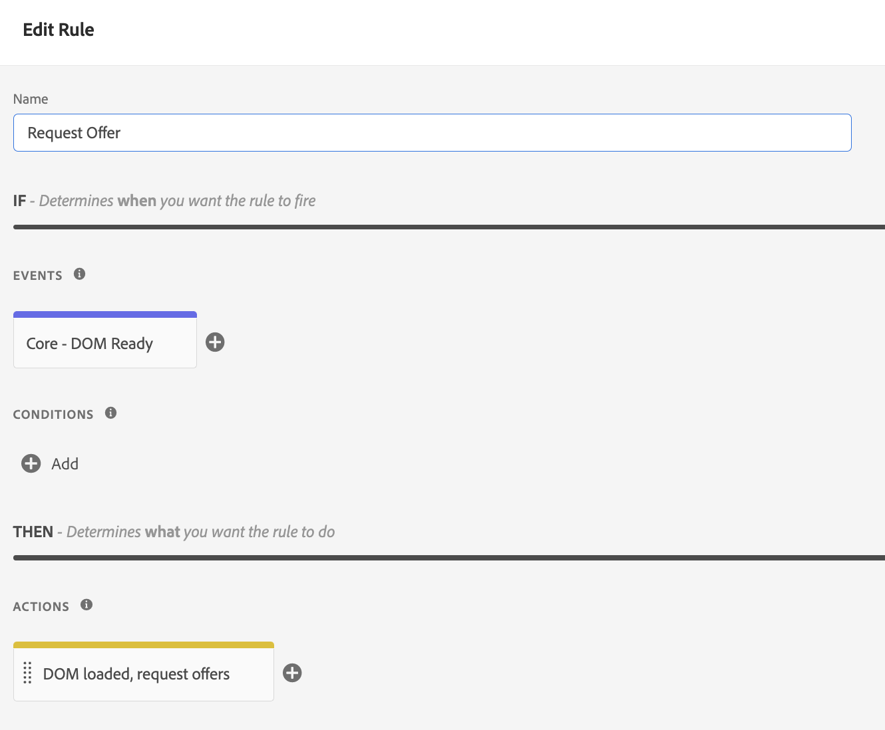

# Distribuire le offerte tramite l’API Edge Decisioning {#edge-decisioning-api}

>[!TIP]
>
>La funzione Decisioni, la nuova funzionalità decisionale di [!DNL Adobe Journey Optimizer], è ora disponibile tramite i canali e-mail e di esperienza basati su codice. [Ulteriori informazioni](../../../experience-decisioning/gs-experience-decisioning.md)

## Introduzione e prerequisiti {#edge-overview-and-prerequisites}

[Adobe Experience Platform Web SDK](https://experienceleague.adobe.com/docs/experience-platform/edge/home.html#video-overview) è una libreria JavaScript lato client che consente ai clienti Adobe Experience Cloud di interagire con i vari servizi Experience Cloud tramite Experience Platform Edge Network.

Experience Platform Web SDK supporta l’esecuzione di query sulle soluzioni di personalizzazione di Adobe, inclusa la gestione delle decisioni, e consente di recuperare ed eseguire il rendering delle offerte personalizzate create utilizzando le API o la Libreria di offerte. Per istruzioni più dettagliate, consulta la documentazione su [creazione di un&#39;offerta](../../get-started/starting-offer-decisioning.md).

Esistono due modi per implementare la gestione delle decisioni con [Platform Web SDK](https://experienceleague.adobe.com/docs/experience-platform/edge/home.html#video-overview). Una modalità è rivolta agli sviluppatori e richiede la conoscenza dei siti web e della programmazione. L’altro modo consiste nell’utilizzare l’interfaccia utente di Adobe Experience Platform per configurare le offerte; a tale scopo è necessario fare riferimento solo a uno script di piccole dimensioni nell’intestazione della pagina HTML.

Per ulteriori informazioni su come distribuire offerte personalizzate tramite Adobe Experience Platform Web SDK, consulta la documentazione di Adobe Experience Platform sulla [gestione delle decisioni](https://experienceleague.adobe.com/docs/experience-platform/edge/personalization/offer-decisioning/offer-decisioning-overview.html#enabling-offer-decisioning).

### Ambiti decisionali {#decision-scopes}

Un ambito decisionale è la stringa con codifica Base64 di un oggetto JSON contenente l’attività e gli ID di posizionamento che desideri che il servizio offer decisioning utilizzi per proporre le offerte.

*JSON ambito decisione:*

```json
{
  "activityId":"xcore:offer-activity:11cfb1fa93381aca",
  "placementId":"xcore:offer-placement:1175009612b0100c"
}
```

*Stringa con codifica Base64 per ambito decisionale:*

```json
"eyJhY3Rpdml0eUlkIjoieGNvcmU6b2ZmZXItYWN0aXZpdHk6MTFjZmIxZmE5MzM4MWFjYSIsInBsYWNlbWVudElkIjoieGNvcmU6b2ZmZXItcGxhY2VtZW50OjExNzUwMDk2MTJiMDEwMGMifQ=="
```

>[!TIP]
>
>Puoi copiare il valore dell&#39;ambito della decisione dalla pagina **Panoramica attività** nell&#39;interfaccia utente.

## Adobe Experience Platform Web SDK {#aep-web-sdk}

Platform Web SDK sostituisce i seguenti SDK:

* Visitor.js
* AppMeasurement.js
* AT.js
* DIL.js

SDK non ha combinato queste librerie ed è una nuova implementazione da zero. Per utilizzarlo, devi prima seguire questi passaggi:

1. Assicurati che la tua organizzazione disponga delle autorizzazioni appropriate per utilizzare SDK e che le autorizzazioni siano state configurate correttamente.

   <!-- For more detailed instructions, refer to the documentation on using the [Adobe Experience Platform Web SDK](). -->

1. [Configura lo stream di dati](https://experienceleague.adobe.com/docs/experience-platform/edge/fundamentals/datastreams.html?lang=it) nella scheda Raccolta dati del tuo account in Adobe Experience Cloud.

1. Installa SDK. Esistono diversi metodi per eseguire questa operazione, descritti nella [Installa la pagina SDK](https://experienceleague.adobe.com/docs/experience-platform/edge/fundamentals/installing-the-sdk.html). Questa pagina continuerà con ogni diverso metodo di implementazione.

Per utilizzare SDK, è necessario definire uno [schema](../../../data/get-started-schemas.md) e uno [flusso di dati](../../../data/get-started-datasets.md).

<!-- ****TODO - Configure schema**** -->

Per personalizzare le offerte, devi configurare separatamente la personalizzazione o i profili.

<!-- Refer to the [doc](www.link.com) for detailed instructions.  -->

>[!NOTE]
>
>**Trasmissione dei dati contestuali nelle richieste Edge Decisioning**
>
>Nelle richieste di Edge Decisioning puoi trasmettere dati contestuali (come tipo di dispositivo, posizione o preferenze utente) per creare regole di idoneità dinamiche e distribuire offerte personalizzate in base a condizioni in tempo reale. [Ulteriori informazioni sui dati contestuali e sulle richieste Edge Decisioning](../../context-data-edge.md)

Per configurare SDK per la gestione delle decisioni, effettua una delle due operazioni seguenti:

## Opzione 1: installare l’estensione tag e l’implementazione tramite launch

Questa opzione è più intuitiva per le persone che potrebbero avere meno esperienza di codifica.

1. [Creare una proprietà tag](https://experienceleague.adobe.com/docs/experience-platform/tags/admin/companies-and-properties.html)

1. [Aggiungere il codice di incorporamento](https://experienceleague.adobe.com/docs/core-services-learn/implementing-in-websites-with-launch/configure-launch/launch-add-embed.html)

1. Installa e configura l’estensione Adobe Experience Platform Web SDK con lo stream di dati creato selezionando la configurazione dal menu a discesa &quot;Stream di dati&quot;. Consulta la documentazione sulle [estensioni](https://experienceleague.adobe.com/docs/experience-platform/tags/ui/extensions/overview.html).

   

   

1. Creare gli elementi dati [necessari](https://experienceleague.adobe.com/docs/experience-platform/tags/ui/data-elements.html). È necessario creare almeno una mappa identità di Platform Web SDK e un elemento dati Platform Web SDK XDM Object.

   

   

1. Crea le [regole](https://experienceleague.adobe.com/docs/experience-platform/tags/ui/rules.html?lang=it):

   Aggiungi un’azione Platform Web SDK Send Event e aggiungi gli ambiti decisionali pertinenti alla configurazione di tale azione

   

   

1. [Crea e pubblica](https://experienceleague.adobe.com/docs/experience-platform/tags/publish/libraries.html) una libreria contenente tutte le regole, gli elementi dati e le estensioni pertinenti che hai configurato.

## Opzione 2: implementazione manuale utilizzando la versione autonoma predefinita

Di seguito sono riportati i passaggi necessari per utilizzare la gestione delle decisioni utilizzando l’installazione autonoma precompilata del web SDK. Questa guida presuppone che sia la prima volta che implementi SDK, quindi tutti i passaggi potrebbero non essere applicabili a te. Questa guida presuppone anche un certo grado di esperienza di sviluppo.

Includi il seguente snippet JavaScript dall&#39;opzione 2: la versione standalone predefinita in [questa pagina](https://experienceleague.adobe.com/docs/experience-platform/edge/fundamentals/installing-the-sdk.html) nella sezione `<head>` della pagina HTML.

```
javascript
    <script>
        !function(n,o){o.forEach(function(o){n[o]||((n.__alloyNS=n.__alloyNS||
        []).push(o),n[o]=function(){var u=arguments;return new Promise(
        function(i,l){n[o].q.push([i,l,u])})},n[o].q=[])})}
        (window,["alloy"]);
    </script>
    <script src="https://cdn1.adoberesources.net/alloy/2.6.4/alloy.js" async></script>
```

Per configurare la configurazione di SDK, dovrai disporre di due ID all’interno dell’account Adobe: edgeConfigId e orgId. Il valore edgeConfigId è uguale all’ID dello stream di dati, che avresti dovuto configurare nei Prerequisiti.

Per trovare il tuo edgeConfigID/ID dello stream di dati, vai a Raccolta dati e seleziona lo stream di dati. Per trovare il tuo orgId, vai al tuo profilo.

Configura SDK in JavaScript seguendo le istruzioni riportate in questa pagina. Utilizza sempre il tuo edgeConfigId e l’orgId nella funzione di configurazione. La documentazione descrive anche i parametri opzionali esistenti per la configurazione. La configurazione finale potrebbe avere un aspetto simile al seguente:

```
javascript
    alloy("configure", {
        "edgeConfigId": "12345678-0ABC-DEF-GHIJ-KLMNOPQRSTUV",                            
        "orgId":"ABCDEFGHIJKLMNOPQRSTUVW@AdobeOrg",
        "debugEnabled": true,
        "edgeDomain": "edge.adobedc.net",
        "clickCollectionEnabled": true,
        "idMigrationEnabled": true,
        "thirdPartyCookiesEnabled": true,
        "defaultConsent":"in"  
    });
```

Installa l’estensione Debugger Chrome da utilizzare con il debug. Disponibile qui: <https://chrome.google.com/webstore/detail/adobe-experience-platform/bfnnokhpnncpkdmbokanobigaccjkpob>

Quindi, accedi al tuo account all’interno del debugger. Quindi, vai a Registri e assicurati di essere connesso all’area di lavoro corretta. Ora, copia la versione con codifica base64 dell’ambito di decisione dall’offerta.

Quando modifichi il tuo sito web, includi lo script con la configurazione e la funzione `sendEvent` per inviare l&#39;ambito della decisione ad Adobe.

**Esempio**:

```
javascript
    alloy("sendEvent", {
        "decisionScopes": 
        [
        "eyJ4ZG06YWN0aXZpdHlJZCI6Inhjb3JlOm9mZmVyLWFjdGl2aXR5OjE0ZWE4MDhhZjJjZDM1NzQiLCJ4ZG06cGxhY2VtZW50SWQiOiJ4Y29yZTpvZmZlci1wbGFjZW1lbnQ6MTRjNGFmZDI2OTXXXXXXXXXX"
        ]
    });
```

Per un esempio su come gestire la risposta, consulta la sezione seguente:

```
javascript
    alloy("sendEvent", {
        "decisionScopes":
        [
        "eyJ4ZG06YWN0aXZpdHlJZCI6Inhjb3JlOm9mZmVyLWFjdGl2aXR5OjE0ZWE4MDhhZjJjZDM1NzQiLCJ4ZG06cGxhY2VtZW50SWQiOiJ4Y29yZTpvZmZlci1wbGFjZW1lbnQ6MTRjNGFmZDI2OTXXXXXXXXXX"
        ]
    }).then(function(result) {
        Object.entries(result).forEach(([key, value]) => {
            console.log(key, value);
        });
    });
```

Puoi utilizzare il debugger per verificare di essersi connesso correttamente alla rete Edge.

>[!NOTE]
>
>Se nei registri non trovi una connessione al server Edge di, potresti dover disattivare il Ad Blocker.

Consulta come hai creato la tua offerta e la formattazione utilizzata. In base ai criteri soddisfatti nella decisione, verrà restituita un’offerta contenente le informazioni specificate al momento della creazione all’interno di Adobe Experience Platform.

In questo esempio, il JSON da restituire è:

```
json
{
   "name":"ABC Test",
   "description":"This is a test offer", 
   "link":"https://sampletesting.online/",
   "image":"https://sample-demo-URL.png"
}
```

Gestisci l’oggetto di risposta e analizza i dati necessari. Poiché è possibile inviare più ambiti decisionali in una chiamata `sendEvent`, la risposta potrebbe essere leggermente diversa.

```
json
    {
        "id": "abrxgl843d913",
        "scope": "eyJ4ZG06YWN0aXZpdHlJZCI6Inhjb3JlOm9mZmVyLWFjdGl2aXR5OjE0ZWE4MDhhZjJjZDM1NzQiLCJ4ZG06cGxhY2VtZW50SWQiOiJ4Y29yZTpvZmZlci1wbGFjZW1lbnQ6MTRjNGFmZDI2OTVlNWRmOSJ9",
        "items": 
        [
            {
                "id": "xcore:fallback-offer:14ea7f1ea26ebd0a",
                "etag": "1",
                "schema": "https://ns.adobe.com/experience/offer-management/content-component-json",
                "data": {
                    "id": "xcore:fallback-offer:14ea7f1ea26ebd0a",
                    "format": "application/json",
                    "language": [
                        "en-us"
                    ],
                    "content": "{\"name\":\"ABC Test\",\"description\":\"This is a test offer\", \"link\":\"https://sampletesting.online/\",\"image\":\"https://sample-demo-URL.png\"}"
                }
            }
        ]
    }
]
}
```

```
json
{
    "propositions": 
    [
    {
        "renderAttempted": false,
        "id": "e15ecb09-993e-4b66-93d8-0a4c77e3d913",
        "scope": "eyJ4ZG06YWN0aXZpdHlJZCI6Inhjb3JlOm9mZmVyLWFjdGl2aXR5OjE0ZWE4MDhhZjJjZDM1NzQiLCJ4ZG06cGxhY2VtZW50SWQiOiJ4Y29yZTpvZmZlci1wbGFjZW1lbnQ6MTRjNGFmZDI2OTVlNWRmOSJ9",
        "items": 
        [
            {
                "id": "xcore:fallback-offer:14ea7f1ea26ebd0a",
                "etag": "1",
                "schema": "https://ns.adobe.com/experience/offer-management/content-component-json",
                "data": {
                    "id": "xcore:fallback-offer:14ea7f1ea26ebd0a",
                    "format": "application/json",
                    "language": [
                        "en-us"
                    ],
                    "content": "{\"name\":\"Claire Hubacek Test\",\"description\":\"This is a test offer\", \"link\":\"https://sampletesting.online/\",\"image\":\"https://sample-demo-URL.png\"}"
                }
            }
        ]
    }
    ]
}
```

In questo esempio, il percorso necessario per gestire e utilizzare i dettagli specifici dell&#39;offerta nella pagina Web era: `result['decisions'][0]['items'][0]['data']['content']`

Per impostare le variabili JS:

```
javascript
const offer = JSON.parse(result['decisions'][0]['items'][0]['data']['content']);

let offerURL = offer['link'];
let offerDescription = offer['description'];
let offerImageURL = offer['image'];

document.getElementById("offerDescription").innerHTML = offerDescription;
document.getElementById('offerImage').src = offerImageURL;
```

### Più valori decisionScopes {#multiple-decision-scopes}

È inoltre possibile inviare più ambiti decisionali in una singola chiamata `sendEvent`. In questo esempio, la risposta restituisce una proposta per ogni ambito richiesto.

**Esempio**:

```javascript
alloy("sendEvent", {
    "decisionScopes":
    [
    "eyJhY3Rpdml0eUlkIjoieGNvcmU6b2ZmZXItYWN0aXZpdHk6MTFjZmIxZmE5MzM4MWFjYSIsInBsYWNlbWVudElkIjoieGNvcmU6b2ZmZXItcGxhY2VtZW50OjExNzUwMDk2MTJiMDEwMGMifQ==",
    "eyJhY3Rpdml0eUlkIjoieGNvcmU6b2ZmZXItYWN0aXZpdHk6MTIyMjA4YjNhODc0MDU1OCIsInBsYWNlbWVudElkIjoieGNvcmU6b2ZmZXItcGxhY2VtZW50OjEyMjIwNDUyOTUxNGEyYzAifQ=="
    ]
});
```

La risposta contiene una voce di payload per ambito risolto:

```json
{
    "requestId": "94c4f2f1-9218-43ce-afd3-eb0d853c5174",
    "handle": [
        {
            "payload": [
                {
                    "id": "a2804dfb-a0ec-4df9-8311-59d3ecdeb642",
                    "scope": "eyJhY3Rpdml0eUlkIjoieGNvcmU6b2ZmZXItYWN0aXZpdHk6MTFjZmIxZmE5MzM4MTEyMyIsInBsYWNlbWVudElkIjoieGNvcmU6b2ZmZXItcGxhY2VtZW50OjExNzUwMDk2MTJiMDExMjMifQ==",
                    "activity": {
                        "id": "xcore:offer-activity:11cfb1fa93381123",
                        "etag": "1"
                    },
                    "placement": {
                        "id": "xcore:offer-placement:1175009612b01123",
                        "etag": "3"
                    },
                    "items": [
                        {
                            "id": "xcore:personalized-offer:11e36d4a22954123",
                            "schema": "https://ns.adobe.com/experience/offer-management/content-component-text",
                            "etag": "2",
                            "data": {
                                "id": "xcore:personalized-offer:11e36d4a22954123",
                                "format": "text/text",
                                "language": [
                                    "en"
                                ],
                                "content": "20% Off on shipping",
                                "characteristics": {
                                    "foo2": "bar2"
                                }
                            }
                        }
                    ]
                },
                {
                    "id": "a2804dfb-a0ec-4df9-8311-59d3ecdeb642",
                    "scope": "eyJhY3Rpdml0eUlkIjoieGNvcmU6b2ZmZXItYWN0aXZpdHk6MTFjZmIxZmE5MzM4MWFjYSIsInBsYWNlbWVudElkIjoieGNvcmU6b2ZmZXItcGxhY2VtZW50OjExNzUwMDk2MTJiMDEwMGMifQ==",
                    "activity": {
                        "id": "xcore:offer-activity:11cfb1fa93381aca",
                        "etag": "2"
                    },
                    "placement": {
                        "id": "xcore:offer-placement:1175009612b0100c",
                        "etag": "1"
                    },
                    "items": [
                        {
                            "id": "xcore:personalized-offer:11e36d4a2295415d",
                            "schema": "https://ns.adobe.com/experience/offer-management/content-component-imagelink",
                            "etag": "1",
                            "data": {
                                "id": "xcore:personalized-offer:11e36d4a2295415d",
                                "format": "image/png",
                                "language": [
                                    "en"
                                ],
                                "deliveryURL": "https://image.jpeg",
                                "characteristics": {
                                    "foo": "bar",
                                    "foo1": "bar1"
                                }
                            }
                        }
                    ]
                }
            ],
            "type": "personalization:decisions",
            "eventIndex": 0
        }
    ]
}
```

<!--
## Limitations

Some offer constraints are currently not supported with the mobile Experience Edge workflows, for example Capping. The Capping field value specifies the number of times an offer can be presented across all users. For more details, see [Add constraints to an offer](../../offer-library/add-constraints.md#capping).
-->
