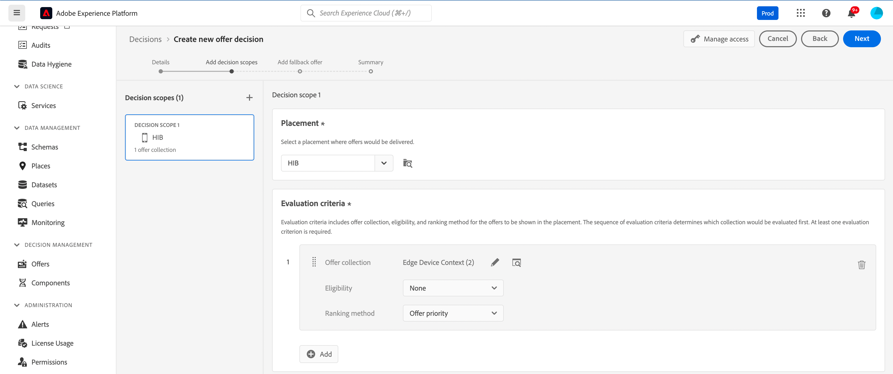

# Dati contestuali e richieste Edge Decisioning {#edge}

Questa sezione ti guida attraverso il passaggio di dati contestuali nelle richieste di Edge Decisioning e il loro utilizzo nelle regole di idoneità. Esploreremo un caso d’uso end-to-end che illustra come distribuire offerte personalizzate in base al tipo di dispositivo utilizzato dai clienti.

Questo caso d’uso prevede diversi passaggi chiave:

1. [Configura prerequisiti](#prerequisites): assicurati che siano stati completati tutti i passaggi necessari per trasmettere i dati contestuali nelle richieste.
1. [Utilizza i dati contestuali nelle regole di idoneità](#rules): crea regole che determinano quali offerte mostrare in base al tipo di dispositivo dell&#39;utente.
1. [Progettare offerte specifiche per il dispositivo](#offers): crea offerte personalizzate per ogni tipo di dispositivo e collegale alle regole corrispondenti.
1. [Crea una raccolta di offerte](#collection): raggruppa tutte le offerte in una raccolta statica.
1. [Configura una decisione](#decision): crea una nuova decisione che sfrutta il motore delle decisioni per le offerte per scegliere l&#39;offerta migliore da presentare agli utenti in base al tipo di dispositivo.
1. [Trasmettere i dati contestuali nella richiesta Edge Decisioning](#request): trasmettere i dati contestuali tramite la richiesta API per recuperare e presentare le offerte appropriate agli utenti.

>[!BEGINSHADEBOX]

Per andare oltre, puoi anche sfruttare i dati contestuali nelle **formule di classificazione** o per **personalizzare le rappresentazioni delle offerte** in modo dinamico. Ad esempio, puoi creare una singola offerta e utilizzare i campi di personalizzazione per adattarne la rappresentazione in base ai dati contestuali. Ad esempio, puoi visualizzare una determinata immagine se l’utente ha un iphone, e un’altra per gli utenti di ipad. Per ulteriori informazioni, consulta le sezioni seguenti:

* [Classificazione delle formule: incrementa le offerte in base ai dati contestuali](../offers/ranking/create-ranking-formulas.md#context-data)
* [Personalizzare le rappresentazioni in base ai dati contestuali](../offers/offer-library/add-representations.md#context-data)

>[!ENDSHADEBOX]

## Prerequisiti per trasmettere i dati contestuali nelle richieste di Edge Decisioning {#prerequisites}

Invece di passare il contesto in un formato piuttosto libero utilizzando l’API Decisioning, il payload del contesto di Edge Decisioning deve essere conforme all’evento esperienza XDM. A questo scopo, il contesto deve essere definito come parte dell’evento &quot;Esperienza XDM&quot; utilizzato per la raccolta dati.

1. Definisci uno schema di evento esperienza. Ai fini di questo caso d’uso, viene creato uno schema &quot;Contesto dell’offerta&quot; e i campi del contesto dell’offerta fanno parte di un gruppo di campi &quot;Contesto dell’offerta&quot;. In realtà, il gruppo di campi viene aggiunto allo schema evento esperienza utilizzato per la raccolta dati associata allo stream di dati &quot;Edge Collection Network&quot;.

   >[!NOTE]
   >
   >Lo schema evento esperienza contesto offerta deve far parte del profilo, con un campo &quot;CUSTOMER_ID&quot; utilizzato come identità primaria.

   In questo esempio, il gruppo di campi &quot;Contesto offerta&quot; ha due proprietà: language e deviceType. Queste proprietà verranno utilizzate nelle regole di classificazione e idoneità delle offerte.

   {width="60%" align="center" zoomable="yes"}

   Scopri come utilizzare gli schemi nella guida di Adobe Experience Platform [Experience Data Model (XDM)](https://experienceleague.adobe.com/it/docs/experience-platform/xdm/home){target="_blank"}

1. Crea un set di dati (qui &quot;Contesto dell’offerta&quot;) e assicurati che sia abilitato per il profilo.

1. Crea un nuovo flusso di dati dal menu **[!UICONTROL Raccolta dati]** > **[!UICONTROL Flussi di dati]**. Scopri come creare e configurare lo stream di dati nella [guida sugli stream di dati](https://experienceleague.adobe.com/it/docs/experience-platform/datastreams/configure){target="_blank"} di Adobe Experience Platform

   In questo caso, abbiamo creato un flusso di dati &quot;Contesto offerta&quot;, con lo schema evento &quot;Contenuto offerta&quot; selezionato.

   

1. Modifica lo stream di dati appena creato e seleziona &quot;Adobe Experience Platform&quot; come servizio e &quot;Contesto offerta&quot; come set di dati dell’evento.

   

1. Salva lo stream di dati e copiane l’ID. Questo ID verrà utilizzato nell’endpoint di richiesta API. [Scopri come generare la chiamata API](#request)

   

## Utilizzare i dati contestuali nelle regole di idoneità {#rules}

Crea regole di idoneità che determinano le offerte da mostrare in base al tipo di dispositivo dell’utente:


* regola dispositivo iphone:

   * Nome regola: &quot;Edge Context Rule - iphone&quot;
   * Configurazione: deviceType = &#39;iphone&#39;
   * Sintassi PQL:

     ```
     select _Any1 from xEvent where _Any1._experienceplatform.offerContextData.deviceType.equals("iphone", false)
     ```

* regola dispositivo ipad:

   * Nome regola: &quot;Edge Context Rule - ipad&quot;
   * Configurazione: deviceType = &#39;ipad&#39;
   * Sintassi PQL

     ```
     select _Any1 from xEvent where _Any1._experienceplatform.offerContextData.deviceType.equals("ipad", false)
     ```

## Crea offerte {#offers}

Crea un’offerta per ciascun tipo di dispositivo e collegala alla regola di idoneità corrispondente creata in precedenza:

* Offerta per gli utenti di iphone:

   * Nome offerta : &quot;Contesto Edge - Contenuto offerta iPhone&quot;
   * Regola associata: &quot;Edge Context Rule - iphone&quot;

* Offerta per gli utenti ipad:

   * Nome offerta: Contesto Edge - Contenuto offerta iPad :
   * Regola associata: &quot;Edge Context Rule - ipad&quot;

Inoltre, crea un’offerta di fallback (qui &quot;Contenuto di fallback contestuale&quot;) da visualizzare se non sono soddisfatti criteri specifici del dispositivo.

## Aggiungere offerte in una raccolta {#collection}

Aggiungi le offerte create in precedenza a una raccolta statica denominata qui &quot;Edge Device Context&quot;. Questa raccolta sarà il luogo in cui la decisione di offerta selezionerà le offerte idonee da presentare ai clienti.


## Crea decisione di offerta {#decision}

Crea una nuova decisione che sfrutta il motore delle decisioni per le offerte per scegliere l’offerta migliore da presentare agli utenti in base al tipo di dispositivo con l’offerta &quot;Context Fallback&quot; selezionata come offerta di fallback.



>[!NOTE]
>
>Per andare oltre, puoi sfruttare i dati contestuali nelle formule di classificazione e assegnarle alla tua decisione. AGGIUNGI INFORMAZIONI

## Trasmettere i dati contestuali nella richiesta Edge Decisioning {#request}

### Endpoint

Nell&#39;endpoint, utilizzare l&#39;ID dello [stream di dati](#prerequisites) creato in precedenza.

`https://edge.adobedc.net/ee/irl1/v1/interact?configId=f3c47f2a-c484-4908-87a5-a82b55039e22`

### Payload

Di seguito è riportato un esempio di richiesta che trasmette dati contestuali.

* Le informazioni sul tipo di dispositivo vengono passate nel nodo `xdm:ContextData`.
* Nel nodo `decisionScopes`, copia e incolla l&#39;ambito di decisione della [decisione di offerta](#decision) configurata in precedenza.

  +++Dove recuperare l’ambito della decisione

  

  +++

```
{
    "events": [{
        "xdm": {
            "identityMap": {
                "customerId": [{
                    "id": "0000158216",
                    "authenticatedState": "authenticated",
                    "primary": true
                }]
            },
            "_experienceplatform": {
                "identity": {
                    "core": {
                        "customerId": "0000158216"
                    }
                },
                "offerContextData" : {
                    "language" : "NL",
                    "deviceType" : "iphone"
                }
            }
        }
    }],
    "query": {
        "personalization": {
            "decisionScopes": ["eyJ4ZG06YWN0aXZpdHlJZCI6Inhjb3JlOm9mZmVyLWFjdGl2aXR5OjE3M2I1MGM5Mjg0ZGQ4NzkiLCJ4ZG06cGxhY2VtZW50SWQiOiJ4Y29yZTpvZmZlci1wbGFjZW1lbnQ6MTZhMzQxZWQ4ZDYyMzc2MSJ9"]
        }
    }
}
```

### Risposta

Ecco un esempio di risposta:

```
{
    "requestId": "14a2d3f5-a6fa-494e-b42c-cc65a845284a",
    "handle": [
        {
            "payload": [
                {
                    "id": "1eafc831-4819-4800-8e25-c9e9f0838e09",
                    "scope": "eyJ4ZG06YWN0aXZpdHlJZCI6Inhjb3JlOm9mZmVyLWFjdGl2aXR5OjE3M2I1MGM5Mjg0ZGQ4NzkiLCJ4ZG06cGxhY2VtZW50SWQiOiJ4Y29yZTpvZmZlci1wbGFjZW1lbnQ6MTZhMzQxZWQ4ZDYyMzc2MSJ9",
                    "activity": {
                        "id": "xcore:offer-activity:173b50c9284dd879",
                        "etag": "1",
                        "name": "Edge Device Context"
                    },
                    "placement": {
                        "id": "xcore:offer-placement:16a341ed8d623761",
                        "etag": "1",
                        "name": "HIB",
                        "channel": "https://ns.adobe.com/xdm/channel-types/mobile",
                        "componentType": "https://ns.adobe.com/experience/offer-management/content-component-json"
                    },
                    "items": [
                        {
                            "id": "xcore:personalized-offer:173b4e05676d87f5",
                            "etag": "3",
                            "name": "Edge Context - iPhone Offer",
                            "priority": 0,
                            "schema": "https://ns.adobe.com/experience/offer-management/content-component-json",
                            "data": {
                                "id": "xcore:personalized-offer:173b4e05676d87f5",
                                "format": "application/json",
                                "language": [
                                    "en-gb"
                                ],
                                "content": "{\n    \"name\" : \"iphone offer\"\n}"
                            }
                        }
                    ]
                }
            ],
            "type": "personalization:decisions",
            "eventIndex": 0
        },
        {
            "payload": [],
            "type": "activation:pull",
            "eventIndex": 0
        },
        {
            "payload": [],
            "type": "personalization:decisions",
            "eventIndex": 0
        },
        {
            "payload": [
                {
                    "scope": "Target",
                    "hint": "37",
                    "ttlSeconds": 1800
                },
                {
                    "scope": "AAM",
                    "hint": "6",
                    "ttlSeconds": 1800
                },
                {
                    "scope": "EdgeNetwork",
                    "hint": "irl1",
                    "ttlSeconds": 1800
                }
            ],
            "type": "locationHint:result"
        },
        {
            "payload": [
                {
                    "key": "kndctr_907075E95BF479EC0A495C73_AdobeOrg_identity",
                    "value": "CiY0MDAwMDgyMjMzNTEzNzU1OTcwMjQ0NDcyNjU1MTAyMDEwNDQ3MVIRCNnE4Y6QMRABGAEqBElSTDHwAdnE4Y6QMQ==",
                    "maxAge": 34128000
                },
                {
                    "key": "kndctr_907075E95BF479EC0A495C73_AdobeOrg_cluster",
                    "value": "irl1",
                    "maxAge": 1800
                }
            ],
            "type": "state:store"
        }
    ]
}
```
