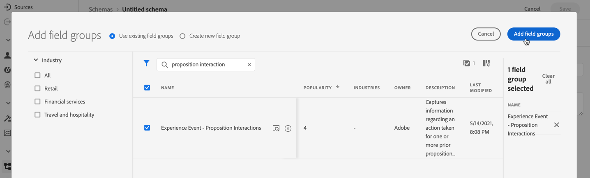

# Creare un set di dati per raccogliere gli eventi {#create-dataset}

Per raccogliere eventi di esperienza, devi innanzitutto creare un set di dati in cui verranno inviati questi eventi.

Inizia creando lo schema che verrà utilizzato nel set di dati:

1. Dal menu **[!UICONTROL Gestione dati]**, selezionare **[!UICONTROL Schema]**.

1. Fai clic su **[!UICONTROL Crea schema]**, in alto a destra, seleziona **[!UICONTROL Evento esperienza]** e fai clic su **Avanti**.

   

   >[!NOTE]
   >
   >Ulteriori informazioni sugli schemi e sui gruppi di campi XDM nella [documentazione di panoramica del sistema XDM](https://experienceleague.adobe.com/docs/experience-platform/xdm/home.html?lang=it){target="_blank"}.

1. Immetti un nome e una descrizione per lo schema e fai clic su **Fine**.
   

1. Dalla sezione **[!UICONTROL Gruppi di campi]** a sinistra, seleziona **[!UICONTROL Aggiungi]**.

   

1. Nel campo **[!UICONTROL Ricerca]** digitare &quot;interazione della proposta&quot;.

1. Seleziona il gruppo di campi **[!UICONTROL Evento esperienza - Interazioni proposte]** e fai clic su **[!UICONTROL Aggiungi gruppi di campi]**.

   

   >[!CAUTION]
   >
   >Allo schema che verrà utilizzato nel set di dati deve essere associato il gruppo di campi **[!UICONTROL Evento esperienza - Interazioni proposta]**. In caso contrario, non potrai utilizzarlo nel modello di intelligenza artificiale.

1. Salva lo schema.

>[!NOTE]
>
>Ulteriori informazioni sulla creazione di schemi in [Nozioni di base sulla composizione dello schema](https://experienceleague.adobe.com/docs/experience-platform/xdm/schema/composition.html?lang=it#understanding-schemas){target="_blank"}.

ora puoi creare un set di dati utilizzando questo schema. Per farlo, segui la procedura indicata di seguito:

1. Dal menu **[!UICONTROL Gestione dati]**, seleziona **[!UICONTROL Set di dati]** e passa alla scheda **[!UICONTROL Sfoglia]**.

1. Fai clic su **[!UICONTROL Crea set di dati]** e seleziona **[!UICONTROL Crea set di dati dallo schema]**.

   

1. Seleziona lo schema appena creato dall&#39;elenco e fai clic su **[!UICONTROL Avanti]**.

1. Fornisci un nome univoco per il set di dati nel campo **[!UICONTROL Name]** e fai clic su **[!UICONTROL Finish]**.

   

>[!NOTE]
>
>È ora possibile selezionare questo set di dati per raccogliere i dati dell&#39;evento durante la [creazione di un modello di IA](../ranking/create-ranking-strategies.md).
