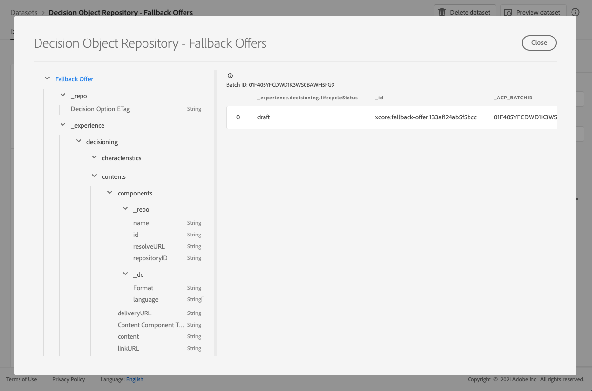

# Il fallback offre il set di dati {#fallback-dataset}

Ogni volta che un’offerta viene modificata, viene aggiornato il set di dati generato automaticamente per le offerte di fallback.

Il batch di successo più recente nel set di dati viene visualizzato a destra. La visualizzazione gerarchica dello schema per il set di dati viene visualizzata nel riquadro a sinistra.

>[!NOTE]
>
>Scopri come accedere ai set di dati esportati per ciascun oggetto della Libreria offerte in [questa sezione](../export-catalog/access-dataset.md).

Elenco di tutti i campi che possono essere utilizzati nel set di dati **[!UICONTROL Decision Object Repository - Fallback Offers]** .

## Identificatore

Identificatore univoco del record.

Tipo: string

## _esperienza

### decisione

#### caratteristiche

**Caratteristiche** dell&#39;opzione di decisione. Proprietà o attributi aggiuntivi appartenenti a questa particolare opzione di decisione. istanze diverse possono avere caratteristiche diverse (chiavi nella mappa). Le caratteristiche sono coppie di valori nome utilizzate per distinguere un’opzione di decisione da altre. Le caratteristiche vengono utilizzate come valori nel contenuto che rappresenta questa opzione decisionale e come funzioni per analizzare e ottimizzare le prestazioni di un’opzione. Quando ogni istanza ha lo stesso attributo o proprietà, tale aspetto deve essere modellato come uno schema di estensione che deriva dai dettagli dell’opzione di decisione.

Tipo: oggetto

<!--Field under Characteristics without title = additionalProperties? Desc = Value of the property. Type: string-->

#### sommario

**Dettagli contenuto**. Elementi di contenuto per eseguire il rendering dell’elemento decisione in contesti diversi. Una singola opzione di decisione può avere più varianti di contenuto. Il contenuto è un’informazione rivolta a un pubblico da utilizzare in un’esperienza (digitale). I contenuti vengono consegnati attraverso i canali in un particolare posizionamento.

Tipo: array

* **componenti**

   I componenti del contenuto che rappresentano l’opzione di decisione, incluse tutte le varianti di lingua. Componenti specifici sono reperibili da &#39;dx:format&#39;, &#39;dc:subject&#39; e &#39;dc:language&#39; o da una combinazione di essi. Questi metadati vengono utilizzati per individuare o rappresentare il contenuto associato a un’offerta e integrarlo in base al contratto di posizionamento.

   Tipo: array

   * **Tipo componente contenuto**

      Set enumerato di URI in cui ogni valore corrisponde a un tipo assegnato al componente contenuto. Alcuni consumatori delle rappresentazioni di contenuto si aspettano che il valore @type sia un riferimento allo schema che descrive proprietà aggiuntive del componente di contenuto.

      Tipo: string

   * **_dc**

      * **Formato**

         La manifestazione fisica o digitale della risorsa. In genere, Format deve includere il tipo di supporto della risorsa. Il formato può essere utilizzato per determinare il software, l&#39;hardware o altre apparecchiature necessarie per visualizzare o utilizzare la risorsa. Si consiglia di selezionare un valore da un vocabolario controllato (ad esempio, l&#39;elenco di [Tipi di file multimediali Internet](http://www.iana.org/ assegnazioni/tipi di file multimediali/) che definiscono i formati dei file multimediali per computer).

         Tipo: string

      * **Lingua**

         Lingua o lingue della risorsa.\nLe lingue sono specificate nel codice della lingua come definito in [IETF RFC 3066](https://www.ietf.org/rfc/rfc3066.txt), che fa parte di BCP 47, utilizzato altrove in XDM.

         Tipo: string
   * **_repo**

      * **id**

         Identificatore univoco facoltativo per fare riferimento alla risorsa in un archivio di contenuti. Quando si utilizzano le API di Platform per recuperare la rappresentazione, il client può aspettarsi un&#39;ulteriore proprietà \&quot;repo:resolveUrl\&quot; per recuperare la risorsa.

         Tipo: string

      * **nome**

         Alcuni suggerimenti su dove individuare l&#39;archivio in cui è memorizzata la risorsa esterna tramite il \&quot;repo:id\&quot;.

         Tipo: string

      * **repositoryID**

         Identificatore univoco facoltativo per fare riferimento alla risorsa in un archivio di contenuti. Quando si utilizzano le API di Platform per recuperare la rappresentazione, il client può aspettarsi un&#39;ulteriore proprietà \&quot;repo:resolveUrl\&quot; per recuperare la risorsa.

         Tipo: string

      * **resolveURL**

         Un localizzatore di risorse univoco facoltativo per leggere la risorsa in un archivio di contenuti. In questo modo sarà più facile ottenere la risorsa senza che il cliente comprenda dove la risorsa viene gestita e quali API chiamare. Questo è simile a un collegamento HAL, ma il semantico è più semplice e più risoluto.

         Tipo: string
   * **content**

      Un campo facoltativo per contenere direttamente il contenuto. Invece di fare riferimento al contenuto in un archivio di risorse, il componente può contenere direttamente contenuti semplici. Questo campo non viene utilizzato per le risorse di contenuto composito, complesso e binario.

      Tipo: string

   * **deliveryURL**

      Un localizzatore di risorse univoco facoltativo per ottenere la risorsa da una rete di distribuzione dei contenuti o da un endpoint di servizio. Questo URL viene utilizzato per accedere pubblicamente alla risorsa da un agente utente.

      Tipo: string

   * **linkURL**

      Un localizzatore di risorse univoco facoltativo per le interazioni dell’utente. Questo URL viene utilizzato per fare riferimento all’utente finale in un agente utente e può essere monitorato.

      Tipo: string

* **Posizionamento**

   Posizionamento a cui conformarsi. Il valore è l’URI (@id) del posizionamento dell’offerta a cui si fa riferimento. Vedi schema https://ns.adobe.com/experience/decisioning/placement.

   Tipo: string

#### Stato del ciclo di vita

Lo stato del ciclo di vita consente di eseguire i flussi di lavoro con un oggetto. Lo stato può influire sul punto in cui un oggetto è visibile o considerato rilevante. Le modifiche allo stato sono guidate dai client o dai servizi che utilizzano gli oggetti.

Tipo: string

Valori possibili: &quot;bozza&quot;, &quot;approvato&quot;, &quot;in diretta&quot;, &quot;completato&quot;, &quot;archiviato&quot;

Valore predefinito: &quot;bozza&quot;

#### Nome opzione decisione

Nome dell&#39;opzione visualizzato in diverse interfacce utente.

Tipo: string

#### Tag

Set di tag associati a questa entità. I tag vengono utilizzati nelle espressioni filtro per vincolare l’inventario complessivo a un sottoinsieme (categoria).

Tipo: array

## _repo

### Opzione di decisione ETag

Revisione in cui si trovava l&#39;oggetto opzione di decisione al momento dell&#39;esecuzione dello snapshot.

Tipo: string
