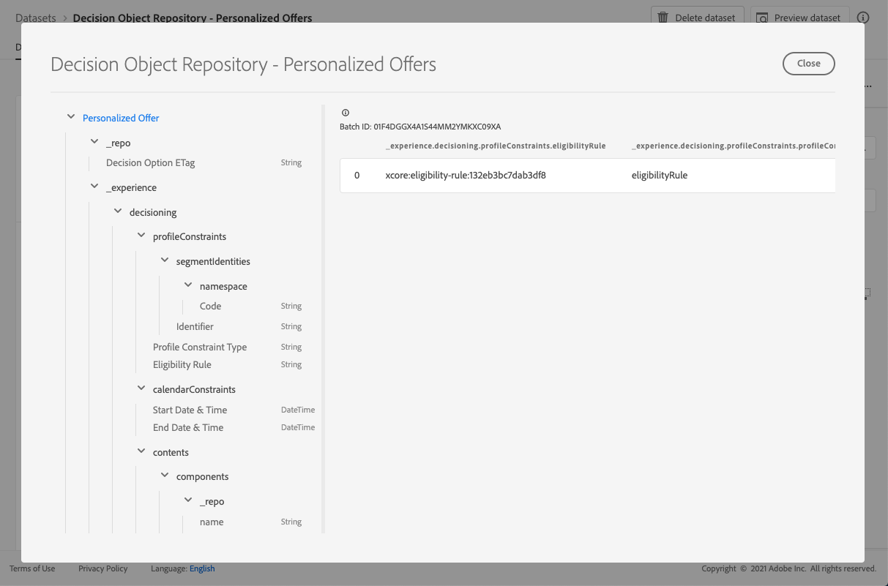

# Set di dati di offerte personalizzate {#offers-dataset}

Ogni volta che viene modificata un’offerta, viene aggiornato il set di dati generato automaticamente per le offerte di contenuti personalizzate.

Il batch con esito positivo più recente nel set di dati viene visualizzato a destra. La visualizzazione gerarchica dello schema per il set di dati viene visualizzata nel riquadro a sinistra.

>[!NOTE]
>
>Le offerte personalizzate eliminate sono contrassegnate come archiviate nel set di dati.

Elenco di tutti i campi che possono essere utilizzati nel set di dati **[!UICONTROL Archivio oggetti decisionali - Offerte personalizzate]**.

<!--Personalized offers form the set of choices for a decision. The objective for decisioning is to take a large inventory of items and apply numerous constraint rules to that inventory to narrow it down and then to rank the qualifying options according to a criteria. The resulting propositions assemble and personalize the experience for specific individuals.-->

+++ Identificatore

**Campo:** _id
**Titolo:** Identificatore
**Descrizione:** Identificatore univoco del record.
**Tipo:** stringa

+++

+++ _esperienza {#experience}

**Campo:** _esperienza
**Tipo:** oggetto

+++

+++ _experience > decisioning

**Campo:** decisioning
**Tipo:** oggetto

+++

+++ _experience > decisioning > calendarConstraints 

**Campo:** calendarConstraints
**Titolo:** Dettagli Vincolo Calendario
**Descrizione:** I vincoli di calendario determinano se un&#39;opzione di decisione è valida dato un intervallo di date. Al di fuori di tale intervallo di date, l’opzione non può essere proposta.
**Tipo:** oggetto

* **Data e ora di fine**

  **Campo:** endDate
  **Titolo:** Data e ora di fine
  **Descrizione:** data di fine validità delle opzioni di decisione. Le opzioni che hanno superato la data di fine non possono più essere proposte nel processo decisionale.
  **Tipo:** stringa

* **Data e ora inizio**

  **Campo:** startDate
  **Titolo:** Data e ora di inizio
  **Descrizione:** la data di inizio della validità delle opzioni di decisione. Le opzioni che non hanno raggiunto la data di inizio non possono ancora essere proposte nel processo decisionale.
  **Tipo:** stringa

+++

+++ _experience > decisioning > caratteristiche

**Campo:** caratteristiche
**Titolo:** Caratteristiche Dell&#39;Opzione Di Decisione
**Descrizione:** proprietà o attributi aggiuntivi appartenenti a questa particolare opzione di decisione. Diverse istanze possono avere caratteristiche diverse (chiavi nella mappa). Le caratteristiche sono coppie di nome e valore utilizzate per distinguere un’opzione di decisione dalle altre. Le caratteristiche vengono utilizzate come valori nel contenuto che rappresenta questa opzione di decisione e come funzioni per analizzare e ottimizzare le prestazioni di un’opzione. Quando ogni istanza ha lo stesso attributo o proprietà, tale aspetto deve essere modellato come schema di estensione che deriva dai dettagli dell’opzione di decisione.
**Tipo:** oggetto

+++

+++ _experience > decisioning > content

**Campo:** contenuto
**Titolo:** Dettagli contenuto
**Descrizione:** elementi di contenuto per eseguire il rendering dell&#39;elemento di decisione in contesti diversi. Una singola opzione di decisione può avere più varianti di contenuto. Il contenuto è un’informazione destinata a un pubblico e destinata a essere utilizzata in un’esperienza (digitale). I contenuti vengono distribuiti attraverso i canali in un particolare posizionamento.
**Tipo:** array

+++

+++_experience > decisioning > contenuti > componenti

**Campo:** componenti
**Descrizione:** i componenti del contenuto che rappresentano l&#39;opzione di decisione, incluse tutte le relative varianti di lingua. Componenti specifici trovati da &#39;dx:format&#39;, &#39;dc:subject&#39; e &#39;dc:language&#39; o da una loro combinazione. Questi metadati vengono utilizzati per individuare o rappresentare il contenuto associato a un’offerta e integrarlo in base al contratto di posizionamento.
**Tipo:** array
**Richiesto:** &quot;_type&quot;, &quot;_dc&quot; <!--TBC?-->

* **_experience > decisioning > contenuti > componenti > Tipo di componente contenuto**

  **Campo:** _type
  **Titolo:** Tipo di componente contenuto
  **Descrizione:** un insieme enumerato di URI in cui ogni valore è associato a un tipo assegnato al componente contenuto. Alcuni consumatori delle rappresentazioni di contenuto si aspettano che il valore @type sia un riferimento allo schema che descrive proprietà aggiuntive del componente contenuto.
  **Tipo:** stringa

* **_experience > decisioning > contenuti > componenti > _dc**

  **Campo:** _dc
  **Tipo:** oggetto
  **Obbligatorio:** &quot;formato&quot;

   * **Formato**

     **Campo:** formato
     **Titolo:** Formato
     **Descrizione:** la manifestazione fisica o digitale della risorsa. In genere, il formato deve includere il tipo di file multimediale della risorsa. Il formato può essere utilizzato per determinare il software, l&#39;hardware o altre apparecchiature necessarie per visualizzare o utilizzare la risorsa. Si consiglia di selezionare un valore da un vocabolario controllato (ad esempio, l&#39;elenco di [tipi di supporti Internet](https://www.iana.org/assignments/media-types/) che definiscono i formati dei supporti per computer).
     **Tipo:** stringa
     **Esempio:** &quot;application/vnd.adobe.photoshop&quot;

   * **Lingua**
     **Campo:** lingua
     **Titolo:** Lingua
     **Descrizione:** lingua o lingue della risorsa. \nLe lingue sono specificate nel codice della lingua definito in [IETF RFC 3066](https://www.ietf.org/rfc/rfc3066.txt), che fa parte di BCP 47, utilizzato altrove in XDM.
     **Tipo:** array
     **Esempi:** &quot;\n&quot;, &quot;pt-BR&quot;, &quot;es-ES&quot;

* **_experience > decisioning > contenuti > componenti > _repo**

  **Campo:** _repo
  **Tipo:** oggetto

   * **id**

     **Campo:** id
     **Descrizione:** un identificatore univoco facoltativo per fare riferimento alla risorsa in un archivio dei contenuti. Quando si utilizzano le API di Platform per recuperare la rappresentazione, il client può aspettarsi una proprietà aggiuntiva \&quot;repo:resolveUrl\&quot; per recuperare la risorsa.
     **Tipo:** stringa
     **Esempio:** &quot;urn:aaid:sc:US:6dc33479-13ca-4b19-b25d-c805eff8a69e&quot;

   * **nome**

     **Campo:** nome
     **Descrizione:** alcuni suggerimenti su dove individuare l&#39;archivio in cui è memorizzata la risorsa esterna dal \&quot;repo:id\&quot;.
     **Tipo:** stringa

   * **repositoryID**

     **Campo:** repositoryID
     **Descrizione:** un identificatore univoco facoltativo per fare riferimento alla risorsa in un archivio dei contenuti. Quando si utilizzano le API di Platform per recuperare la rappresentazione, il client può aspettarsi una proprietà aggiuntiva \&quot;repo:resolveUrl\&quot; per recuperare la risorsa.
     **Tipo:** stringa
     **Esempio:** &quot;C87932A55B06F7070A49412D@AdobeOrg&quot;

   * **resolveURL**

     **Campo:** resolveURL
     **Descrizione:** un localizzatore di risorse univoco facoltativo per leggere la risorsa in un archivio dei contenuti. In questo modo sarà più facile ottenere la risorsa senza che il cliente capisca dove viene gestita e quali API chiamare. Questo è simile a un collegamento HAL, ma la semantica è più semplice e più mirata.
     **Tipo:** stringa
     **Esempio:** &quot;https://plaftform.adobe.io/resolveByPath?path=&quot;/mycorp/content/projectx/fragment/prod/herobanners/banner14.html3&quot;&quot;

* **_experience > decisioning > contenuti > componenti > contenuto**

  **Campo:** contenuto
  **Descrizione:** campo facoltativo che contiene direttamente il contenuto. Invece di fare riferimento al contenuto in un archivio di risorse, il componente può contenere direttamente il contenuto semplice. Questo campo non viene utilizzato per risorse di contenuto composito, complesso e binario.
  **Tipo:** stringa

* **_experience > decisioning > contenuti > componenti > deliveryURL**

  **Campo:** deliveryURL
  **Descrizione:** un localizzatore di risorse univoco facoltativo per ottenere la risorsa da una rete di distribuzione di contenuti o da un endpoint di servizio. Questo URL viene utilizzato per accedere alla risorsa pubblicamente da un agente utente.
  **Tipo:** stringa
  **Esempio:** &quot;https://cdn.adobe.io/content/projectx/fragment/prod/static/1232324wd32.jpeg&quot;

* **_experience > decisioning > contenuti > componenti > linkURL**

  **Campo:** linkURL
  **Descrizione:** un localizzatore di risorse univoco facoltativo per le interazioni utente. Questo URL viene utilizzato per fare riferimento all’utente finale in un agente utente e può essere tracciato.
  **Tipo:** stringa
  **Esempio:** &quot;https://cdn.adobe.io/tracker?code=23432&amp;redirect=/content/projectx/fragment/prod/static/1232324wd32.jpeg&quot;

+++_experience > decisioning > content > Placement (Esperienza > decisioni > contenuti > Posizionamento)

**Campo:** posizionamento
**Titolo:** posizionamento
**Descrizione:** posizionamento da rispettare. Il valore è l’URI (@id) del posizionamento dell’offerta a cui si fa riferimento. Consulta schema https://ns.adobe.com/experience/decisioning/placement.
**Tipo:** stringa

+++

+++ _experience > decisioning > Stato del ciclo di vita

**Campo:** lifecycleStatus
**Titolo:** Stato Del Ciclo Di Vita
**Descrizione:** lo stato del ciclo di vita consente di eseguire flussi di lavoro con un oggetto. Lo stato può influenzare il punto in cui un oggetto è visibile o considerato rilevante. Le modifiche di stato sono guidate dai client o dai servizi che utilizzano gli oggetti.
**Tipo:** stringa
**Valori possibili:** &quot;Bozza&quot; (predefinito), &quot;Approvato&quot;, &quot;Live&quot;, &quot;Completato&quot;, &quot;Archiviato&quot;

+++

+++ _experience > decisioning > Nome opzione decisione

**Campo:** nome
**Titolo:** Nome Opzione Di Decisione
**Descrizione:** Nome opzione visualizzato in varie interfacce utente.
**Tipo:** stringa

+++

+++ _experience > decisioning > profileConstraints

**Campo:** profileConstraints
**Titolo:** Dettagli Vincolo Profilo
**Descrizione:** I vincoli di profilo decidono se un&#39;opzione è idonea per questa identità di profilo, al momento, in questo contesto. Se non è necessario che il vincolo di profilo consideri i valori di ciascuna opzione, ovvero non è una variante delle opzioni selezionate, il vincolo di profilo che restituisce &quot;false&quot; annulla l’intera selezione dell’opzione. D&#39;altra parte, una regola di vincolo di profilo che accetta un&#39;opzione come parametro viene valutata per ogni opzione qualificata della selezione dell&#39;opzione.
**Tipo:** oggetto

+++

+++_experience > decisioning > profileConstraints > Descrizione

**Campo:** descrizione
**Titolo:** Descrizione
**Descrizione:** descrizione vincolo profilo. Viene utilizzato per comunicare le intenzioni leggibili dell’uomo su come o perché questo vincolo di profilo è stato costruito e/o quale opzione sarà inclusa o esclusa da esso.
**Tipo:** stringa

+++

+++_experience > decisioning > profileConstraints > Regola di idoneità

**Campo:** idoneitàRegola
**Titolo:** Regola di idoneità
**Descrizione:** riferimento a una regola di decisione che restituisce true o false per un profilo specificato e/o altri oggetti XDM contestuali specificati. La regola viene utilizzata per decidere se l’opzione è idonea per un determinato profilo. Il valore è l’URI (@id) della regola di decisione a cui si fa riferimento. Consulta schema https://ns.adobe.com/experience/decisioning/rule.
**Tipo:** stringa

+++

+++_experience > decisioning > profileConstraints > Tipo di vincolo profilo

**Campo:** profileConstraintType
**Titolo:** Tipo Di Vincolo Del Profilo
**Descrizione:** Determina se sono attualmente impostati vincoli e il modo in cui questi vengono espressi. Potrebbe essere tramite una regola o tramite una o più appartenenze al pubblico.
**Tipo:** stringa
**Valori possibili:**

* &quot;none&quot; (impostazione predefinita)
* &quot;EliabilityRule&quot;: &quot;Il vincolo di profilo è espresso come una singola regola che deve restituire true prima che l’azione vincolata sia consentita.&quot;
* &quot;anySegments&quot;: &quot;Il vincolo di profilo è espresso come uno o più tipi di pubblico e il profilo deve essere membro di almeno uno di essi prima che l’azione vincolata sia consentita.&quot;
* &quot;allSegments&quot;: &quot;Il vincolo di profilo è espresso come uno o più tipi di pubblico e il profilo deve essere un membro di tutti loro prima che l’azione vincolata sia consentita.&quot;
* &quot;regole&quot;: &quot;Il vincolo di profilo è espresso come una serie di regole diverse, ad esempio idoneità, applicabilità, idoneità, che tutte devono restituire true prima che l’azione vincolata sia consentita.&quot;

+++

+++_experience > decisioning > profileConstraints > Identificatori segmento

**Campo:** segmentIdentities
**Titolo:** Identificatori Segmento
**Descrizione:** identificatori dei tipi di pubblico
**Tipo:** array

* **Identificatore**

  **Campo:** _id
  **Titolo:** Identificatore
  **Descrizione:** identità dei tipi di pubblico nel relativo spazio dei nomi.
  **Tipo:** stringa

* **Spazio dei nomi**

  **Campo:** spazio dei nomi
  **Titolo:** Spazio Dei Nomi
  **Descrizione:** lo spazio dei nomi associato all&#39;attributo `xid`.
  **Tipo:** oggetto
  **Obbligatorio:** &quot;code&quot;

   * **Codice**

     **Campo:** codice
     **Titolo:** Codice
     **Descrizione:** Il codice è un identificatore leggibile dello spazio dei nomi e può essere utilizzato per richiedere l&#39;ID tecnico dello spazio dei nomi, utilizzato per l&#39;elaborazione del grafico delle identità.
     **Tipo:** stringa

* **Identificatore esperienza**

  **Campo:** xid
  **Titolo:** Identificatore esperienza
  **Descrizione:** Se presente, questo valore rappresenta un identificatore per più spazi dei nomi che è univoco tra tutti gli identificatori relativi allo spazio dei nomi in tutti gli spazi dei nomi.
  **Tipo:** stringa

+++

+++ _experience > decisioning > ranking

**Campo:** classificazione
**Titolo:** Dettagli Classificazione
**Descrizione:** Grado (priorità). Definisce l’azione considerata migliore in base al contesto del criterio di decisione. Tra tutte le opzioni selezionate che soddisfano il vincolo di idoneità, l’ordine di classificazione deciderà le opzioni principali (o le N principali) da proporre.
**Tipo:** oggetto

+++

+++_experience > decisioning > ranking > Valutazione ordine

**Campo:** ordine
**Titolo:** Valutazione dell&#39;ordine
**Descrizione:** valutazione di un ordine relativo di una o più opzioni di decisione. Le opzioni con valori ordinali più alti vengono selezionate rispetto alle opzioni con valori ordinali più bassi. I valori determinati con questo metodo possono essere ordinati, ma non è possibile misurare le distanze tra di essi né calcolare somme o prodotti. La mediana e la modalità sono le uniche misure della tendenza centrale che possono essere utilizzate per i dati ordinali.
**Tipo:** oggetto

* **Funzione punteggio**

  **Campo:** funzione
  **Titolo:** Funzione punteggio
  **Descrizione:** Riferimento a una funzione che calcola un punteggio numerico per questa opzione di decisione. Le opzioni di decisione verranno quindi ordinate (classificate) in base a tale punteggio. Il valore di questa proprietà è l&#39;URI (@id) della funzione da richiamare contemporaneamente con l&#39;opzione on. Consulta schema https://ns.adobe.com/experience/decisioning/function.
  **Tipo:** stringa

* **Tipo di valutazione ordine**

  **Campo:** orderEvaluationType
  **Titolo:** Tipo di valutazione ordine
  **Descrizione:** Specifica il meccanismo di valutazione dell&#39;ordine utilizzato, la priorità statica delle opzioni di decisione, una funzione di punteggio che calcola un valore numerico per ogni opzione o un modello di IA che riceve un elenco per ordinarlo.
  **Tipo:** stringa
  **Valori possibili:** &quot;static&quot;, &quot;scoringFunction&quot;, &quot;rankingStrategy&quot;

* **Strategia di classificazione**

  **Campo:** strategia di classificazione
  **Titolo:** Strategia di classificazione
  **Descrizione:** un riferimento a una strategia che classifica un elenco di opzioni di decisione. Le opzioni di decisione verranno restituite in un elenco ordinato. Il valore di questa proprietà è l&#39;URI (@id) della funzione da richiamare contemporaneamente con l&#39;opzione on. Consulta schema https://ns.adobe.com/experience/decisioning/rankingStrategy.
  **Tipo:** stringa

+++

+++_experience > decisioning > ranking > Priorità

**Campo:** priorità
**Titolo:** Priorità
**Descrizione:** la priorità di una singola opzione di decisione rispetto a tutte le altre opzioni. Le opzioni per le quali non viene specificata alcuna funzione di ordinamento hanno priorità utilizzando questa proprietà. Le opzioni con valori di priorità più alti vengono selezionate prima di qualsiasi opzione con priorità inferiore. Se due o più opzioni qualificate condividono il valore di priorità più elevato, una viene scelta in modo casuale e utilizzata per la proposta di decisione.
**Tipo:** numero intero
**Valore minimo:** 0
**Valore predefinito:** 0

+++

+++ _experience > decisioning > tag

**Campo:** tag
**Titolo:** Tag
**Descrizione:** il set di qualificatori di raccolta (noti in precedenza come &quot;tag&quot;) associati a questa entità. I qualificatori di raccolta vengono utilizzati nelle espressioni di filtro per vincolare l’inventario complessivo a un sottoinsieme (categoria).
**Tipo:** array

+++

<!--Field without name under tags: Description: An identifier of a collection qualifier object. The value is the @id of the collection qualifier that is referenced. See tag schema: https://ns.adobe.com/experience/decisioning/tag. Type: string-->

+++_repo

**Campo:** _repo
**Tipo:** oggetto

+++ 

+++ _repo > Opzione di decisione ETag

**Campo:** etag
**Titolo:** Opzione di decisione ETag
**Descrizione:** revisione in cui si trovava l&#39;oggetto opzione di decisione quando è stata acquisita l&#39;istantanea.
**Tipo:** stringa

+++
