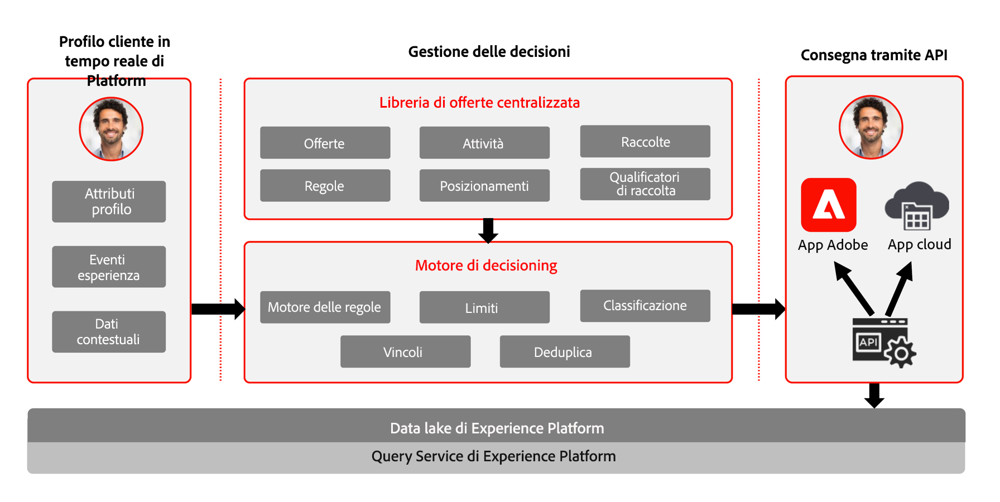
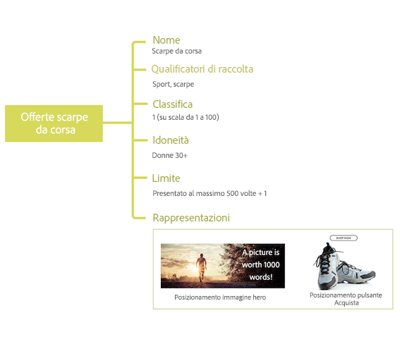

# Introduzione alla gestione delle decisioni {#about-decision-management}

>[!TIP]
>
>La funzione Decisioni, la nuova funzionalità decisionale di [!DNL Adobe Journey Optimizer], è ora disponibile tramite i canali e-mail e di esperienza basati su codice. [Ulteriori informazioni](../../experience-decisioning/gs-experience-decisioning.md)

Utilizza [!DNL Journey Optimizer] per offrire ai clienti l’offerta e l’esperienza migliore al momento giusto, in tutti i punti di contatto. Una volta progettate, puoi indirizzarle al tuo pubblico con offerte personalizzate.

La funzione Gestione delle decisioni semplifica la personalizzazione con una libreria centrale di offerte di marketing e un motore decisionale che applica regole e vincoli ai profili avanzati e in tempo reale creati da Adobe Experience Platform, per aiutarti a inviare ai tuoi clienti l’offerta giusta al momento giusto.

La capacità di Gestione delle decisioni è costituita da due componenti principali:

* La **Libreria di offerte centralizzata** è l’interfaccia in cui puoi creare e gestire i diversi elementi che compongono le offerte e definirne regole e vincoli.
* Il **motore delle decisioni per le offerte** sfrutta i dati di Adobe Experience Platform e i profili cliente in tempo reale, insieme alla Libreria di offerte, per selezionare i clienti, i canali e il momento più appropriati per l’invio delle offerte.

I vantaggi includono:

* Miglioramento delle prestazioni delle campagne grazie alla distribuzione di offerte personalizzate su più canali.
* Flussi di lavoro migliorati: anziché creare più consegne o campagne, i team di marketing possono ottimizzare i flussi di lavoro creando un’unica consegna e variare le offerte in parti differenti del modello.
* Potrai controllare il numero di volte in cui un’offerta viene visualizzata nelle varie campagne e dai diversi clienti.

➡️ [Ulteriori informazioni sulla gestione delle decisioni sono disponibili in questi video](#video)

>[!NOTE]
>
>Tutte le funzioni di gestione delle decisioni descritte in questa sezione si applicano anche agli utenti di [Adobe Experience Platform](https://experienceleague.adobe.com/docs/experience-platform/landing/home.html?lang=it){target="_blank"} che utilizzano l’applicazione **Offer Decisioning**.

## Informazioni su offerte e decisioni {#about-offers-and-decisions}

Un’**offerta** è costituita da contenuti, regole di idoneità e vincoli che definiscono le condizioni in cui viene presentata ai clienti.

Viene creata utilizzando la **Libreria di offerte**, che fornisce un catalogo centrale delle offerte in cui è possibile associare regole di idoneità e vincoli a più parti di contenuto per creare e pubblicare le offerte (consulta [Interfaccia utente della Libreria di offerte](../get-started/user-interface.md)).

Una volta arricchita la Libreria di offerte con le offerte, puoi integrarle in **decisioni**.

Le decisioni sono contenitori per le offerte che sfrutteranno il motore delle decisioni per le offerte per scegliere l’offerta migliore da consegnare in base al target.

## Casi d’uso comuni {#common-use-cases}

Le funzionalità di Gestione delle decisioni e la sua integrazione con Adobe Experience Platform consentono di coprire numerosi casi d’uso per aumentare il coinvolgimento e la conversione dei clienti.

* Puoi visualizzare sul tuo sito web le offerte che corrispondono al punto di interesse del visitatore, in base ai dati provenienti da Adobe Experience Platform.

  

* Se i clienti si trovano vicino a uno dei tuoi negozi, puoi inviare loro notifiche push sulle offerte disponibili in base ai loro attributi (livello di fedeltà, genere, acquisti precedenti...).

  

* La funzione di gestione delle decisioni consente inoltre di migliorare l’esperienza dei clienti che contattano il team di assistenza. Con le API di Gestione delle decisioni puoi visualizzare nel portale degli agenti del call center informazioni sulle offerte di cui il cliente ha già usufruito e sulle migliori offerte successive.

  

## Concedere l’accesso alla gestione delle decisioni {#granting-acess-to-decision-management}

Le autorizzazioni per accedere e utilizzare le funzionalità di decisioning vengono gestite mediante [Adobe Admin Console](https://helpx.adobe.com/it/enterprise/managing/user-guide.html){target="_blank"}.

Per concedere l’accesso alla funzionalità di gestione delle decisioni, devi creare un **[!UICONTROL Profilo di prodotto]** e assegnare le autorizzazioni corrispondenti ai tuoi utenti. Ulteriori informazioni sulla gestione di utenti e autorizzazioni [!DNL Journey Optimizer] sono disponibili in [questa sezione](../../administration/permissions.md).

Le autorizzazioni specificheper la gestione delle decisioni sono elencate in [questa sezione](../../administration/high-low-permissions.md#decisions-permissions).

## Glossario {#glossary}

Di seguito è riportato l’elenco dei concetti principali con cui lavorare quando si utilizza Gestione decisioni.

* **Quota limite** o **Quota limite frequenza**: il limite viene utilizzato come vincolo per definire quante volte viene presentata un’offerta.
Ci sono due tipi di limite: uno indica quante volte un’offerta può essere proposta al pubblico target combinato, noto anche come “Limiti totali”; l’altro indica quante volte un’offerta può essere proposta allo stesso utente finale, noto anche come “Limite del profilo”.

* **Raccolte**: le raccolte sono sottoinsiemi di offerte basate su condizioni predefinite che sono state definite da un addetto marketing, ad esempio la categoria dell’offerta.

* **Decisione**: una decisione contiene la logica su cui si basa la selezione di un’offerta.

* **Regola di decisione**: le regole di decisione sono vincoli aggiunti a un’offerta personalizzata e applicati a un profilo per determinare l’idoneità.

* **Offerta idonea**: un’offerta idonea soddisfa i vincoli definiti a monte e può essere offerta in modo coerente a un profilo.

* **Gestione delle decisioni**: consente di creare e fornire esperienze di offerta personalizzate per l’utente finale sui vari canali e applicazioni utilizzando la logica di business e le regole decisionali.

* **Offerte di fallback**: un’offerta di fallback è l’offerta predefinita che viene visualizzata se un utente finale non risulta idoneo per nessuna delle offerte personalizzate incluse nella raccolta.

* **Offerta**: un’offerta è un messaggio di marketing a cui possono essere associate delle regole volte a determinare gli utenti idonei che potranno visualizzare l’offerta.

* **Libreria di offerte**: la libreria di offerte è una libreria centrale utilizzata per gestire offerte personalizzate e di fallback, regole di decisione e decisioni.

* **Offerte personalizzate**: un’offerta personalizzata è un messaggio personalizzabile basato su vincoli e regole di idoneità.

* **Posizionamenti**: per posizionamento si intende la posizione e/o il contesto in cui un’offerta viene visualizzata da un utente finale.

* **Priorità**: la priorità viene utilizzata per classificare le offerte che soddisfano tutti i vincoli, come idoneità, calendario e limiti.

* **Rappresentazioni**: per rappresentazione si intendono le informazioni utilizzate da un canale, ad esempio posizione o lingua, per visualizzare un’offerta.

## Video sulle procedure{#video}

### Che cos&#39;è la gestione delle decisioni? {#what-is-offer-decisioning}

Il video seguente fornisce un’introduzione alle funzionalità chiave di gestione delle decisioni, alla sua architettura e ai casi d’uso:

>[!VIDEO](https://video.tv.adobe.com/v/340415?captions=ita&quality=12&learn=on)

### Definire e gestire le offerte {#use-offer-decisioning}

Il video seguente mostra come utilizzare la funzione di gestione delle decisioni per definire e gestire le offerte e sfruttare i dati sui clienti in tempo reale.

>[!VIDEO](https://video.tv.adobe.com/v/340352?captions=ita&quality=12&learn=on)

