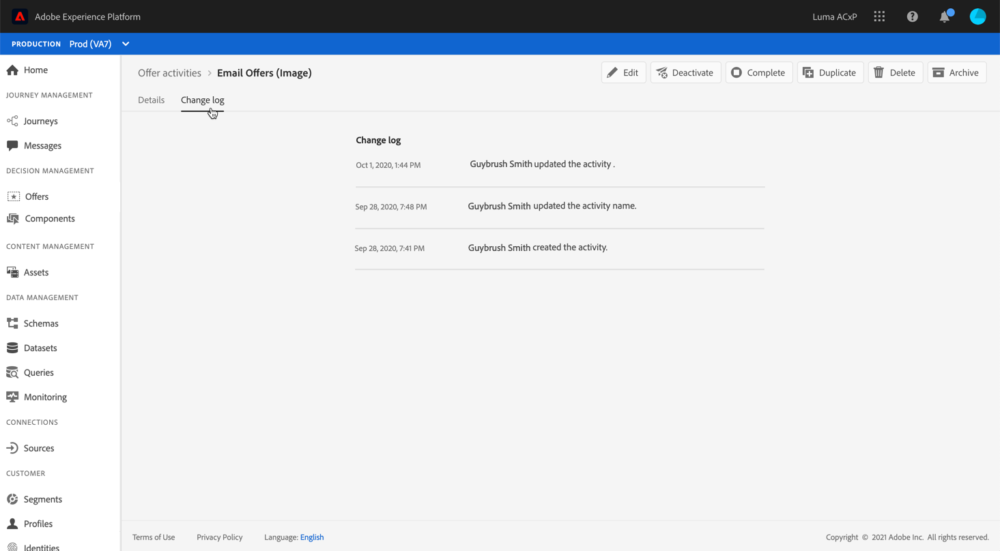

# Interfaccia utente {#user-interface}

La Libreria di offerte consente di creare e gestire posizionamenti e offerte in un unico punto, nonché di accedere a tutte le decisioni create (precedentemente note come “attività di offerta”).

Utilizza il menu **[!UICONTROL Offers]** per gestire le offerte personalizzate e di fallback, organizzarle in raccolte e consegnarle creando le seguenti decisioni:

* **[!UICONTROL Offers]**: accedi alle tue offerte personalizzate e di fallback o creane di nuove. Consulta [Creazione di un’offerta](../offer-library/creating-personalized-offers.md) e [Creazione di un’offerta di fallback](../offer-library/creating-fallback-offers.md).

* **[!UICONTROL Collections]**: crea e gestisci raccolte di offerte statiche e dinamiche. Consulta [Informazioni sulle raccolte di offerte](../offer-library/creating-collections.md).

* **[!UICONTROL Decisions]**: crea e gestisci le decisioni per distribuire le offerte. Consulta [Creare decisioni](../offer-activities/create-offer-activities.md).

Utilizza il menu **[!UICONTROL Components]** per gestire i componenti necessari per creare le offerte:

* **[!UICONTROL Placements]**: crea e gestisci i posizionamenti in cui verranno visualizzate le offerte. Consulta [Creazione di posizionamenti](../offer-library/creating-placements.md).

* **[!UICONTROL Tags]**: crea e gestisci i tag per organizzare e filtrare le offerte. Consulta [Creazione di tag](../offer-library/creating-tags.md).

* **[!UICONTROL Rules]**: gestisci le condizioni in cui vengono presentate le offerte. Consulta [Creazione di una regola di decisione](../offer-library/creating-decision-rules.md).

* **[!UICONTROL Rankings]**: crea e gestisci formule di classificazione per determinare quale offerta deve essere presentata per prima per un determinato posizionamento. Consulta [Creare formule di classificazione](../offer-library/create-ranking-formulas.md).

## Ricerca e filtro delle informazioni

Usa la **barra di ricerca** per trovare un elemento specifico.

Per accedere a **Filtri** puoi anche fare clic sull’icona del filtro posta in alto a sinistra nell’elenco. Il menu dei filtri ti consente di filtrare gli elementi visualizzati in base a criteri diversi. Ad esempio, puoi filtrare i posizionamenti creati per il canale di comunicazione e-mail e per il contenuto di tipo immagine.

## Personalizzare le informazioni visualizzate

Gli elenchi dei menu di Gestione delle decisioni possono essere personalizzati utilizzando il pulsante di configurazione in alto a destra degli elenchi.

Questo ti consente di scegliere le informazioni da visualizzare in base alle tue esigenze.

La personalizzazione delle colonne viene salvata per ogni utente.

## Riquadro informazioni

Nei diversi elenchi, seleziona un elemento per visualizzare un riquadro informazioni che ti consenta di recuperare informazioni ed eseguire azioni di base su quell’elemento.

Dagli elenchi delle offerte e delle decisioni ora è possibile eseguire azioni in blocco su più elementi. A questo scopo, seleziona le offerte o le decisioni desiderate, quindi seleziona l’azione da eseguire dal riquadro informazioni.

Puoi anche duplicare un’offerta o decisioni esistenti per creare una copia con lo stato **[!UICONTROL Draft]**. Questa operazione può essere eseguita dal riquadro delle informazioni oppure dalla vista dettagliata di un’offerta o di una decisione.

## Registri di modifica di offerte e decisioni {#changes-logs}

La Libreria offerte ti consente di visualizzare tutte le modifiche apportate a un’offerta o a una decisione. A questo scopo, apri l’offerta o la decisione facendo clic sul nome nell’elenco, quindi seleziona la scheda **[!UICONTROL Change log]**.

Tutte le modifiche apportate vengono visualizzate in questa schermata, così come il nome dell’utente che le ha eseguite.

