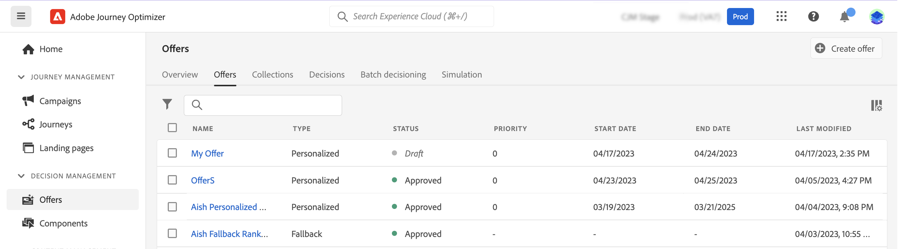

# Interfaccia utente {#user-interface}

La **[!UICONTROL Gestione delle decisioni]** nella barra a sinistra sono disponibili due menu che consentono di accedere alle funzionalità di gestione delle decisioni:

Utilizza la **[!UICONTROL Offerte]** menu per gestire e distribuire le offerte:

* **[!UICONTROL Panoramica]**: Da nuovo a [!DNL decision management]? Segui i passaggi sullo schermo per iniziare a impostare posizionamenti, offerte e raccolte. Quando già conosci [!DNL decision management], ottenere una panoramica delle offerte, delle raccolte e delle decisioni più recenti. [Ulteriori informazioni](#overview)
* **[!UICONTROL Offerte]**: Crea e accedi alle tue offerte personalizzate e di fallback. Scopri come creare [offerte](../offer-library/creating-personalized-offers.md) e [offerte di fallback](../offer-library/creating-fallback-offers.md)
* **[!UICONTROL Raccolte]**: Organizza le offerte in raccolte statiche e dinamiche. [Ulteriori informazioni](../offer-library/creating-collections.md)
* **[!UICONTROL Decisioni]**: Crea e gestisci le decisioni per distribuire le tue offerte. [Ulteriori informazioni](../offer-activities/create-offer-activities.md)
* **[!UICONTROL Decisioni in batch]**: Distribuisci le decisioni relative alle offerte a tutti i profili in un dato segmento Adobe Experience Platform. [Ulteriori informazioni](../batch-delivery.md)
* **[!UICONTROL Simulazione]**: Convalida la logica decisionale simulando quali offerte verranno consegnate a un profilo di test per un determinato posizionamento. [Ulteriori informazioni](../offer-activities/simulation.md)

Utilizza la **[!UICONTROL Componenti]** per creare e gestire i componenti necessari per creare offerte e decisioni:

* **[!UICONTROL Posizionamenti]**: Crea e gestisci i posizionamenti in cui verranno visualizzate le offerte. [Ulteriori informazioni](../offer-library/creating-placements.md)
* **[!UICONTROL Qualificatori di raccolta]**: Crea e gestisci i qualificatori della raccolta (precedentemente noti come &quot;tag&quot;) per organizzare e filtrare le offerte. [Ulteriori informazioni](../offer-library/creating-tags.md)
* **[!UICONTROL Regole]**: Gestisci le condizioni in cui vengono presentate le offerte. [Ulteriori informazioni](../offer-library/creating-decision-rules.md)
* **[!UICONTROL Classifica]**: Crea e gestisci formule di classificazione per determinare quale offerta deve essere presentata per prima per un determinato posizionamento. [Ulteriori informazioni](../ranking/create-ranking-formulas.md)

>[!NOTE]
>
>Se riscontri problemi nell’accesso alla gestione delle decisioni o ad alcune delle relative funzioni, verifica con un utente amministratore che ti siano stati concessi i diritti richiesti. Vedi [Concedere l’accesso alla gestione delle decisioni](starting-offer-decisioning.md#granting-acess-to-decision-management).

## Panoramica {#overview}

Quando hai effettuato una nuova operazione con [!DNL decision management], **[!UICONTROL Panoramica]** La scheda ti guida attraverso i passaggi principali necessari per iniziare a creare la tua prima decisione di offerta. Segui i passaggi sullo schermo per iniziare a creare posizionamenti, offerte e raccolte. Una volta completati questi primi passaggi, viene richiesto di creare le decisioni relative alle offerte.

>[!NOTE]
>
>I passaggi principali per creare offerte e utilizzarle in una decisione sono descritti in [questa sezione](../offer-library/key-steps.md).

Quando hai più familiarità con [!DNL decision management] e hai già creato almeno una decisione di offerta, **[!UICONTROL Panoramica]** visualizza le offerte, le raccolte e le decisioni più recenti.

Fai clic su un’offerta o su una decisione per accedere direttamente ai dettagli dell’elemento selezionato.

Fai clic sul pulsante **[!UICONTROL Visualizza tutto]** per accedere agli elenchi di offerte, raccolte o decisioni.

## Ricerca e filtro delle informazioni {#search-and-filter-information}

Usa la **barra di ricerca** per trovare un elemento specifico.

Per accedere a **Filtri** puoi anche fare clic sull’icona del filtro posta in alto a sinistra nell’elenco. Il menu dei filtri ti consente di filtrare gli elementi visualizzati in base a criteri diversi. Ad esempio, puoi filtrare i posizionamenti creati per il canale di comunicazione e-mail e per il contenuto di tipo immagine.

## Personalizzare le informazioni visualizzate {#customize-displayed-information}

Gli elenchi dei menu di Gestione delle decisioni possono essere personalizzati utilizzando il pulsante di configurazione in alto a destra degli elenchi.

Questo ti consente di scegliere le informazioni da visualizzare in base alle tue esigenze.

La personalizzazione delle colonne viene salvata per ogni utente.

## Riquadro informazioni {#information-pane}

Nei diversi elenchi, seleziona un elemento per visualizzare un riquadro informazioni che ti consenta di recuperare informazioni ed eseguire azioni di base su quell’elemento.

Dagli elenchi delle offerte e delle decisioni ora è possibile eseguire azioni in blocco su più elementi. A questo scopo, seleziona le offerte o le decisioni desiderate, quindi seleziona l’azione da eseguire dal riquadro informazioni.

Puoi anche duplicare un’offerta o decisioni esistenti per creare una copia con il **[!UICONTROL Bozza]** stato. Questa operazione può essere eseguita dal riquadro delle informazioni oppure dalla vista dettagliata di un’offerta o di una decisione.

## Registri di modifica di offerte e decisioni {#changes-logs}

La Libreria offerte ti consente di visualizzare tutte le modifiche apportate a un’offerta o a una decisione. A questo scopo, apri l’offerta o la decisione facendo clic sul suo nome nell’elenco, quindi seleziona il **[!UICONTROL Registro delle modifiche]** scheda .

Tutte le modifiche apportate vengono visualizzate in questa schermata, così come il nome dell’utente che le ha eseguite.

