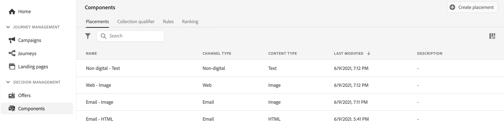

# Interfaccia utente della libreria di offerte {#user-interface}

La sezione **[!UICONTROL Gestione delle decisioni]** nella barra a sinistra fornisce due menu che consentono di accedere alle funzionalità di gestione delle decisioni:

Utilizza il menu **[!UICONTROL Offerte]** per gestire e distribuire le offerte:

* **[!UICONTROL Panoramica]**: novità di [!DNL decision management]? Segui i passaggi sullo schermo per iniziare a impostare posizionamenti, offerte e raccolte. Se hai già familiarità con [!DNL decision management], ottieni una panoramica delle offerte, raccolte e decisioni più recenti. [Ulteriori informazioni](#overview)
* **[!UICONTROL Offerte]**: crea e accedi alle tue offerte personalizzate e di fallback. Scopri come creare [offerte](../offer-library/creating-personalized-offers.md) e [offerte di fallback](../offer-library/creating-fallback-offers.md)
* **[!UICONTROL Raccolte]**: organizza le offerte in raccolte statiche e dinamiche. [Ulteriori informazioni](../offer-library/creating-collections.md)
* **[!UICONTROL Decisioni]**: crea e gestisci le decisioni per distribuire le offerte. [Ulteriori informazioni](../offer-activities/create-offer-activities.md)
* **[!UICONTROL Decisioning in batch]**: consegna le decisioni sulle offerte a tutti i profili in un determinato pubblico Adobe Experience Platform. [Ulteriori informazioni](../batch-delivery.md)
* **[!UICONTROL Simulazione]**: convalida la logica decisionale simulando quali offerte verranno consegnate a un profilo di test per un determinato posizionamento. [Ulteriori informazioni](../offer-activities/simulation.md)

Utilizza il menu **[!UICONTROL Componenti]** per creare e gestire i componenti necessari per creare offerte e decisioni:

* **[!UICONTROL Posizionamenti]**: crea e gestisci i posizionamenti in cui verranno visualizzate le offerte. [Ulteriori informazioni](../offer-library/creating-placements.md)
* **[!UICONTROL Qualificatori di raccolta]**: crea e gestisci i qualificatori di raccolta (noti in precedenza come &quot;tag&quot;) per organizzare e filtrare le offerte. [Ulteriori informazioni](../offer-library/creating-tags.md)
* **[!UICONTROL Regole]**: gestisci le condizioni in cui vengono presentate le offerte. [Ulteriori informazioni](../offer-library/creating-decision-rules.md)
* **[!UICONTROL Classificazione]**: crea e gestisci formule di classificazione per determinare quale offerta deve essere presentata per prima per un determinato posizionamento. [Ulteriori informazioni](../ranking/create-ranking-formulas.md)

>[!NOTE]
>
>In caso di problemi durante l’accesso a Gestione decisioni o ad alcune sue funzioni, rivolgiti a un utente amministratore per verificare di disporre dei diritti necessari. Vedere [Concedere l&#39;accesso alla gestione delle decisioni](starting-offer-decisioning.md#granting-acess-to-decision-management).

## Panoramica {#overview}

Quando non hai ancora [!DNL decision management], la scheda **[!UICONTROL Panoramica]** ti guida attraverso i passaggi principali necessari per iniziare a creare la tua prima decisione di offerta. Segui i passaggi sullo schermo per iniziare a creare posizionamenti, offerte e raccolte. Una volta completati questi primi passaggi, ti viene richiesto di creare le decisioni sulle offerte.

>[!NOTE]
>
>I passaggi principali per creare offerte e utilizzarle in una decisione sono descritti in [questa sezione](../offer-library/key-steps.md).

Se hai più familiarità con [!DNL decision management] e hai già creato almeno una decisione di offerta, nella scheda **[!UICONTROL Panoramica]** vengono visualizzate le offerte, raccolte e decisioni più recenti.

Fai clic su un’offerta o una decisione per accedere direttamente ai dettagli dell’elemento selezionato.

Fai clic sul pulsante **[!UICONTROL Visualizza tutto]** per accedere agli elenchi delle offerte, delle raccolte o delle decisioni.

## Ricerca e filtro delle informazioni {#search-and-filter-information}

Usa la **barra di ricerca** per trovare un elemento specifico.

Per accedere a **Filtri** puoi anche fare clic sull’icona del filtro posta in alto a sinistra nell’elenco. Il menu dei filtri ti consente di filtrare gli elementi visualizzati in base a criteri diversi. Ad esempio, puoi filtrare i posizionamenti creati per il canale di comunicazione e-mail e per il contenuto di tipo immagine.

## Personalizzare le informazioni visualizzate {#customize-displayed-information}

Gli elenchi dei menu di Gestione delle decisioni possono essere personalizzati utilizzando il pulsante di configurazione in alto a destra degli elenchi.

Questo ti consente di scegliere le informazioni da visualizzare in base alle tue esigenze.

La personalizzazione delle colonne viene salvata per ogni utente.

## Riquadro informazioni {#information-pane}

Nei diversi elenchi, seleziona un elemento per visualizzare un riquadro informazioni che ti consenta di recuperare informazioni ed eseguire azioni di base su quell’elemento.

Dagli elenchi delle offerte e delle decisioni ora è possibile eseguire azioni in blocco su più elementi. A questo scopo, seleziona le offerte o le decisioni desiderate, quindi seleziona l’azione da eseguire dal riquadro informazioni.

Puoi anche duplicare un&#39;offerta o decisioni esistenti per creare una copia con lo stato **[!UICONTROL Bozza]**. Questa operazione può essere eseguita dal riquadro delle informazioni oppure dalla vista dettagliata di un’offerta o di una decisione.

## Registri di modifica di offerte e decisioni {#changes-logs}

[!DNL Journey Optimizer] consente di visualizzare tutte le modifiche apportate a un&#39;offerta o a una decisione. Per eseguire questa operazione, accedere al menu **[!UICONTROL Audits]** dal menu a sinistra. [Scopri come controllare le azioni sulle risorse](../../privacy/audit-logs.md)
