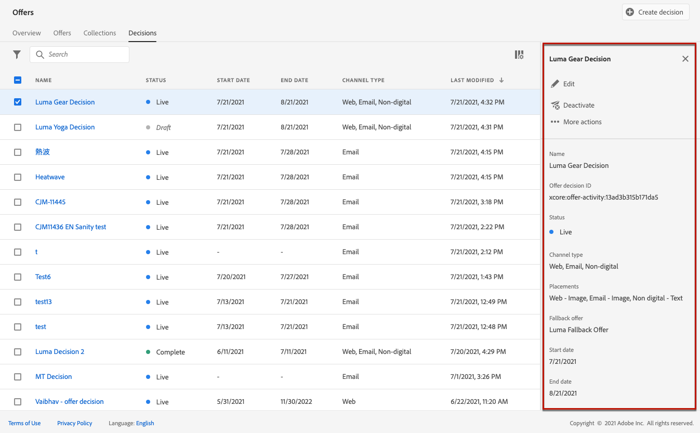

# Creare decisioni {#create-offer-activities}

Le decisioni (precedentemente note come attività di offerta) sono contenitori per le offerte che sfrutteranno il modulo di decisione dell’offerta per scegliere l’offerta migliore da consegnare, a seconda del target della consegna.

➡️ [Scopri questa funzione nel video](#video)

L’elenco delle decisioni è accessibile nel menu **[!UICONTROL Offers]** / **[!UICONTROL Decisions]** scheda . Sono disponibili filtri per aiutarti a recuperare le decisioni in base al loro stato o alle date di inizio e fine.

Prima di creare una decisione, accertati che i componenti seguenti siano stati creati nella Libreria offerte:

* [Posizionamenti](../offer-library/creating-placements.md)
* [Raccolte](../offer-library/creating-collections.md)
* [Offerte personalizzate](../offer-library/creating-personalized-offers.md)
* [Offerte di fallback](../offer-library/creating-fallback-offers.md)

## Crea la decisione {#create-activity}

1. Accedi all&#39;elenco delle decisioni, quindi fai clic su **[!UICONTROL Create decision]**.

1. Specifica il nome della decisione, la data e l&#39;ora di inizio e fine, quindi fai clic su **[!UICONTROL Next]**.

   

## Aggiungi ambiti decisionali {#add-decision-scopes}

1. Trascina e rilascia un posizionamento dall’elenco per aggiungerlo alla decisione, quindi fai clic su **[!UICONTROL Add collection]**.

   

   >[!NOTE]
   >
   >Lo stesso posizionamento può essere selezionato più volte nella decisione.

1. Seleziona la raccolta contenente le offerte da considerare, quindi fai clic su **[!UICONTROL Add]**.

   

1. Le offerte selezionate vengono aggiunte al posizionamento. In questo esempio, abbiamo selezionato due offerte che verranno visualizzate in un posizionamento di tipo JSON per presentare le offerte in una soluzione di call center.

   

1. Per impostazione predefinita, se più offerte sono idonee per questo posizionamento, verranno consegnate al cliente le offerte con il punteggio di priorità più alto.

   Se desideri utilizzare una formula specifica per scegliere l&#39;offerta idonea da consegnare, seleziona una formula di classificazione dall&#39;elenco a discesa **[!UICONTROL Rank offers by]**. Per ulteriori informazioni al riguardo, consulta [questa sezione](../offer-activities/configure-offer-selection.md).

1. Il campo **[!UICONTROL Constraint]** limita la selezione delle offerte per questo posizionamento. Questo vincolo può essere applicato utilizzando una regola decisionale o uno o più segmenti di Adobe Experience Platform.

   Per limitare la selezione delle offerte ai membri di un segmento Adobe Experience Platform, seleziona **[!UICONTROL Segments]**, quindi fai clic su **[!UICONTROL Add segments]**.

   

   Aggiungi uno o più segmenti dal riquadro a sinistra, combinali utilizzando gli operatori logici **[!UICONTROL And]** / **[!UICONTROL Or]**, quindi fai clic su **[!UICONTROL Select]** per confermare.

   Per ulteriori informazioni su come lavorare con i segmenti, consulta [questa pagina](../../segment/about-segments.md).

   

   Se desideri aggiungere un vincolo di selezione per questo posizionamento utilizzando una regola di decisione, seleziona l’opzione **[!UICONTROL Decision rule]** , quindi trascina la regola desiderata dal riquadro di sinistra nell’area **[!UICONTROL Decision rule]**. Per ulteriori informazioni su come creare una regola decisionale, consulta [questa sezione](../offer-library/creating-decision-rules.md).

   

## Aggiungere un’offerta di fallback {#add-fallback}

Seleziona l’offerta di fallback che verrà presentata come ultima risorsa ai clienti che non soddisfano le regole e i vincoli di idoneità delle offerte, quindi fai clic su **[!UICONTROL Next]**.

## Rivedi e salva la decisione {#review}

Se tutto è configurato correttamente, viene visualizzato un riepilogo delle proprietà della decisione.

1. Assicurati che la decisione sia pronta per essere utilizzata per presentare offerte ai clienti.
1. Fai clic su **[!UICONTROL Finish]**.
1. Quindi seleziona **[!UICONTROL Save and activate]**.

   

   Puoi anche salvare la decisione come bozza, per modificarla e attivarla in un secondo momento.

La decisione viene visualizzata nell’elenco con lo stato **[!UICONTROL Live]** o **[!UICONTROL Draft]** , a seconda che sia stata attivata o meno nel passaggio precedente.

È ora pronto per essere utilizzato per fornire offerte ai clienti.

## Elenco delle decisioni {#decision-list}

Dall’elenco delle decisioni, puoi selezionare la decisione di visualizzarne le proprietà. Da qui puoi anche modificarlo, modificarne lo stato (**Bozza**, **Live**, **Completa**, **Archiviato**), duplicare la decisione o eliminarla.

Seleziona il pulsante **[!UICONTROL Edit]** per tornare alla modalità di modifica delle decisioni, dove puoi modificare i [dettagli](#create-activity), [ambiti decisionali](#add-decision-scopes) e [offerte di fallback](#add-fallback) della decisione.

Seleziona una decisione dal vivo e fai clic su **[!UICONTROL Deactivate]** per impostare nuovamente lo stato della decisione su **[!UICONTROL Draft]**.

Per impostare nuovamente lo stato su **[!UICONTROL Live]**, selezionare il pulsante **[!UICONTROL Activate]** visualizzato.

Il pulsante **[!UICONTROL More actions]** abilita le azioni descritte di seguito.

* **[!UICONTROL Complete]**: imposta lo stato della decisione su  **[!UICONTROL Complete]**, il che significa che la decisione non può più essere chiamata. Questa azione è disponibile solo per le decisioni attivate. La decisione è ancora disponibile dall’elenco, ma non è possibile ripristinarne lo stato su **[!UICONTROL Draft]** o **[!UICONTROL Approved]**. È possibile duplicarla, eliminarla o archiviarla.

* **[!UICONTROL Duplicate]**: crea una decisione con le stesse proprietà, ambito decisionale e offerta di fallback. Per impostazione predefinita, la nuova decisione ha lo stato **[!UICONTROL Draft]** .

* **[!UICONTROL Delete]**: rimuove la decisione dall&#39;elenco.

   >[!CAUTION]
   >
   >La decisione e il suo contenuto non saranno più accessibili. Questa azione non può essere annullata.
   >
   >Se la decisione viene utilizzata in un altro oggetto, non può essere eliminata.

* **[!UICONTROL Archive]**: imposta lo stato della decisione su  **[!UICONTROL Archived]**. La decisione è ancora disponibile dall’elenco, ma non è possibile ripristinarne lo stato su **[!UICONTROL Draft]** o **[!UICONTROL Approved]**. È possibile duplicarla o eliminarla.

È inoltre possibile eliminare o modificare lo stato di più decisioni contemporaneamente selezionando le caselle di controllo corrispondenti.

Se desideri modificare lo stato di diverse decisioni con stati diversi, verranno modificati solo gli stati rilevanti.

Una volta creata una decisione, puoi fare clic sul suo nome dall’elenco.

Questo consente di accedere a informazioni dettagliate su tale decisione. Seleziona la scheda **[!UICONTROL Change log]** per [monitorare tutte le modifiche](../get-started/user-interface.md#changes-log) apportate alla decisione.

## Video tutorial {#video}

>[!NOTE]
>
>Questo video si applica al servizio di applicazione Offer Decisioning integrato in Adobe Experience Platform. Tuttavia, fornisce indicazioni generiche per utilizzare Offerta nel contesto di Journey Optimizer.

>[!VIDEO](https://video.tv.adobe.com/v/329606?quality=12)
