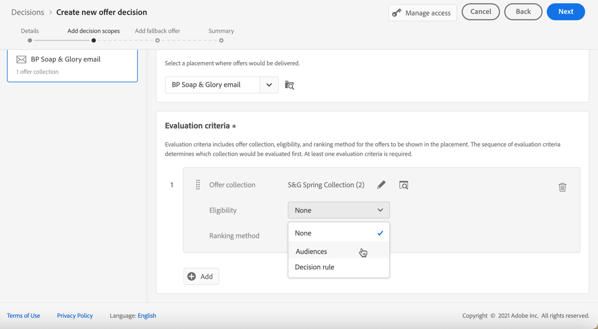

# Creare decisioni {#create-offer-activities}

Le decisioni (precedentemente note come attività di offerta) sono contenitori per le offerte che sfrutteranno il modulo di decisione dell’offerta per scegliere l’offerta migliore da consegnare, a seconda del target della consegna.

➡️ [Scopri questa funzione nel video](#video)

L&#39;elenco delle decisioni è accessibile nella **[!UICONTROL Offers]** menu > **[!UICONTROL Decisions]** scheda . Sono disponibili filtri per aiutarti a recuperare le decisioni in base al loro stato o alle date di inizio e fine.

Prima di creare una decisione, accertati che i componenti seguenti siano stati creati nella Libreria offerte:

* [Posizionamenti](../offer-library/creating-placements.md)
* [Raccolte](../offer-library/creating-collections.md)
* [Offerte personalizzate](../offer-library/creating-personalized-offers.md)
* [Offerte di fallback](../offer-library/creating-fallback-offers.md)

## Crea la decisione {#create-activity}

1. Accedi all&#39;elenco delle decisioni, quindi fai clic su **[!UICONTROL Create decision]**.

1. Specifica il nome della decisione.

1. Se necessario, definisci una data e un’ora di inizio e di fine, quindi fai clic su **[!UICONTROL Next]**.

   

## Definire gli ambiti decisionali {#add-decision-scopes}

1. Seleziona un posizionamento dall’elenco a discesa. Sarà aggiunto al primo ambito decisionale della vostra decisione.

   

1. Fai clic su **[!UICONTROL Add]** per selezionare i criteri di valutazione per questo posizionamento.

   

   Ogni criterio consiste in una raccolta di offerte associata a un vincolo di idoneità e in un metodo di classificazione per determinare le offerte da visualizzare nel posizionamento.

   >[!NOTE]
   >
   >È necessario almeno un criterio di valutazione.

1. Seleziona la raccolta di offerte che contiene le offerte da considerare, quindi fai clic su **[!UICONTROL Add]**.

   

   >[!NOTE]
   >
   >Puoi fare clic su **[!UICONTROL Open offer collections]** per visualizzare l’elenco delle raccolte in una nuova scheda, che consente di sfogliare le raccolte e le offerte che contengono.

   La raccolta selezionata viene aggiunta ai criteri.

   

1. Utilizza la **[!UICONTROL Eligibility]** per limitare la selezione delle offerte per questo posizionamento.

   Questo vincolo può essere applicato utilizzando un **norma decisionale** o uno o più **Segmenti Adobe Experience Platform**. Entrambi sono descritti in [questa sezione](#segments-vs-decision-rules).

   * Per limitare la selezione delle offerte ai membri di un segmento di Experience Platform, seleziona **[!UICONTROL Segments]**, quindi fai clic su **[!UICONTROL Add segments]**.

      

      Aggiungi uno o più segmenti dal riquadro a sinistra e combinali utilizzando il **[!UICONTROL And]** / **[!UICONTROL Or]** operatori logici.

      

      Scopri come lavorare con i segmenti in [questa sezione](../../segment/about-segments.md).

   * Se desideri aggiungere un vincolo di selezione con una regola di decisione, utilizza la **[!UICONTROL Decision rule]** e seleziona la regola scelta.

      

      Scopri come creare una regola decisionale in [questa sezione](../offer-library/creating-decision-rules.md).

1. Definisci il metodo di classificazione da utilizzare per selezionare l’offerta migliore per ciascun profilo.

   

   * Per impostazione predefinita, se più offerte sono idonee per questo posizionamento, l’offerta con il punteggio di priorità più alto verrà consegnata al cliente.

   * Se desideri utilizzare una formula specifica per scegliere l&#39;offerta idonea da consegnare, seleziona **[!UICONTROL Ranking formula]**. Scopri come classificare le offerte in [questa sezione](../offer-activities/configure-offer-selection.md).

1. Fai clic su **[!UICONTROL Add]** per definire più criteri per lo stesso posizionamento.

   

1. Quando aggiungi più criteri, questi verranno valutati in un ordine specifico. La prima raccolta aggiunta alla sequenza verrà valutata per prima e così via.

   Per modificare la sequenza predefinita, puoi trascinare e rilasciare le raccolte per riordinarle come desiderato.

   

1. Puoi anche valutare più criteri contemporaneamente. A questo scopo, trascina e rilascia la raccolta sopra un’altra.

   

   Ora hanno lo stesso rango e quindi saranno valutati contemporaneamente.

   

1. Per aggiungere un altro posizionamento per le offerte come parte di questa decisione, utilizza **[!UICONTROL New scope]** pulsante . Ripeti i passaggi indicati sopra per ogni ambito di decisione.

   

### Utilizzo di segmenti e regole decisionali {#segments-vs-decision-rules}

<!--to move to create-offers?-->

Per applicare un vincolo, è possibile limitare la selezione delle offerte ai membri di uno o più **Segmenti Adobe Experience Platform** oppure puoi utilizzare un **norma decisionale**, entrambe le soluzioni corrispondenti a diversi utilizzi.

In sostanza, l’output di un segmento è un elenco di profili, mentre una regola decisionale è una funzione eseguita su richiesta rispetto a un singolo profilo durante il processo decisionale. La differenza tra questi due utilizzi è illustrata di seguito.

* **Segmenti**

   Da un lato, i segmenti sono un gruppo di profili Adobe Experience Platform che corrispondono a una determinata logica in base agli attributi di profilo e agli eventi di esperienza. Tuttavia, Gestione delle offerte non esegue il calcolo del segmento, che potrebbe non essere aggiornato al momento della presentazione dell’offerta.

   Ulteriori informazioni sui segmenti in [questa sezione](../../segment/about-segments.md).

* **Regole di decisione**

   D’altra parte, una regola decisionale si basa sui dati disponibili in Adobe Experience Platform e determina a chi può essere visualizzata un’offerta. Una volta selezionata in un’offerta o in una decisione per un determinato posizionamento, la regola viene eseguita ogni volta che viene presa una decisione, in modo che ogni profilo ottenga l’ultima e l’offerta migliore.

   Ulteriori informazioni sulle regole decisionali in [questa sezione](../offer-library/creating-decision-rules.md).

## Aggiungere un’offerta di fallback {#add-fallback}

Una volta definiti gli ambiti decisionali, definisci l’offerta di fallback che verrà presentata come ultima risorsa ai clienti che non soddisfano le regole e i vincoli di idoneità delle offerte.

A questo scopo, selezionala dall’elenco delle offerte di fallback disponibili per i posizionamenti definiti nella decisione, quindi fai clic su **[!UICONTROL Next]**.

>[!NOTE]
>
>Puoi fare clic su **[!UICONTROL Open offer library]** per visualizzare l’elenco delle offerte in una nuova scheda.

## Rivedi e salva la decisione {#review}

Se tutto è configurato correttamente, viene visualizzato un riepilogo delle proprietà della decisione.

1. Assicurati che la decisione sia pronta per essere utilizzata per presentare offerte ai clienti. Vengono visualizzati tutti gli ambiti decisionali e l’offerta di fallback in essa contenuta.

   

   È possibile espandere o comprimere ogni posizionamento. Puoi anche visualizzare in anteprima le offerte disponibili, i dettagli di idoneità e classificazione per ogni posizionamento.

   

1. Fai clic su **[!UICONTROL Finish]**.
1. Seleziona **[!UICONTROL Save and activate]**.

   

   Puoi anche salvare la decisione come bozza, per modificarla e attivarla in un secondo momento.

La decisione viene visualizzata nell’elenco con la **[!UICONTROL Live]** o **[!UICONTROL Draft]** a seconda che sia stato attivato o meno nel passaggio precedente.

È ora pronto per essere utilizzato per fornire offerte ai clienti.

## Elenco delle decisioni {#decision-list}

Dall’elenco delle decisioni, puoi selezionare la decisione di visualizzarne le proprietà. È inoltre possibile modificarlo, modificarne lo stato (**Bozza**, **Live**, **Completa**, **Archiviato**), duplica la decisione o la elimina.

Seleziona la **[!UICONTROL Edit]** pulsante per tornare alla modalità di modifica della decisione, in cui è possibile modificare la [dettagli](#create-activity), [ambiti decisionali](#add-decision-scopes) e [offerta di fallback](#add-fallback).

Seleziona una decisione dal vivo e fai clic su **[!UICONTROL Deactivate]** per ripristinare lo stato della decisione su **[!UICONTROL Draft]**.

Per impostare nuovamente lo stato su **[!UICONTROL Live]**, seleziona **[!UICONTROL Activate]** pulsante visualizzato.

La **[!UICONTROL More actions]** attiva le azioni descritte di seguito.

* **[!UICONTROL Complete]**: imposta lo stato della decisione su **[!UICONTROL Complete]** Ciò significa che la decisione non può più essere chiamata. Questa azione è disponibile solo per le decisioni attivate. La decisione è ancora disponibile dall&#39;elenco, ma non è possibile ripristinarne lo stato su **[!UICONTROL Draft]** o **[!UICONTROL Approved]**. È possibile duplicarla, eliminarla o archiviarla.

* **[!UICONTROL Duplicate]**: crea una decisione con le stesse proprietà, ambito decisionale e offerta di fallback. Per impostazione predefinita, la nuova decisione ha **[!UICONTROL Draft]** stato.

* **[!UICONTROL Delete]**: rimuove la decisione dall&#39;elenco.

   >[!CAUTION]
   >
   >La decisione e il suo contenuto non saranno più accessibili. Questa azione non può essere annullata.
   >
   >Se la decisione viene utilizzata in un altro oggetto, non può essere eliminata.

* **[!UICONTROL Archive]**: imposta lo stato della decisione su **[!UICONTROL Archived]**. La decisione è ancora disponibile dall&#39;elenco, ma non è possibile ripristinarne lo stato su **[!UICONTROL Draft]** o **[!UICONTROL Approved]**. È possibile duplicarla o eliminarla.

È inoltre possibile eliminare o modificare lo stato di più decisioni contemporaneamente selezionando le caselle di controllo corrispondenti.

Se desideri modificare lo stato di diverse decisioni con stati diversi, verranno modificati solo gli stati rilevanti.

Una volta creata una decisione, puoi fare clic sul suo nome dall’elenco.

Questo consente di accedere a informazioni dettagliate su tale decisione. Seleziona la **[!UICONTROL Change log]** scheda a [controlla tutte le modifiche](../get-started/user-interface.md#changes-log) che sono stati presi alla decisione.

## Video tutorial {#video}

>[!NOTE]
>
>Questo video si applica al servizio di applicazione Offer Decisioning integrato in Adobe Experience Platform. Tuttavia, fornisce indicazioni generiche per utilizzare Offerta nel contesto di Journey Optimizer.

>[!VIDEO](https://video.tv.adobe.com/v/329606?quality=12)
