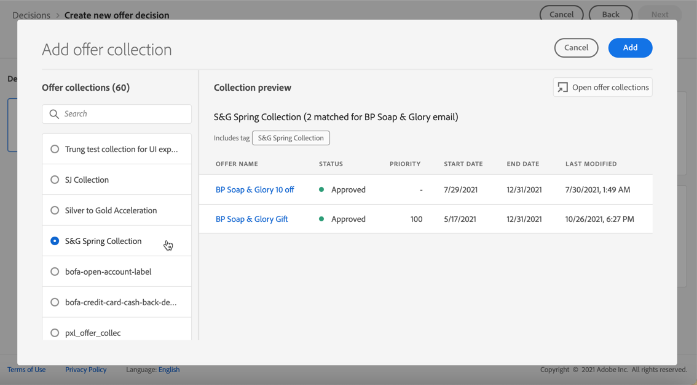

# Creare decisioni {#create-offer-activities}

Le decisioni sono contenitori per le offerte che sfrutteranno il modulo di gestione delle decisioni per l’offerta al fine di scegliere l’offerta migliore da consegnare, a seconda del target della consegna.

➡️ [Scopri come creare attività di offerta in questo video](#video)

L&#39;elenco delle decisioni è accessibile nella **[!UICONTROL Offerte]** menu > **[!UICONTROL Decisioni]** scheda . Sono disponibili filtri per aiutarti a recuperare le decisioni in base al loro stato o alle date di inizio e fine.

Prima di creare una decisione, accertati che i componenti seguenti siano stati creati nella Libreria offerte:

* [Posizionamenti](../offer-library/creating-placements.md)
* [Raccolte](../offer-library/creating-collections.md)
* [Offerte personalizzate](../offer-library/creating-personalized-offers.md)
* [Offerte di fallback](../offer-library/creating-fallback-offers.md)

## Crea la decisione {#create-activity}

1. Accedi all&#39;elenco delle decisioni, quindi fai clic su **[!UICONTROL Crea decisione]**.

1. Specifica il nome della decisione.

1. Se necessario, definisci una data e un’ora di inizio e di fine, quindi fai clic su **[!UICONTROL Successivo]**.

   

1. Per assegnare etichette di utilizzo dati personalizzate o di base alla decisione, seleziona **[!UICONTROL Gestisci accesso]**. [Ulteriori informazioni su Object Level Access Control (OLAC)](../../administration/object-based-access.md)

## Definire gli ambiti decisionali {#add-decision-scopes}

1. Seleziona un posizionamento dall’elenco a discesa. Sarà aggiunto al primo ambito decisionale della vostra decisione.

   

1. Fai clic su **[!UICONTROL Aggiungi]** per selezionare i criteri di valutazione per questo posizionamento.

   

   Ogni criterio consiste in una raccolta di offerte associata a un vincolo di idoneità e in un metodo di classificazione per determinare le offerte da visualizzare nel posizionamento.

   >[!NOTE]
   >
   >È necessario almeno un criterio di valutazione.

1. Seleziona la raccolta di offerte che contiene le offerte da considerare, quindi fai clic su **[!UICONTROL Aggiungi]**.

   

   >[!NOTE]
   >
   >Puoi fare clic su **[!UICONTROL Aprire le raccolte di offerte]** per visualizzare l’elenco delle raccolte in una nuova scheda, che consente di sfogliare le raccolte e le offerte che contengono.

   La raccolta selezionata viene aggiunta ai criteri.

   

1. Utilizza la **[!UICONTROL Ammissibilità]** per limitare la selezione delle offerte per questo posizionamento.

   Questo vincolo può essere applicato utilizzando un **norma decisionale** o uno o più **Segmenti Adobe Experience Platform**. Entrambi sono descritti in [questa sezione](../offer-library/add-constraints.md#segments-vs-decision-rules).

   * Per limitare la selezione delle offerte ai membri di un segmento di Experience Platform, seleziona **[!UICONTROL Segmenti]**, quindi fai clic su **[!UICONTROL Aggiungere segmenti]**.

      

      Aggiungi uno o più segmenti dal riquadro a sinistra e combinali utilizzando il **[!UICONTROL E]** / **[!UICONTROL Oppure]** operatori logici.

      

      Scopri come lavorare con i segmenti in [questa sezione](../../segment/about-segments.md).

   * Se desideri aggiungere un vincolo di selezione con una regola di decisione, utilizza la **[!UICONTROL Regola decisionale]** e seleziona la regola scelta.

      

      Scopri come creare una regola decisionale in [questa sezione](../offer-library/creating-decision-rules.md).

1. Quando selezioni segmenti o regole di decisione, puoi visualizzare informazioni sui profili qualificati stimati. Fai clic su **[!UICONTROL Aggiorna]** per aggiornare i dati.

   >[!NOTE]
   >
   >Le stime del profilo non sono disponibili quando i parametri delle regole includono dati non presenti nel profilo, ad esempio dati contestuali. Ad esempio, una regola di idoneità che richiede che il tempo corrente sia ≥ 80 gradi.

   

1. Definisci il metodo di classificazione da utilizzare per selezionare l’offerta migliore per ciascun profilo. [Maggiori informazioni](../offer-activities/configure-offer-selection.md).

   

   * Per impostazione predefinita, se più offerte sono idonee per questo posizionamento, l’ **[!UICONTROL Priorità offerta]** utilizza il valore definito nelle offerte: l’offerta con il punteggio di priorità più alto verrà consegnata all’utente.

   * Se desideri utilizzare un punteggio calcolato specifico per scegliere l&#39;offerta idonea da consegnare, seleziona **[!UICONTROL Formula]** o **[!UICONTROL Modello AI]**. [Maggiori informazioni](../offer-activities/configure-offer-selection.md).

1. Fai clic su **[!UICONTROL Aggiungi]** per definire più criteri per lo stesso posizionamento.

   

1. Quando aggiungi più criteri, questi verranno valutati in un ordine specifico. La prima raccolta aggiunta alla sequenza verrà valutata per prima e così via. [Ulteriori informazioni](#evaluation-criteria-order)

   Per modificare la sequenza predefinita, puoi trascinare e rilasciare le raccolte per riordinarle come desiderato.

   

1. Puoi anche valutare più criteri contemporaneamente. A questo scopo, trascina e rilascia la raccolta sopra un’altra.

   

   Ora hanno lo stesso rango e quindi saranno valutati contemporaneamente. [Ulteriori informazioni](#evaluation-criteria-order)

   

1. Per aggiungere un altro posizionamento per le offerte come parte di questa decisione, utilizza **[!UICONTROL Nuovo ambito]** pulsante . Ripeti i passaggi indicati sopra per ogni ambito di decisione.

   

### Ordine dei criteri di valutazione {#evaluation-criteria-order}

Come descritto in precedenza, i criteri di valutazione consistono in una raccolta, vincoli di ammissibilità e un metodo di classificazione. È possibile impostare l’ordine sequenziale desiderato per la valutazione dei criteri di valutazione, ma è anche possibile combinare più criteri di valutazione in modo che vengano valutati insieme e non separatamente.

Ad esempio, si dispone di due raccolte, una nei criteri di valutazione A e una nei criteri di valutazione B. La richiesta prevede il rinvio di due offerte. Supponiamo che vi siano due offerte ammissibili in base ai criteri di valutazione A e tre offerte ammissibili in base ai criteri di valutazione B.

* Se i due criteri di valutazione sono **non combinato** e/o in ordine sequenziale (1 e 2), le prime due offerte ammissibili dei criteri di valutazione saranno restituite nella prima riga. Se non vi sono due offerte ammissibili per i primi criteri di valutazione, il modulo decisionale passerà ai criteri di valutazione successivi in sequenza per trovare quante offerte sono ancora necessarie e, in ultima analisi, restituirà un fallback se necessario.

   

* Se le due raccolte sono **valutato contemporaneamente** Poiché i criteri di valutazione A e le tre offerte ammissibili ai criteri di valutazione B sono due, le cinque offerte saranno tutte raggruppate in base al valore determinato dai rispettivi metodi di classificazione. Sono richieste due offerte, pertanto le prime due offerte ammissibili di queste cinque offerte saranno restituite.

   

## Aggiungere un’offerta di fallback {#add-fallback}

Una volta definiti gli ambiti decisionali, definisci l’offerta di fallback che verrà presentata come ultima risorsa ai clienti che non soddisfano le regole e i vincoli di idoneità delle offerte.

A questo scopo, selezionala dall’elenco delle offerte di fallback disponibili per i posizionamenti definiti nella decisione, quindi fai clic su **[!UICONTROL Successivo]**.

>[!NOTE]
>
>Puoi fare clic su **[!UICONTROL Apri libreria di offerte]** per visualizzare l’elenco delle offerte in una nuova scheda.

## Rivedi e salva la decisione {#review}

Se tutto è configurato correttamente, viene visualizzato un riepilogo delle proprietà della decisione.

1. Assicurati che la decisione sia pronta per essere utilizzata per presentare offerte ai clienti. Vengono visualizzati tutti gli ambiti decisionali e l’offerta di fallback in essa contenuta.

   

1. È possibile espandere o comprimere ogni posizionamento. Puoi visualizzare in anteprima le offerte disponibili, i dettagli di idoneità e classificazione per ogni posizionamento. Puoi anche visualizzare informazioni sui profili qualificati stimati. Fai clic su **[!UICONTROL Aggiorna]** per aggiornare i dati.

   

1. Fai clic su **[!UICONTROL Fine]**.
1. Seleziona **[!UICONTROL Salva e attiva]**.

   

   Puoi anche salvare la decisione come bozza, per modificarla e attivarla in un secondo momento.

La decisione viene visualizzata nell’elenco con la **[!UICONTROL Live]** o **[!UICONTROL Bozza]** a seconda che sia stato attivato o meno nel passaggio precedente.

È ora pronto per essere utilizzato per fornire offerte ai clienti.

## Elenco delle decisioni {#decision-list}

Dall’elenco delle decisioni, puoi selezionare la decisione di visualizzarne le proprietà. È inoltre possibile modificarlo, modificarne lo stato (**Bozza**, **Live**, **Completa**, **Archiviato**), duplica la decisione o la elimina.

Seleziona la **[!UICONTROL Modifica]** pulsante per tornare alla modalità di modifica della decisione, in cui è possibile modificare la [dettagli](#create-activity), [ambiti decisionali](#add-decision-scopes) e [offerta di fallback](#add-fallback).

Seleziona una decisione dal vivo e fai clic su **[!UICONTROL Disattiva]** per ripristinare lo stato della decisione su **[!UICONTROL Bozza]**.

Per impostare nuovamente lo stato su **[!UICONTROL Live]**, seleziona **[!UICONTROL Attiva]** pulsante visualizzato.

La **[!UICONTROL Altre azioni]** attiva le azioni descritte di seguito.

* **[!UICONTROL Completa]**: imposta lo stato della decisione su **[!UICONTROL Completa]** Ciò significa che la decisione non può più essere chiamata. Questa azione è disponibile solo per le decisioni attivate. La decisione è ancora disponibile dall&#39;elenco, ma non è possibile ripristinarne lo stato su **[!UICONTROL Bozza]** o **[!UICONTROL Approvato]**. È possibile duplicarla, eliminarla o archiviarla.

* **[!UICONTROL Duplica]**: crea una decisione con le stesse proprietà, ambito decisionale e offerta di fallback. Per impostazione predefinita, la nuova decisione ha **[!UICONTROL Bozza]** stato.

* **[!UICONTROL Elimina]**: rimuove la decisione dall&#39;elenco.

   >[!CAUTION]
   >
   >La decisione e il suo contenuto non saranno più accessibili. Questa azione non può essere annullata.
   >
   >Se la decisione viene utilizzata in un altro oggetto, non può essere eliminata.

* **[!UICONTROL Archivia]**: imposta lo stato della decisione su **[!UICONTROL Archiviato]**. La decisione è ancora disponibile dall&#39;elenco, ma non è possibile ripristinarne lo stato su **[!UICONTROL Bozza]** o **[!UICONTROL Approvato]**. È possibile duplicarla o eliminarla.

È inoltre possibile eliminare o modificare lo stato di più decisioni contemporaneamente selezionando le caselle di controllo corrispondenti.

Se desideri modificare lo stato di diverse decisioni con stati diversi, verranno modificati solo gli stati rilevanti.

Una volta creata una decisione, puoi fare clic sul suo nome dall’elenco.

Questo consente di accedere a informazioni dettagliate su tale decisione. Seleziona la **[!UICONTROL Registro delle modifiche]** scheda a [controlla tutte le modifiche](../get-started/user-interface.md#changes-log) che sono stati presi alla decisione.

## Video introduttivo{#video}

Scopri come creare attività di offerta nella gestione delle decisioni.

>[!VIDEO](https://video.tv.adobe.com/v/329606?quality=12)

