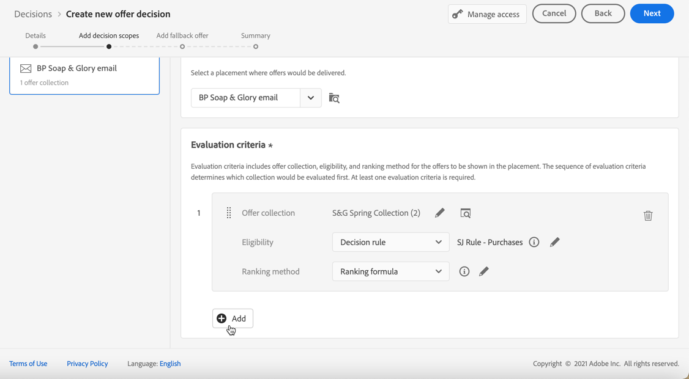
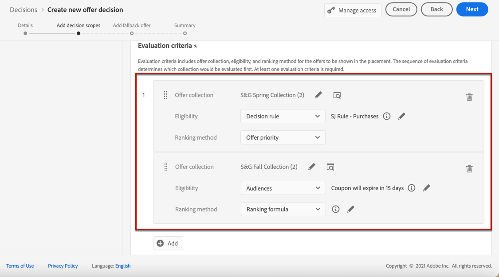
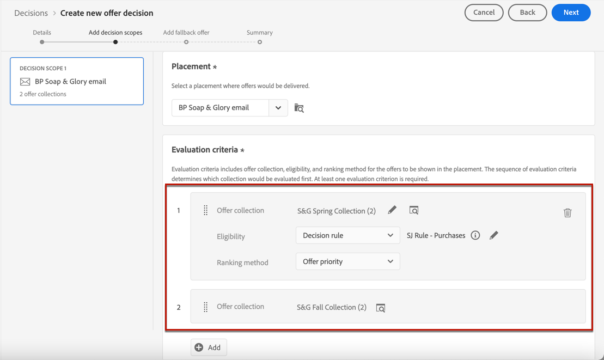

# Creare decisioni {#create-offer-activities}

>[!TIP]
>
>La funzione Decisioni, la nuova funzionalità decisionale di [!DNL Adobe Journey Optimizer], è ora disponibile tramite i canali e-mail e di esperienza basati su codice. [Ulteriori informazioni](../../experience-decisioning/gs-experience-decisioning.md)

Le decisioni sono contenitori per le offerte che sfrutteranno il motore delle decisioni per le offerte per scegliere l’offerta migliore da consegnare, a seconda del target.

➡️ [Scopri come creare le attività di offerta in questo video](#video)

L&#39;elenco delle decisioni è accessibile nel menu **[!UICONTROL Offerte]** > scheda **[!UICONTROL Decisioni]**. Sono disponibili filtri per aiutarti a recuperare le decisioni in base al loro stato o alle date di inizio e fine.

Prima di creare una decisione, assicurati che i componenti seguenti siano stati creati nella Libreria di offerte:

* [Posizionamenti](../offer-library/creating-placements.md)
* [Raccolte](../offer-library/creating-collections.md)
* [Offerte personalizzate](../offer-library/creating-personalized-offers.md)
* [Offerte di fallback](../offer-library/creating-fallback-offers.md)

## Creare la decisione {#create-activity}

>[!CONTEXTUALHELP]
>id="ajo_decisioning_decision_details"
>title="Dettagli della decisione di offerta"
>abstract="Specifica il nome della decisione e, se necessario, definisci una data e un’ora di inizio e di fine. Per assegnare etichette di utilizzo dei dati personalizzati o principali alla decisione, seleziona **[!UICONTROL Gestisci accesso]**."

1. Accedi all&#39;elenco di decisioni, quindi fai clic su **[!UICONTROL Crea decisione]**.

1. Specifica il nome della decisione.

1. Definisci una data e un&#39;ora di inizio e fine, se necessario, quindi fai clic su **[!UICONTROL Successivo]**.

   

1. Per assegnare etichette di utilizzo dei dati personalizzate o di base alla decisione, selezionare **[!UICONTROL Gestisci accesso]**. [Ulteriori informazioni sul controllo degli accessi a livello di oggetto (OLAC)](../../administration/object-based-access.md)

## Definire gli ambiti decisionali {#add-decision-scopes}

>[!CONTEXTUALHELP]
>id="ajo_decisioning_decision_scopes"
>title="Ambiti decisionali"
>abstract="Configura uno o più ambiti per la decisione di offerta per determinare le offerte da visualizzare. Questa operazione viene eseguita selezionando un posizionamento e i relativi criteri di valutazione per tale posizionamento."

>[!CONTEXTUALHELP]
>id="ajo_decisioning_decision_placement"
>title="Posizionamento"
>abstract="Seleziona un posizionamento in cui verranno consegnate le offerte."

>[!CONTEXTUALHELP]
>id="ajo_decisioning_decision_evaluation"
>title="Criteri di valutazione"
>abstract="I criteri di valutazione consistono in una raccolta di offerte associata a un vincolo di idoneità e a un metodo di classificazione per determinare le offerte da mostrare nel posizionamento. La sequenza dei criteri di valutazione determina quale raccolta verrà valutata per prima. È necessario fornire almeno un criterio di valutazione."

1. Selezionate un posizionamento dall&#39;elenco a discesa. Verrà aggiunto al primo ambito di decisione della tua decisione.

   

1. Fai clic su **[!UICONTROL Aggiungi]** per selezionare i criteri di valutazione per questo posizionamento.

   

   Ogni criterio consiste in una raccolta di offerte associata a un vincolo di idoneità e a un metodo di classificazione per determinare le offerte da mostrare nel posizionamento.

   >[!NOTE]
   >
   >È necessario almeno un criterio di valutazione.

1. Seleziona la raccolta di offerte che contiene le offerte da considerare, quindi fai clic su **[!UICONTROL Aggiungi]**.

   

   >[!NOTE]
   >
   >Puoi fare clic sul collegamento **[!UICONTROL Apri raccolte offerte]** per visualizzare l&#39;elenco delle raccolte in una nuova scheda, che ti consente di sfogliare le raccolte e le offerte che contengono.

   La raccolta selezionata viene aggiunta ai criteri.

   

1. Utilizza il campo **[!UICONTROL Idoneità]** per limitare la selezione delle offerte per questo posizionamento.

   Questo vincolo può essere applicato utilizzando una **regola di decisione** o uno o più **tipi di pubblico di Adobe Experience Platform**. Entrambi sono descritti in [questa sezione](../offer-library/add-constraints.md#segments-vs-decision-rules).

   * Per limitare la selezione delle offerte ai membri di un pubblico Experience Platform, seleziona **[!UICONTROL Tipi di pubblico]**, quindi fai clic su **[!UICONTROL Aggiungi tipi di pubblico]**.

     

     Aggiungi uno o più tipi di pubblico dal riquadro di sinistra e combinali utilizzando gli operatori logici **[!UICONTROL And]** / **[!UICONTROL Or]**.

     

     Scopri come utilizzare i tipi di pubblico in [questa sezione](../../audience/about-audiences.md).

   * Se desideri aggiungere un vincolo di selezione con una regola di decisione, utilizza l&#39;opzione **[!UICONTROL Regola di decisione]** e seleziona la regola desiderata.

     

     Scopri come creare una regola di decisione in [questa sezione](../offer-library/creating-decision-rules.md).

1. Quando selezioni tipi di pubblico o regole di decisione, puoi visualizzare informazioni sui profili qualificati stimati. Fai clic su **[!UICONTROL Aggiorna]** per aggiornare i dati.

   >[!NOTE]
   >
   >Le stime del profilo non sono disponibili quando i parametri della regola includono dati non presenti nel profilo, come i dati contestuali. Ad esempio, una regola di idoneità che richiede che il tempo corrente sia di ≥80 gradi.

   

1. Definisci il metodo di classificazione da utilizzare per selezionare l’offerta migliore per ciascun profilo. [Ulteriori informazioni](../offer-activities/configure-offer-selection.md).

   

   * Per impostazione predefinita, se più offerte sono idonee per questo posizionamento, il metodo **[!UICONTROL Priorità offerta]** utilizza il valore definito nelle offerte: l&#39;offerta con il punteggio di priorità più alto verrà consegnata all&#39;utente.

   * Se si desidera utilizzare un punteggio calcolato specifico per scegliere l&#39;offerta idonea da consegnare, selezionare **[!UICONTROL Formula]** o **[!UICONTROL Modello di IA]**. [Ulteriori informazioni](../offer-activities/configure-offer-selection.md).

1. Fai clic su **[!UICONTROL Aggiungi]** per definire altri criteri per lo stesso posizionamento.

   

1. Quando aggiungi più criteri, questi verranno valutati in un ordine specifico. La prima raccolta aggiunta alla sequenza verrà valutata per prima e così via. [Ulteriori informazioni](#evaluation-criteria-order)

   Per modificare la sequenza predefinita, puoi trascinare e rilasciare le raccolte per riordinarle come desiderato.

   

1. Puoi anche valutare più criteri contemporaneamente. A questo scopo, trascina e rilascia la raccolta sopra un’altra.

   

   Ora hanno lo stesso rango e quindi saranno valutati allo stesso tempo. [Ulteriori informazioni](#evaluation-criteria-order)

   

   >[!CAUTION]
   >
   >* Se il [modello di IA](../ranking/ai-models.md) viene utilizzato in un gruppo di criteri di valutazione, tutti i criteri di valutazione in tale gruppo devono utilizzare il metodo di classificazione di IA e devono utilizzare lo stesso modello di IA specifico.
   >
   >* Solo un gruppo di criteri di valutazione può utilizzare il modello di IA. Qualsiasi altro gruppo all’interno di un ambito decisionale deve utilizzare altri metodi di classificazione (priorità o formula). [Ulteriori informazioni sui metodi di classificazione](../offer-activities/configure-offer-selection.md)

1. Per aggiungere un altro posizionamento per le offerte come parte di questa decisione, utilizza il pulsante **[!UICONTROL Nuovo ambito]**. Ripeti i passaggi precedenti per ogni ambito decisionale.

   

   >[!NOTE]
   >
   >Quando si aggiungono più ambiti decisionali, l’ordine dei criteri di valutazione sarà interessato. [Ulteriori informazioni](#multiple-scopes)

### Ordine dei criteri di valutazione {#evaluation-criteria-order}

Come descritto in precedenza, un criterio di valutazione è costituito da una raccolta, da vincoli di idoneità e da un metodo di classificazione. È possibile impostare l&#39;ordine sequenziale desiderato per la valutazione dei criteri di valutazione, ma è anche possibile combinare più criteri di valutazione in modo che vengano valutati insieme e non separatamente.

#### Con un ambito {#one-scope}

All’interno di un unico ambito decisionale, più criteri e il loro raggruppamento determinano la priorità dei criteri e la classificazione delle offerte idonee. Il primo criterio ha la massima priorità e i criteri combinati all&#39;interno dello stesso &quot;gruppo&quot; hanno la stessa priorità.

Ad esempio, sono disponibili due raccolte, una nel criterio di valutazione A e una nel criterio di valutazione B. La richiesta prevede il rinvio di due offerte. Supponiamo che vi siano due offerte ammissibili dal criterio di valutazione A e tre offerte ammissibili dal criterio di valutazione B.

* Se i due criteri di valutazione sono **non combinati** e/o in ordine sequenziale (1 e 2), le prime due offerte idonee dei criteri di valutazione verranno restituite nella prima riga. Se non ci sono due offerte idonee per il primo criterio di valutazione, il motore decisionale passa al criterio di valutazione successivo in sequenza per trovare tutte le offerte ancora necessarie e alla fine restituisce un fallback, se necessario.

  

* Se le due raccolte sono **valutate contemporaneamente**, poiché esistono due offerte idonee dal criterio di valutazione A e tre offerte idonee dal criterio di valutazione B, tutte le cinque offerte saranno classificate nello stack in base al valore determinato dai rispettivi metodi di classificazione. Sono richieste due offerte, pertanto verranno restituite le prime due offerte idonee di queste cinque.

  

+++ **Esempio con più criteri**

Prendiamo ora in considerazione un esempio in cui si dispone di più criteri per un singolo ambito suddivisi in gruppi diversi.

Hai definito tre criteri. I criteri 1 e 2 sono combinati insieme nel gruppo 1 e il criterio 3 è indipendente (gruppo 2).

Le offerte idonee per ciascun criterio e la relativa priorità (utilizzata nella valutazione della funzione di classificazione) sono le seguenti:

* Gruppo 1:
   * Criterio 1 - (Offerta 1, Offerta 2, Offerta 3) - Priorità 1
   * Criterio 2 - (Offerta 3, Offerta 4, Offerta 5) - Priorità 1

* Gruppo 2:
   * Criterio 3 - (Offerta 5, Offerta 6) - Priorità 0

Le offerte con criteri di priorità più elevata vengono valutate per prime e aggiunte all’elenco delle offerte classificate.

**Iterazione 1:**

Le offerte dei criteri 1 e 2 vengono valutate insieme (offerta 1, offerta 2, offerta 3, offerta 4, offerta 5). Supponiamo che il risultato sia:

Offerta 1 - 10
Offerta 2 - 20
Offerta 3-30 dai criteri 1, 45 dai criteri 2. Il più alto di entrambi sarà considerato, quindi 45 è preso in considerazione.
Offerta 4 - 40
Offerta 5 - 50

L’offerta classificata è ora la seguente: Offerta 5, Offerta 3, Offerta 4, Offerta 2, Offerta 1.

**Iterazione 2:**

Vengono valutate le offerte del criterio 3 (offerta 5, offerta 6). Supponiamo che il risultato sia:

* Offerta 5: non verrà valutata perché esiste già nel risultato precedente.
* Offerta 6 - 60

Le offerte classificate sono ora le seguenti: Offerta 5 , Offerta 3, Offerta 4, Offerta 2, Offerta 1, Offerta 6.

+++

#### Con più ambiti {#multiple-scopes}

**Se la duplicazione è disattivata**

Quando aggiungi diversi ambiti decisionali a una decisione e non è consentita la duplicazione tra posizionamenti diversi, le offerte idonee vengono selezionate in sequenza in base all’ordine degli ambiti decisionali nella richiesta.

>[!NOTE]
>
>Il parametro **[!UICONTROL Consenti duplicati tra posizionamenti]** è impostato a livello di posizionamento. Se la duplicazione è impostata su false per qualsiasi posizionamento in una richiesta di decisioning, tutti i posizionamenti nella richiesta ereditano l’impostazione false. [Ulteriori informazioni sul parametro di duplicazione](../offer-library/creating-placements.md)

Prendiamo un esempio in cui hai aggiunto due ambiti decisionali, come:

* Ambito 1: ci sono quattro offerte idonee (Offerta 1, Offerta 2, Offerta 3, Offerta 4) e la richiesta è di rimandare indietro due offerte.
* Ambito 2: sono ammesse quattro offerte (Offerta 1, Offerta 2, Offerta 3, Offerta 4) e la richiesta è di rimandare indietro due offerte.

+++ **Esempio 1**

La selezione è la seguente:

1. Verranno restituite le prime due offerte idonee dall’ambito 1 (offerta 1, offerta 2).
1. Verranno restituite le due migliori offerte idonee rimanenti dall&#39;ambito 2 (offerta 3, offerta 4).

+++

+++ **Esempio 2**

In questo esempio, l’offerta 1 ha raggiunto il limite massimo di frequenza. [Ulteriori informazioni sui limiti di frequenza](../offer-library/add-constraints.md#capping)

La selezione è la seguente:

1. Verranno restituite le due migliori offerte idonee rimanenti dall&#39;ambito 1 (offerta 2, offerta 3).
1. Verrà restituita l&#39;offerta idonea rimanente dall&#39;ambito 2 (offerta 4).

+++

+++ **Esempio 3**

In questo esempio, Offerta 1 e Offerta 3 hanno raggiunto il limite massimo di frequenza. [Ulteriori informazioni sui limiti di frequenza](../offer-library/add-constraints.md#capping)

La selezione è la seguente:

1. Verranno restituite le due migliori offerte idonee rimanenti dall&#39;ambito 1 (offerta 2, offerta 4).
1. Non ci sono offerte idonee rimanenti per l&#39;ambito 2, quindi viene restituita l&#39;[offerta di fallback](#add-fallback).

+++

**Se la duplicazione è attiva**

Quando la duplicazione è consentita in tutti i posizionamenti, la stessa offerta può essere proposta più volte in posizionamenti diversi. Se questa opzione è abilitata, il sistema considererà la stessa offerta per più posizionamenti. [Ulteriori informazioni sul parametro di duplicazione](../offer-library/creating-placements.md)

Prendiamo lo stesso esempio di cui sopra in cui hai aggiunto due ambiti decisionali, come:

* Ambito 1: ci sono quattro offerte idonee (Offerta 1, Offerta 2, Offerta 3, Offerta 4) e la richiesta è di rimandare indietro due offerte.
* Ambito 2: sono ammesse quattro offerte (Offerta 1, Offerta 2, Offerta 3, Offerta 4) e la richiesta è di rimandare indietro due offerte.

+++ **Esempio 1**

La selezione è la seguente:

1. Verranno restituite le prime due offerte idonee dall’ambito 1 (offerta 1, offerta 2).
1. Verranno restituite le stesse due migliori offerte idonee dell&#39;ambito 2 (offerta 1, offerta 2).

+++

+++ **Esempio 2**

In questo esempio, l’offerta 1 ha raggiunto il limite massimo di frequenza. [Ulteriori informazioni sui limiti di frequenza](../offer-library/add-constraints.md#capping)

La selezione è la seguente:

1. Verranno restituite le due migliori offerte idonee rimanenti dall&#39;ambito 1 (offerta 2, offerta 3).

1. Verranno restituite le stesse due migliori offerte idonee rimanenti dall’ambito 2 (offerta 2, offerta 3).

+++

+++ **Esempio 3**

In questo esempio, Offerta 1 e Offerta 3 hanno raggiunto il limite massimo di frequenza. [Ulteriori informazioni sui limiti di frequenza](../offer-library/add-constraints.md#capping)

La selezione è la seguente:

1. Verranno restituite le due migliori offerte idonee rimanenti dall&#39;ambito 1 (offerta 2, offerta 4).

1. Verranno restituite le stesse due migliori offerte idonee rimanenti dall’ambito 2 (offerta 2, offerta 4).

+++

## Aggiungere un’offerta di fallback {#add-fallback}

>[!CONTEXTUALHELP]
>id="ajo_decisioning_decision_fallback"
>title="Aggiungere un’offerta di fallback"
>abstract="Una volta definiti gli ambiti decisionali, definisci l’offerta di fallback che verrà presentata in ultima istanza a chi non corrisponde ai vincoli e alle regole di idoneità delle offerte."

Dopo aver definito gli ambiti decisionali, definisci l&#39;[offerta di fallback](../offer-library/creating-fallback-offers.md) che verrà presentata come ultima risorsa ai clienti che non corrispondono alle regole e ai vincoli di idoneità delle offerte.

A questo scopo, selezionala dall’elenco delle offerte di fallback disponibili per i posizionamenti definiti nella decisione.

>[!NOTE]
>
>Le offerte di fallback devono contenere tutte le rappresentazioni utilizzate all’interno di una decisione. Ad esempio, se in una decisione sono presenti 5 offerte e ciascuna di esse ha una rappresentazione diversa, nell’offerta di fallback devono essere incluse 5 rappresentazioni.

Una volta selezionata, fai clic su **[!UICONTROL Avanti]**.

Puoi fare clic sul collegamento **[!UICONTROL Apri libreria offerte]** per visualizzare l&#39;elenco delle offerte in una nuova scheda.

## Rivedi e salva la decisione {#review}

Se tutto è configurato correttamente, viene visualizzato un riepilogo delle proprietà di decisione.

1. Assicurati che la decisione sia pronta per essere utilizzata per presentare offerte ai clienti. Vengono visualizzati tutti gli ambiti decisionali e l’offerta di fallback che contiene.

   

1. Potete espandere o comprimere ogni posizionamento. Puoi visualizzare in anteprima le offerte disponibili, i dettagli di idoneità e classificazione per ciascun posizionamento. Puoi anche visualizzare informazioni sui profili qualificati stimati. Fai clic su **[!UICONTROL Aggiorna]** per aggiornare i dati.

   

1. Fai clic su **[!UICONTROL Fine]**.
1. Seleziona **[!UICONTROL Salva e attiva]**.

   

   Puoi anche salvare la decisione come bozza, per poi modificarla e attivarla in un secondo momento.

La decisione viene visualizzata nell&#39;elenco con lo stato **[!UICONTROL Live]** o **[!UICONTROL Bozza]**, a seconda che sia stata attivata o meno nel passaggio precedente.

È ora pronto per essere utilizzato per consegnare le offerte ai clienti.

## Elenco delle decisioni {#decision-list}

Dall’elenco delle decisioni, puoi selezionare la decisione di visualizzarne le proprietà. Da qui puoi anche modificarlo, modificarne lo stato (**Bozza**, **Live**, **Completa**, **Archiviata**), duplicare la decisione o eliminarla.

Seleziona il pulsante **[!UICONTROL Modifica]** per tornare alla modalità di modifica delle decisioni, dove puoi modificare i [dettagli](#create-activity), [ambiti decisionali](#add-decision-scopes) e [offerta di fallback](#add-fallback) della decisione.

>[!IMPORTANT]
>
>Se vengono apportate modifiche a una decisione di offerta utilizzata in un messaggio di un percorso, devi annullare la pubblicazione del percorso e ripubblicarlo.  In questo modo le modifiche verranno incorporate nel messaggio del percorso e il messaggio sarà coerente con gli ultimi aggiornamenti.

Seleziona una decisione live e fai clic su **[!UICONTROL Disattiva]** per impostare nuovamente lo stato della decisione su **[!UICONTROL Bozza]**.

Per impostare nuovamente lo stato su **[!UICONTROL Live]**, seleziona il pulsante **[!UICONTROL Attiva]** visualizzato.

Il pulsante **[!UICONTROL Altre azioni]** abilita le azioni descritte di seguito.

* **[!UICONTROL Complete]**: imposta lo stato della decisione su **[!UICONTROL Complete]**, ovvero la decisione non può più essere chiamata. Questa azione è disponibile solo per le decisioni attivate. La decisione è ancora disponibile nell&#39;elenco, ma non è possibile impostarne lo stato su **[!UICONTROL Bozza]** o **[!UICONTROL Approvato]**. Puoi solo duplicarlo, eliminarlo o archiviarlo.

* **[!UICONTROL Duplicato]**: crea una decisione con le stesse proprietà, gli stessi ambiti decisionali e la stessa offerta di fallback. Per impostazione predefinita, la nuova decisione ha lo stato **[!UICONTROL Bozza]**.

* **[!UICONTROL Elimina]**: rimuove la decisione dall&#39;elenco.

  >[!CAUTION]
  >
  >La decisione e il suo contenuto non saranno più accessibili. Questa azione non può essere annullata.
  >
  >Se la decisione viene utilizzata in un altro oggetto, non può essere eliminata.

* **[!UICONTROL Archivio]**: imposta lo stato della decisione su **[!UICONTROL Archiviato]**. La decisione è ancora disponibile nell&#39;elenco, ma non è possibile impostarne lo stato su **[!UICONTROL Bozza]** o **[!UICONTROL Approvato]**. Puoi solo duplicarlo o eliminarlo.

Puoi anche eliminare o modificare lo stato di più decisioni contemporaneamente selezionando le caselle di controllo corrispondenti.

Se desideri modificare lo stato di più decisioni con stati diversi, verranno modificati solo gli stati rilevanti.

Dopo aver creato una decisione, puoi fare clic sul nome nell’elenco.

Questo consente di accedere a informazioni dettagliate per tale decisione. Selezionare la scheda **[!UICONTROL Registro modifiche]** per [monitorare tutte le modifiche](../get-started/user-interface.md#changes-logs) apportate alla decisione.

## Video dimostrativo{#video}

Scopri come creare attività di offerta nella gestione delle decisioni.

>[!VIDEO](https://video.tv.adobe.com/v/346694?captions=ita&quality=12)

