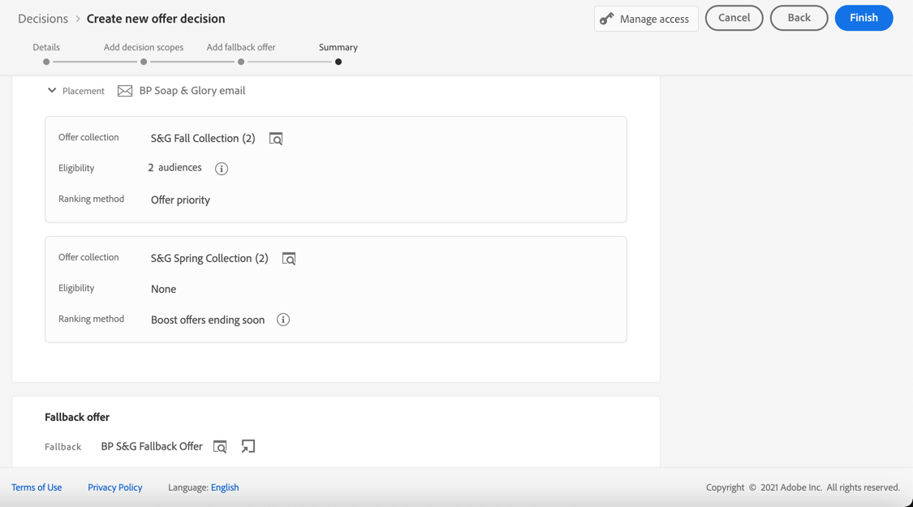

# Creare decisioni {#create-offer-activities}

Le decisioni sono contenitori per le offerte che sfrutteranno il motore delle decisioni per le offerte per scegliere l’offerta migliore da consegnare, a seconda del target.

➡️ [Scopri come creare le attività di offerta in questo video](#video)

L’elenco delle decisioni è accessibile nella sezione **[!UICONTROL Offerte]** menu > **[!UICONTROL Decisioni]** scheda. Sono disponibili filtri per aiutarti a recuperare le decisioni in base al loro stato o alle date di inizio e fine.

Prima di creare una decisione, assicurati che i componenti seguenti siano stati creati nella Libreria di offerte:

* [Posizionamenti](../offer-library/creating-placements.md)
* [Raccolte](../offer-library/creating-collections.md)
* [Offerte personalizzate](../offer-library/creating-personalized-offers.md)
* [Offerte di fallback](../offer-library/creating-fallback-offers.md)

## Creare la decisione {#create-activity}

1. Accedi all’elenco delle decisioni, quindi fai clic su **[!UICONTROL Crea decisione]**.

1. Specifica il nome della decisione.

1. Se necessario, definisci una data e un’ora di inizio e fine, quindi fai clic su **[!UICONTROL Successivo]**.

   

1. Per assegnare etichette di utilizzo dei dati personalizzate o di base alla decisione, seleziona **[!UICONTROL Gestisci accesso]**. [Ulteriori informazioni su OLAC (Object Level Access Control)](../../administration/object-based-access.md)

## Definire gli ambiti decisionali {#add-decision-scopes}

1. Selezionate un posizionamento dall&#39;elenco a discesa. Verrà aggiunto al primo ambito di decisione della tua decisione.

   

1. Clic **[!UICONTROL Aggiungi]** per selezionare i criteri di valutazione per questo posizionamento.

   

   Ogni criterio consiste in una raccolta di offerte associata a un vincolo di idoneità e a un metodo di classificazione per determinare le offerte da mostrare nel posizionamento.

   >[!NOTE]
   >
   >È necessario almeno un criterio di valutazione.

1. Seleziona la raccolta di offerte contenente le offerte da considerare, quindi fai clic su **[!UICONTROL Aggiungi]**.

   

   >[!NOTE]
   >
   >Puoi fare clic su **[!UICONTROL Apri raccolte offerte]** per visualizzare l’elenco delle raccolte in una nuova scheda, che consente di sfogliare le raccolte e le offerte che contengono.

   La raccolta selezionata viene aggiunta ai criteri.

   

1. Utilizza il **[!UICONTROL Idoneità]** per limitare la selezione delle offerte per questo posizionamento.

   Questo vincolo può essere applicato utilizzando un **regola di decisione** o uno o più **Pubblico Adobe Experience Platform**. Entrambi sono descritti in [questa sezione](../offer-library/add-constraints.md#segments-vs-decision-rules).

   * Per limitare la selezione delle offerte ai membri di un pubblico di Experienci Platform, seleziona **[!UICONTROL Tipi di pubblico]**, quindi fai clic su **[!UICONTROL Aggiungere tipi di pubblico]**.

     

     Aggiungi uno o più tipi di pubblico dal riquadro a sinistra e combinali utilizzando **[!UICONTROL E]** / **[!UICONTROL Oppure]** operatori logici.

     

     Scopri come utilizzare i tipi di pubblico in [questa sezione](../../audience/about-audiences.md).

   * Se desideri aggiungere un vincolo di selezione con una regola di decisione, utilizza **[!UICONTROL Regola di decisione]** e selezionare la regola desiderata.

     

     Scopri come creare una regola di decisione in [questa sezione](../offer-library/creating-decision-rules.md).

1. Quando selezioni tipi di pubblico o regole di decisione, puoi visualizzare informazioni sui profili qualificati stimati. Clic **[!UICONTROL Aggiorna]** per aggiornare i dati.

   >[!NOTE]
   >
   >Le stime del profilo non sono disponibili quando i parametri della regola includono dati non presenti nel profilo, come i dati contestuali. Ad esempio, una regola di idoneità che richiede che il tempo corrente sia di ≥80 gradi.

   

1. Definisci il metodo di classificazione da utilizzare per selezionare l’offerta migliore per ciascun profilo. [Maggiori informazioni](../offer-activities/configure-offer-selection.md).

   

   * Per impostazione predefinita, se più offerte sono idonee per questo posizionamento, il **[!UICONTROL Priorità offerta]** utilizza il valore definito nelle offerte: l’offerta con il punteggio di priorità più alto verrà consegnata all’utente.

   * Se desideri utilizzare un punteggio calcolato specifico per scegliere l’offerta idonea da consegnare, seleziona **[!UICONTROL Formula]** o **[!UICONTROL Modello IA]**. [Maggiori informazioni](../offer-activities/configure-offer-selection.md).

1. Clic **[!UICONTROL Aggiungi]** per definire più criteri per lo stesso posizionamento.

   

1. Quando aggiungi più criteri, questi verranno valutati in un ordine specifico. La prima raccolta aggiunta alla sequenza verrà valutata per prima e così via. [Ulteriori informazioni](#evaluation-criteria-order)

   Per modificare la sequenza predefinita, puoi trascinare e rilasciare le raccolte per riordinarle come desiderato.

   

1. Puoi anche valutare più criteri contemporaneamente. A questo scopo, trascina e rilascia la raccolta sopra un’altra.

   

   Ora hanno lo stesso rango e quindi saranno valutati allo stesso tempo. [Ulteriori informazioni](#evaluation-criteria-order)

   

1. Per aggiungere un altro posizionamento per le offerte come parte di questa decisione, utilizza **[!UICONTROL Nuovo ambito]** pulsante. Ripeti i passaggi precedenti per ogni ambito decisionale.

   

### Ordine dei criteri di valutazione {#evaluation-criteria-order}

Come descritto in precedenza, un criterio di valutazione è costituito da una raccolta, da vincoli di idoneità e da un metodo di classificazione. È possibile impostare l&#39;ordine sequenziale desiderato per la valutazione dei criteri di valutazione, ma è anche possibile combinare più criteri di valutazione in modo che vengano valutati insieme e non separatamente.

Ad esempio, sono disponibili due raccolte, una nel criterio di valutazione A e una nel criterio di valutazione B. La richiesta prevede il rinvio di due offerte. Supponiamo che vi siano due offerte ammissibili dal criterio di valutazione A e tre offerte ammissibili dal criterio di valutazione B.

* Se i due criteri di valutazione sono **non combinato** e/o in ordine sequenziale (1 e 2), nella prima riga vengono restituite le prime due offerte idonee dei criteri di valutazione. Se non ci sono due offerte idonee per il primo criterio di valutazione, il motore decisionale passa al criterio di valutazione successivo in sequenza per trovare tutte le offerte ancora necessarie e alla fine restituisce un fallback, se necessario.

  

* Se le due raccolte sono **valutato contemporaneamente** Poiché esistono due offerte ammissibili in base al criterio di valutazione A e tre offerte ammissibili in base al criterio di valutazione B, le cinque offerte saranno tutte raggruppate in base al valore determinato dai rispettivi metodi di classificazione. Sono richieste due offerte, pertanto verranno restituite le prime due offerte idonee di queste cinque.

  

## Aggiungere un’offerta di fallback {#add-fallback}

Una volta definiti gli ambiti decisionali, definisci l’offerta di fallback che verrà presentata come ultima risorsa ai clienti che non corrispondono alle regole e ai vincoli di idoneità delle offerte.

A questo scopo, selezionala dall’elenco delle offerte di fallback disponibili per i posizionamenti definiti nella decisione, quindi fai clic su **[!UICONTROL Successivo]**.

>[!NOTE]
>
>Puoi fare clic su **[!UICONTROL Apri libreria di offerte]** per visualizzare l’elenco delle offerte in una nuova scheda.

## Rivedi e salva la decisione {#review}

Se tutto è configurato correttamente, viene visualizzato un riepilogo delle proprietà di decisione.

1. Assicurati che la decisione sia pronta per essere utilizzata per presentare offerte ai clienti. Vengono visualizzati tutti gli ambiti decisionali e l’offerta di fallback che contiene.

   

1. Potete espandere o comprimere ogni posizionamento. Puoi visualizzare in anteprima le offerte disponibili, i dettagli di idoneità e classificazione per ciascun posizionamento. Puoi anche visualizzare informazioni sui profili qualificati stimati. Clic **[!UICONTROL Aggiorna]** per aggiornare i dati.

   

1. Fai clic su **[!UICONTROL Fine]**.
1. Seleziona **[!UICONTROL Salva e attiva]**.

   

   Puoi anche salvare la decisione come bozza, per poi modificarla e attivarla in un secondo momento.

La decisione viene visualizzata nell’elenco con **[!UICONTROL Live]** o **[!UICONTROL Bozza]** a seconda che sia stato attivato o meno nel passaggio precedente.

È ora pronto per essere utilizzato per consegnare le offerte ai clienti.

## Elenco delle decisioni {#decision-list}

Dall’elenco delle decisioni, puoi selezionare la decisione di visualizzarne le proprietà. Da qui è anche possibile modificarlo, modificarne lo stato (**Bozza**, **Live**, **Completa**, **Archiviato**), duplica la decisione o eliminala.

Seleziona la **[!UICONTROL Modifica]** per tornare alla modalità di modifica delle decisioni, dove puoi modificare i [dettagli](#create-activity), [ambiti decisionali](#add-decision-scopes) e [offerta di fallback](#add-fallback).

>[!IMPORTANT]
>
>Se vengono apportate modifiche a una decisione di offerta utilizzata in un messaggio di un percorso, devi annullare la pubblicazione del percorso e ripubblicarlo.  In questo modo le modifiche verranno incorporate nel messaggio del percorso e il messaggio sarà coerente con gli ultimi aggiornamenti.

Seleziona una decisione live e fai clic su **[!UICONTROL Disattiva]** per impostare nuovamente lo stato della decisione su **[!UICONTROL Bozza]**.

Per impostare nuovamente lo stato su **[!UICONTROL Live]**, seleziona la **[!UICONTROL Attiva]** che viene ora visualizzato.

Il **[!UICONTROL Altre azioni]** consente di eseguire le azioni descritte di seguito.

* **[!UICONTROL Completa]**: imposta lo stato della decisione su **[!UICONTROL Completa]**, il che significa che la decisione non può più essere chiamata. Questa azione è disponibile solo per le decisioni attivate. La decisione è ancora disponibile dall’elenco, ma non è possibile impostarne nuovamente lo stato su **[!UICONTROL Bozza]** o **[!UICONTROL Approvato]**. Puoi solo duplicarlo, eliminarlo o archiviarlo.

* **[!UICONTROL Duplica]**: crea una decisione con le stesse proprietà, gli stessi ambiti decisionali e le stesse offerte di fallback. Per impostazione predefinita, la nuova decisione presenta **[!UICONTROL Bozza]** stato.

* **[!UICONTROL Elimina]**: rimuove la decisione dall’elenco.

  >[!CAUTION]
  >
  >La decisione e il suo contenuto non saranno più accessibili. Questa azione non può essere annullata.
  >
  >Se la decisione viene utilizzata in un altro oggetto, non può essere eliminata.

* **[!UICONTROL Archivia]**: imposta lo stato della decisione su **[!UICONTROL Archiviato]**. La decisione è ancora disponibile dall’elenco, ma non è possibile impostarne nuovamente lo stato su **[!UICONTROL Bozza]** o **[!UICONTROL Approvato]**. Puoi solo duplicarlo o eliminarlo.

Puoi anche eliminare o modificare lo stato di più decisioni contemporaneamente selezionando le caselle di controllo corrispondenti.

Se desideri modificare lo stato di più decisioni con stati diversi, verranno modificati solo gli stati rilevanti.

Dopo aver creato una decisione, puoi fare clic sul nome nell’elenco.

Questo consente di accedere a informazioni dettagliate per tale decisione. Seleziona la **[!UICONTROL Registro modifiche]** scheda a [monitorare tutte le modifiche](../get-started/user-interface.md#changes-log) che sono stati oggetto della decisione.

## Video introduttivo{#video}

Scopri come creare attività di offerta nella gestione delle decisioni.

>[!VIDEO](https://video.tv.adobe.com/v/329606?quality=12)

