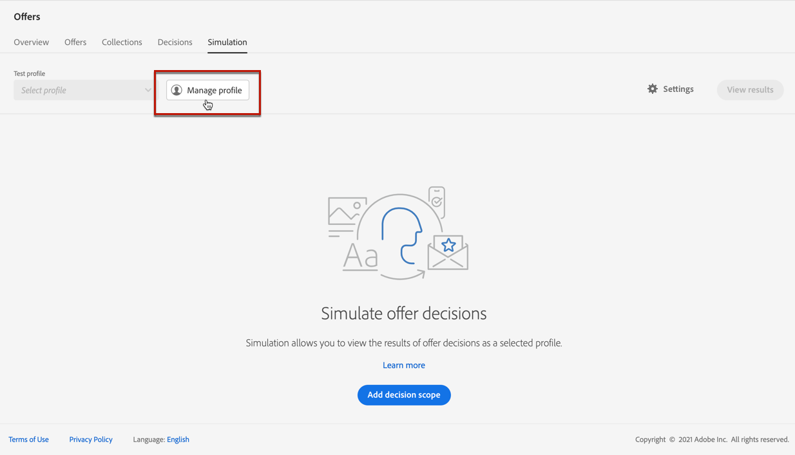

# Creare simulazioni {#create-simulations}

## Informazioni sulla simulazione {#about-simulation}

Per convalidare la logica decisionale, puoi simulare quali offerte verranno consegnate a un profilo di test per un determinato posizionamento.

<!--Simulation allows you to view the results of offer decisions as a selected profile.-->

Questo consente di testare e perfezionare varie versioni delle offerte senza alcun impatto sui destinatari desiderati.

>[!NOTE]
>
>Questa funzionalità simula una singola richiesta al [!DNL Decisioning] API. Ulteriori informazioni su [Distribuire le offerte tramite l’API Decisioning](../api-reference/offer-delivery-api/decisioning-api.md).

Per accedere a questa funzione, seleziona la **[!UICONTROL Simulazione]** scheda da **[!UICONTROL Gestione delle decisioni]** > **[!UICONTROL Offerte]** menu.

>[!NOTE]
>
>Poiché la simulazione non genera alcun evento decisionale, il [limite](../offer-library/creating-personalized-offers.md#capping) il conteggio non è interessato.

<!--
➡️ [Discover this feature in video](#video)
-->

## Selezionare i profili di test {#select-test-profiles}

>[!CONTEXTUALHELP]
>id="ajo_decisioning_simulation_test_profile"
>title="Aggiungere profili di test"
>abstract="Puoi aggiungere un profilo di test selezionando uno spazio dei nomi delle identità e un valore di identità corrispondente. I profili di test devono essere già disponibili per poter essere usati per la simulazione."
>additional-url="https://experienceleague.adobe.com/docs/journey-optimizer/using/segment/profiles/creating-test-profiles.html?lang=it" text="Crea profili di test"

Innanzitutto devi selezionare i profili di test da utilizzare per la simulazione.

>[!CAUTION]
>
>Devi disporre di profili di test per simulare quali offerte verranno consegnate. Scopri come [creare profili di test](../../segment/creating-test-profiles.md).

1. Clic **[!UICONTROL Gestisci profilo]**.

   

1. Seleziona lo spazio dei nomi delle identità da utilizzare per identificare i profili di test. In questo esempio utilizzeremo **E-mail** spazio dei nomi.

   >[!NOTE]
   >
   >Uno spazio dei nomi delle identità definisce il contesto di un identificatore, ad esempio un indirizzo e-mail o un ID del sistema di gestione delle relazioni con i clienti. Ulteriori informazioni sugli spazi dei nomi delle identità di Adobe Experience Platform [in questa sezione](../../segment/get-started-identity.md){target="_blank"}.

1. Inserisci il valore di identità e fai clic su **[!UICONTROL Visualizza]** per elencare i profili disponibili.

   

1. Aggiungi altri profili se desideri testare dati di profilo diversi e salva la selezione.

   

1. Una volta aggiunti, tutti i profili sono elencati nell’elenco a discesa in **[!UICONTROL Profilo di test]**. Puoi passare dai profili di test salvati a quelli salvati e visualizzare i risultati per ciascun profilo selezionato.

   

   >[!NOTE]
   >
   >I profili selezionati rimarranno elencati come profili di test nel **[!UICONTROL Simulazione]** da sessione a sessione fino a quando non vengono rimossi utilizzando **[!UICONTROL Gestisci profilo]**.

1. Puoi fare clic su **[!UICONTROL Dettagli profilo]** per visualizzare i dati di profilo selezionati.

<!--Learn more on [selecting test profiles](messages/preview.md#select-test-profiles)-->

## Aggiungere ambiti decisionali {#add-decision-scopes}

Ora seleziona le decisioni di offerta che desideri simulare sui profili di test.

1. Seleziona **[!UICONTROL Aggiungi ambito decisione]**.

   

1. Selezionate un posizionamento dall&#39;elenco.

   

1. Vengono visualizzate le decisioni disponibili.

   * Puoi usare il campo di ricerca per perfezionare la selezione.
   * Puoi fare clic su **[!UICONTROL Apri decisioni di offerta]** per aprire l&#39;elenco di tutte le decisioni create. Ulteriori informazioni su [decisioni](create-offer-activities.md).

   Seleziona la decisione desiderata e fai clic su **[!UICONTROL Aggiungi]**.

   

1. L’ambito decisionale appena definito viene visualizzato nell’area di lavoro principale.

   Puoi regolare il numero di offerte che desideri richiedere. Ad esempio, se selezioni 2, verranno visualizzate le 2 offerte migliori per questo ambito decisionale.

   

   >[!NOTE]
   >
   >Puoi richiedere fino a 30 offerte.

1. Ripeti i passaggi precedenti per aggiungere tutte le decisioni necessarie.

   

   >[!NOTE]
   >
   >Anche se definisci diversi ambiti decisionali, viene simulata una sola richiesta API.

## Definire le impostazioni di simulazione {#define-simulation-settings}

Per modificare le impostazioni predefinite per le simulazioni, segui la procedura indicata di seguito.

1. Clic **[!UICONTROL Impostazioni]**.

   

1. In **[!UICONTROL Deduplicazione]** sezione, puoi scegliere di consentire le offerte duplicate tra decisioni e/o posizionamenti. Ciò significa che a più decisioni/posizionamenti può essere assegnata la stessa offerta.

   

   >[!NOTE]
   >
   >Per impostazione predefinita, tutti i flag di deduplicazione sono abilitati per la simulazione, il che significa che il motore decisionale consente i duplicati e può quindi fare la stessa proposta per più decisioni/posizionamenti. Ulteriori informazioni su [!DNL Decisioning] Proprietà della richiesta API in [questa sezione](../api-reference/offer-delivery-api/decisioning-api.md).

1. In **[!UICONTROL Formato di risposta]** , puoi scegliere di includere i metadati nella vista codice. Seleziona l’opzione corrispondente e seleziona i metadati desiderati. Vengono visualizzati nei payload di richiesta e risposta al momento della selezione **[!UICONTROL Visualizza codice]**. Per ulteriori informazioni, consulta [Visualizza risultati simulazione](#simulation-results) sezione.

   

   >[!NOTE]
   >
   >Quando si attiva l&#39;opzione, tutti gli elementi vengono selezionati per impostazione predefinita.

1. Fai clic su **[!UICONTROL Salva]**.

>[!NOTE]
>
>Attualmente per i dati di simulazione è possibile utilizzare solo **[!UICONTROL Hub]** API.

<!--
In the **[!UICONTROL API for simulation]** section, select the API you want to use: **[!UICONTROL Hub]** or **[!UICONTROL Edge]**.
Hub and Edge are two different end points for simulation data.

In the **[!UICONTROL Context data]** section, you can add as many elements as needed.

    >[!NOTE]
    >
    >This section is hidden if you select Edge API in the section above. Hub allows the use of Context data, Edge does not.

Context data allows the user to add contextual data that could affect the simulation score.
For instance, let's say the customer has an offer for a discount on ice cream. In the rules for that offer, it can have logic that would rank it higher when the temperature is above 80 degrees. In simulation, the user could add context data: temperature=65 and that offer would rank lower, of they could add temperature=95 and that would rank higher.
-->

## Visualizza risultati simulazione {#simulation-results}

Dopo aver aggiunto un ambito di decisione e selezionato un profilo di test, puoi visualizzare i risultati.

1. Clic **[!UICONTROL Visualizza risultati]**.

   

1. Le migliori offerte disponibili vengono visualizzate in base al profilo selezionato per ogni decisione.

   Seleziona un’offerta per visualizzarne i dettagli.

   

1. Clic **[!UICONTROL Visualizza codice]** per visualizzare i payload di richieste e risposte. [Ulteriori informazioni](#view-code)

1. Seleziona un altro profilo dall’elenco per visualizzare i risultati delle decisioni sulle offerte per un profilo di test diverso.

1. Puoi aggiungere, rimuovere o aggiornare gli ambiti decisionali il numero di volte necessario.

>[!NOTE]
>
>Ogni volta che modifichi profili o aggiorni ambiti decisionali, devi aggiornare i risultati utilizzando **[!UICONTROL Visualizza risultati]** pulsante.

## Visualizza codice {#view-code}

1. Utilizza il **[!UICONTROL Visualizza codice]** per visualizzare i payload di richieste e risposte.

   

   La vista Codice mostra le informazioni per gli sviluppatori per l&#39;utente corrente. Per impostazione predefinita, il **[!UICONTROL Payload di risposta]** viene visualizzato.

   

1. Clic **[!UICONTROL Payload di risposta]** o **[!UICONTROL Richiedi payload]** per spostarsi tra le due schede.

   

1. Per utilizzare il payload della richiesta all’esterno di [!DNL Journey Optimizer] - ad esempio per la risoluzione dei problemi, copiarlo utilizzando **[!UICONTROL Copia negli Appunti]** nella parte superiore della vista codice.

   

   <!--You cannot copy the response payload. ACTUALLY YES YOU CAN > to confirm with PM/dev? -->

   >[!NOTE]
   >
   >Quando copi i payload di richiesta o di risposta nel tuo codice, assicurati di sostituire {USER_TOKEN} e {API_KEY} con valori validi. Scopri come recuperare questi valori in [API di Adobe Experience Platform](https://experienceleague.adobe.com/docs/experience-platform/landing/platform-apis/api-authentication.html){target="_blank"} documentazione.

