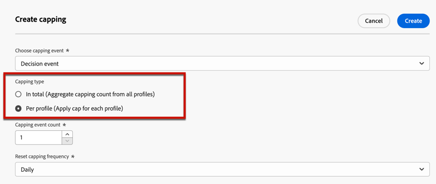
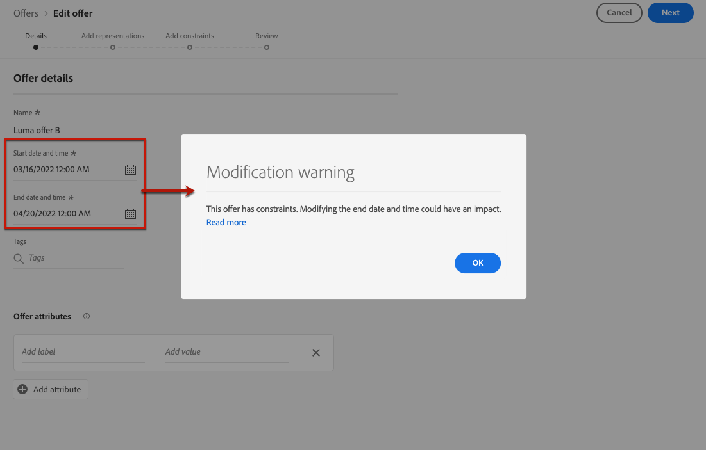

# Aggiungere vincoli a un’offerta {#add-constraints}

>[!CONTEXTUALHELP]
>id="od_offer_constraints"
>title="Informazioni sui vincoli delle offerte"
>abstract="Con i vincoli, puoi specificare in che modo viene assegnata la priorità all’offerta e come viene presentata all’utente rispetto ad altre offerte."

>[!CONTEXTUALHELP]
>id="ajo_decisioning_constraints"
>title="Informazioni sui vincoli delle offerte"
>abstract="Con i vincoli, puoi specificare in che modo viene assegnata la priorità all’offerta e come viene presentata all’utente rispetto ad altre offerte."

>[!CONTEXTUALHELP]
>id="od_offer_priority"
>title="Informazioni sulla priorità delle offerte"
>abstract="In questo campo, puoi specificare le impostazioni di priorità per l’offerta. La priorità è un numero utilizzato per classificare le offerte che soddisfano tutti i vincoli, come idoneità, data e limiti."

>[!CONTEXTUALHELP]
>id="ajo_decisioning_priority"
>title="Impostare la priorità"
>abstract="La priorità consente di definire la priorità dell’offerta rispetto alle altre, se l’utente si qualifica per più di un’offerta. Maggiore è la priorità di un’offerta, maggiore sarà la sua priorità rispetto ad altre offerte."

I vincoli ti consentono di definire le condizioni in cui verrà visualizzata un’offerta.

1. Configurare **[!UICONTROL Idoneità dell’offerta]**. [Ulteriori informazioni](#eligibility)

   

1. Definisci il **[!UICONTROL Priorità]** dell’offerta rispetto ad altre se l’utente è idoneo per più di un’offerta. Maggiore è la priorità di un’offerta, maggiore sarà la sua priorità rispetto ad altre offerte.

   

   >[!NOTE]
   >
   >La priorità dell’offerta deve essere un valore intero (senza decimali).

1. Specifica dell’offerta **[!UICONTROL Limitazione]**, ovvero il numero di volte in cui verrà presentata l’offerta. [Ulteriori informazioni](#capping)

   

1. Clic **[!UICONTROL Successivo]** per confermare tutti i vincoli definiti.

Ad esempio, se impostate i seguenti vincoli:

* L’offerta verrà considerata solo per gli utenti che corrispondono alla regola di decisione &quot;Clienti Gold Loyalty&quot;.
* La priorità dell’offerta è impostata su &quot;50&quot;, il che significa che l’offerta sarà presentata prima delle offerte con priorità tra 1 e 49 e dopo quelle con priorità di almeno 51.
* L’offerta verrà presentata solo una volta al mese per utente in tutti i posizionamenti.

## Idoneità {#eligibility}

>[!CONTEXTUALHELP]
>id="ajo_decisioning_eligibility"
>title="Definire l’idoneità"
>abstract="Per impostazione predefinita, l’offerta può essere presentata a qualsiasi profilo, ma puoi utilizzare tipi di pubblico o regole di decisione per limitare l’offerta a profili specifici."

>[!CONTEXTUALHELP]
>id="od_offer_eligibility"
>title="Informazioni sull’idoneità alle offerte"
>abstract="In questa sezione puoi utilizzare le regole di decisione per determinare quali utenti sono idonei all’offerta."
>additional-url="https://video.tv.adobe.com/v/329373?captions=ita" text="Guarda il video dimostrativo"

>[!CONTEXTUALHELP]
>id="ajo_decisioning_total_profile_estimate"
>title="Stima totale dei profili"
>abstract="Quando selezion tipi di pubblico o regole di decisione, puoi visualizzare informazioni sui profili qualificati stimati."

Il **[!UICONTROL Idoneità dell’offerta]** Questa sezione ti consente di limitare l’offerta a profili specifici definiti utilizzando tipi di pubblico o regole decisionali.

>[!NOTE]
>
>Ulteriori informazioni sull’utilizzo di **audience** rispetto a **regole di decisione** in [questa sezione](#segments-vs-decision-rules).

* Per impostazione predefinita, il **[!UICONTROL Tutti i visitatori]** L’opzione è selezionata, il che significa che qualsiasi profilo sarà idoneo per ricevere l’offerta.

  

* Puoi anche limitare la presentazione dell’offerta ai membri di uno o più [Pubblico Adobe Experience Platform](../../audience/about-audiences.md).

  A questo scopo, attiva il **[!UICONTROL Visitatori che rientrano in uno o più tipi di pubblico]** , quindi aggiungi uno o più tipi di pubblico dal riquadro a sinistra e combinali utilizzando **[!UICONTROL E]** / **[!UICONTROL Oppure]** operatori logici.

  

* Se si desidera associare un [regola di decisione](../offer-library/creating-decision-rules.md) all’offerta, seleziona **[!UICONTROL Per regola di decisione definita]**, quindi trascina la regola desiderata dal riquadro di sinistra a **[!UICONTROL Regola di decisione]** area.

  

  >[!CAUTION]
  >
  >Le offerte basate su eventi non sono attualmente supportate in [!DNL Journey Optimizer]. Se crei una regola di decisione basata su un [evento](https://experienceleague.adobe.com/docs/experience-platform/segmentation/ui/segment-builder.html#events){target="_blank"}, non potrai sfruttarlo in un’offerta.

Quando selezioni tipi di pubblico o regole di decisione, puoi visualizzare informazioni sui profili qualificati stimati. Clic **[!UICONTROL Aggiorna]** per aggiornare i dati.

>[!NOTE]
>
>Le stime del profilo non sono disponibili quando i parametri della regola includono dati non presenti nel profilo, come i dati contestuali. Ad esempio, una regola di idoneità che richiede che il tempo corrente sia di ≥80 gradi.

### Utilizzo dei tipi di pubblico e delle regole di decisione {#segments-vs-decision-rules}

Per applicare un vincolo, è possibile limitare la selezione delle offerte ai membri di uno o più **Pubblico Adobe Experience Platform**, oppure puoi utilizzare una **regola di decisione**, entrambe le soluzioni corrispondono a utilizzi diversi.

In sostanza, l’output di un pubblico è un elenco di profili, mentre una regola di decisione è una funzione eseguita su richiesta su un singolo profilo durante il processo decisionale. La differenza tra questi due utilizzi è descritta di seguito.

* **Tipi di pubblico**

  Da un lato, i tipi di pubblico sono un gruppo di profili Adobe Experience Platform che corrispondono a una determinata logica basata sugli attributi del profilo e sugli eventi di esperienza. Tuttavia, Gestione delle offerte non ricalcola il pubblico, che potrebbe non essere aggiornato al momento della presentazione dell’offerta.

  Ulteriori informazioni sui tipi di pubblico in [questa sezione](../../audience/about-audiences.md).

* **Regole di decisione**

  D’altra parte, una regola di decisione si basa sui dati disponibili in Adobe Experience Platform e determina a chi può essere visualizzata un’offerta. Una volta selezionata in un’offerta o in una decisione per un determinato posizionamento, la regola viene eseguita ogni volta che viene presa una decisione, in modo che ogni profilo ottenga l’offerta più recente e migliore.

  Ulteriori informazioni sulle regole di decisione in [questa sezione](creating-decision-rules.md).

## Limiti {#capping}

>[!CONTEXTUALHELP]
>id="od_offer_globalcap"
>title="Informazioni sui limiti delle offerte"
>abstract="In questo campo puoi specificare quante volte può essere presentata l’offerta."

>[!CONTEXTUALHELP]
>id="ajo_decisioning_capping"
>title="Utilizzare i limiti"
>abstract="Per evitare di sollecitare eccessivamente i clienti, utilizza i limiti per definire il numero massimo di volte in cui un’offerta può essere presentata."
>additional-url="https://experienceleague.adobe.com/docs/journey-optimizer/using/decisioning/offer-decisioning/managing-offers-in-the-offer-library/configure-offers/add-constraints.html#capping-change-date" text="La modifica delle date può influire sui limiti"

Il limite viene utilizzato come vincolo per definire il numero massimo di volte in cui è possibile presentare un’offerta.

Limitare il numero di volte in cui gli utenti ricevono offerte specifiche consente di evitare di sollecitare eccessivamente i clienti e quindi di ottimizzare ogni punto di contatto con l’offerta migliore.

Per impostare i limiti, attenersi alla procedura principale descritta di seguito.

1. Assicurati che le **[!UICONTROL Abilita limite]** pulsante di attivazione/disattivazione selezionato. Il limite è attivato per impostazione predefinita.

   >[!CAUTION]
   >
   >Non è possibile abilitare o disabilitare il limite di frequenza per le offerte create in precedenza. A questo scopo, devi creare una nuova offerta.

1. Definisci quale **[!UICONTROL Evento di limite]** per aumentare il contatore. [Ulteriori informazioni](#capping-event)

1. Imposta il numero di volte in cui è possibile presentare l’offerta. [Ulteriori informazioni](#capping-count)

1. Scegli se desideri applicare il limite a tutti gli utenti o a un solo profilo. [Ulteriori informazioni](#capping-type)

1. Imposta il **[!UICONTROL Frequenza]** per definire la frequenza con cui viene reimpostato il conteggio dei limiti. [Ulteriori informazioni](#frequency-capping)

1. Se hai definito diversi [rappresentazioni](add-representations.md) per l’offerta, specifica se desideri applicare il limite **in tutti i posizionamenti** o **a ciascun posizionamento**. [Ulteriori informazioni](#placements)

1. Una volta salvata e approvata, se l’offerta è stata presentata il numero di volte che hai specificato in questo campo in base ai criteri e all’arco temporale definito, la sua consegna si interrompe.

Il numero di volte in cui viene proposta un’offerta viene calcolato al momento della preparazione dell’e-mail. Ad esempio, se prepari un’e-mail contenente una serie di offerte, questi numeri vengono conteggiati in base al tetto massimo, indipendentemente dal fatto che l’e-mail venga inviata o meno.

<!--If an email delivery is deleted or if the preparation is done again before being sent, the capping value for the offer is automatically updated.-->

>[!NOTE]
>
>I contatori dei limiti vengono ripristinati alla scadenza dell’offerta o 2 anni dopo la data di inizio dell’offerta, a seconda di quale dei due eventi si verifica per primo. Scopri come definire la data di un’offerta in [questa sezione](creating-personalized-offers.md#create-offer).

### Evento di limite {#capping-event}

>[!CONTEXTUALHELP]
>id="ajo_decisioning_frequency_capping_impression"
>title="Impression"
>abstract="È possibile utilizzare le impression come eventi per i limiti solo per i canali in entrata."

Il **[!UICONTROL Evento di limite]** consente di definire quale evento verrà preso in considerazione per aumentare il contatore:

* **[!UICONTROL Evento decisionale]** (valore predefinito): numero massimo di volte in cui è possibile presentare un’offerta.
* **[!UICONTROL Impression]**: numero massimo di volte che l’offerta può essere visualizzata a un utente.

  >[!NOTE]
  >
  >L’utilizzo delle impression come eventi di limitazione è disponibile per **canali in entrata** solo.

* **[!UICONTROL Clic]**: numero massimo di volte in cui un utente può fare clic sull’offerta.
* **[!UICONTROL Evento personalizzato]**: puoi definire un evento personalizzato che verrà utilizzato per limitare il numero di offerte inviate. Ad esempio, puoi limitare il numero di rimborsi fino a quando non raggiungono lo stesso 10000, o fino a quando un determinato profilo non viene rimborsato 1 volta. A tale scopo, utilizza [ADOBE EXPERIENCE PLATFORM XDM](https://experienceleague.adobe.com/docs/experience-platform/xdm/home.html?lang=it){target="_blank"} schemi per creare una regola evento personalizzata.

  <!--For example, you can cap on the number of redemptions so that the offer can be shown until redemptions equal 10000. You can only select XDM ExperienceEvents. -->

  Nell’esempio seguente, desideri limitare il numero di checkout.

   1. Seleziona **[!UICONTROL Evento personalizzato]** dall&#39;elenco e utilizzare **[!UICONTROL Aggiungi evento personalizzato]** pulsante.

      

   1. Utilizza il **[!UICONTROL Creare regole evento personalizzate]** per selezionare l’evento rilevante. Puoi scegliere qualsiasi azione utente per la quale limitare le offerte.

      Scegli qui **[!UICONTROL Commerce]** > **[!UICONTROL Pagamenti]** > **[!UICONTROL Valore]** e seleziona **[!UICONTROL esiste]** dall’elenco a discesa.

      

   1. Una volta creata, la regola viene visualizzata nella **[!UICONTROL Query evento personalizzata]** campo.

      

>[!CAUTION]
>
>Per tutti gli eventi di limitazione ad eccezione di quelli decisionali, il feedback di gestione delle decisioni potrebbe non essere raccolto automaticamente e il contatore di limitazione potrebbe non essere incrementato correttamente. [Ulteriori informazioni](../data-collection/data-collection.md)
>
>Per garantire che ogni evento di limitazione venga tracciato e contabilizzato nel contatore delle limitazioni, accertati che lo schema utilizzato per raccogliere gli eventi di esperienza includa il gruppo di campi corretto per tale evento. [Ulteriori informazioni](../data-collection/schema-requirement.md)

### Conteggio limite {#capping-count}

Il **[!UICONTROL Limite conteggio limite]** consente di specificare il numero di volte in cui è possibile presentare l’offerta.

>[!NOTE]
>
>Il numero deve essere un numero intero maggiore di 0.

Ad esempio, hai definito un evento di limite personalizzato, come il numero di checkout presi in considerazione. Se si immette 10 in **[!UICONTROL Limite conteggio limite]** , non verranno inviate altre offerte dopo 10 checkout.

### Tipo di limite {#capping-type}

Puoi anche specificare se applicare il limite a tutti gli utenti o a un profilo specifico:

* Seleziona **[!UICONTROL In totale]** per definire quante volte un’offerta può essere proposta al pubblico target combinato, ovvero a tutti gli utenti.

  Ad esempio, se sei un rivenditore di elettronica e hai concluso un&#39;operazione &quot;TV Doorbuster&quot;, vuoi che l&#39;offerta venga restituita solo 200 volte in tutti i profili.

* Seleziona **[!UICONTROL Per profilo]** per definire quante volte un’offerta può essere proposta allo stesso utente.

  Ad esempio, se sei una banca con un&#39;offerta &quot;Carta di credito Platino&quot;, non vuoi che questa offerta venga visualizzata più di 5 volte per profilo. In effetti, si ritiene che se l&#39;utente ha visto l&#39;offerta 5 volte e non ha agito di conseguenza, ha una maggiore possibilità di agire sulla migliore offerta successiva.

### Quota limite {#frequency-capping}

>[!CONTEXTUALHELP]
>id="ajo_decisioning_frequency_capping"
>title="Impostare la frequenza dei limiti"
>abstract="Puoi scegliere di reimpostare il contatore dei limiti delle offerte su base giornaliera, settimanale o mensile. Ricorda che dopo la pubblicazione dell’offerta con quota limite abilitata, non potrai modificare la frequenza definita."

Il **[!UICONTROL Frequenza]** consente di definire la frequenza con cui viene reimpostato il conteggio dei limiti. A tale scopo, definisci il periodo di tempo per il conteggio (giornaliero, settimanale o mensile) e inserisci il numero di giorni/settimane/mesi desiderato. Ad esempio, se desideri reimpostare il conteggio dei limiti ogni 2 settimane, seleziona **[!UICONTROL Ogni settimana]** dall’elenco a discesa corrispondente e digita **2** nell&#39;altro campo.

>[!NOTE]
>
>Il ripristino del contatore del limite di frequenza si verifica alle **12:00 UTC**, il giorno definito o il primo giorno della settimana/mese, se applicabile. Il giorno di inizio della settimana è **Domenica**. Qualsiasi durata scelta non può superare **2 anni** (ossia il numero corrispondente di mesi, settimane o giorni).
>
>Dopo la pubblicazione dell’offerta, non potrai modificare il periodo di tempo (mensile, settimanale o giornaliero) selezionato per la frequenza. Puoi comunque modificare il limite di frequenza se l’offerta presenta **[!UICONTROL Bozza]** e non è mai stato pubblicato prima con il limite di frequenza abilitato.

+++ **Da leggere: Limitazione di frequenza e API Edge Decisioning**

Il contatore dei limiti di frequenza viene aggiornato e disponibile in una decisione API Edge Decisioning in meno di 3 secondi.

Ogni area hub è associata a una o più aree edge. Le regole di quota limite vengono generate ed esportate da ogni area hub alle aree edge associate. Ogni volta che viene presa una decisione utilizzando l’API Edge Decisioning, il sistema applica le regole disponibili nella stessa area Edge:

* Se è presente una regola corrispondente, il contatore del limite di frequenza del profilo viene incrementato.
* In caso contrario, non viene creato alcun contatore per il profilo e la regola di quota limite non è applicabile. Di conseguenza, il profilo continuerà a ricevere offerte personalizzate anche se viene superata la soglia di limite.

Ad esempio, consideriamo l’area hub della tua organizzazione come *NLD2*, e stai inviando una richiesta decisionale dall&#39;Europa (*IRL1* regione di spigolo). In questo scenario, la richiesta di decisioni incrementerà il contatore del profilo, in quanto le regole sono disponibili nel (Irlanda) *IRL1* area geografica. Tuttavia, se la richiesta di decisione proviene da una regione come il Giappone (*JPN3*), che non è una regione edge associata a (Paesi Bassi) *NLD2* area hub, non verrà creato alcun contatore e le regole di quota limite non verranno applicate.

Per ulteriori informazioni sulle aree edge e hub associate all’organizzazione, contatta il rappresentante del tuo Adobe.

+++

### Limitazioni e posizionamenti {#placements}

Se hai definito diversi [rappresentazioni](add-representations.md) per l’offerta, specifica se applicare il limite tra tutti i posizionamenti o a ciascun posizionamento.

* **[!UICONTROL Applicare un limite a tutti i posizionamenti]**: i conteggi dei limiti calcolano il totale di tutte le decisioni relative ai posizionamenti associati all’offerta.

  Ad esempio, se un’offerta presenta **E-mail** posizionamento e **Web** e impostate la quota limite in corrispondenza di **2 per profilo in tutti i posizionamenti**, quindi ogni profilo potrebbe ricevere l’offerta fino a 2 volte in totale, indipendentemente dal mix di posizionamento.

* **[!UICONTROL Applicare un limite a ciascun posizionamento]**: i conteggi dei limiti applicheranno separatamente i conteggi delle decisioni per ciascun posizionamento.

  Ad esempio, se un’offerta presenta **E-mail** posizionamento e **Web** e impostate la quota limite in corrispondenza di **2 per profilo per ciascun posizionamento**, quindi ogni profilo potrebbe ricevere l’offerta fino a 2 volte per il posizionamento dell’e-mail e altre 2 volte per il posizionamento web.

### Impatto della modifica delle date sui limiti {#capping-change-date}

>[!CONTEXTUALHELP]
>id="ajo_decisioning_offer_change_date"
>title="La modifica delle date può influire sui limiti"
>abstract="Se a questa offerta vengono applicati dei limiti, questi possono essere influenzati dalla modifica della data di inizio o di fine."

Devi procedere con cautela quando modifichi la data di un’offerta, perché ciò può avere un impatto sui limiti se vengono soddisfatte le seguenti condizioni:

* L’offerta è [approvato](#review).
* [Limitazione](#capping) è già applicato all’offerta.
* Il limite è definito per profilo.

>[!NOTE]
>
>Scopri come definire la data di un’offerta in [questa sezione](creating-personalized-offers.md#create-offer).

Il limite per profilo memorizza i conteggi dei limiti su ciascun profilo. Quando modifichi la data di inizio e di fine di un’offerta approvata, il conteggio dei limiti per alcuni profili potrebbe essere influenzato in base ai diversi scenari descritti di seguito.

Di seguito sono riportati gli scenari possibili in cui **modifica della data di inizio di un’offerta**:

| Scenario Se... | Cosa succede: allora... | Possibile impatto sul numero di limiti |
|--- |--- |--- |
| ... la data di inizio dell’offerta viene aggiornata prima della data di inizio dell’offerta originale, | ... il conteggio dei limiti inizierà nella nuova data di inizio. | No |
| ... la nuova data di inizio è precedente alla data di fine corrente, | ... il limite continuerà con una nuova data di inizio e il conteggio dei limiti precedente per ciascun profilo verrà riportato avanti. | No |
| ... la nuova data di inizio è successiva alla data di fine corrente, | ... il limite corrente scadrà e il nuovo conteggio dei limiti ricomincerà da 0 per tutti i profili nella nuova data di inizio. | Sì |

Di seguito sono riportati gli scenari possibili in cui **estensione di una data di fine offerta**:

| Scenario Se... | Cosa succede: allora... | Possibile impatto sul numero di limiti |
|--- |--- |--- |
| ... una richiesta di decisioni si verifica prima della data di fine dell’offerta originale, | ... il conteggio dei limiti verrà aggiornato e il conteggio dei limiti precedente per ciascun profilo verrà riportato avanti. | No |
| ... non si verifica alcuna richiesta di decisioni prima della data di fine originale, | ... il conteggio dei limiti verrà reimpostato sulla data di fine originale per ciascun profilo. Il nuovo conteggio dei limiti riprenderà quindi da 0 per tutte le nuove richieste di decisioni che si verificheranno dopo la data di fine originale. | Sì |

**Esempio**

Supponiamo che tu abbia un’offerta con una data di inizio originale impostata su **Gennaio 1**, scadenza il **31 gennaio**.

1. Ai profili X, Y e Z viene presentata l’offerta.
1. On **10 gennaio**, la data di fine dell’offerta viene modificata in **15 febbraio**.
1. **Dall’11 gennaio al 31 gennaio**, all’offerta viene presentato solo il profilo Z.

   * Perché una richiesta di decisioni si è verificata prima della data di fine originale **per il profilo Z**, la data di fine dell’offerta può essere estesa a **15 febbraio**.
   * Tuttavia, poiché non si è verificata alcuna attività prima della data di fine originale per **profili X e Y**, i contatori scadranno e i conteggi dei limiti verranno reimpostati su 0 il **31 gennaio**.

