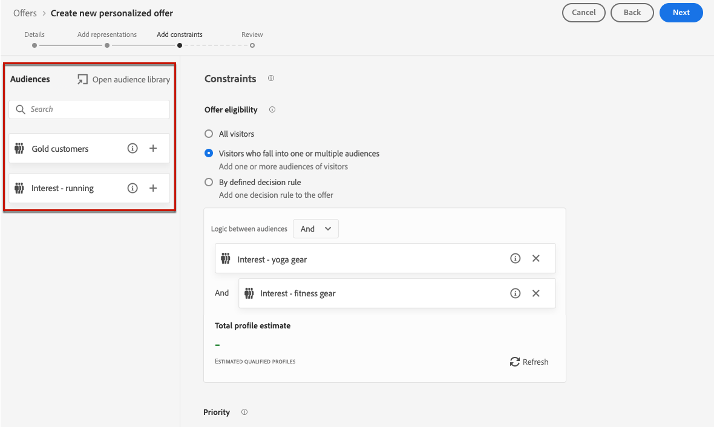
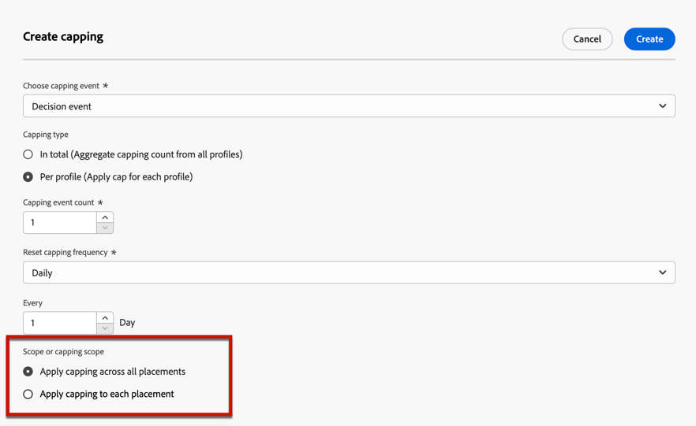

# Aggiungere vincoli a un’offerta {#add-constraints}

>[!CONTEXTUALHELP]
>id="od_offer_constraints"
>title="Informazioni sui vincoli delle offerte"
>abstract="Con i vincoli, puoi specificare in che modo l’offerta viene prioritaria e presentata all’utente rispetto ad altre offerte."

>[!CONTEXTUALHELP]
>id="od_offer_priority"
>title="Informazioni sulla priorità delle offerte"
>abstract="In questo campo, puoi specificare le impostazioni di priorità per l’offerta. La priorità è un numero utilizzato per classificare le offerte che soddisfano tutti i vincoli quali idoneità, date e limiti."

>[!CONTEXTUALHELP]
>id="ajo_decisioning_priority"
>title="Priorità"
>abstract="La priorità consente di definire la priorità dell’offerta rispetto alle altre se l’utente si qualifica per più di un’offerta. Maggiore sarà la priorità di un&#39;offerta, maggiore sarà la sua priorità rispetto ad altre offerte."

I vincoli ti consentono di definire le condizioni in cui verrà visualizzata un’offerta.

1. Configura le **[!UICONTROL Offer eligibility]**. [Ulteriori informazioni](#eligibility)

   

1. Definisci la **[!UICONTROL Priority]** dell’offerta rispetto alle altre se l’utente è idoneo per più di un’offerta. Maggiore sarà la priorità di un&#39;offerta, maggiore sarà la sua priorità rispetto ad altre offerte.

   

1. Specifica le offerte **[!UICONTROL Capping]**, ovvero il numero di volte in cui verrà presentata l’offerta. [Ulteriori informazioni](#capping)

   

1. Fai clic su **[!UICONTROL Next]** per confermare tutti i vincoli definiti.

Ad esempio, se imposti i vincoli seguenti:

* L’offerta verrà considerata solo per gli utenti che corrispondono alla regola di decisione &quot;Clienti Gold Loyalty&quot;.
* La priorità dell&#39;offerta è impostata su &quot;50&quot;, il che significa che l&#39;offerta sarà presentata prima delle offerte con una priorità compresa tra 1 e 49 e dopo quelle con una priorità di almeno 51.
* L’offerta verrà presentata una sola volta per utente in tutti i posizionamenti.

## Ammissibilità {#eligibility}

>[!CONTEXTUALHELP]
>id="ajo_decisioning_eligibility"
>title="Ammissibilità"
>abstract="L’idoneità delle offerte consente di limitare l’offerta a profili specifici definiti utilizzando segmenti o regole decisionali."

>[!CONTEXTUALHELP]
>id="od_offer_eligibility"
>title="Informazioni sull’idoneità delle offerte"
>abstract="In questa sezione puoi utilizzare le regole decisionali per determinare quali utenti sono idonei per l’offerta."
>additional-url="https://video.tv.adobe.com/v/329373" text="Guarda il video dimostrativo"

La **[!UICONTROL Offer eligibility]** La sezione ti consente di limitare l’offerta a profili specifici definiti utilizzando segmenti o regole decisionali.

>[!NOTE]
>
>Ulteriori informazioni sull&#39;utilizzo di **segmenti** contro **norme decisionali** in [questa sezione](#segments-vs-decision-rules).

* Per impostazione predefinita, la **[!UICONTROL All visitors]** viene selezionata, il che significa che qualsiasi profilo sarà idoneo per la presentazione dell’offerta.

   

* Puoi anche limitare la presentazione dell’offerta ai membri di uno o più [Segmenti Adobe Experience Platform](../../segment/about-segments.md).

   Per eseguire questa operazione, attiva il **[!UICONTROL Visitors who fall into one or multiple segments]** , quindi aggiungi uno o più segmenti dal riquadro a sinistra e combinali utilizzando la **[!UICONTROL And]** / **[!UICONTROL Or]** operatori logici.

   

* Per associare uno specifico [norma decisionale](../offer-library/creating-decision-rules.md) all’offerta, seleziona **[!UICONTROL By defined decision rule]**, quindi trascina la regola desiderata dal riquadro di sinistra nel **[!UICONTROL Decision rule]** area.

   

   >[!CAUTION]
   >
   >Le offerte basate su eventi non sono attualmente supportate in [!DNL Journey Optimizer]. Se crei una regola decisionale basata su un [event](https://experienceleague.adobe.com/docs/experience-platform/segmentation/ui/segment-builder.html?lang=en#events){target=&quot;_blank&quot;}, non potrai sfruttarlo in un&#39;offerta.

### Utilizzo di segmenti e regole decisionali {#segments-vs-decision-rules}

Per applicare un vincolo, è possibile limitare la selezione delle offerte ai membri di uno o più **Segmenti Adobe Experience Platform** oppure puoi utilizzare un **norma decisionale**, entrambe le soluzioni corrispondenti a diversi utilizzi.

In sostanza, l’output di un segmento è un elenco di profili, mentre una regola decisionale è una funzione eseguita su richiesta rispetto a un singolo profilo durante il processo decisionale. La differenza tra questi due utilizzi è illustrata di seguito.

* **Segmenti**

   Da un lato, i segmenti sono un gruppo di profili Adobe Experience Platform che corrispondono a una determinata logica in base agli attributi di profilo e agli eventi di esperienza. Tuttavia, Gestione delle offerte non esegue il calcolo del segmento, che potrebbe non essere aggiornato al momento della presentazione dell’offerta.

   Ulteriori informazioni sui segmenti in [questa sezione](../../segment/about-segments.md).

* **Regole di decisione**

   D’altra parte, una regola decisionale si basa sui dati disponibili in Adobe Experience Platform e determina a chi può essere visualizzata un’offerta. Una volta selezionata in un’offerta o in una decisione per un determinato posizionamento, la regola viene eseguita ogni volta che viene presa una decisione, in modo che ogni profilo ottenga l’ultima e l’offerta migliore.

   Ulteriori informazioni sulle regole decisionali in [questa sezione](creating-decision-rules.md).

## Limite di frequenza {#capping}

>[!CONTEXTUALHELP]
>id="od_offer_globalcap"
>title="Informazioni sul limite delle offerte"
>abstract="In questo campo, puoi specificare quante volte può essere presentata l’offerta."

>[!CONTEXTUALHELP]
>id="ajo_decisioning_capping"
>title="Limitazione"
>abstract="La limitazione di utilizzo viene utilizzata per definire il numero massimo di volte in cui è possibile presentare un’offerta."

La limitazione di utilizzo viene utilizzata per definire il numero massimo di volte in cui è possibile presentare un’offerta.

Limitare il numero di volte in cui gli utenti ricevono offerte specifiche ti consente di evitare di sollecitare eccessivamente i clienti e, quindi, di ottimizzare ogni punto di contatto con l’offerta migliore.

Per impostare il limite, effettua le seguenti operazioni.

1. Definisci il numero di volte in cui può essere presentata l’offerta.

   

   >[!NOTE]
   >
   >Il numero deve essere maggiore di 0.

1. Specifica se desideri che il limite sia applicato a tutti gli utenti o a un profilo specifico:

   

   * Seleziona **[!UICONTROL In total]** per definire quante volte un’offerta può essere proposta tra il pubblico di destinazione combinato, ovvero tra tutti gli utenti.

      Ad esempio, se sei un rivenditore di elettronica con un&#39;offerta di porta TV, vuoi che l&#39;offerta venga restituita solo 200 volte in tutti i profili.

   * Seleziona **[!UICONTROL Per profile]** per definire quante volte può essere proposta un’offerta allo stesso utente.

      Ad esempio, se sei una banca con un&#39;offerta &quot;Carta di credito Platinum&quot;, non vuoi che questa offerta venga visualizzata più di 5 volte per profilo. In effetti, si ritiene che se l&#39;utente ha visto l&#39;offerta 5 volte e non ha agito su di essa, ha una maggiore possibilità di agire sulla prossima offerta migliore.

1. Se ne hai definiti diversi [rappresentazioni](#representations) per l’offerta, specifica se applicare il limite **[!UICONTROL All placements]** o **[!UICONTROL Per placement]**.

   

   * **[!UICONTROL All placements]**: i conteggi dei massimali totalizzeranno tutte le decisioni nei posizionamenti associati all’offerta.

      Ad esempio, se un’offerta ha una **E-mail** posizionamento e **Web** e si imposta il limite su **2 per profilo in tutti i posizionamenti**, ogni profilo potrebbe ricevere l’offerta fino a 2 volte in totale, indipendentemente dal mix di posizionamento.

   * **[!UICONTROL Per placement]**: i conteggi dei limiti applicheranno separatamente i conteggi delle decisioni per ogni posizionamento.

      Ad esempio, se un’offerta ha una **E-mail** posizionamento e **Web** e si imposta il limite su **2 per profilo per ogni posizionamento**, allora ogni profilo potrebbe ricevere l’offerta fino a 2 volte per il posizionamento dell’e-mail e un ulteriore 2 volte per il posizionamento web.

1. Una volta salvata e approvata, se all’offerta è stato presentato il numero di volte specificato in questo campo in base ai criteri definiti, la consegna verrà interrotta.

Il numero di volte in cui viene proposta un’offerta viene calcolato al momento della preparazione dell’e-mail. Ad esempio, se prepari un’e-mail contenente una serie di offerte, questi numeri vengono conteggiati in base al tetto massimo, indipendentemente dal fatto che l’e-mail venga inviata o meno.

<!--If an email delivery is deleted or if the preparation is done again before being sent, the capping value for the offer is automatically updated.-->

>[!NOTE]
>
>I contatori di maschiatura vengono reimpostati quando l’offerta scade o due anni dopo la data di inizio dell’offerta, a seconda di quale dei due eventi si verifica per primi. Scopri come definire la data di un’offerta in [questa sezione](creating-personalized-offers.md#create-offer).

### Impatto della modifica delle date sul massimale {#capping-change-date}

>[!CONTEXTUALHELP]
>id="ajo_decisioning_offer_change_date"
>title="La modifica della data può influire sui limiti"
>abstract="Se il limite viene applicato a questa offerta, potrebbe essere interessato quando si modifica la data di inizio o di fine."

È necessario prestare attenzione quando si modifica la data di un’offerta, perché questo può avere un impatto sui limiti se vengono soddisfatte le seguenti condizioni:

* L&#39;offerta è [approvato](#review).
* [Limitazione](#capping) è già applicato all’offerta.
* La limitazione di utilizzo è definita in base al profilo.

>[!NOTE]
>
>Scopri come definire la data di un’offerta in [questa sezione](creating-personalized-offers.md#create-offer).

Il limite di frequenza per profilo memorizza i conteggi dei limiti su ciascun profilo. Quando modifichi la data di inizio e di fine di un’offerta approvata, il conteggio dei limiti per alcuni profili potrebbe essere interessato in base ai diversi scenari descritti di seguito.

Di seguito sono riportati gli scenari possibili quando **modifica di una data di inizio offerta**:

| Scenario: Se... | Cosa succede: allora... | Possibile impatto sul conteggio dei limiti |
|--- |--- |--- |
| ... la data di inizio dell’offerta viene aggiornata prima dell’inizio della data di inizio dell’offerta originale, | ... il conteggio dei limiti inizierà alla nuova data di inizio. | No |
| ... la nuova data di inizio è anteriore alla data di fine corrente, | ... il limite continuerà con una nuova data di inizio e il precedente conteggio dei limiti per ciascun profilo verrà riportato. | No |
| ... la nuova data di inizio è successiva alla data di fine corrente, | ... il limite attuale scade e il nuovo conteggio dei limiti ripartirà da 0 per tutti i profili alla nuova data di inizio. | Sì |

Di seguito sono riportati gli scenari possibili quando **estensione di una data di fine offerta**:

| Scenario: Se... | Cosa succede: allora... | Possibile impatto sul conteggio dei limiti |
|--- |--- |--- |
| ... una richiesta di decisione si verifica prima della data di fine dell’offerta originale, | ... il conteggio dei limiti verrà aggiornato e il conteggio dei limiti precedente per ciascun profilo verrà riportato. | No |
| ... nessuna richiesta di decisione viene effettuata prima della data di fine originale, | ... il conteggio dei limiti verrà reimpostato sulla data di fine originale per ciascun profilo. Il nuovo conteggio dei limiti inizia da 0 per tutte le nuove richieste di decisione che verranno effettuate dopo la data di fine originale. | Sì |

**Esempio**

Supponiamo di avere un&#39;offerta con una data di inizio originale impostata su **Gennaio 1**, in scadenza **31 gennaio**.

1. Vengono presentati i profili X, Y e Z.
1. On **Gennaio 10**, la data di fine dell’offerta viene modificata in **15 febbraio**.
1. **Dall&#39;11 gennaio al 31 gennaio**, l’offerta viene presentata solo al profilo Z.

   * Perché una richiesta di decisione si è verificata prima della data di fine originale **per il profilo Z**, la data di fine dell’offerta può essere estesa a **15 febbraio**.
   * Tuttavia, poiché non si è verificata alcuna attività prima della data di fine originale per **profili X e Y**, i loro contatori scadranno e i loro conteggi dei limiti saranno reimpostati a 0 su **31 gennaio**.

