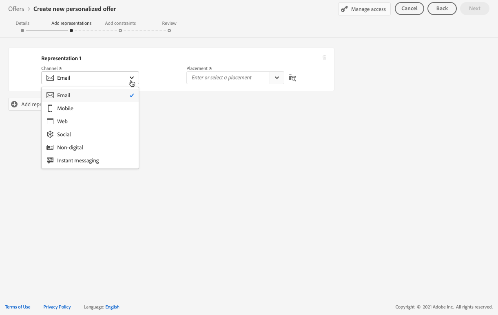
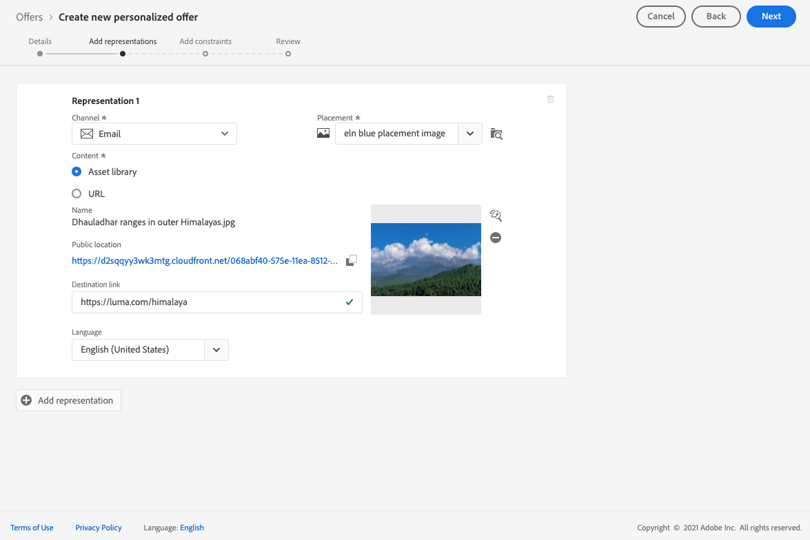
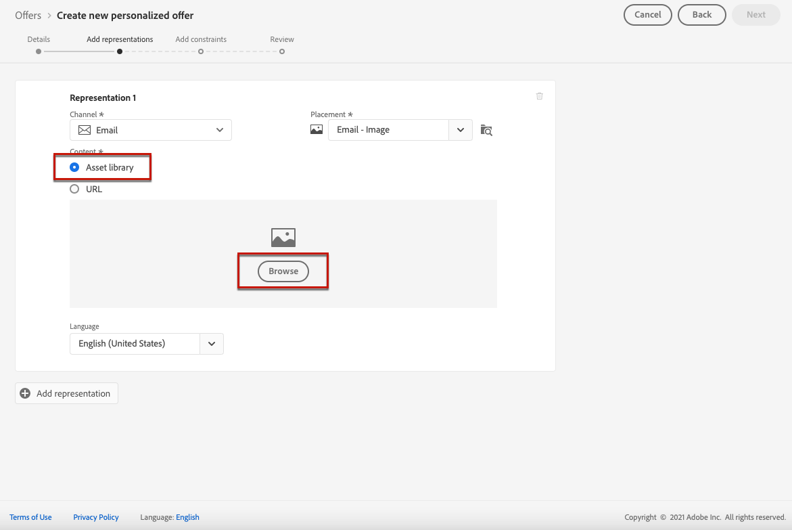

# Aggiungere rappresentazioni a un’offerta {#add-representations}

>[!CONTEXTUALHELP]
>id="ajo_decisioning_representation"
>title="Rappresentazioni"
>abstract="Aggiungi delle rappresentazioni per definire dove verrà visualizzata l’offerta nel messaggio. Più rappresentazioni sono disponibili, più opportunità esistono per utilizzare l’offerta in contesti di posizionamento diversi."

Un’offerta può essere visualizzata in posizioni diverse all’interno di un messaggio: in un banner superiore con un’immagine, come testo in un paragrafo, come blocco di HTML, ecc. Più rappresentazioni sono disponibili, più opportunità esistono per utilizzare l’offerta in contesti di posizionamento diversi.

## Configurare le rappresentazioni dell’offerta {#representations}

Per aggiungere una o più rappresentazioni all’offerta e configurarle, effettua le seguenti operazioni.

1. Per la prima rappresentazione, inizia selezionando la **[!UICONTROL Channel]** verrà utilizzato.

   

   >[!NOTE]
   >
   >Vengono visualizzati solo i posizionamenti disponibili per il canale selezionato nel **[!UICONTROL Placement]** elenco a discesa.

1. Seleziona un posizionamento dall’elenco.

   Puoi inoltre utilizzare il pulsante accanto al **[!UICONTROL Placement]** elenco a discesa per sfogliare tutti i posizionamenti.

   

   È comunque possibile filtrare i posizionamenti in base al relativo canale e/o tipo di contenuto. Scegli un posizionamento e fai clic su **[!UICONTROL Select]**.

   

1. Aggiungi contenuto alla tua rappresentazione. Scopri come in [questa sezione](#content).

1. Quando aggiungi contenuto, ad esempio un’immagine o un URL, puoi specificare un **[!UICONTROL Destination link]**: gli utenti che fanno clic sull’offerta verranno indirizzati alla pagina corrispondente.

   

1. Infine, seleziona la lingua scelta per identificare e gestire gli elementi da visualizzare agli utenti.

1. Per aggiungere un&#39;altra rappresentazione, utilizza la **[!UICONTROL Add representation]** e aggiungi tutte le rappresentazioni necessarie.

   

1. Dopo aver aggiunto tutte le rappresentazioni, seleziona **[!UICONTROL Next]**.

## Definire il contenuto per le rappresentazioni {#content}

È possibile aggiungere diversi tipi di contenuto a una rappresentazione.

>[!NOTE]
>
>È disponibile per l’uso solo il contenuto corrispondente al tipo di contenuto del posizionamento.

### Aggiungere immagini {#images}

Se la posizione selezionata è di tipo immagine, puoi aggiungere contenuto proveniente da **Risorsa Adobe Experience Cloud** libreria, un archivio centralizzato di risorse fornito da [!DNL Adobe Experience Manager Assets Essentials].

>[!NOTE]
>
> Per lavorare con [Adobe Experience Manager Assets Essentials](https://experienceleague.adobe.com/docs/experience-manager-assets-essentials/help/introduction.html){target=&quot;_blank&quot;}, devi distribuire [!DNL Assets Essentials] per la tua organizzazione e assicurati che gli utenti facciano parte del **Utenti consumer Assets Essentials** o **Utenti Assets Essentials** Profili di prodotto. Ulteriori informazioni su [questa pagina](https://experienceleague.adobe.com/docs/experience-manager-assets-essentials/help/get-started-admins/deploy-administer.html){target=&quot;_blank&quot;}.

1. Scegli l’opzione **[!UICONTROL Asset library]**.

1. Seleziona **[!UICONTROL Browse]**.

   

1. Sfoglia le risorse per selezionare l&#39;immagine desiderata

1. Fai clic su **[!UICONTROL Select]**.

   

### Aggiungere file HTML o JSON {#html-json}

Se il posizionamento selezionato è di tipo HTML, puoi anche aggiungere contenuto HTML o JSON proveniente da [Libreria risorse Adobe Experience Cloud](https://experienceleague.adobe.com/docs/experience-manager-assets-essentials/help/introduction.html){target=&quot;_blank&quot;}).

Ad esempio, hai creato un modello e-mail di HTML in [Adobe Experience Manager](https://experienceleague.adobe.com/docs/experience-manager.html){target=&quot;_blank&quot;} e desideri utilizzare il file per il contenuto dell&#39;offerta. Invece di creare un nuovo file, puoi semplicemente caricare il modello nel **Libreria risorse** per riutilizzarlo nelle rappresentazioni dell’offerta.

Per riutilizzare il contenuto in una rappresentazione, sfoglia **Libreria risorse** come descritto in [questa sezione](#images) e seleziona il file HTML o JSON desiderato.

### Aggiungi URL {#urls}

Per aggiungere contenuto da una posizione pubblica esterna, seleziona **[!UICONTROL URL]**, quindi immetti l’indirizzo URL del contenuto da aggiungere.

### Aggiungi testo personalizzato {#custom-text}

È inoltre possibile inserire contenuto di tipo testo quando si seleziona una posizione compatibile.

1. Seleziona la **[!UICONTROL Custom]** e fai clic su **[!UICONTROL Add content]**.

   

   >[!NOTE]
   >
   >Questa opzione non è disponibile per i posizionamenti di tipo immagine.

1. Digita il testo che verrà visualizzato nell’offerta.

   

   Puoi personalizzare il contenuto utilizzando l’editor espressioni. Ulteriori informazioni su [personalizzazione](../../personalization/personalize.md#use-expression-editor).

   

   >[!NOTE]
   >
   >Solo il **[!UICONTROL Profile attributes]**, **[!UICONTROL Segment memberships]** e **[!UICONTROL Helper functions]** le fonti sono disponibili per la gestione delle decisioni.

