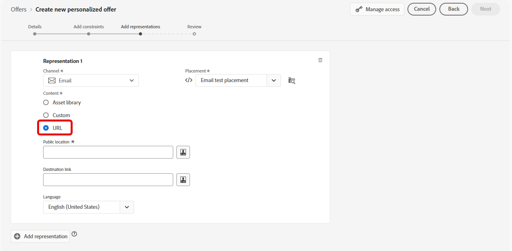

# Aggiungere rappresentazioni a un’offerta {#add-representations}

>[!TIP]
>
>La funzione Decisioni, la nuova funzionalità decisionale di [!DNL Adobe Journey Optimizer], è ora disponibile tramite i canali e-mail e di esperienza basati su codice. [Ulteriori informazioni](../../experience-decisioning/gs-experience-decisioning.md)

>[!CONTEXTUALHELP]
>id="ajo_decisioning_representation"
>title="Rappresentazioni"
>abstract="Aggiungi delle rappresentazioni per definire dove verrà visualizzata l’offerta nel messaggio. Più rappresentazioni ha un’offerta, maggiori sono le opportunità di utilizzo dell’offerta in contesti di posizionamento diversi."

Un’offerta può essere visualizzata in posizioni diverse all’interno di un messaggio: in un banner superiore con un’immagine, come testo in un paragrafo, come un blocco HTML e così via. Più rappresentazioni ha un’offerta, maggiori sono le opportunità di utilizzo dell’offerta in contesti di posizionamento diversi.

## Configurare le rappresentazioni dell’offerta {#representations}

Per aggiungere una o più rappresentazioni all’offerta e configurarle, segui i passaggi seguenti.

1. Per la prima rappresentazione, inizia selezionando il **[!UICONTROL Canale]** che verrà utilizzato.

   

   >[!NOTE]
   >
   >Solo i posizionamenti disponibili per il canale selezionato vengono visualizzati nell&#39;elenco a discesa **[!UICONTROL Posizionamento]**.

1. Selezionate un posizionamento dall&#39;elenco.

   Puoi anche utilizzare il pulsante accanto all&#39;elenco a discesa **[!UICONTROL Posizionamento]** per sfogliare tutti i posizionamenti.

   

   Lì è ancora possibile filtrare i posizionamenti in base al loro canale e/o tipo di contenuto. Scegli un posizionamento e fai clic su **[!UICONTROL Seleziona]**.

   

1. Aggiungi contenuto alla rappresentazione. Scopri come in [questa sezione](#content).

1. Quando aggiungi contenuto come un&#39;immagine o un URL, puoi specificare un **[!UICONTROL collegamento di destinazione]**: gli utenti che fanno clic sull&#39;offerta verranno indirizzati alla pagina corrispondente.

   

1. Infine, seleziona la lingua desiderata per identificare e gestire gli elementi da mostrare agli utenti.

1. Per aggiungere un&#39;altra rappresentazione, utilizzare il pulsante **[!UICONTROL Aggiungi rappresentazione]** e aggiungere tutte le rappresentazioni necessarie.

   

1. Dopo aver aggiunto tutte le rappresentazioni, seleziona **[!UICONTROL Avanti]**.

## Definire il contenuto per le rappresentazioni {#content}

È possibile aggiungere diversi tipi di contenuto a una rappresentazione.

>[!NOTE]
>
>È disponibile per l’uso solo il contenuto corrispondente al tipo di contenuto del posizionamento.

### Aggiungere immagini {#images}

Se il posizionamento selezionato è di tipo immagine, puoi aggiungere contenuto proveniente dalla libreria **Adobe Experience Cloud Asset**, un archivio centralizzato di risorse fornito da [!DNL Adobe Experience Manager Assets].

>[!NOTE]
>
> Per lavorare con [Adobe Experience Manager Assets Essentials](https://experienceleague.adobe.com/docs/experience-manager-assets-essentials/help/introduction.html){target="_blank"}, devi distribuire [!DNL Assets Essentials] per la tua organizzazione e assicurarti che gli utenti facciano parte dei **Utenti consumer di Assets Essentials** o/e **Utenti Assets Essentials** profili di prodotto. Ulteriori informazioni su [questa pagina](https://experienceleague.adobe.com/docs/experience-manager-assets-essentials/help/get-started-admins/deploy-administer.html){target="_blank"}.

1. Scegliere l&#39;opzione **[!UICONTROL Libreria risorse]**.

1. Seleziona **[!UICONTROL Sfoglia]**.

   

1. Sfoglia le risorse per selezionare l’immagine desiderata

1. Fai clic su **[!UICONTROL Seleziona]**.

   

### Aggiungere file HTML o JSON {#html-json}

Se il posizionamento selezionato è di tipo HTML, puoi anche aggiungere contenuto HTML o JSON proveniente dalla [libreria di risorse Adobe Experience Cloud](https://experienceleague.adobe.com/docs/experience-manager-assets-essentials/help/introduction.html){target="_blank"}).

Ad esempio, hai creato un modello di e-mail di HTML in [Adobe Experience Manager](https://experienceleague.adobe.com/docs/experience-manager.html){target="_blank"} e desideri utilizzare tale file per il contenuto dell&#39;offerta. Invece di creare un nuovo file, puoi semplicemente caricare il modello nella **Libreria risorse** per riutilizzarlo nelle rappresentazioni dell&#39;offerta.

Per riutilizzare il contenuto in una rappresentazione, sfoglia la **Libreria risorse** come descritto in [questa sezione](#images) e seleziona il file HTML o JSON desiderato.


### Aggiungi URL {#urls}

Per aggiungere contenuto da una posizione pubblica esterna, selezionare **[!UICONTROL URL]**, quindi immettere l&#39;indirizzo URL del contenuto da aggiungere.

Puoi personalizzare gli URL utilizzando l’editor di personalizzazione. Ulteriori informazioni sulla [personalizzazione](../../personalization/personalize.md#use-expression-editor).



Ad esempio, desideri personalizzare l’immagine visualizzata come offerta. Vuoi che gli utenti che preferiscono le vacanze in città vedano lo skyline di New York e quelli che preferiscono le vacanze in spiaggia vedano la costa nord delle Hawaii.

Utilizza l’editor di personalizzazione per recuperare gli attributi del profilo memorizzati in Adobe Experience Platform utilizzando gli schemi di unione. [Ulteriori informazioni](https://experienceleague.adobe.com/docs/experience-platform/profile/union-schemas/union-schemas-overview.html){target="_blank"}


Se si specifica un **[!UICONTROL collegamento di destinazione]**, è possibile personalizzare anche l&#39;URL a cui verranno indirizzati gli utenti che fanno clic sull&#39;offerta.

### Aggiungi testo personalizzato {#custom-text}

È inoltre possibile inserire contenuto di tipo testo quando si seleziona un posizionamento compatibile.

1. Seleziona l&#39;opzione **[!UICONTROL Personalizzato]** e fai clic su **[!UICONTROL Aggiungi contenuto]**.

   

   >[!NOTE]
   >
   >Questa opzione non è disponibile per i posizionamenti di tipo immagine.

1. Digita il testo che verrà visualizzato nell’offerta.

   

   Puoi personalizzare i contenuti utilizzando l’editor di personalizzazione. Ulteriori informazioni sulla [personalizzazione](../../personalization/personalize.md#use-expression-editor).

   

   >[!NOTE]
   >
   >Solo le origini **[!UICONTROL Attributi profilo]**, **[!UICONTROL Tipi di pubblico]** e **[!UICONTROL Funzioni helper]** sono disponibili per la gestione delle decisioni.

## Personalizzare le rappresentazioni in base ai dati contestuali{#context-data}

Quando i dati contestuali vengono passati nella chiamata [Edge decisioning](../api-reference/offer-delivery-api/edge-decisioning-api.md), puoi sfruttare questi dati per personalizzare dinamicamente le rappresentazioni. Ad esempio, puoi personalizzare la rappresentazione di un’offerta in base a fattori in tempo reale, come le condizioni meteo correnti al momento in cui viene presa la decisione.

Per utilizzare i dati contestuali nelle rappresentazioni delle offerte, incorporare la variabile di dati contestuali direttamente nel contenuto della rappresentazione utilizzando lo spazio dei nomi `profile.timeSeriesEvents.`.

Di seguito è riportato un esempio di sintassi utilizzato per personalizzare la rappresentazione di un’offerta in base ai sistemi operativi degli utenti:

```
 iosandroid 
```

La richiesta di Edge decisioning corrispondente, inclusi i dati contestuali, è la seguente:

```
{
    "body": {
        "xdm": {
            "identityMap": {
                "Email": [
                    {
                        "id": "xyz@abc.com"
                    }
                ]
            },
            "device": {
                "model": "Apple"
            }
        },
        "extra": {
            "query": {
                "decisionScopes": [
                    "eyJ4ZG06..."
                ]
            }
        }
    }
}
```
