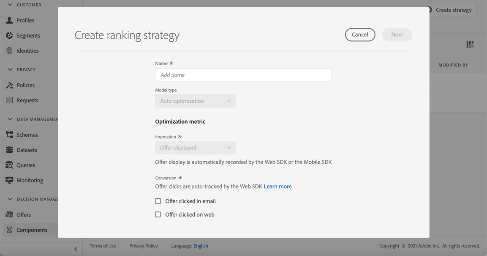
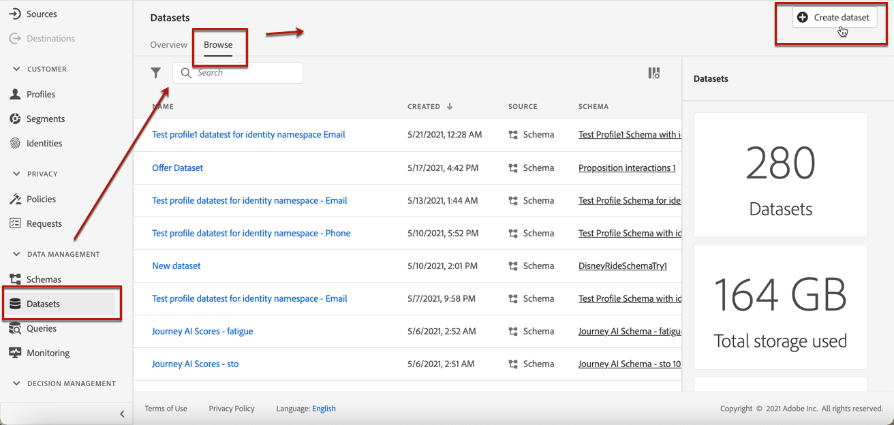

# Creare modelli AI {#ai-rankings}

## Creare una strategia di classificazione {#create-ranking-strategy}

Per creare una strategia di classificazione, segui i passaggi seguenti:

1. Accedere al **[!UICONTROL Components]** quindi seleziona il **[!UICONTROL AI rankings]** scheda .

   

   Vengono elencate tutte le strategie di classificazione create finora.

1. Fai clic sul pulsante **[!UICONTROL Create strategy]**.

1. Compila i campi seguenti:

   

   * **[!UICONTROL Name]**: Nome univoco da specificare.

   * **[!UICONTROL Model type]**: Attualmente in [!DNL Journey Optimizer] l&#39;unico tipo di modello supportato è **[!UICONTROL Auto-optimization]**. [Ulteriori informazioni](ai-ranking.md#auto-optimization)

   * **[!UICONTROL Optimization metric]**

      Questa opzione consente agli addetti al marketing di scegliere come generare e addestrare il modello di apprendimento automatico: in base alle offerte visualizzate, alle offerte su cui è stato fatto clic nell’e-mail e/o alle offerte su cui è stato fatto clic sul web.

      >[!NOTE]
      >
      >Se necessario, puoi selezionare tutti i tipi di metrica.

      Esistono due tipi di metriche di ottimizzazione:
      * **[!UICONTROL Impression]**: Al momento gli eventi di impression corrispondono a tutte le offerte visualizzate.
      * **[!UICONTROL Conversion]**: Gli eventi di conversione corrispondono a tutte le offerte che generano clic tramite e-mail o web.

      Tutti gli eventi di impression e/o conversione selezionati verranno acquisiti automaticamente utilizzando l’SDK per web o l’SDK mobile fornito. Ulteriori informazioni su questo in [Panoramica di Adobe Experience Platform Web SDK](https://experienceleague.adobe.com/docs/experience-platform/edge/home.html?lang=it).

   * **[!UICONTROL Dataset ID]**: Per le conversioni, devi fornire un set di dati in cui vengono raccolti gli eventi selezionandolo dall’elenco a discesa. Scopri come creare tale set di dati in [questa sezione](#create-dataset). <!--This dataset needs to be associated with a schema that must have the **[!UICONTROL Proposition Interactions]** field group (previously known as mixin) associated with it.-->

   

   >[!CAUTION]
   >
   >Solo i set di dati creati dagli schemi associati alla **[!UICONTROL Experience Event - Proposition Interactions]** i gruppi di campi (precedentemente noti come mixin) vengono visualizzati nell’elenco a discesa.

1. Salva e attiva la strategia di classificazione.

   

È ora pronto per essere utilizzato in una decisione per classificare le offerte ammissibili per un posizionamento. [Ulteriori informazioni](../offer-activities/configure-offer-selection.md#use-ranking-strategy).<!--TBC?-->

## Creare un set di dati per raccogliere gli eventi {#create-dataset}

Devi creare un set di dati in cui verranno raccolti gli eventi di conversione. Inizia creando lo schema che verrà utilizzato nel set di dati:

1. Da **[!UICONTROL Data Management]** menu, seleziona **[!UICONTROL Schema]**, vai al **[!UICONTROL Browse]** e fai clic su **[!UICONTROL Create schema]**.

   

1. Scegli **[!UICONTROL XDM ExperienceEvent]**.

   

   >[!NOTE]
   >
   >    Ulteriori informazioni sugli schemi e sui gruppi di campi XDM nella sezione [Panoramica del sistema XDM](https://experienceleague.adobe.com/docs/experience-platform/xdm/home.html?lang=it).


1. In **[!UICONTROL Search]** digitare &quot;proposition Interposition&quot; e selezionare il campo **[!UICONTROL Experience Event - Proposition Interactions]** gruppo di campi.

   

   >[!CAUTION]
   >
   >    Lo schema che verrà utilizzato nel set di dati deve avere **[!UICONTROL Experience Event - Proposition Interactions]** gruppo di campi associato. In caso contrario, non potrai utilizzarlo nella tua strategia di classificazione.

1. Fai clic su **[!UICONTROL Add field groups]**.

   

   >[!NOTE]
   >Il gruppo di campi era precedentemente noto come mixin.

1. Digitare un nome e salvare lo schema.<!--How do you edit the fields in this new schema? Examples?-->

>[!NOTE]
>
>    Ulteriori informazioni sulla creazione degli schemi in [Nozioni di base sulla composizione dello schema](https://experienceleague.adobe.com/docs/experience-platform/xdm/schema/composition.html?lang=en#understanding-schemas).

Ora puoi creare un set di dati utilizzando questo schema. Per farlo, segui la procedura indicata di seguito:

1. Da **[!UICONTROL Data Management]** menu, seleziona **[!UICONTROL Datasets]**, vai al **[!UICONTROL Browse]** e fai clic su **[!UICONTROL Create dataset]**.

   

1. Seleziona **[!UICONTROL Create dataset from schema]**.

   

1. Seleziona dall’elenco lo schema appena creato.

   

1. Fai clic su **[!UICONTROL Next]**.

1. Immetti un nome univoco per il set di dati nel **[!UICONTROL Name]** campo e fai clic su **[!UICONTROL Finish]**.

   

Il set di dati è ora pronto per essere selezionato per raccogliere i dati dell’evento quando [creazione di una strategia di classificazione](#create-ranking-strategy).

## Requisiti dello schema dell’offerta {#schema-requirements}

A questo punto, devi disporre di:

* ha creato la strategia di classificazione,
* definito il tipo di evento da acquisire - offerta visualizzata (impression) e/o offerta su cui si è fatto clic (conversione),
* e in cui desideri raccogliere i dati dell’evento.

Ora ogni volta che un’offerta viene visualizzata e/o fai clic su di essa, desideri che l’evento corrispondente venga catturato automaticamente da **[!UICONTROL Experience Event - Proposition Interactions]** gruppo di campi utilizzando [Adobe Experience Platform Web SDK](https://experienceleague.adobe.com/docs/experience-platform/edge/web-sdk-faq.html#what-is-adobe-experience-platform-web-sdk%3F){target=&quot;_blank&quot;} o Mobile SDK.

Per poter inviare tipi di evento (offerta visualizzata o offerta su cui è stato fatto clic), devi impostare il valore corretto per ciascun tipo di evento in un evento di esperienza inviato in Adobe Experience Platform. Di seguito sono riportati i requisiti dello schema da implementare nel codice JavaScript:

### Scenario visualizzato dell’offerta

**Tipo evento:** `decisioning.propositionDisplay`
**Origine:** Web.sdk/Alloy.js (`sendEvent command -> xdm : {eventType, interactionMixin}`) o acquisizione batch
+++**Payload di esempio:**

```
{
    "@id": "a7864a96-1eac-4934-ab44-54ad037b4f2b",
    "xdm:timestamp": "2020-09-26T15:52:25+00:00",
    "xdm:eventType": "decisioning.propositionDisplay",
    "https://ns.adobe.com/experience/decisioning/propositions":
    [
        {
            "xdm:items":
            [
                {
                    "xdm:id": "personalized-offer:f67bab756ed6ee4",
                },
                {
                    "xdm:id": "personalized-offer:f67bab756ed6ee5",
                }
            ],
            "xdm:id": "3cc33a7e-13ca-4b19-b25d-c816eff9a70a", //decision event id - taken from experience event for “nextBestOffer”
            "xdm:scope": "scope:12cfc3fa94281acb", //decision scope id - taken from experience event for “nextBestOffer”
        }
    ]
}
```

+++

### Scenario con clic sull’offerta

**Tipo evento:** `decisioning.propositionInteract`
**Origine:** Web.sdk/Alloy.js (`sendEvent command -> xdm : {eventType, interactionMixin}`) o acquisizione batch
+++**Payload di esempio:**

```
{
    "@id": "a7864a96-1eac-4934-ab44-54ad037b4f2b",
    "xdm:timestamp": "2020-09-26T15:52:25+00:00",
    "xdm:eventType": "decisioning.propositionInteract",
    "https://ns.adobe.com/experience/decisioning/propositions":
    [
        {
            "xdm:items":
            [
                {
                    "xdm:id": "personalized-offer:f67bab756ed6ee4"
                },
                {
                    "xdm:id": "personalized-offer:f67bab756ed6ee5"
                },
            ],
            "xdm:id": "3cc33a7e-13ca-4b19-b25d-c816eff9a70a", //decision event id
            "xdm:scope": "scope:12cfc3fa94281acb", //decision scope id
        }
    ]
}
```

+++

<!--
## Using a ranking strategy {#using-ranking}

To use the ranking strategy you created above, follow the steps below:

Once a ranking strategy has been created, you can assign it to a placement in a decision. For more on this, see [Configure offers selection in decisions](../offer-activities/configure-offer-selection.md).

1. Create a decision.
1. Add a placement.
1. Add a collection.
1. Choose to rank offers by AI ranking (select it from the drop-down list).
1. Click Add ranking.
1. Select the ranking strategy that you created. All the details of the ranking strategy are displayed.
1. Click Next to confirm.
1. Save your decision.

It is now ready to be used in a decision to rank eligible offers for a placement (see [Configure offers selection in decisions](../offer-activities/configure-offer-selection.md)).
-->

