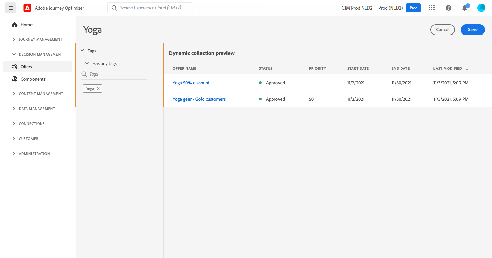

# Creare le raccolte {#create-collections}

>[!CONTEXTUALHELP]
>id="ajo_decisioning_decision_collection"
>title="Informazioni sulle raccolte di offerte"
>abstract="Le raccolte consentono di organizzare le offerte raggruppandole in categorie a tua scelta."

>[!CONTEXTUALHELP]
>id="ajo_decisioning_collection_dynamic"
>title="Raccolta dinamica"
>abstract="Utilizza i qualificatori di raccolta per qualificare dinamicamente le offerte per una raccolta."

>[!CONTEXTUALHELP]
>id="ajo_decisioning_collection_static"
>title="Raccolta statica"
>abstract="Seleziona e raggruppa manualmente le offerte utilizzando criteri quali lo stato, i qualificatori di raccolta, la data e il canale."

>[!CONTEXTUALHELP]
>id="ajo_decisioning_collection_static_select"
>title="Anteprima raccolta statica"
>abstract="Le raccolte statiche vengono create selezionando manualmente le singole offerte da includere nella raccolta. La raccolta può essere aggiornata solo aggiungendo manualmente altre offerte."

>[!CONTEXTUALHELP]
>id="ajo_decisioning_collection_dynamic_select"
>title="Anteprima raccolta dinamica"
>abstract="Le raccolte dinamiche raccolgono le offerte in base ai qualificatori di raccolta. Queste raccolte vengono aggiornate automaticamente. Ad esempio, se viene creata una nuova offerta con il qualificatore di raccolta “sport”, questa verrà aggiunta automaticamente alla raccolta corrispondente."

Le raccolte ti consentono di organizzare le offerte raggruppandole in categorie a tua scelta. Ad esempio, puoi creare una raccolta &quot;sport&quot; che conterrà solo offerte relative allo sport.

➡️ [Scopri questa funzione nel video](#video)

L&#39;elenco delle raccolte di offerte è accessibile nel menu **[!UICONTROL Offerte]**.

Puoi creare due tipi di raccolte:

* **Le raccolte dinamiche** sono raccolte di offerte basate su qualificatori di raccolta (noti in precedenza come &quot;tag&quot;). Queste raccolte vengono aggiornate automaticamente. Ad esempio, se viene creata una nuova offerta con il qualificatore di raccolta selezionato, questa verrà aggiunta automaticamente alla raccolta.

* **Le raccolte statiche** sono raccolte create selezionando manualmente le singole offerte da includere nella raccolta. La raccolta può essere aggiornata solo aggiungendo manualmente altre offerte.

Per creare una raccolta, effettua le seguenti operazioni:

1. Vai alla scheda **[!UICONTROL Raccolte]**, quindi fai clic su **[!UICONTROL Crea raccolta]**.

1. Specifica il nome e il tipo di raccolta da creare.

   

1. Per creare una raccolta dinamica, utilizzare il riquadro a sinistra per selezionare il qualificatore di raccolta delle offerte da aggiungere alla raccolta, quindi fare clic su **[!UICONTROL Salva]**. Tutte le offerte con il qualificatore di raccolta selezionato verranno salvate nella raccolta.

   Per ulteriori informazioni sulla creazione di qualificatori di raccolta, vedere [Creare qualificatori di raccolta](../offer-library/creating-tags.md).

   

1. Per creare una raccolta statica, utilizza il riquadro a sinistra per filtrare l’elenco delle offerte (stato, qualificatore della raccolta, data, canale, tipo di contenuto), quindi seleziona le offerte da aggiungere alla raccolta.

   

   >[!NOTE]
   >
   >Le raccolte statiche non vengono aggiornate automaticamente. Per aggiungere offerte a una raccolta statica, devi modificarla e aggiungerle manualmente.

1. Per assegnare etichette di utilizzo dei dati personalizzate o di base a una raccolta statica, selezionare **[!UICONTROL Gestisci accesso]**. [Ulteriori informazioni sul controllo degli accessi a livello di oggetto (OLAC)](../../administration/object-based-access.md)

   >[!NOTE]
   >
   >L&#39;utilizzo di OLAC non è disponibile per le raccolte dinamiche. Deve essere gestito a livello di offerta. Di conseguenza, se non hai accesso a nessuna di queste offerte, è possibile che non venga visualizzata alcuna offerta all’interno di una raccolta dinamica.

1. Una volta creata la raccolta, questa viene visualizzata nell’elenco. Puoi selezionarla per modificarla o eliminarla.

   

## Video dimostrativo {#video}

>[!VIDEO](https://video.tv.adobe.com/v/346688?captions=ita&quality=12)

