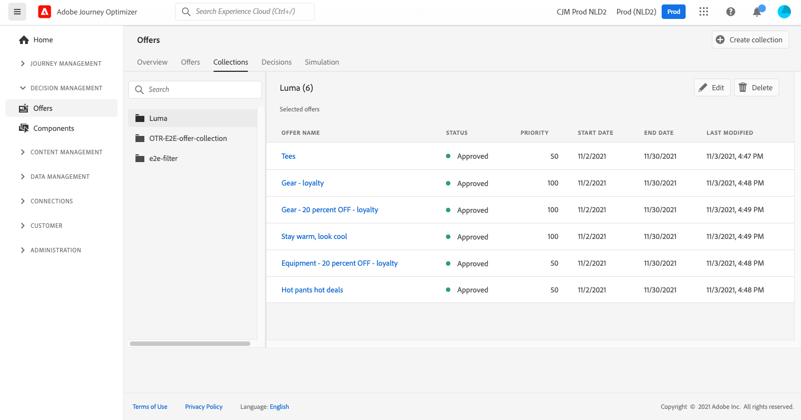

# Creare le raccolte {#create-collections}

>[!CONTEXTUALHELP]
>id="ajo_decisioning_decision_collection"
>title="Informazioni sulle raccolte di offerte"
>abstract="Con le raccolte di offerte, puoi organizzare le offerte raggruppandole in categorie a tua scelta."

Le raccolte ti consentono di organizzare le offerte raggruppandole in categorie a tua scelta. Ad esempio, puoi creare una collezione &quot;sport&quot; che conterrà solo offerte relative allo sport.

➡️ [Scopri questa funzione nel video](#video)

L’elenco delle raccolte di offerte è accessibile nella **[!UICONTROL Offerte]** menu.

Puoi creare due tipi di raccolte:

* **Raccolte dinamiche** sono raccolte di offerte basate su tag. Queste raccolte vengono aggiornate automaticamente. Ad esempio, se viene creata una nuova offerta con il tag selezionato, questa verrà aggiunta automaticamente alla raccolta.

* **Raccolte statiche** sono raccolte create selezionando manualmente le singole offerte da includere nella raccolta. È possibile aggiornare la raccolta solo aggiungendo manualmente ulteriori offerte.

Per creare una raccolta, effettua le seguenti operazioni:

1. Vai a **[!UICONTROL Raccolte]** scheda , quindi fai clic su **[!UICONTROL Crea raccolta]**.

1. Specifica il nome e il tipo di raccolta da creare.

   

1. Per creare una raccolta dinamica, utilizza il riquadro a sinistra per selezionare il tag delle offerte da aggiungere alla raccolta, quindi fai clic su **[!UICONTROL Salva]**. Tutte le offerte con il tag selezionato verranno salvate nella raccolta.

   Per ulteriori informazioni sulla creazione dei tag, consulta [Creare tag](../offer-library/creating-tags.md).

   

1. Per creare una raccolta statica, utilizza il riquadro a sinistra per filtrare l’elenco delle offerte (stato, tag, data, canale, tipo di contenuto), quindi seleziona le offerte da aggiungere alla raccolta.

   

   >[!NOTE]
   >
   >Le raccolte statiche non vengono aggiornate automaticamente. Per aggiungere offerte a una raccolta statica, devi modificarla e aggiungerla manualmente.

1. Per assegnare etichette di utilizzo dati personalizzate o principali a una raccolta statica, seleziona **[!UICONTROL Gestisci accesso]**. [Ulteriori informazioni su Object Level Access Control (OLAC)](../../administration/object-based-access.md)

1. Una volta creata la raccolta, questa viene visualizzata nell’elenco. È possibile selezionarlo per modificarlo o eliminarlo.

   

## Video introduttivo {#video}

>[!VIDEO](https://video.tv.adobe.com/v/329376?quality=12)

