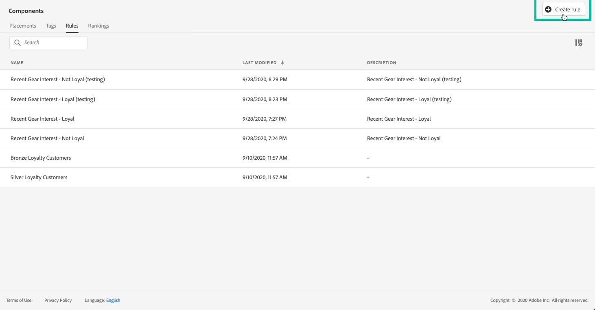
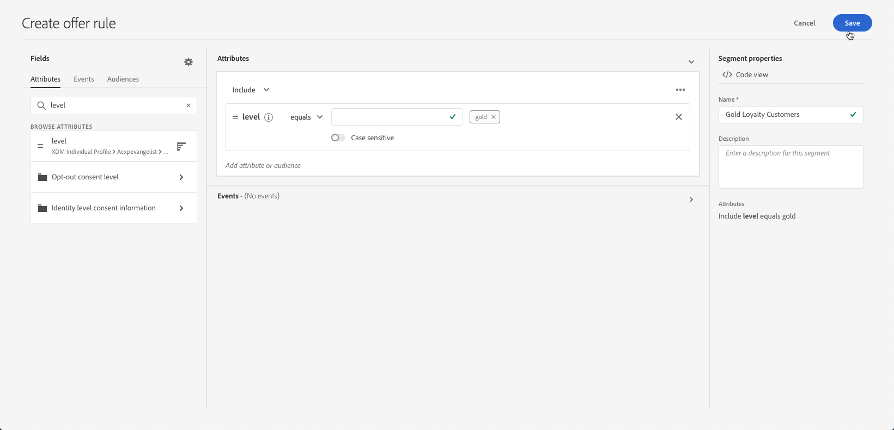

# Creare regole di decisione {#creating-decision-rules}

Puoi creare regole decisionali per le offerte in base ai dati disponibili in Adobe Experience Platform. Le regole decisionali determinano a chi visualizzare un’offerta.

Ad esempio, puoi specificare che desideri che venga visualizzata solo “Offerta di abbigliamento invernale per le donne” quando (Genere = ‘Femmina’) e (Area geografica = ‘Nord Est’). 

 [Scopri questa funzione nel video](#video)

L&#39;elenco delle regole decisionali create è accessibile nel menu **[!UICONTROL Components]**.

Per creare una regola decisionale, effettua le seguenti operazioni:

1. Vai alla scheda **[!UICONTROL Rules]**, quindi fai clic su **[!UICONTROL Create rule]**.

   

1. Denomina la regola e fornisci una descrizione, quindi configura la regola in base alle tue esigenze.

   A questo scopo, è disponibile il **Generatore di segmenti** di Adobe Experience Platform per aiutarti a creare le condizioni della regola. Per ulteriori informazioni su come utilizzarlo, consulta la [documentazione dedicata](https://experienceleague.adobe.com/docs/experience-platform/segmentation/ui/segment-builder.html).

   In questo esempio, la regola eseguirà il targeting dei clienti con il livello di fedeltà &quot;Gold&quot;.

   

   >[!NOTE]
   >
   >Il Generatore di segmenti fornito per creare regole decisionali presenta alcune specificità rispetto a quella utilizzata con il servizio **[!UICONTROL Audience Destinations]**. Ad esempio, la scheda **[!UICONTROL Segments]** non è disponibile per l’uso. Tuttavia, il processo globale descritto nella documentazione di Segment Builder è ancora valido per creare regole decisionali per le offerte.

1. Fai clic su **[!UICONTROL Save]** per confermare.

1. Una volta creata, la regola viene visualizzata nell’elenco delle regole. È possibile selezionarlo per visualizzarne le proprietà e modificarlo o eliminarlo.

   

## Video tutorial {#video}

>[!NOTE]
>
>Questo video si applica al servizio di applicazione Offer Decisioning integrato in Adobe Experience Platform. Tuttavia, fornisce indicazioni generiche per utilizzare Offerta nel contesto di Journey Optimizer.

>[!VIDEO](https://video.tv.adobe.com/v/329373?quality=12)
