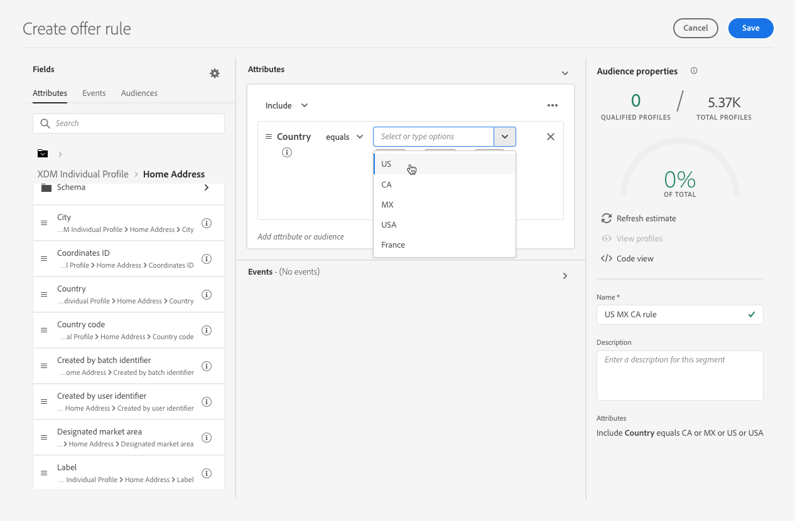

# Creare regole di decisione {#create-decision-rules}

>[!TIP]
>
>La funzione Decisioni, la nuova funzionalità decisionale di [!DNL Adobe Journey Optimizer], è ora disponibile tramite i canali e-mail e di esperienza basati su codice. [Ulteriori informazioni](../../experience-decisioning/gs-experience-decisioning.md)

## Informazioni sulle regole di decisione {#about}

Puoi creare regole di decisione delle offerte basate sui dati disponibili in Adobe Experience Platform. Le regole di decisione determinano a chi può essere visualizzata un’offerta.

Ad esempio, puoi specificare di voler visualizzare solo &quot;Offerta di abbigliamento invernale per le donne&quot; quando (Genere = &quot;Femmina&quot;) e (Area geografica = &quot;Nord Est&quot;).

➡️ [Scopri questa funzione nel video](#video)

Di seguito è riportato un elenco di limitazioni di cui tenere conto quando si lavora con le regole di decisione:

* Edge Decisioning utilizza il profilo edge che non memorizza gli eventi, pertanto qualsiasi regola utilizzata in una decisione edge non sarà valida.
* Durante la creazione di una regola di decisione, non è supportato guardare indietro a un periodo di tempo precedente. Ad esempio, se specifichi un evento esperienza che si è verificato nell’ultimo mese come componente della regola. Qualsiasi tentativo di includere un periodo di lookback durante la creazione della regola attiverà un errore durante il salvataggio.
  <!--* Decision requests that use the hub profile will look at the last 100 experience events on the profile to evaluate rules that reference historical experience events.-->

## Creare una regola di decisione {#create}

L&#39;elenco delle regole di decisione create è accessibile nel menu **[!UICONTROL Componenti]**.

Per creare una regola di decisione, effettua le seguenti operazioni:

1. Vai alla scheda **[!UICONTROL Regole]**, quindi fai clic su **[!UICONTROL Crea regola]**.

   

1. Denomina la regola e fornisci una descrizione, quindi configura la regola in base alle tue esigenze.

   A tale scopo, è disponibile il **Generatore di segmenti** di Adobe Experience Platform che consente di creare le condizioni della regola. [Scopri come creare le definizioni dei segmenti](../../audience/creating-a-segment-definition.md)

   <!--In this example, the rule will target customers that have the "Gold" loyalty level.-->

   

   >[!NOTE]
   >
   >Il Generatore di segmenti fornito per creare regole di decisione presenta alcune specificità rispetto a quello utilizzato con il servizio **[!UICONTROL Segmentation]**. Tuttavia, il processo globale descritto nella documentazione di [Segment Builder](../../audience/creating-a-segment-definition.md) è ancora valido per la creazione di regole per le decisioni sulle offerte. Ulteriori informazioni nella [documentazione del servizio di segmentazione di Adobe Experience Platform](https://experienceleague.adobe.com/docs/experience-platform/segmentation/ui/segment-builder.html?lang=it).

1. Durante l&#39;aggiunta e la configurazione di nuovi campi nell&#39;area di lavoro, nel riquadro **[!UICONTROL Proprietà pubblico]** vengono visualizzate informazioni sui profili stimati appartenenti al pubblico. Fai clic su **[!UICONTROL Aggiorna stima]** per aggiornare i dati.

   

   >[!NOTE]
   >
   >Le stime del profilo non sono disponibili quando i parametri della regola includono dati non presenti nel profilo, come i dati contestuali. Ad esempio, una regola di idoneità che richiede che il tempo corrente sia di ≥80 gradi.

1. Fai clic su **[!UICONTROL Salva]** per confermare.

1. Una volta creata, la regola viene visualizzata nell&#39;elenco **[!UICONTROL Regole]**. Puoi selezionarlo per visualizzarne le proprietà e modificarlo o eliminarlo.

   

>[!CAUTION]
>
>Le offerte basate su eventi non sono attualmente supportate in [!DNL Journey Optimizer]. Se crei una regola di decisione basata su un [evento](https://experienceleague.adobe.com/docs/experience-platform/segmentation/ui/segment-builder.html?lang=it#events){target="_blank"}, non potrai sfruttarla in un&#39;offerta.

## Video tutorial {#video}

>[!VIDEO](https://video.tv.adobe.com/v/329373?quality=12)
