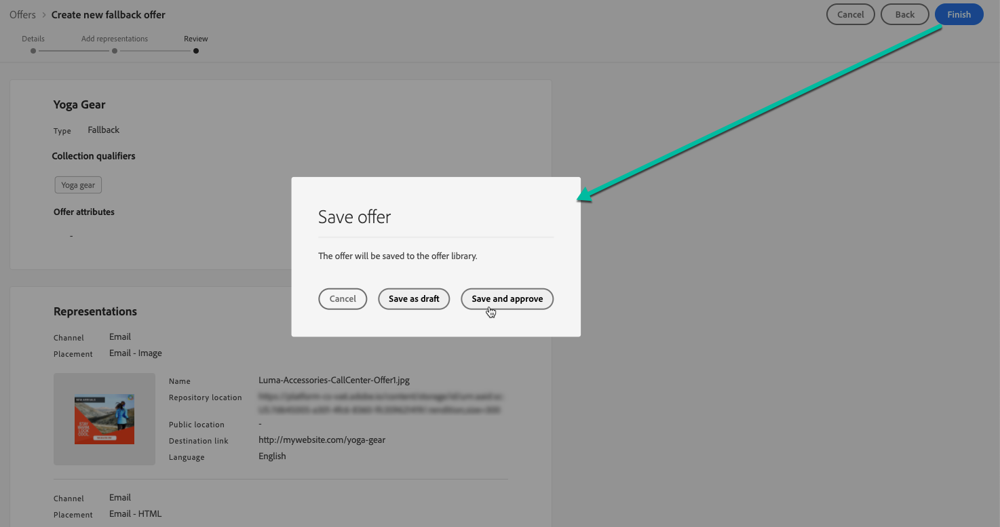

# Creare le offerte di fallback {#create-fallback-offers}

L’offerta di fallback viene inviata ai clienti se non sono idonei per altre offerte. I passaggi per creare un’offerta di fallback consistono nella creazione di una o più rappresentazioni, come quando crei un’offerta.

➡️ [Scopri questa funzione nel video](#video)

L&#39;elenco delle offerte di fallback è accessibile nel menu **[!UICONTROL Offerte]**.

Per creare un’offerta di fallback, effettua le seguenti operazioni:

>[!NOTE]
>
>A differenza delle offerte personalizzate, le offerte di fallback non hanno regole di idoneità e parametri di vincolo, in quanto vengono presentate ai clienti come ultime risorse senza condizioni.

1. Fai clic su **[!UICONTROL Crea offerta]**, quindi seleziona **[!UICONTROL Offerta di fallback]**.

   

1. Specifica il nome dell’offerta di fallback. Puoi anche associare uno o più qualificatori di raccolta esistenti (noti in precedenza come &quot;tag&quot;), per cercare e organizzare più facilmente la Libreria di offerte.

   

1. Per assegnare etichette di utilizzo dei dati personalizzate o di base all&#39;offerta, selezionare **[!UICONTROL Gestisci accesso]**. [Ulteriori informazioni sul controllo degli accessi a livello di oggetto (OLAC)](../../administration/object-based-access.md)

1. Crea una o più rappresentazioni per l’offerta di fallback. A questo scopo, trascina e rilascia i posizionamenti dal riquadro a sinistra, come durante la creazione di un’offerta personalizzata. Consulta [Creare offerte personalizzate](../offer-library/creating-personalized-offers.md).

   

   >[!CAUTION]
   >
   >Le offerte di fallback devono contenere tutte le rappresentazioni utilizzate in una [decisione](../offer-activities/create-offer-activities.md). Ad esempio, se in una decisione sono presenti 5 offerte e ciascuna di esse ha una rappresentazione diversa, nell’offerta di fallback devono essere incluse 5 rappresentazioni.

1. Dopo aver aggiunto le rappresentazioni dell’offerta di fallback, viene visualizzato un riepilogo. Se tutto è configurato correttamente e l&#39;offerta di fallback è pronta per essere presentata ai clienti, fai clic su **[!UICONTROL Fine]**, quindi seleziona **[!UICONTROL Salva e approva]**.

   Puoi anche salvare l’offerta di fallback come bozza, per poi modificarla e approvarla in un secondo momento.

   

1. L&#39;offerta di fallback viene visualizzata nell&#39;elenco con lo stato **[!UICONTROL Live]** o **[!UICONTROL Bozza]**, a seconda che sia stata approvata o meno nel passaggio precedente.

   Ora è pronto per essere consegnato ai clienti. Puoi selezionarlo per visualizzarne le proprietà e modificarlo. <!-- no suppression? -->

   

## Video dimostrativo {#video}

>[!VIDEO](https://video.tv.adobe.com/v/329383?quality=12)

