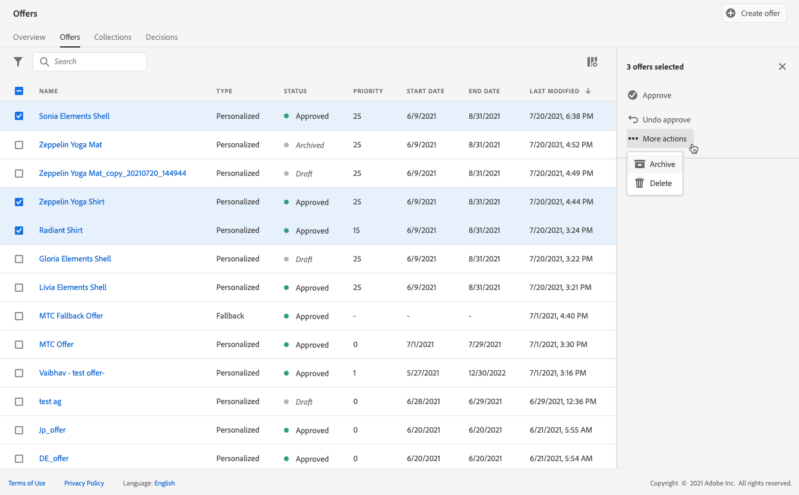

# Creare le offerte personalizzate {#create-personalized-offers}

Prima di creare un’offerta, accertati di aver creato:

* A **placement** in cui verrà visualizzata l’offerta. Vedi [Creare posizionamenti](../offer-library/creating-placements.md)
* Per aggiungere una condizione di idoneità: a **norma decisionale** che definirà la condizione in cui verrà presentata l’offerta. Vedi [Creare regole decisionali](../offer-library/creating-decision-rules.md).
* Uno o più **tag** da associare all’offerta. Vedi [Creare tag](../offer-library/creating-tags.md).

➡️ [Scopri questa funzione nel video](#video)

L’elenco delle offerte personalizzate è accessibile nella sezione **[!UICONTROL Offers]** menu.

## Creare l’offerta {#create-offer}

>[!CONTEXTUALHELP]
>id="od_offer_attributes"
>title="Informazioni sugli attributi delle offerte"
>abstract="Con gli attributi dell’offerta, puoi associare coppie di valori chiave all’offerta a scopo di reporting e analisi."
>additional-url="https://video.tv.adobe.com/v/329375" text="Guarda il video dimostrativo"

Per creare un **offerta**, segui questi passaggi:

1. Fai clic su **[!UICONTROL Create offer]**, quindi seleziona **[!UICONTROL Personalized offer]**.

   

1. Specifica il nome dell’offerta, la data e l’ora di inizio e fine dell’offerta. Puoi anche associare uno o più tag esistenti all’offerta, per facilitarne la ricerca e l’organizzazione.

   

   >[!NOTE]
   >
   >La **[!UICONTROL Offer attributes]** La sezione ti consente di associare coppie chiave-valore all’offerta a scopo di reporting e analisi.

## Configurare le rappresentazioni dell’offerta {#representations}

Un’offerta può essere visualizzata in posizioni diverse all’interno di un messaggio: in un banner superiore con un’immagine, come testo in un paragrafo, come blocco di HTML, ecc. Più rappresentazioni sono disponibili, più opportunità esistono per utilizzare l’offerta in contesti di posizionamento diversi.

Per aggiungere una o più rappresentazioni all’offerta e configurarle, effettua le seguenti operazioni.

1. Per la prima rappresentazione, inizia selezionando la **[!UICONTROL Channel]** verrà utilizzato.

   

   >[!NOTE]
   >
   >Vengono visualizzati solo i posizionamenti disponibili per il canale selezionato nel **[!UICONTROL Placement]** elenco a discesa.

1. Seleziona un posizionamento dall’elenco.

   Puoi inoltre utilizzare il pulsante accanto al **[!UICONTROL Placement]** elenco a discesa per sfogliare tutti i posizionamenti.

   

   È comunque possibile filtrare i posizionamenti in base al relativo canale e/o tipo di contenuto. Scegli un posizionamento e fai clic su **[!UICONTROL Select]**.

   

1. Aggiungi contenuto alla tua rappresentazione. Scopri come in [questa sezione](#content).

1. Quando aggiungi contenuto, ad esempio un’immagine o un URL, puoi specificare un **[!UICONTROL Destination link]**: gli utenti che fanno clic sull’offerta verranno indirizzati alla pagina corrispondente.

   

1. Infine, seleziona la lingua scelta per identificare e gestire gli elementi da visualizzare agli utenti.

1. Per aggiungere un&#39;altra rappresentazione, utilizza la **[!UICONTROL Add representation]** e aggiungi tutte le rappresentazioni necessarie.

   

1. Dopo aver aggiunto tutte le rappresentazioni, seleziona **[!UICONTROL Next]**.

## Definire il contenuto per le rappresentazioni {#content}

È possibile aggiungere diversi tipi di contenuto a una rappresentazione.

>[!NOTE]
>
>È disponibile per l’uso solo il contenuto corrispondente al tipo di contenuto del posizionamento.

### Aggiungere immagini {#images}

Se la posizione selezionata è di tipo immagine, puoi aggiungere contenuto proveniente da **Risorsa Adobe Experience Cloud** libreria, un archivio centralizzato di risorse fornito da [!DNL Adobe Experience Manager Assets Essentials].

>[!NOTE]
>
> Per lavorare con [Adobe Experience Manager Assets Essentials](https://experienceleague.adobe.com/docs/experience-manager-assets-essentials/help/introduction.html?lang=en){target=&quot;_blank&quot;}, devi distribuire [!DNL Assets Essentials] per la tua organizzazione e assicurati che gli utenti facciano parte del **Utenti consumer Assets Essentials** o **Utenti Assets Essentials** Profili di prodotto. Ulteriori informazioni su [questa pagina](https://experienceleague.adobe.com/docs/experience-manager-assets-essentials/help/deploy-administer.html){target=&quot;_blank&quot;}.

1. Scegli l’opzione **[!UICONTROL Asset library]**.

1. Seleziona **[!UICONTROL Browse]**.

   

1. Sfoglia le risorse per selezionare l&#39;immagine desiderata

1. Fai clic su **[!UICONTROL Select]**.

   

### Aggiungi URL {#urls}

Per aggiungere contenuto da una posizione pubblica esterna, seleziona **[!UICONTROL URL]**, quindi immetti l’indirizzo URL del contenuto da aggiungere.

### Aggiungi testo personalizzato {#custom-text}

È inoltre possibile inserire contenuto di tipo testo quando si seleziona una posizione compatibile.

1. Seleziona la **[!UICONTROL Custom]** e fai clic su **[!UICONTROL Add content]**.

   

   >[!NOTE]
   >
   >Questa opzione non è disponibile per i posizionamenti di tipo immagine.

1. Digita il testo che verrà visualizzato nell’offerta.

   

   Puoi personalizzare il contenuto utilizzando l’editor espressioni. Ulteriori informazioni su [personalizzazione](../../personalization/personalize.md#use-expression-editor).

   

   >[!NOTE]
   >
   >Solo il **[!UICONTROL Profile attributes]**, **[!UICONTROL Segment memberships]** e **[!UICONTROL Helper functions]** le fonti sono disponibili per la gestione delle decisioni.

## Aggiungere regole e vincoli di idoneità {#eligibility}

>[!CONTEXTUALHELP]
>id="od_offer_constraints"
>title="Informazioni sui vincoli delle offerte"
>abstract="Con i vincoli, puoi specificare in che modo l’offerta viene prioritaria e presentata all’utente rispetto ad altre offerte."
>additional-url="https://video.tv.adobe.com/v/329375" text="Guarda il video dimostrativo"

>[!CONTEXTUALHELP]
>id="od_offer_eligibility"
>title="Informazioni sull’idoneità delle offerte"
>abstract="In questa sezione puoi utilizzare le regole decisionali per determinare quali utenti sono idonei per l’offerta."
>additional-url="https://video.tv.adobe.com/v/329373" text="Guarda il video dimostrativo"

>[!CONTEXTUALHELP]
>id="od_offer_priority"
>title="Informazioni sulla priorità delle offerte"
>abstract="In questo campo, puoi specificare le impostazioni di priorità per l’offerta. La priorità è un numero utilizzato per classificare le offerte che soddisfano tutti i vincoli quali idoneità, date e limiti."
>additional-url="https://video.tv.adobe.com/v/329375" text="Guarda il video dimostrativo"

>[!CONTEXTUALHELP]
>id="od_offer_globalcap"
>title="Informazioni sul limite delle offerte"
>abstract="In questo campo, puoi specificare quante volte l’offerta può essere presentata a tutti gli utenti."
>additional-url="https://video.tv.adobe.com/v/329375" text="Guarda il video dimostrativo"

Le regole di idoneità e i vincoli ti consentono di definire le condizioni in cui verrà visualizzata un’offerta.

1. Configura le **[!UICONTROL Offer eligibility]**.

   * Per impostazione predefinita, la **[!UICONTROL All visitors]** l’opzione della regola decisionale è selezionata, il che significa che qualsiasi profilo sarà idoneo per la presentazione dell’offerta.

   * Puoi limitare la presentazione dell’offerta ai membri di uno o più segmenti di Adobe Experience Platform. Per eseguire questa operazione, attiva il **[!UICONTROL Visitors who fall into one or multiple segments]** , quindi aggiungi uno o più segmenti dal riquadro a sinistra e combinali utilizzando la **[!UICONTROL And]** / **[!UICONTROL Or]** operatori logici.

      Per ulteriori informazioni su come lavorare con i segmenti, consulta [questa pagina](../../segment/about-segments.md).

      

   * Se desideri associare una regola decisionale specifica all&#39;offerta, seleziona **[!UICONTROL By defined decision rule]**, quindi trascina la regola desiderata dal riquadro di sinistra nel **[!UICONTROL Decision rule]** area. Per ulteriori informazioni su come creare una regola decisionale, consulta [questa sezione](../offer-library/creating-decision-rules.md).

      

      >[!CAUTION]
      >
      >Le offerte basate su eventi non sono attualmente supportate in [!DNL Journey Optimizer]. Se crei una regola decisionale basata su un [event](https://experienceleague.adobe.com/docs/experience-platform/segmentation/ui/segment-builder.html?lang=en#events){target=&quot;_blank&quot;}, non potrai sfruttarlo in un&#39;offerta.
   Ulteriori informazioni sull’utilizzo dei segmenti rispetto alle regole decisionali in [questa sezione](../offer-activities/create-offer-activities.md#segments-vs-decision-rules).

1. Definisci la **[!UICONTROL Priority]** dell’offerta rispetto alle altre se l’utente è idoneo per più di un’offerta. Maggiore sarà la priorità di un&#39;offerta, maggiore sarà la sua priorità rispetto ad altre offerte.

1. Specifica le offerte **[!UICONTROL Capping]**, ovvero il numero di volte in cui l’offerta verrà presentata in totale tra tutti gli utenti. Se l’offerta è stata consegnata a tutti gli utenti per il numero di volte specificato in questo campo, la relativa consegna verrà interrotta.

   >[!NOTE]
   >
   >Il numero di volte in cui viene proposta un’offerta viene calcolato al momento della preparazione dell’e-mail. Ad esempio, se prepari un’e-mail contenente una serie di offerte, questi numeri vengono conteggiati in base al tetto massimo, indipendentemente dal fatto che l’e-mail venga inviata o meno.
   >
   >Se una consegna e-mail viene eliminata o se la preparazione viene eseguita nuovamente prima dell’invio, il valore di limite per l’offerta viene aggiornato automaticamente.

   

   Nell’esempio precedente:

   * La priorità dell&#39;offerta è impostata su &quot;50&quot;, il che significa che l&#39;offerta sarà presentata prima delle offerte con una priorità compresa tra 1 e 49 e dopo quelle con una priorità di almeno 51.
   * L’offerta verrà considerata solo per gli utenti che corrispondono alla regola di decisione &quot;Clienti Gold Loyalty&quot;.
   * L’offerta viene presentata una sola volta per utente.

## Rivedi l’offerta {#review}

Una volta definite le regole di idoneità e i vincoli, viene visualizzato un riepilogo delle proprietà dell’offerta.

1. Assicurati che tutto sia configurato correttamente.

1. Quando l’offerta è pronta per essere presentata agli utenti, fai clic su **[!UICONTROL Finish]**.

1. Seleziona **[!UICONTROL Save and approve]**.

   

   Puoi anche salvare l’offerta come bozza, per modificarla e approvarla in un secondo momento.

L’offerta viene visualizzata nell’elenco con la **[!UICONTROL Approved]** o **[!UICONTROL Draft]** a seconda che sia stato approvato o meno nel passaggio precedente.

È ora pronto per essere consegnato agli utenti.

## Elenco delle offerte {#offer-list}

Dall’elenco delle offerte, puoi selezionare l’offerta per visualizzarne le proprietà. Puoi anche modificarlo, modificarne lo stato (**Bozza**, **Approvato**, **Archiviato**), duplica l’offerta o eliminala.

Seleziona la **[!UICONTROL Edit]** per tornare alla modalità di modifica dell’offerta, dove puoi modificare l’offerta [dettagli](#create-offer), [rappresentazioni](#representations), nonché modificare il [regole di idoneità e vincoli](#eligibility).

Seleziona un’offerta approvata e fai clic su **[!UICONTROL Undo approve]** per impostare nuovamente lo stato dell’offerta su **[!UICONTROL Draft]**.

Per impostare nuovamente lo stato su **[!UICONTROL Approved]**, seleziona il pulsante corrispondente visualizzato.

La **[!UICONTROL More actions]** attiva le azioni descritte di seguito.

* **[!UICONTROL Duplicate]**: crea un’offerta con le stesse proprietà, rappresentazioni, regole di idoneità e vincoli. Per impostazione predefinita, la nuova offerta ha il **[!UICONTROL Draft]** stato.
* **[!UICONTROL Delete]**: rimuove l’offerta dall’elenco.

   >[!CAUTION]
   >
   >L’offerta e il relativo contenuto non saranno più accessibili. Questa azione non può essere annullata.
   >
   >Se l&#39;offerta viene utilizzata in una raccolta o in una decisione, non può essere eliminata. È innanzitutto necessario rimuovere l’offerta da qualsiasi oggetto.

* **[!UICONTROL Archive]**: imposta lo stato dell’offerta su **[!UICONTROL Archived]**. L’offerta è ancora disponibile dall’elenco, ma non è possibile ripristinarne lo stato su **[!UICONTROL Draft]** o **[!UICONTROL Approved]**. È possibile duplicarla o eliminarla.

Puoi anche eliminare o modificare lo stato di più offerte contemporaneamente selezionando le caselle di controllo corrispondenti.

Se desideri modificare lo stato di diverse offerte con stati diversi, verranno modificati solo gli stati pertinenti.

Una volta creata un’offerta, puoi fare clic sul suo nome dall’elenco.

Ciò ti consente di accedere a informazioni dettagliate per quell’offerta. Seleziona la **[!UICONTROL Change log]** scheda a [controlla tutte le modifiche](../get-started/user-interface.md#monitoring-changes) che sono stati fatti all&#39;offerta.

## Video tutorial {#video}

>[!NOTE]
>
>Questo video si applica al servizio di applicazione Offer Decisioning integrato in Adobe Experience Platform. Tuttavia, fornisce indicazioni generiche per utilizzare Offerta nel contesto di Journey Optimizer.

>[!VIDEO](https://video.tv.adobe.com/v/329375?quality=12)
