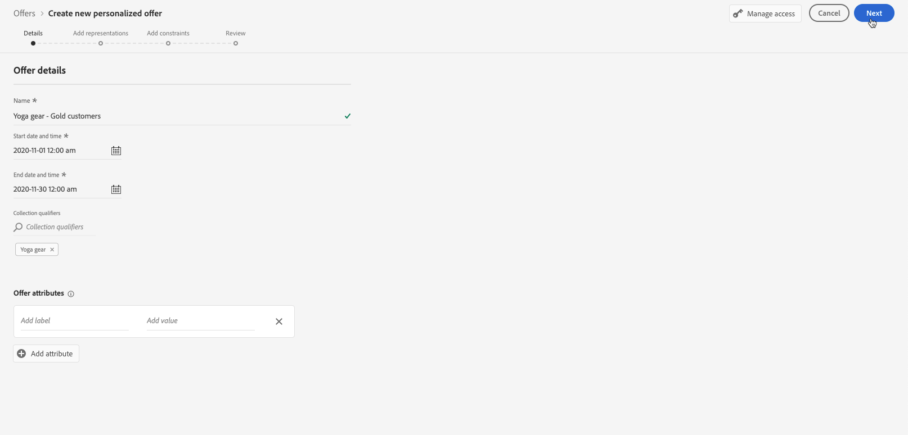

# Creare le offerte personalizzate {#create-personalized-offers}

Prima di creare un’offerta, accertati di aver creato:

* A **placement** in cui verrà visualizzata l’offerta. Vedi [Creare posizionamenti](../offer-library/creating-placements.md)
* Per aggiungere una condizione di idoneità: a **norma decisionale** che definirà la condizione in cui verrà presentata l’offerta. Vedi [Creare regole decisionali](../offer-library/creating-decision-rules.md).
* Uno o più **tag** da associare all’offerta. Vedi [Creare tag](../offer-library/creating-tags.md).

➡️ [Scopri questa funzione nel video](#video)

L’elenco delle offerte personalizzate è accessibile nella sezione **[!UICONTROL Offerte]** menu.

## Creare un’offerta {#create-offer}

>[!CONTEXTUALHELP]
>id="od_offer_attributes"
>title="Informazioni sugli attributi delle offerte"
>abstract="Con gli attributi dell’offerta, puoi associare coppie di valori chiave all’offerta a scopo di reporting e analisi."

>[!CONTEXTUALHELP]
>id="ajo_decisioning_offer_attributes"
>title="Attributi di offerta"
>abstract="Con gli attributi dell’offerta, puoi associare coppie di valori chiave all’offerta a scopo di reporting e analisi."

Per creare un **offerta**, segui questi passaggi:

1. Fai clic su **[!UICONTROL Creare un’offerta]**, quindi seleziona **[!UICONTROL Offerta personalizzata]**.

   

1. Specifica il nome dell’offerta, la data e l’ora di inizio e fine dell’offerta. Al di fuori di queste date, l’offerta non verrà selezionata dal motore Decisioning.

   

   >[!CAUTION]
   >
   >L’aggiornamento delle date di inizio/fine può avere un impatto sui limiti. [Ulteriori informazioni](add-constraints.md#capping-change-date)

1. Puoi anche associare uno o più **[!UICONTROL tag]** nell’offerta, ti consente di cercare e organizzare più facilmente la Libreria offerte. [Ulteriori informazioni](creating-tags.md).

1. La **[!UICONTROL Attributi di offerta]** La sezione ti consente di associare coppie chiave-valore all’offerta a scopo di reporting e analisi.

1. Per assegnare etichette di utilizzo dati personalizzate o di base all’offerta, seleziona **[!UICONTROL Gestisci accesso]**. [Ulteriori informazioni su Object Level Access Control (OLAC)](../../administration/object-based-access.md)

   

1. Aggiungi delle rappresentazioni per definire dove verrà visualizzata l’offerta nel messaggio. [Ulteriori informazioni](add-representations.md)

   

1. Aggiungi dei vincoli per impostare le condizioni per la visualizzazione dell’offerta. [Ulteriori informazioni](add-constraints.md)

   >[!NOTE]
   >
   >Quando selezioni segmenti o regole decisionali, puoi visualizzare informazioni sui profili qualificati stimati. Fai clic su **[!UICONTROL Aggiorna]** per aggiornare i dati.
   >
   >Le stime del profilo non sono disponibili quando i parametri delle regole includono dati non presenti nel profilo, ad esempio dati contestuali. Ad esempio, una regola di idoneità che richiede che il tempo corrente sia ≥ 80 gradi.

   

1. Rivedi e salva l’offerta. [Ulteriori informazioni](#review)

## Rivedi l’offerta {#review}

Una volta definite le regole di idoneità e i vincoli, viene visualizzato un riepilogo delle proprietà dell’offerta.

1. Assicurati che tutto sia configurato correttamente.

1. Puoi visualizzare informazioni sui profili qualificati stimati. Fai clic su **[!UICONTROL Aggiorna]** per aggiornare i dati.

   

1. Quando l’offerta è pronta per essere presentata agli utenti, fai clic su **[!UICONTROL Fine]**.

1. Seleziona **[!UICONTROL Salva e approva]**.

   

   Puoi anche salvare l’offerta come bozza, per modificarla e approvarla in un secondo momento.

L’offerta viene visualizzata nell’elenco con la **[!UICONTROL Approvato]** o **[!UICONTROL Bozza]** a seconda che sia stato approvato o meno nel passaggio precedente.

È ora pronto per essere consegnato agli utenti.

## Gestire le offerte {#offer-list}

Dall’elenco delle offerte, puoi selezionare l’offerta per visualizzarne le proprietà. Puoi anche modificarlo, modificarne lo stato (**Bozza**, **Approvato**, **Archiviato**), duplica l’offerta o eliminala.

Seleziona la **[!UICONTROL Modifica]** per tornare alla modalità di modifica dell’offerta, dove puoi modificare l’offerta [dettagli](#create-offer), [rappresentazioni](#representations), nonché modificare il [regole di idoneità e vincoli](#eligibility).

Seleziona un’offerta approvata e fai clic su **[!UICONTROL Annulla approvazione]** per impostare nuovamente lo stato dell’offerta su **[!UICONTROL Bozza]**.

Per impostare nuovamente lo stato su **[!UICONTROL Approvato]**, seleziona il pulsante corrispondente visualizzato.

La **[!UICONTROL Altre azioni]** attiva le azioni descritte di seguito.

* **[!UICONTROL Duplica]**: crea un’offerta con le stesse proprietà, rappresentazioni, regole di idoneità e vincoli. Per impostazione predefinita, la nuova offerta ha il **[!UICONTROL Bozza]** stato.
* **[!UICONTROL Elimina]**: rimuove l’offerta dall’elenco.

   >[!CAUTION]
   >
   >L’offerta e il relativo contenuto non saranno più accessibili. Questa azione non può essere annullata.
   >
   >Se l&#39;offerta viene utilizzata in una raccolta o in una decisione, non può essere eliminata. È innanzitutto necessario rimuovere l’offerta da qualsiasi oggetto.

* **[!UICONTROL Archivia]**: imposta lo stato dell’offerta su **[!UICONTROL Archiviato]**. L’offerta è ancora disponibile dall’elenco, ma non è possibile ripristinarne lo stato su **[!UICONTROL Bozza]** o **[!UICONTROL Approvato]**. È possibile duplicarla o eliminarla.

Puoi anche eliminare o modificare lo stato di più offerte contemporaneamente selezionando le caselle di controllo corrispondenti.

Se desideri modificare lo stato di diverse offerte con stati diversi, verranno modificati solo gli stati pertinenti.

Una volta creata un’offerta, puoi fare clic sul suo nome dall’elenco.

Ciò ti consente di accedere a informazioni dettagliate per quell’offerta. Seleziona la **[!UICONTROL Registro delle modifiche]** scheda a [controlla tutte le modifiche](../get-started/user-interface.md#monitoring-changes) che sono stati fatti all&#39;offerta.

## Video tutorial {#video}

>[!VIDEO](https://video.tv.adobe.com/v/329375?quality=12)
