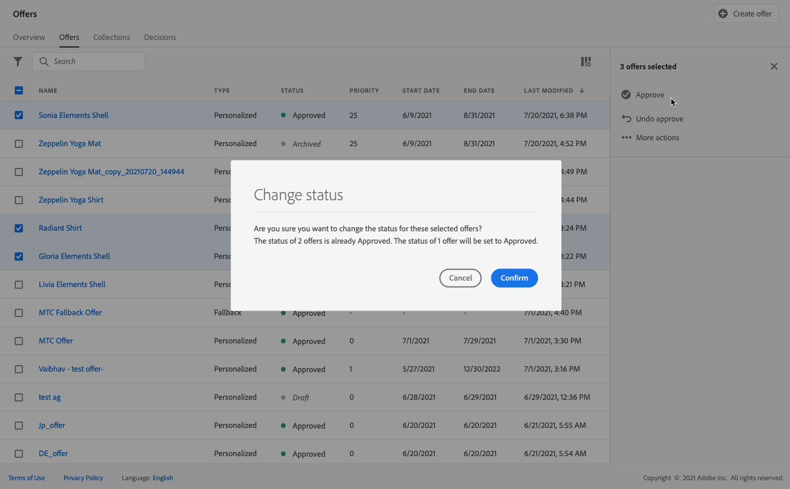

# Creare le offerte personalizzate {#create-personalized-offers}

>[!TIP]
>
>La funzione Decisioni, la nuova funzionalità decisionale di [!DNL Adobe Journey Optimizer], è ora disponibile tramite i canali e-mail e di esperienza basati su codice. [Ulteriori informazioni](../../experience-decisioning/gs-experience-decisioning.md)

Prima di creare un’offerta, assicurati di aver creato:

* Un **posizionamento** in cui verrà visualizzata l&#39;offerta. Vedi [Creare posizionamenti](../offer-library/creating-placements.md)
* Se desideri aggiungere una condizione di idoneità: una **regola di decisione** che definirà la condizione in cui verrà presentata l&#39;offerta. Consulta [Creare regole di decisione](../offer-library/creating-decision-rules.md).
* Uno o più **qualificatori di raccolta** (noti in precedenza come &quot;tag&quot;) da associare all&#39;offerta. Vedi [Creare qualificatori di raccolta](../offer-library/creating-tags.md).

➡️ [Scopri questa funzione nel video](#video)

L&#39;elenco delle offerte personalizzate è accessibile nel menu **[!UICONTROL Offerte]**.

## Creare un’offerta {#create-offer}

>[!CONTEXTUALHELP]
>id="ajo_decisioning_offer_details"
>title="Dettagli dell’offerta"
>abstract="Inserisci il nome dell’offerta e le date di inizio e di fine. Al di fuori di questo intervallo di date, l’offerta non verrà selezionata dal motore della funzione Decisioni."

>[!CONTEXTUALHELP]
>id="od_offer_attributes"
>title="Informazioni sugli attributi di offerta"
>abstract="Con gli attributi di offerta, puoi associare coppie di valori chiave all’offerta a scopo di reporting e analisi."

>[!CONTEXTUALHELP]
>id="ajo_decisioning_offer_attributes"
>title="Attributi di offerta"
>abstract="Con gli attributi di offerta, puoi associare coppie di valori chiave all’offerta a scopo di reporting e analisi."

>[!CONTEXTUALHELP]
>id="ajo_decisioning_new_personalized"
>title="Offerta personalizzata"
>abstract="Un’offerta personalizzata è un messaggio personalizzabile basato su vincoli e regole di idoneità."

Per creare un&#39;offerta **offer**, eseguire la procedura seguente:

1. Fai clic su **[!UICONTROL Crea offerta]**, quindi seleziona **[!UICONTROL Offerta personalizzata]**.

   

1. Specifica il nome dell’offerta nonché la data e l’ora di inizio e di fine. Al di fuori di questo intervallo di date, l’offerta non verrà selezionata dal motore della funzione Decisioni.

   >[!NOTE]
   >
   >Quando selezioni gli orari, viene preso in considerazione il tuo fuso orario corrente.

   

   >[!CAUTION]
   >
   >L’aggiornamento delle date di inizio/fine può avere un impatto sui limiti. [Ulteriori informazioni](add-constraints.md#capping-change-date)

1. È inoltre possibile associare all&#39;offerta uno o più qualificatori **[!UICONTROL per la raccolta]** esistenti, consentendo di cercare e organizzare più facilmente la Libreria di offerte. [Ulteriori informazioni](creating-tags.md).

1. La sezione **[!UICONTROL Attributi offerta]** ti consente di associare coppie chiave-valore all&#39;offerta a scopo di reporting e analisi.

1. Per assegnare etichette di utilizzo dei dati personalizzate o di base all&#39;offerta, selezionare **[!UICONTROL Gestisci accesso]**. [Ulteriori informazioni sul controllo degli accessi a livello di oggetto (OLAC)](../../administration/object-based-access.md)

   

1. Aggiungi delle rappresentazioni per definire dove verrà visualizzata l’offerta nel messaggio. [Ulteriori informazioni](add-representations.md)

   

   >[!CAUTION]
   >
   >La dimensione di un’offerta, comprese tutte le sue rappresentazioni, non può superare i 300 KB.

1. Aggiungi vincoli per impostare le condizioni per la visualizzazione dell’offerta. [Ulteriori informazioni](add-constraints.md)

   >[!NOTE]
   >
   >Quando selezioni tipi di pubblico o regole di decisione, puoi visualizzare informazioni sui profili qualificati stimati. Fai clic su **[!UICONTROL Aggiorna]** per aggiornare i dati.
   >
   >Tieni presente che le stime di profilo non sono disponibili quando i parametri della regola includono dati non presenti nel profilo, come i dati contestuali. Ad esempio, una regola di idoneità che richiede che il tempo corrente sia di ≥80 gradi.

   

1. Rivedi e salva l’offerta. [Ulteriori informazioni](#review)

## Rivedi l&#39;offerta {#review}

Una volta definiti le regole di idoneità e i vincoli, viene visualizzato un riepilogo delle proprietà dell’offerta.

1. Assicurati che tutto sia configurato correttamente.

1. Puoi visualizzare informazioni sui profili qualificati stimati. Fai clic su **[!UICONTROL Aggiorna]** per aggiornare i dati.

   

1. Quando la tua offerta sarà pronta per essere presentata agli utenti, fai clic su **[!UICONTROL Fine]**.

1. Seleziona **[!UICONTROL Salva e approva]**.

   

   Puoi anche salvare l’offerta come bozza, per poi modificarla e approvarla in un secondo momento.

L&#39;offerta viene visualizzata nell&#39;elenco con lo stato **[!UICONTROL Approvato]** o **[!UICONTROL Bozza]**, a seconda che sia stata approvata o meno nel passaggio precedente.

È ora pronto per essere consegnato agli utenti.

## Gestire le offerte {#offer-list}

Dall’elenco delle offerte, puoi selezionare l’offerta per visualizzarne le proprietà. Puoi anche modificarlo, modificarne lo stato (**Bozza**, **Approvato**, **Archiviato**), duplicare l&#39;offerta o eliminarla.

Seleziona il pulsante **[!UICONTROL Modifica]** per tornare alla modalità di modifica delle offerte, dove puoi modificare [dettagli](#create-offer), [rappresentazioni](add-representations.md#representations) dell&#39;offerta e [regole e vincoli di idoneità](add-constraints.md#eligibility).

Seleziona un&#39;offerta approvata e fai clic su **[!UICONTROL Annulla approvazione]** per impostare nuovamente lo stato dell&#39;offerta su **[!UICONTROL Bozza]**.

Per impostare nuovamente lo stato su **[!UICONTROL Approvato]**, selezionare il pulsante corrispondente visualizzato.

Il pulsante **[!UICONTROL Altre azioni]** abilita le azioni descritte di seguito.

* **[!UICONTROL Duplicato]**: crea un&#39;offerta con le stesse proprietà, rappresentazioni, regole di idoneità e vincoli. Per impostazione predefinita, la nuova offerta ha lo stato **[!UICONTROL Bozza]**.
* **[!UICONTROL Elimina]**: rimuove l&#39;offerta dall&#39;elenco.

  >[!CAUTION]
  >
  >L’offerta e il suo contenuto non saranno più accessibili. Questa azione non può essere annullata.
  >
  >Se l’offerta viene utilizzata in una raccolta o in una decisione, non può essere eliminata. Devi prima rimuovere l’offerta da qualsiasi oggetto.

* **[!UICONTROL Archivio]**: imposta lo stato dell&#39;offerta su **[!UICONTROL Archiviato]**. L&#39;offerta è ancora disponibile nell&#39;elenco, ma non è possibile impostarne lo stato su **[!UICONTROL Bozza]** o **[!UICONTROL Approvata]**. Puoi solo duplicarlo o eliminarlo.

Puoi anche eliminare o modificare lo stato di più offerte contemporaneamente selezionando le caselle di controllo corrispondenti.

Se desideri modificare lo stato di più offerte con stati diversi, verranno modificati solo gli stati pertinenti.

Dopo aver creato un’offerta, puoi fare clic sul nome nell’elenco.

Questo consente di accedere a informazioni dettagliate su quell’offerta. Seleziona la scheda **[!UICONTROL Registro modifiche]** per [monitorare tutte le modifiche](../get-started/user-interface.md#changes-logs) apportate all&#39;offerta.

## Video tutorial {#video}

>[!VIDEO](https://video.tv.adobe.com/v/341354?captions=ita&quality=12)
