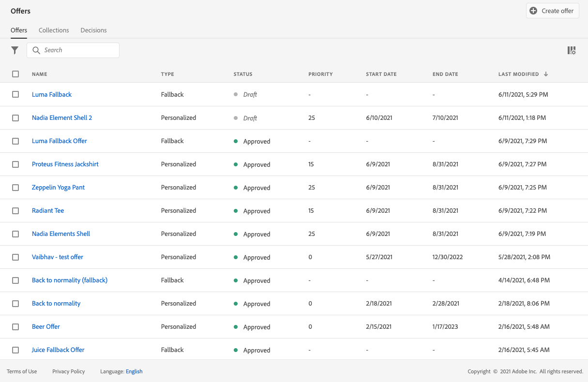

# Creare le offerte personalizzate {#create-personalized-offers}

Prima di creare un’offerta, assicurati di aver creato:

* A **posizionamento** in cui verrà visualizzata l’offerta. Consulta [Creare posizionamenti](../offer-library/creating-placements.md)
* Se desideri aggiungere una condizione di idoneità: **regola di decisione** che definirà la condizione in base alla quale verrà presentata l’offerta. Consulta [Creare regole di decisione](../offer-library/creating-decision-rules.md).
* Uno o più **qualificatori di raccolta** (precedentemente noti come &quot;tag&quot;) che potresti voler associare all’offerta. Consulta [Creare qualificatori di raccolta](../offer-library/creating-tags.md).

➡️ [Scopri questa funzione nel video](#video)

L’elenco delle offerte personalizzate è accessibile nel **[!UICONTROL Offerte]** menu.

## Creare un’offerta {#create-offer}

>[!CONTEXTUALHELP]
>id="od_offer_attributes"
>title="Informazioni sugli attributi di offerta"
>abstract="Con gli attributi di offerta, puoi associare coppie di valori chiave all’offerta a scopo di reporting e analisi."

>[!CONTEXTUALHELP]
>id="ajo_decisioning_offer_attributes"
>title="Attributi di offerta"
>abstract="Con gli attributi di offerta, puoi associare coppie di valori chiave all’offerta a scopo di reporting e analisi."

Per creare un **offerta**, effettua le seguenti operazioni:

1. Clic **[!UICONTROL Crea offerta]**, quindi seleziona **[!UICONTROL Offerta personalizzata]**.

   

1. Specifica il nome dell’offerta nonché la data e l’ora di inizio e di fine. Al di fuori di queste date, l’offerta non verrà selezionata dal motore delle decisioni.

   

   >[!CAUTION]
   >
   >L’aggiornamento delle date di inizio/fine può avere un impatto sui limiti. [Ulteriori informazioni](add-constraints.md#capping-change-date)

1. È inoltre possibile associare uno o più elementi esistenti **[!UICONTROL qualificatori di raccolta]** all’offerta, per cercare e organizzare più facilmente la Libreria di offerte. [Maggiori informazioni](creating-tags.md).

1. Il **[!UICONTROL Attributi offerta]** consente di associare coppie chiave-valore all’offerta a scopo di reporting e analisi.

1. Per assegnare etichette di utilizzo dei dati personalizzate o di base all’offerta, seleziona **[!UICONTROL Gestisci accesso]**. [Ulteriori informazioni su OLAC (Object Level Access Control)](../../administration/object-based-access.md)

   

1. Aggiungi delle rappresentazioni per definire dove verrà visualizzata l’offerta nel messaggio. [Ulteriori informazioni](add-representations.md)

   

1. Aggiungi vincoli per impostare le condizioni per la visualizzazione dell’offerta. [Ulteriori informazioni](add-constraints.md)

   >[!NOTE]
   >
   >Quando selezioni segmenti o regole di decisione, puoi visualizzare informazioni sulla stima dei profili qualificati. Clic **[!UICONTROL Aggiorna]** per aggiornare i dati.
   >
   >Tieni presente che le stime di profilo non sono disponibili quando i parametri della regola includono dati non presenti nel profilo, come i dati contestuali. Ad esempio, una regola di idoneità che richiede che il tempo corrente sia di ≥80 gradi.

   

1. Rivedi e salva l’offerta. [Ulteriori informazioni](#review)

## Rivedi l&#39;offerta {#review}

Una volta definiti le regole di idoneità e i vincoli, viene visualizzato un riepilogo delle proprietà dell’offerta.

1. Assicurati che tutto sia configurato correttamente.

1. Puoi visualizzare informazioni sui profili qualificati stimati. Clic **[!UICONTROL Aggiorna]** per aggiornare i dati.

   

1. Quando l’offerta è pronta per essere presentata agli utenti, fai clic su **[!UICONTROL Fine]**.

1. Seleziona **[!UICONTROL Salva e approva]**.

   

   Puoi anche salvare l’offerta come bozza, per poi modificarla e approvarla in un secondo momento.

L’offerta viene visualizzata nell’elenco con **[!UICONTROL Approvato]** o **[!UICONTROL Bozza]** a seconda che sia stato approvato o meno nel passaggio precedente.

È ora pronto per essere consegnato agli utenti.

## Gestire le offerte {#offer-list}

Dall’elenco delle offerte, puoi selezionare l’offerta per visualizzarne le proprietà. Puoi anche modificarlo, cambiarne lo stato (**Bozza**, **Approvato**, **Archiviato**), duplica l’offerta o eliminala.

Seleziona la **[!UICONTROL Modifica]** per tornare alla modalità edizione dell’offerta, dove puoi modificare i [dettagli](#create-offer), [rappresentazioni](#representations), nonché modificare il [regole e vincoli di idoneità](#eligibility).

Seleziona un’offerta approvata e fai clic su **[!UICONTROL Annulla approvazione]** per impostare nuovamente lo stato dell&#39;offerta su **[!UICONTROL Bozza]**.

Per impostare nuovamente lo stato su **[!UICONTROL Approvato]**, seleziona il pulsante corrispondente visualizzato.

Il **[!UICONTROL Altre azioni]** consente di eseguire le azioni descritte di seguito.

* **[!UICONTROL Duplica]**: crea un’offerta con le stesse proprietà, rappresentazioni, regole di idoneità e vincoli. Per impostazione predefinita, la nuova offerta presenta **[!UICONTROL Bozza]** stato.
* **[!UICONTROL Elimina]**: rimuove l’offerta dall’elenco.

   >[!CAUTION]
   >
   >L’offerta e il suo contenuto non saranno più accessibili. Questa azione non può essere annullata.
   >
   >Se l’offerta viene utilizzata in una raccolta o in una decisione, non può essere eliminata. Devi prima rimuovere l’offerta da qualsiasi oggetto.

* **[!UICONTROL Archivia]**: imposta lo stato dell’offerta su **[!UICONTROL Archiviato]**. L’offerta è ancora disponibile dall’elenco, ma non è possibile impostarne nuovamente lo stato su **[!UICONTROL Bozza]** o **[!UICONTROL Approvato]**. Puoi solo duplicarlo o eliminarlo.

Puoi anche eliminare o modificare lo stato di più offerte contemporaneamente selezionando le caselle di controllo corrispondenti.

Se desideri modificare lo stato di più offerte con stati diversi, verranno modificati solo gli stati pertinenti.

Dopo aver creato un’offerta, puoi fare clic sul nome nell’elenco.

Questo consente di accedere a informazioni dettagliate su quell’offerta. Seleziona la **[!UICONTROL Registro modifiche]** scheda a [monitorare tutte le modifiche](../get-started/user-interface.md#monitoring-changes) che sono stati inseriti nell&#39;offerta.

## Video tutorial {#video}

>[!VIDEO](https://video.tv.adobe.com/v/329375?quality=12)
