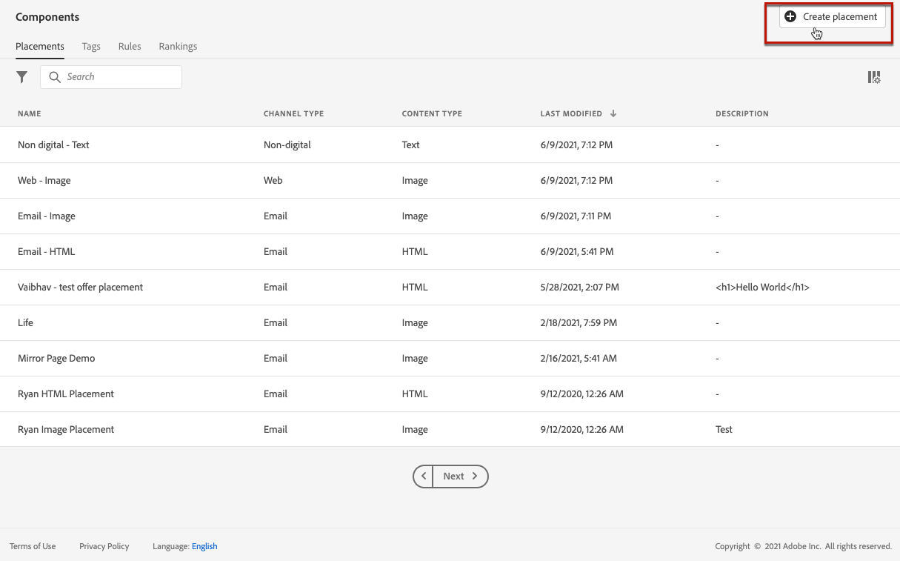

# Creare i posizionamenti {#create-placements}

>[!CONTEXTUALHELP]
>id="ajo_decisioning_placement"
>title="Posizionamento"
>abstract="Un posizionamento è un contenitore utilizzato per mostrare le offerte, affinché il contenuto corretto venga visualizzato nella posizione desiderata all’interno del messaggio. I posizionamenti vengono creati dal menu “Componenti”."

Il posizionamento garantisce che il contenuto dell’offerta corretta venga visualizzato nella posizione corretta all’interno del messaggio. Quando aggiungi contenuto a un’offerta, ti verrà chiesto di selezionare un posizionamento in cui visualizzare il contenuto.

➡️ [Scopri come creare i posizionamenti in questo video](#video)

Nell’esempio seguente, sono presenti tre posizioni, corrispondenti a diversi tipi di contenuto (immagine, testo, HTML).

L’elenco dei posizionamenti è accessibile nella sezione **[!UICONTROL Componenti]** menu. I filtri sono disponibili per aiutarti a recuperare i posizionamenti in base a un canale o a un contenuto specifico.

Per creare un posizionamento, effettuate le seguenti operazioni:

1. Clic **[!UICONTROL Crea posizionamento]**.

   

1. Definite le proprietà del posizionamento:

   * **[!UICONTROL Nome]**: nome del posizionamento. Assicurati di definire un nome significativo per recuperarlo più facilmente.
   * **[!UICONTROL Tipo di canale]**: canale per il quale verrà utilizzato il posizionamento.
   * **[!UICONTROL Tipo di contenuto]**: tipo di contenuto che il posizionamento potrà visualizzare: Testo, HTML, Collegamento immagine o JSON.
   * **[!UICONTROL Descrizione]**: descrizione del posizionamento (facoltativo).

   

1. Il **[!UICONTROL Impostazioni richiesta]** e **[!UICONTROL Formato di risposta]** Le sezioni forniscono parametri aggiuntivi:

   * **[!UICONTROL Consenti duplicati nei posizionamenti]**: controlla se la stessa offerta può essere proposta più volte tra posizionamenti diversi. Se questa opzione è abilitata, il sistema considererà la stessa offerta per più posizionamenti. Per impostazione predefinita, il parametro è impostato su false.

     Se questa opzione è impostata su false per qualsiasi posizionamento in una richiesta di decisione, tutti i posizionamenti nella richiesta ereditano l’impostazione &quot;false&quot;.

   * **[!UICONTROL Richiedi offerta]**: per impostazione predefinita, viene restituita un’offerta dell’ambito di decisione per ogni profilo. Puoi regolare il numero di offerte restituite utilizzando questa opzione. Ad esempio, se selezioni 2, verranno visualizzate le 2 offerte migliori per l’ambito di decisione selezionato.

   * **[!UICONTROL Includi contenuto]** / **[!UICONTROL Includi metadati]**: specifica se il contenuto e i metadati dell’offerta devono essere restituiti nella risposta API. Puoi includere solo tutti i metadati o campi specifici. Per impostazione predefinita, il valore Includi metadati è impostato su true.

   Questi parametri possono anche essere impostati direttamente nella richiesta API se si lavora con [API Decisioning](https://experienceleague.adobe.com/docs/journey-optimizer/using/offer-decisioning/api-reference/offer-delivery-api/decisioning-api.html). Tuttavia, configurarli nell’interfaccia utente può aiutarti a risparmiare tempo, in quanto non dovrai trasmetterli a ogni richiesta API. Tieni presente che se configuri i parametri sia nell’interfaccia utente che nella richiesta API, i valori della richiesta API avranno la precedenza su quelli dell’interfaccia.

   >[!NOTE]
   >
   >Se utilizzi il [API Edge Decisioning](https://experienceleague.adobe.com/docs/journey-optimizer/using/offer-decisioning/api-reference/offer-delivery-api/edge-decisioning-api.html?), non è possibile impostare questi parametri nella richiesta. È necessario definirli in questa schermata.
   >
   >Se utilizzi il [API Batch Decisioning](../api-reference/offer-delivery-api/batch-decisioning-api.md), è possibile impostare questi parametri in questa schermata o nella richiesta API. In caso di mancata corrispondenza dei valori dei parametri tra la schermata e la richiesta APi, verranno utilizzati i valori della richiesta.

1. Clic **[!UICONTROL Salva]** per confermare.

1. Una volta creato, il posizionamento viene visualizzato nell’elenco dei posizionamenti. Puoi selezionarlo per visualizzarne le proprietà e modificarlo.

   

## Video introduttivo{#video}

Scopri come creare posizionamenti nella gestione delle decisioni.

>[!VIDEO](https://video.tv.adobe.com/v/329372?quality=12)

