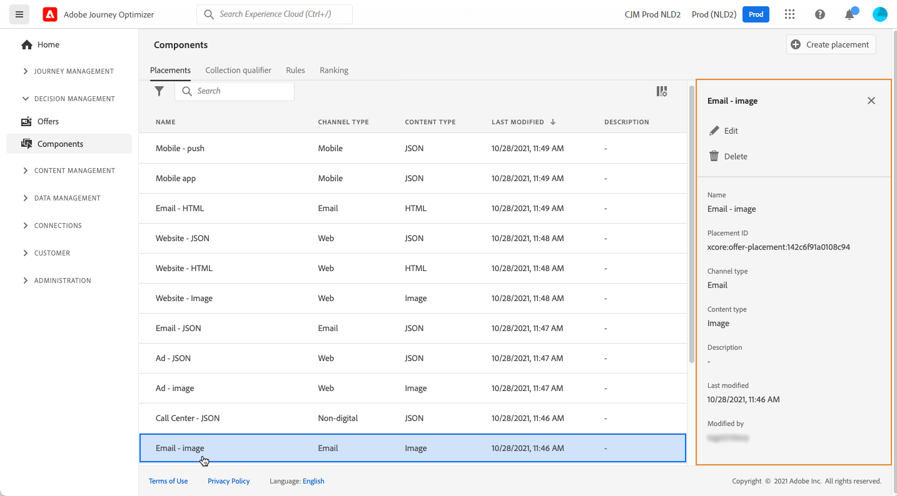

# Creare i posizionamenti {#create-placements}

>[!CONTEXTUALHELP]
>id="ajo_decisioning_placement"
>title="Posizionamento"
>abstract="Un posizionamento è un contenitore utilizzato per mostrare le offerte. Assicurati che il contenuto dell’offerta corretta sia visualizzato nella posizione giusta all’interno del messaggio. I posizionamenti vengono creati dal menu &quot;Componenti&quot;."

Un posizionamento garantisce che il contenuto dell’offerta corretta sia visualizzato nella posizione giusta all’interno del messaggio. Quando aggiungi contenuto a un’offerta, ti verrà chiesto di selezionare un posizionamento in cui visualizzare il contenuto.

➡️ [Scopri come creare posizionamenti in questo video](#video)

Nell’esempio seguente sono presenti tre posizioni, corrispondenti a diversi tipi di contenuto (immagine, testo, HTML).

L’elenco dei posizionamenti è accessibile nella **[!UICONTROL Components]** menu. Sono disponibili filtri per recuperare i posizionamenti in base a un canale o contenuto specifico.

Per creare un posizionamento, effettua le seguenti operazioni:

1. Fai clic su **[!UICONTROL Create placement]**.

   

1. Definisci le proprietà del posizionamento:

   * **[!UICONTROL Name]**: Nome del posizionamento. Assicurati di definire un nome significativo per recuperarlo più facilmente.
   * **[!UICONTROL Channel type]**: Canale per il quale verrà utilizzato il posizionamento.
   * **[!UICONTROL Content type]**: Il tipo di contenuto che il posizionamento può visualizzare: Testo, HTML, collegamento immagine o JSON.
   * **[!UICONTROL Description]**: Una descrizione del posizionamento (facoltativo).

   

1. Fai clic su **[!UICONTROL Save]** per confermare.

1. Una volta creato, il posizionamento viene visualizzato nell’elenco dei posizionamenti. È possibile selezionarlo per visualizzarne le proprietà e modificarlo.

   

## Video introduttivo{#video}

Scopri come creare i posizionamenti in Offer Decisioning.

>[!VIDEO](https://video.tv.adobe.com/v/329372?quality=12)

