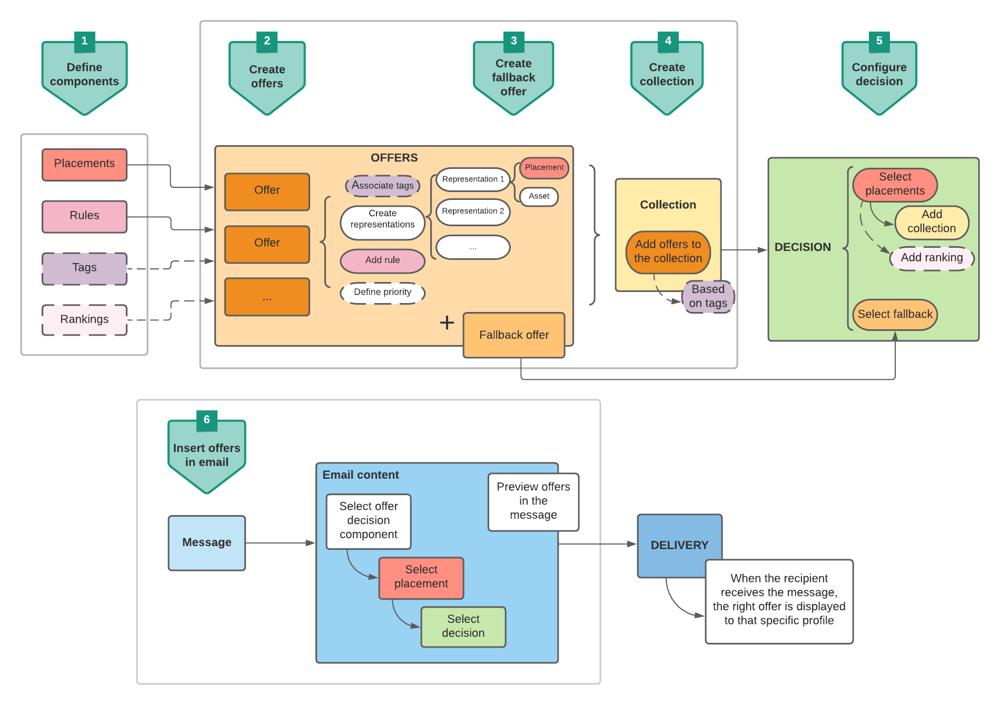
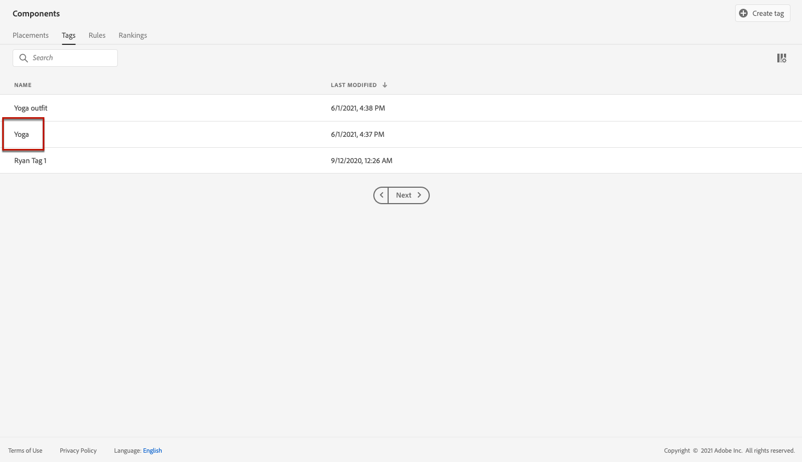

# Caso d’uso: configurare offerte personalizzate da utilizzare in un messaggio e-mail {#configure-add-personalized-offers-email}

Questa sezione presenta un esempio end-to-end per mostrare come configurare le offerte e utilizzarle in un messaggio e-mail, in base a una decisione creata in precedenza.

## Passaggi principali {#main-steps}

Di seguito sono elencati i passaggi chiave per configurare le offerte, includerle in una decisione e sfruttarla in un messaggio e-mail:

1. Prima di creare le offerte, [definisci i componenti](#define-components)

   * Creare posizionamenti
   * Creare regole di decisione
   * Creare qualificatori di raccolta (noti in precedenza come &quot;tag&quot;)
   * Creare classificazioni (facoltativo)

1. [Configurare le offerte](#configure-offers)

   * Crea offerte
   * Per ogni offerta:

      * Create le rappresentazioni e selezionate un posizionamento e una risorsa per ciascuna rappresentazione
      * Aggiungi una regola per ogni offerta
      * Definisci una priorità per ogni offerta

1. [Creare un’offerta di fallback](#create-fallback)

1. [Crea una raccolta](#create-collection) per includere le offerte personalizzate create

1. [Configurare la decisione](#configure-decision)

   * Creare una decisione
   * Seleziona i posizionamenti creati
   * Per ogni posizionamento, seleziona la raccolta
   * Per ogni posizionamento, seleziona una classificazione (facoltativo)
   * Seleziona il fallback

1. [Inserire la decisione in un messaggio e-mail](#insert-decision-in-email)

   * Seleziona un posizionamento corrispondente alle offerte da visualizzare
   * Seleziona la decisione dagli elementi compatibili con il posizionamento selezionato
   * Visualizzare l’anteprima delle offerte

Il processo complessivo di Gestione delle decisioni per utilizzare le offerte in un messaggio e-mail può essere descritto come segue:

## Definire i componenti {#define-components}

Prima di iniziare a creare le offerte, devi definire diversi componenti da utilizzare nelle offerte.

Tali componenti sono disponibili nel **[!UICONTROL menu Gestione delle decisioni]** > **[!UICONTROL Componenti]**.

1. Inizia creando **posizionamenti** per le offerte.

   Utilizzerai questi posizionamenti per definire dove verrà visualizzata l’offerta risultante durante la definizione della decisione di offerta.

   In questo esempio, crea tre posizionamenti con i seguenti tipi di canale e di contenuto:

   * *Web - Immagine*
   * *E-mail - Immagine*
   * *Non digitale - Testo*

   

   I passaggi dettagliati per la creazione dei posizionamenti sono descritti in [questa sezione](../../using/offers/offer-library/creating-placements.md).

1. Crea **regole di decisione**.

   Le regole di decisione forniranno l’offerta migliore a un profilo in Adobe Experience Platform.

   Configura due regole semplici utilizzando l&#39;attributo **[!UICONTROL Profilo individuale XDM > Persona > Genere]**:

   * *Clienti femminili*
   * *Clienti maschi*

   

   I passaggi dettagliati per la creazione delle regole sono descritti in [questa sezione](../../using/offers/offer-library/creating-decision-rules.md).

1. È inoltre possibile creare un qualificatore **raccolta**.

   Potrai quindi associarlo alle offerte e utilizzare questo qualificatore di raccolta per raggruppare le offerte in una raccolta.

   In questo esempio, crea il qualificatore della raccolta *Yoga*.

   

   I passaggi dettagliati per la creazione dei qualificatori di raccolta sono descritti in [questa sezione](../../using/offers/offer-library/creating-tags.md).

1. Se desideri definire regole che determinano quale offerta deve essere presentata per prima per un determinato posizionamento (anziché tenere conto dei punteggi di priorità delle offerte), puoi creare una **formula di classificazione**.

   I passaggi dettagliati per la creazione di formule di classificazione sono descritti in [questa sezione](../../using/offers/ranking/create-ranking-formulas.md#create-ranking-formula).

   >[!NOTE]
   >
   >In questo esempio utilizzeremo solo i punteggi di priorità. Ulteriori informazioni su [regole di idoneità e vincoli](../../using/offers/offer-library/add-constraints.md#eligibility).

## Configurare le offerte {#configure-offers}

Ora puoi creare e configurare le offerte. In questo esempio, creerai quattro offerte che desideri visualizzare in base a ciascun profilo specifico.

1. Crea un’offerta. Ulteriori informazioni in [questa sezione](../../using/offers/offer-library/creating-personalized-offers.md#create-offer).

1. In questa offerta, crea tre rappresentazioni. Ogni rappresentazione deve essere una combinazione di un posizionamento creato in precedenza e di una risorsa:

   * Uno corrispondente al posizionamento *Web - Immagine*
   * Uno corrispondente al posizionamento *Email - Image*
   * Uno corrispondente al posizionamento *Non digitale - Testo*

   >[!NOTE]
   >
   >Un’offerta può essere visualizzata in posizioni diverse in un messaggio per creare più opportunità di utilizzo in contesti di posizionamento diversi.

   Ulteriori informazioni sulle rappresentazioni in [questa sezione](../../using/offers/offer-library/add-representations.md#representations).

1. Selezionate un&#39;immagine appropriata per i primi due posizionamenti. Immettere il testo personalizzato per il posizionamento *Non digitale - Testo*.

   

1. Nella sezione **[!UICONTROL Idoneità all&#39;offerta]**, seleziona **[!UICONTROL In base alla regola di decisione definita]** e trascina e rilascia la regola desiderata.

   

1. Compila la **[!UICONTROL Priorità]**. In questo esempio, aggiungi *25*.

1. Rivedi l&#39;offerta, quindi fai clic su **[!UICONTROL Salva e approva]**.

   

1. In questo esempio, crea altre tre offerte con le stesse rappresentazioni, ma con risorse diverse. Assegna loro diverse regole e priorità, ad esempio:

   * Prima offerta - Regola di decisione: *Clienti donne*, Priorità: *25*
   * Seconda offerta - Regola di decisione: *Clienti donne*, Priorità: *15*
   * Terza offerta - Regola di decisione: *Clienti maschi*, Priorità: *25*
   * Quarta offerta - Regola di decisione: *Clienti maschi*, Priorità: *15*

   

I passaggi dettagliati per creare e configurare le offerte sono descritti in [questa sezione](../../using/offers/offer-library/creating-personalized-offers.md).

## Creare un’offerta di fallback {#create-fallback}

1. Crea un’offerta di fallback.

1. Definisci le stesse rappresentazioni delle offerte, con le risorse appropriate (dovrebbero essere diverse da quelle utilizzate nelle offerte).

   Ogni rappresentazione deve essere una combinazione di un posizionamento creato in precedenza e di una risorsa:

   * Uno corrispondente al posizionamento *Web - Immagine*
   * Uno corrispondente al posizionamento *Email - Image*
   * Uno corrispondente al posizionamento *Non digitale - Testo*

   

1. Rivedi l&#39;offerta di fallback, quindi fai clic su **[!UICONTROL Salva e approva]**.

L’offerta di fallback è ora pronta per essere utilizzata in una decisione.

I passaggi dettagliati per creare e configurare un&#39;offerta di fallback sono descritti in [questa sezione](../../using/offers/offer-library/creating-fallback-offers.md).

## Creare una raccolta {#create-collection}

Durante la configurazione della decisione, dovrai aggiungere le offerte personalizzate come parte di una raccolta.

1. Per accelerare il processo decisionale, crea una raccolta dinamica.

1. Utilizza il qualificatore della raccolta *Yoga* per selezionare le quattro offerte personalizzate create in precedenza.

   

I passaggi dettagliati per creare una raccolta sono descritti in [questa sezione](../../using/offers/offer-library/creating-collections.md).

## Configurare la decisione {#configure-decision}

Ora devi creare una decisione che combini i posizionamenti con le offerte personalizzate e l’offerta di fallback appena creata.

Questa combinazione verrà utilizzata dal motore decisionale per trovare l’offerta migliore per un profilo specifico: in questo esempio, sarà basata sulla priorità e sulla regola di decisione assegnate a ogni offerta.

Per creare e configurare una decisione di offerta, segui i passaggi principali seguenti:

1. Creare una decisione. Ulteriori informazioni in [questa sezione](../../using/offers/offer-activities/create-offer-activities.md#create-activity).

1. Seleziona i posizionamenti *Web - Immagine*, *E-mail - Immagine* e *Non digitale - Testo*.

   

1. Per ogni posizionamento, aggiungi la raccolta creata.

   

1. Se hai definito una classificazione durante la [creazione dei componenti](#define-components), puoi assegnarla a un posizionamento nella decisione. Se più offerte sono idonee per essere presentate in questo posizionamento, la decisione utilizzerà questa formula per calcolare quale offerta consegnare per prima.

   I passaggi dettagliati per assegnare una formula di classificazione a un posizionamento sono descritti in [questa sezione](../../using/offers/offer-activities/configure-offer-selection.md#assign-ranking-formula).

1. Seleziona l’offerta di fallback creata. Verrà visualizzata come offerta di fallback disponibile per i tre posizionamenti selezionati.

   

1. Rivedi la decisione, quindi fai clic su **[!UICONTROL Salva e approva]**.

   

La decisione è ora pronta per essere utilizzata per distribuire offerte ottimizzate e personalizzate.

I passaggi dettagliati per creare e configurare una decisione sono descritti in [questa sezione](../../using/offers/offer-activities/create-offer-activities.md).

## Inserire la decisione in un messaggio e-mail {#insert-decision-in-email}

Ora che la tua decisione è attiva, puoi inserirla in un messaggio e-mail. Per farlo, segui i passaggi descritti in [questa pagina](../../using/email/add-offers-email.md).

